## OpenLiteSpeed：从入门到放弃

https://lala.im/6991.html


文章标题开个玩笑，这篇文章不敢保证说让你从入门到精通，但是熟练使用是肯定没问题的。

OpenLiteSpeed是LiteSpeed的开源版本，相对于企业版功能上少了一点，但基本没什么影响，具体的功能对比：

https://www.litespeedtech.com/products/litespeed-web-server/editions

如果你稍微花点时间摸索一下的话，你会发现OpenLiteSpeed上手真的很快，门槛比Apache/Nginx低很多。因为它自带了一个WEB控制台，基本上所有的操作都可以通过这个控制台完成。

除此之外，OpenLiteSpeed还集成了很多“新奇玩意”什么HTTP3/QUIC/TLS1.3/Brotli等等全都原生支持。

近年来OpenLiteSpeed的官方经常做一些吊打Apache/Nginx的测试，是不是真的吊打我不清楚，但是我能保证的是：

OpenLiteSpeed安装简单，易于使用，功能丰富，是一个非常不错的Webserver，值得一试。

本文将使用OpenLiteSpeed部署一个WordPress，以及配置SSL和性能调优。

安装，本文使用Debian10：

```
apt -y update
apt -y install wget
wget -O - http://rpms.litespeedtech.com/debian/enable_lst_debian_repo.sh | bash
apt -y install openlitespeed mariadb-server certbot
```

你不需要再去安装PHP，因为openlitespeed这个包会自动帮你安装好PHP组件，对于Debian10而言它会帮你安装好PHP7.3。

初次安装，执行下面的命令修改WEB控制台的管理员账号密码：

```
bash /usr/local/lsws/admin/misc/admpass.sh
```

启动以及设置OpenLiteSpeed开机自启：

```
systemctl start lsws
systemctl enable lsws
```

然后打开WEB控制台：

http://209.151.156.157:7080

登录进去的第一件事，应该修改默认的监听器端口，默认情况下它监听在8088端口，这里修改为80端口：

[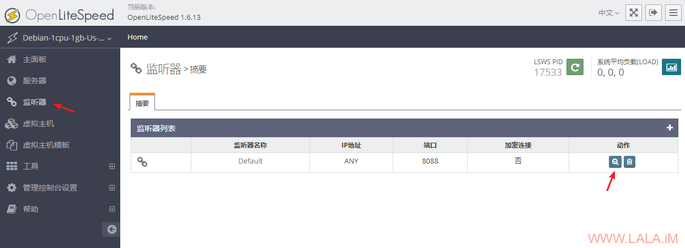](https://lala.im/wp-content/uploads/2020/05/lala.im_2020-05-15_12-06-03.png)

点击编辑：

[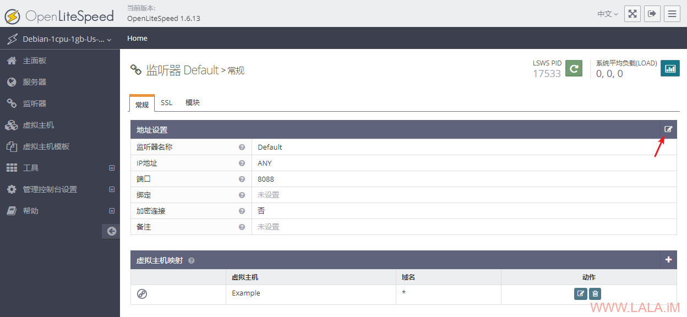](https://lala.im/wp-content/uploads/2020/05/lala.im_2020-05-15_12-07-47.png)

将端口改为80：

[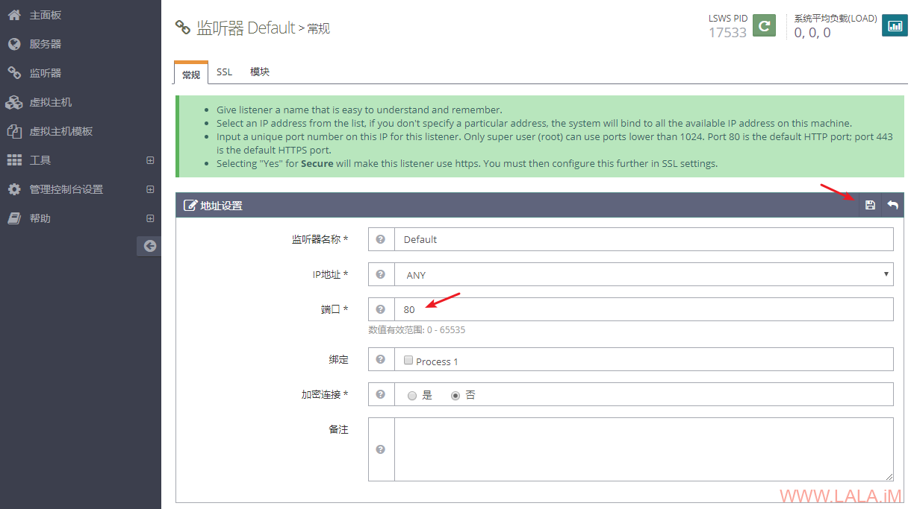](https://lala.im/wp-content/uploads/2020/05/lala.im_2020-05-15_12-08-48.png)

在你修改了配置之后它会提示让你重启服务生效，实际上在OpenLiteSpeed上做的修改，百分之90都是要重启才能生效的：

[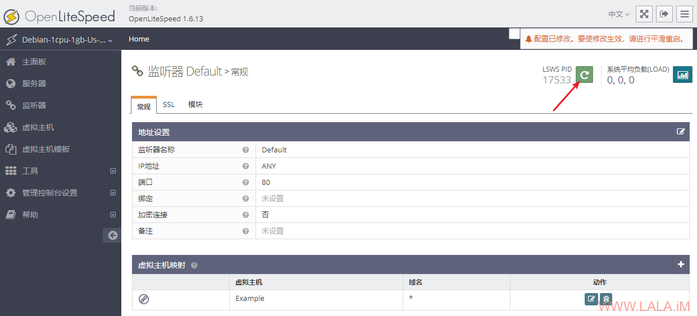](https://lala.im/wp-content/uploads/2020/05/lala.im_2020-05-15_12-11-03.png)

注：本文后续的配置就不会截这么多详细的图片了，大部分都是直接进到配置的界面截一张图片，所以你要熟悉一下这些基本操作。

现在让我们来添加另外一个监听器，这个监听器监听在443端口，用于HTTPS连接。现在建站不支持SSL，和咸鱼有什么区别？

在监听器界面点击添加按钮，按照下图配置：

[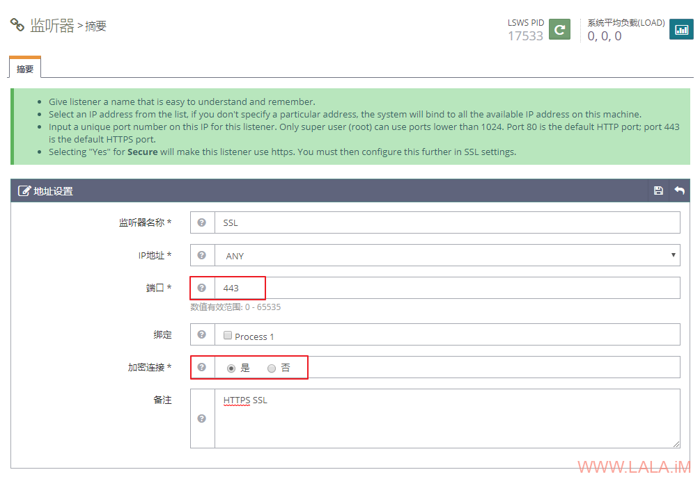](https://lala.im/wp-content/uploads/2020/05/lala.im_2020-05-15_12-16-50.png)

在添加好这个监听器后，不要急着重启让修改生效，现在我们需要生成一个自签名的证书：

```
mkdir -p /opt/signcert && cd /opt/signcert
openssl req -x509 -newkey rsa:4096 -keyout openlitespeed-key.pem -out openlitespeed-cert.pem -nodes -days 365
```

生成好证书后，进入这个监听器的设置界面，点击SSL配置，将你生成的证书和私钥路径填写在上面：

[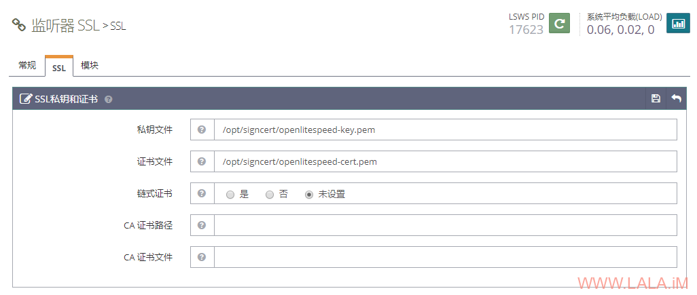](https://lala.im/wp-content/uploads/2020/05/lala.im_2020-05-15_12-22-30.png)

配置完上面这些后重启服务使其生效：

[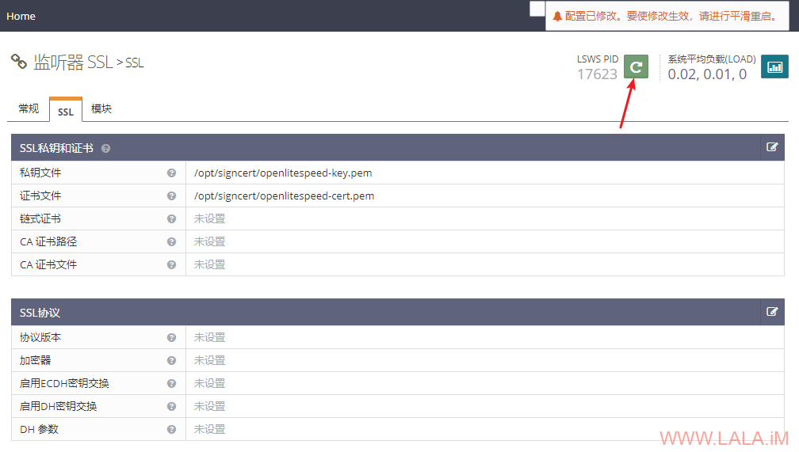](https://lala.im/wp-content/uploads/2020/05/lala.im_2020-05-15_12-23-32.png)

如果正常，你将可以在主面板的控制台看到监听器显示绿色：

[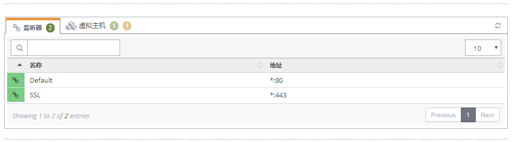](https://lala.im/wp-content/uploads/2020/05/lala.im_2020-05-15_12-24-32.png)

这里解释一下为什么选择自签名的证书而不选择Let’encrypt这类证书呢？

监听器这里配置自签名证书的目的是为了防止IP泄露SSL证书，导致别人可以通过这种方式反查到你的源站。

就类似于你平常给Nginx配置一个默认主机，然后给这个主机配置一个假证书，是一样的道理。

OpenLiteSpeed的监听器相当于Nginx的默认主机，它接管所有缺省主机名的请求，这样配置之后别人在访问你的服务器IP，显示的证书名是你自签的证书而不是你的真实域名证书。

现在我们需要修改PHP的一些配置，对于Debian10而言，编辑默认的php.ini：

```
nano /usr/local/lsws/lsphp73/etc/php/7.3/litespeed/php.ini
```

默认的8M太小，修改一下文件上传的大小：

```
post_max_size = 100M
upload_max_filesize = 100M
```

根据需要你还可以在这个文件修改更多配置，修改完成之后，使用如下命令创建一个.lsphp_restart.txt重启PHP，使其生效：

```
touch /usr/local/lsws/admin/tmp/.lsphp_restart.txt
```

是不是觉得这个重启PHP进程的方式很奇葩？这是因为OpenLiteSpeed默认使用的PHP运行方式是独立模式，独立模式使用这种方式重启是最优雅的了。

如果是附加模式，你可以直接重启lsws，PHP进程也会跟着一起重启，如果要改为使用附加模式：

[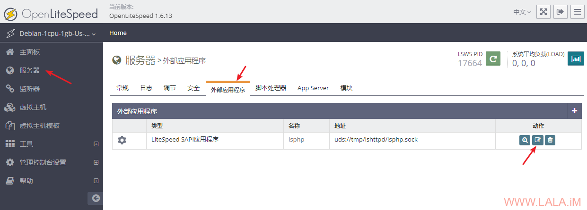](https://lala.im/wp-content/uploads/2020/05/lala.im_2020-05-15_12-37-28.png)

修改为如图所示：

[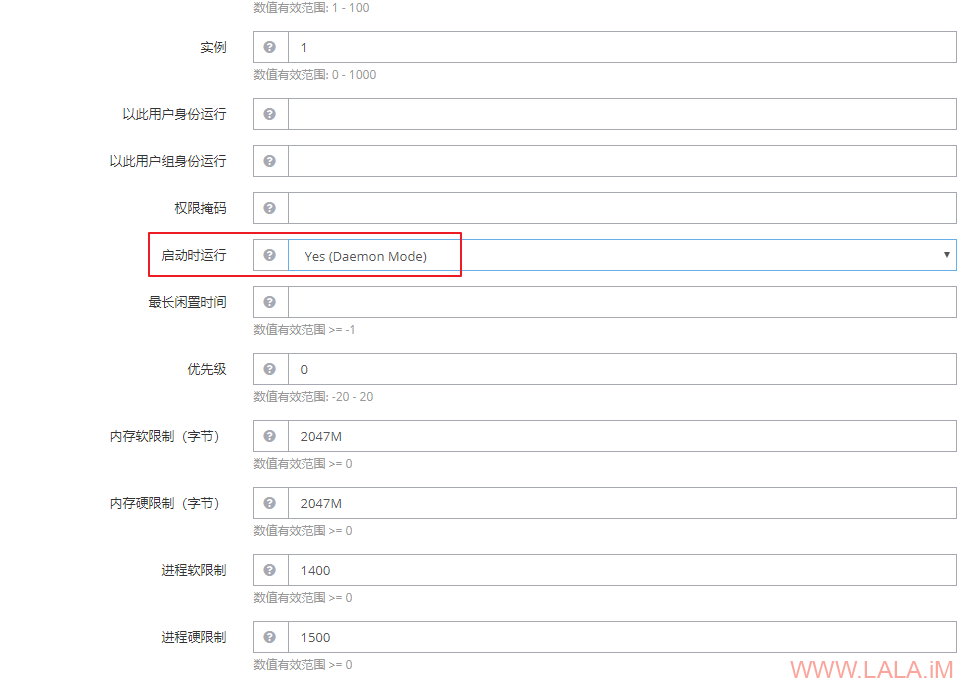](https://lala.im/wp-content/uploads/2020/05/lala.im_2020-05-15_12-38-19.png)

注：不建议使用附加模式，相较于独立来说，性能没有独立模式好。

接下来，我们给OpenLiteSpeed的配置调优，在服务器-调节-GZIP/Brotli Compression-压缩类型，添加如下配置：

```
image/jpeg, image/gif, image/png, image/bmp
```

如图所示：

[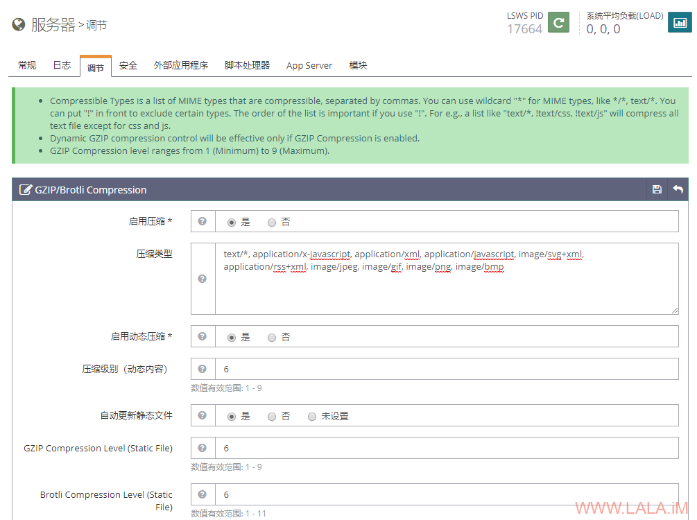](https://lala.im/wp-content/uploads/2020/05/lala.im_2020-05-15_12-43-20.png)

这样可以让Brotli压缩图片格式的文件，使站点加载速度更快。

你还可以修改一下默认的连接数，默认情况下是10000：

[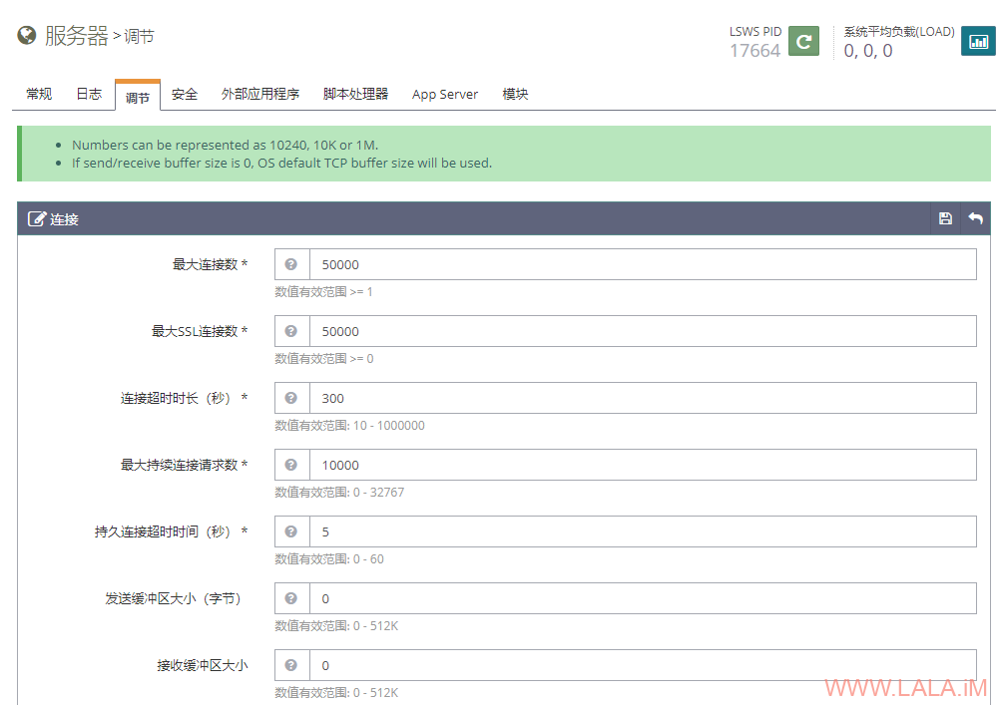](https://lala.im/wp-content/uploads/2020/05/lala.im_2020-05-15_12-49-48.png)

现在我们就可以来创建一个虚拟主机了。在创建虚拟主机之前，我们先把站点目录准备好：

```
mkdir /usr/local/lsws/wordpress-imlala
mkdir /usr/local/lsws/wordpress-imlala/html
mkdir /usr/local/lsws/wordpress-imlala/logs
```

这里有必要介绍几个OpenLiteSpeed的环境变量：

|    变量名    |               路径               |                    说明                    |
| :----------: | :------------------------------: | :----------------------------------------: |
| $SERVER_ROOT |         /usr/local/lsws/         |          OpenLiteSpeed的根目录。           |
|   $VH_ROOT   |     /usr/local/lsws/$VH_ROOT     | 虚拟主机的根目录，也可以说是站点的根目录。 |
|   $VH_NAME   | conf/vhosts/$VH_NAME/vhconf.conf |    虚拟主机名，一般用于匹配conf配置文件    |

一般情况下创建虚拟主机的时候只需要用到VH_ROOT/VH_NAME。现在的OpenLiteSpeed支持相对路径，所以SERVER_ROOT一般不会用了。

点击虚拟主机-添加，按下图添加：

[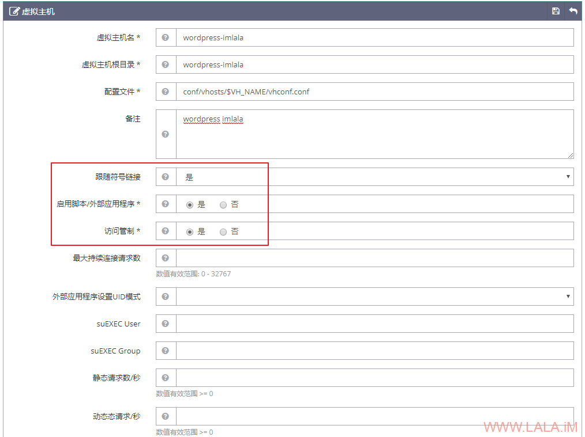](https://lala.im/wp-content/uploads/2020/05/lala.im_2020-05-15_13-23-33.png)

点保存会它会报错，提示你配置文件不存在，没关系这里点击CLICK TO CREATE就能帮你创建配置文件，之后再保存即可：

[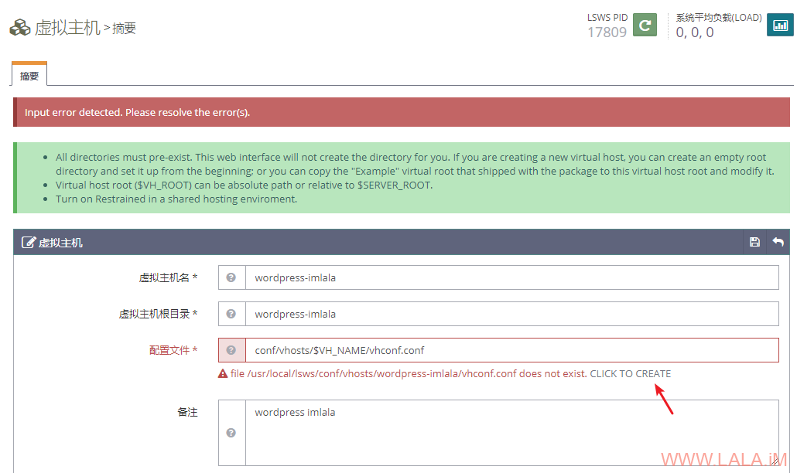](https://lala.im/wp-content/uploads/2020/05/lala.im_2020-05-15_13-24-19.png)

保存之后进到这个虚拟主机的配置界面，点击常规，按下图配置：

[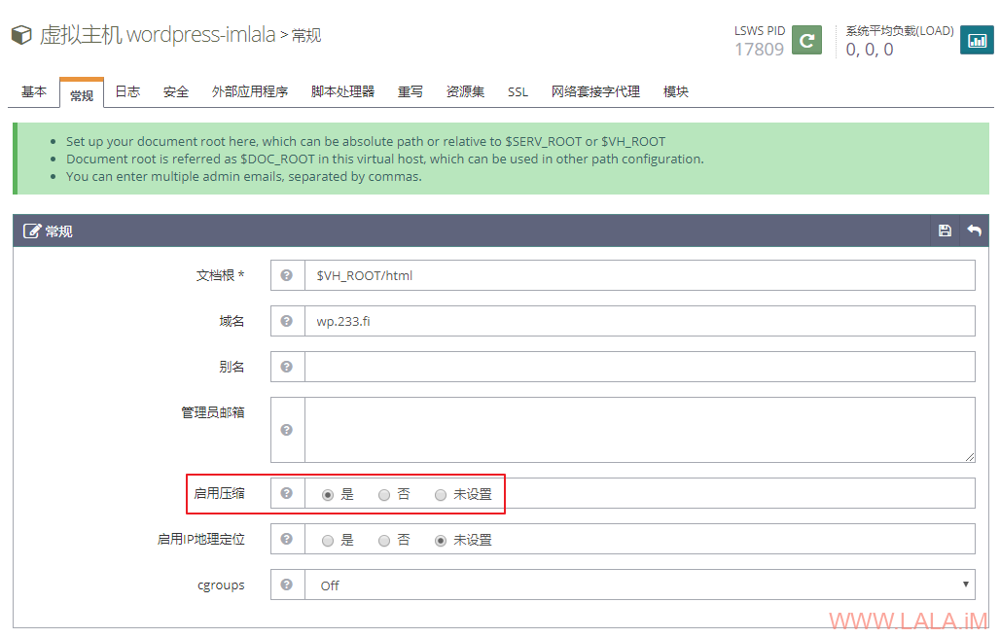](https://lala.im/wp-content/uploads/2020/05/lala.im_2020-05-15_13-27-15.png)

还是在常规界面，找到索引文件，按下图配置：

[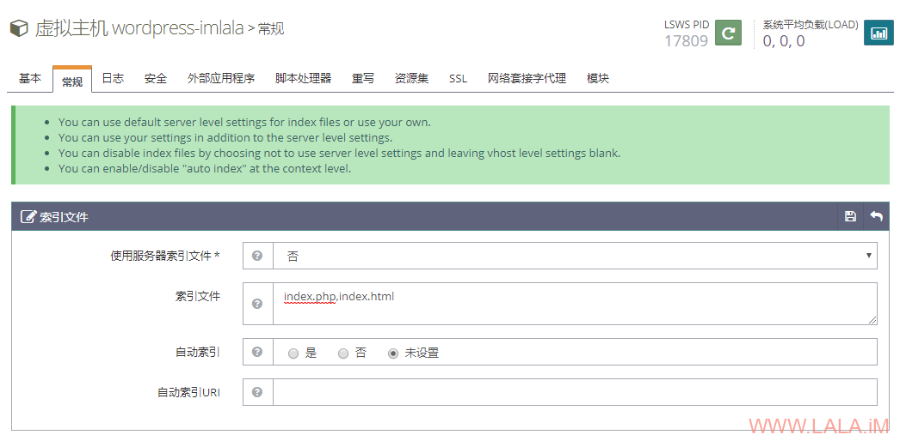](https://lala.im/wp-content/uploads/2020/05/lala.im_2020-05-15_13-28-57.png)

错误日志，按下图配置：

[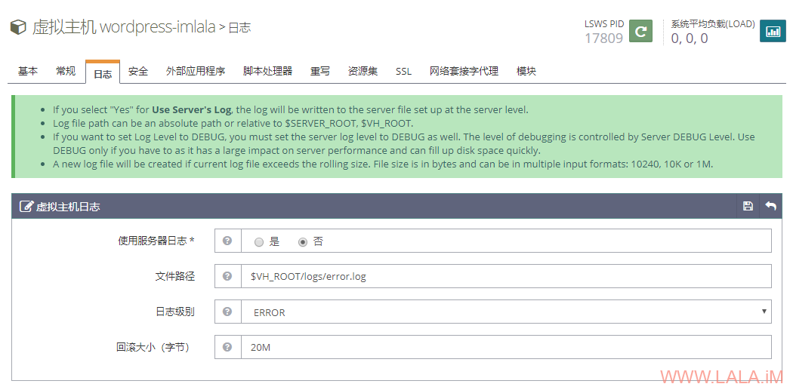](https://lala.im/wp-content/uploads/2020/05/lala.im_2020-05-15_13-32-24.png)

访问日志，如果站点访问量很大，可以不设置这个，节省硬盘空间：

[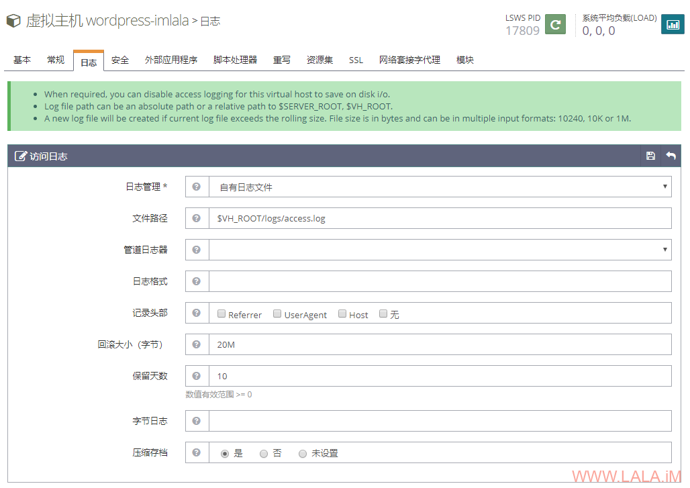](https://lala.im/wp-content/uploads/2020/05/lala.im_2020-05-15_13-34-32.png)

接着点击安全-访问控制，允许列表添加一个*，代表允许所有人访问：

[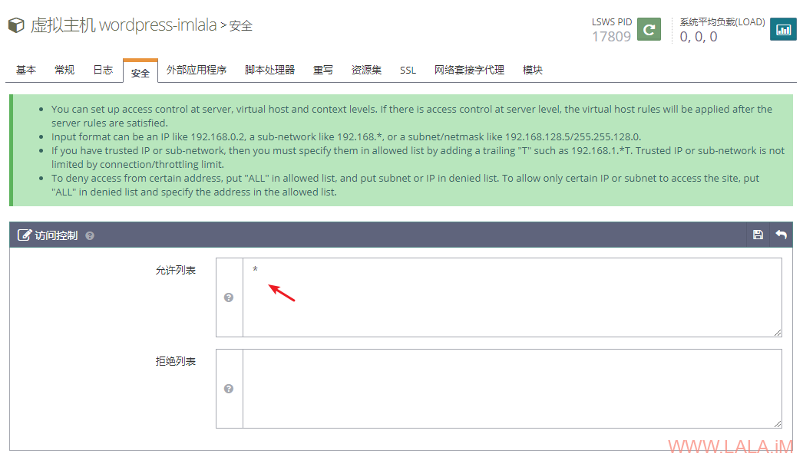](https://lala.im/wp-content/uploads/2020/05/lala.im_2020-05-15_13-36-18.png)

找到重写，启用.htaccess：

[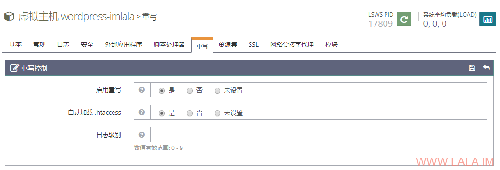](https://lala.im/wp-content/uploads/2020/05/lala.im_2020-05-15_13-37-39.png)

最后找到SSL，在这里填写你的域名证书和私钥：

[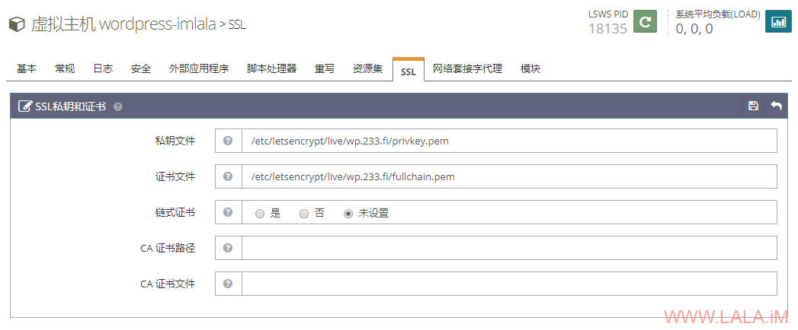](https://lala.im/wp-content/uploads/2020/05/lala.im_2020-05-15_13-46-24.png)

如果还没有SSL证书，这步可暂时跳过。

虚拟主机就创建好了，接下来我们需要把这个虚拟主机映射给相应的监听器。

刚才我们配置了2个监听器，一个是80端口的，还有一个443端口，这里要把这个虚拟主机分别映射给这2个监听器，步骤是一样的，我就只截一遍图片好了。

点击监听器-查看-虚拟主机映射

[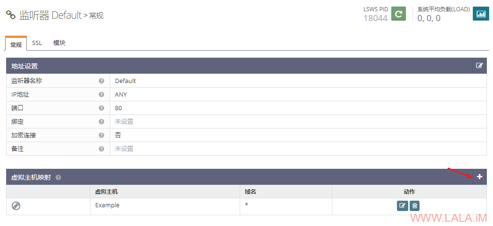](https://lala.im/wp-content/uploads/2020/05/lala.im_2020-05-15_13-40-58.png)

选择你刚创建的虚拟主机并填写正确的域名：

[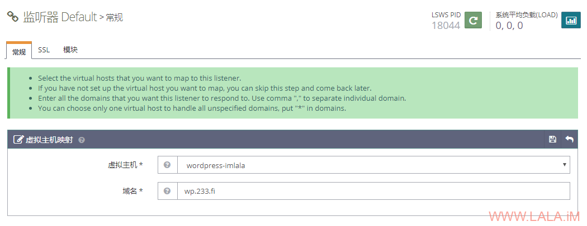](https://lala.im/wp-content/uploads/2020/05/lala.im_2020-05-15_13-41-33.png)

在面板上重启OpenLiteSpeed使所有更改生效。

接下来尝试安装一个WordPress。

初始化数据库配置：

```
mysql_secure_installation
```

登录到MySQL：

```
mysql -u root -p
```

创建数据库和用户：

```
CREATE DATABASE wordpress CHARACTER SET utf8mb4 COLLATE utf8mb4_unicode_ci;
GRANT ALL PRIVILEGES ON wordpress.* TO wordpress@localhost IDENTIFIED BY '设置你的数据库用户密码';
FLUSH PRIVILEGES;
quit
```

下载源码/解压/移动到虚拟主机目录：

```
cd /usr/local/lsws/wordpress-imlala/html
wget https://wordpress.org/latest.tar.gz
tar -xzvf latest.tar.gz
cd wordpress/
mv * ../
cd ..
rm -rf latest.tar.gz wordpress
```

给予正确的权限：

```
chown -R nobody:nogroup /usr/local/lsws/wordpress-imlala
```

打开你的域名应该就能看到WordPress的安装界面了。

安装完成之后可以使用下面的命令签发一个SSL证书：

```
certbot certonly --agree-tos --no-eff-email --email xxxx@qq.com --webroot -w /usr/local/lsws/wordpress-imlala/html -d wp.233.fi
```

在WordPress的插件界面，可以安装LiteSpeed Cache来提升性能：

[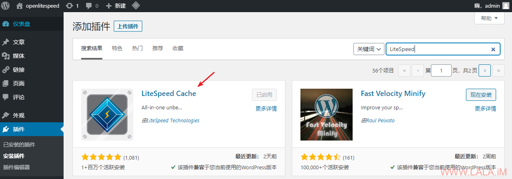](https://lala.im/wp-content/uploads/2020/05/lala.im_2020-05-15_14-00-18.png)

关于这个插件的设置，根据自己的需要按需来配置即可，这里我只建议把这个Purge Stale功能关了：

[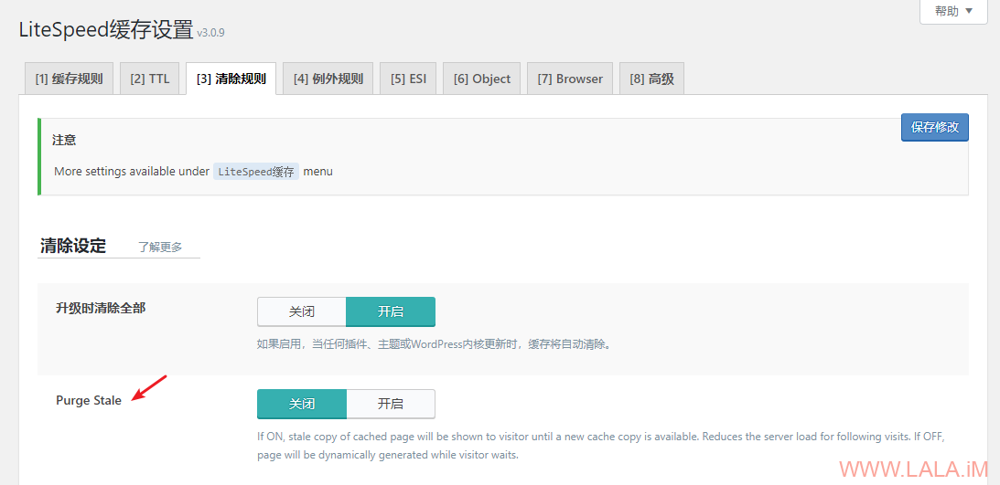](https://lala.im/wp-content/uploads/2020/05/lala.im_2020-05-15_14-02-05.png)

然后还有一个值得注意的是，OpenLiteSpeed加载的.htaccess只是在初次的时候会自动加载，如果你的.htaccess是后续创建的或者添加了新的内容进去，需要重启OpenLiteSpeed才能生效。

例如，在WordPress设置了固定链接后，你需要重启OpenLiteSpeed：

[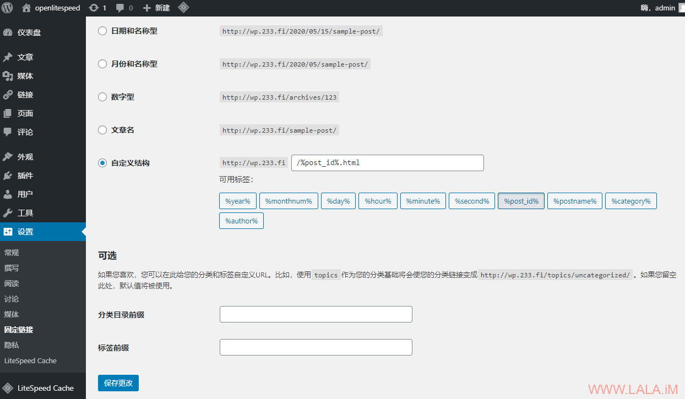](https://lala.im/wp-content/uploads/2020/05/lala.im_2020-05-15_14-05-03.png)