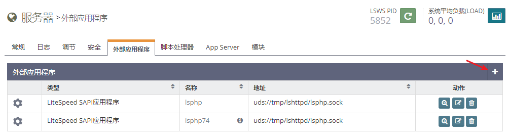
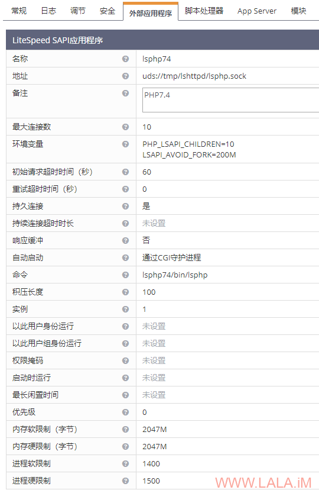
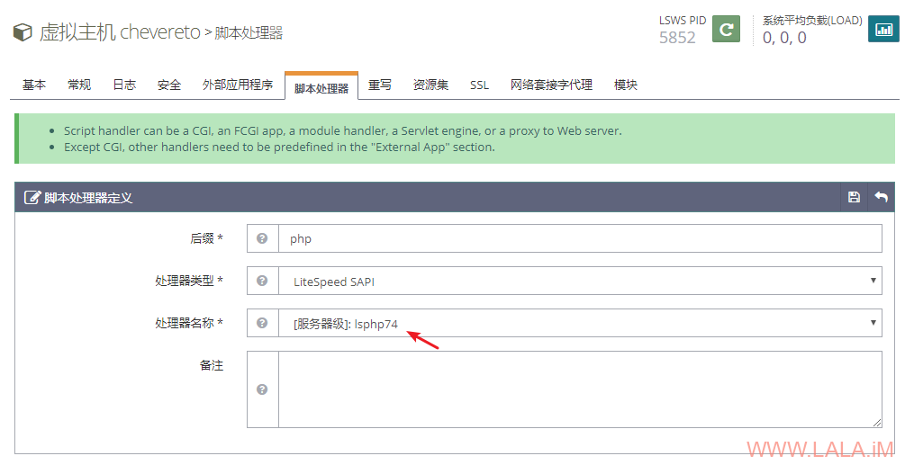
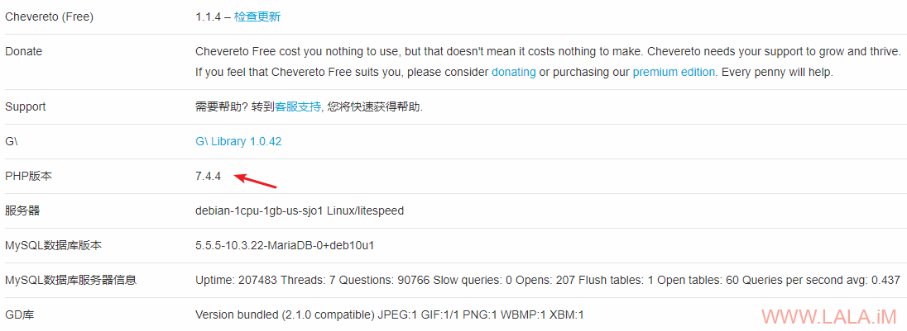
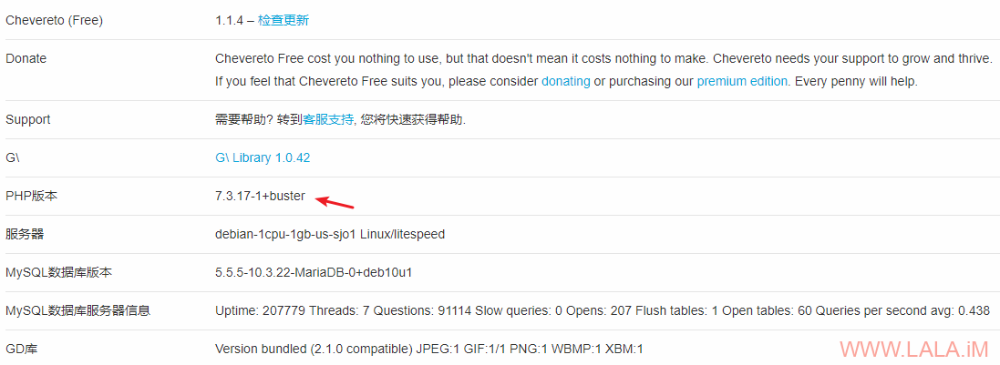

## OpenLiteSpeed：多版本PHP安装/切换

https://lala.im/7028.html


这篇文章介绍一下如何让OpenLiteSpeed支持多版本PHP。

安装OpenLiteSpeed：

```
apt -y update
apt -y install wget
wget -O - http://rpms.litespeedtech.com/debian/enable_lst_debian_repo.sh | bash
apt -y install openlitespeed
```

openlitespeed包会自带一个PHP7.3，除了7.3以外，官方的这个存储库内还有7.4/7.2/7.1可供安装：

```
apt -y install lsphp74 lsphp74-common lsphp74-json lsphp74-mysql lsphp74-imap lsphp74-curl
apt -y install lsphp72 lsphp72-common lsphp72-json lsphp72-mysql lsphp72-imap lsphp72-curl
apt -y install lsphp71 lsphp71-common lsphp71-json lsphp71-mysql lsphp71-imap lsphp71-curl
```

一般的PHP环境装上面这几个包就足够了，如果有些程序还需要其他的组件没有安装的话，可以搜索你需要的包然后进行安装，例如搜索PHP7.4的其他软件包：

```
apt search lsphp74
```

安装了新的PHP版本之后，现在要配置OpenLiteSpeed使其支持，这里演示以PHP7.4为主。

打开OpenLiteSpeed的WEB控制台，找到“服务器”-“外部应用程序”-“添加”：

[](https://lala.im/wp-content/uploads/2020/05/lala.im_2020-05-16_22-31-14.png)

然后按照下面来填写相应的配置（没提到的配置留空即可）：

```
名称：lsphp74
地址：uds://tmp/lshttpd/lsphp.sock
备注：PHP7.4
最大连接数：10
环境变量：PHP_LSAPI_CHILDREN=10/LSAPI_AVOID_FORK=200M
初始请求超时时间：60
重试超时时间：0
持久连接：是
响应缓冲：否
自动启动：通过CGI守护进程
命令：lsphp74/bin/lsphp
积压长度：100
实例：1
内存软限制：2047M
内存硬限制：2047M
进程软限制：1400
进程硬限制：1400
```

如图所示：

[](https://lala.im/wp-content/uploads/2020/05/lala.im_2020-05-16_22-27-47.png)

举一反三，上面的这个配置，如果你是拿来配置PHP7.2的话，只需要更改如下的配置即可，其他可以原样照搬：

```
名称：lsphp72
备注：PHP7.2
命令：lsphp72/bin/lsphp
```

同理PHP7.1也是如此：

```
名称：lsphp71
备注：PHP7.1
命令：lsphp71/bin/lsphp
```

需要注意的是，每个PHP版本对应的php.ini都不同，它们的路径分别如下：

```
/usr/local/lsws/lsphp74/etc/php/7.4/litespeed/php.ini
/usr/local/lsws/lsphp73/etc/php/7.3/litespeed/php.ini
/usr/local/lsws/lsphp72/etc/php/7.2/litespeed/php.ini
/usr/local/lsws/lsphp71/etc/php/7.1/litespeed/php.ini
```

php.ini的配置不共通，如果你切换了版本记得也要修改相应的php.ini，之后重启php进程使修改生效：

```
touch /usr/local/lsws/admin/tmp/.lsphp_restart.txt
```

现在如果我们要让某一个虚拟主机支持PHP7.4就只需要找到对应的虚拟主机，然后在里面添加一个脚本处理器即可：

[](https://lala.im/wp-content/uploads/2020/05/lala.im_2020-05-16_22-37-09.png)

重启OpenLiteSpeed后，可以看到我的这个Chevereto的图床已经在使用PHP7.4了：

[](https://lala.im/wp-content/uploads/2020/05/lala.im_2020-05-16_22-51-44.png)

如果我将刚添加的脚本处理器删除，那么现在会回到使用默认的PHP7.3：

[](https://lala.im/wp-content/uploads/2020/05/lala.im_2020-05-16_22-56-32.png)