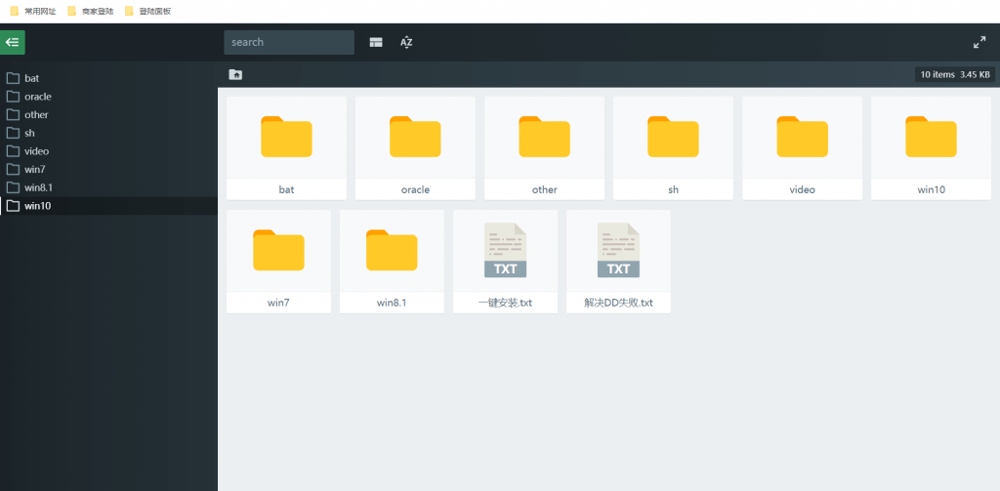

# 一款简洁，漂亮的目录列表程序



最近get到一个类似[h5ai](https://www.zhujizixun.com/tag/h5ai)的单文件[列目录程序](https://www.zhujizixun.com/tag/列目录程序)，风格简洁，h5适配好，拿来做文件分享和下载站很不错，跟大家安利一下。

演示地址：http://d.nat.ee/

官网地址：https://files.photo.gallery/

程序下载地址：

https://cdn.jsdelivr.net/npm/files.photo.gallery/index.php

**如何去掉授权提示信息？**

编辑文件末尾，把

```
<script src="<?php echo config::$assets ?>js/files.js"></script>
```

修改为：

```
<script src="http://d.nat.ee/js/files.js"></script>
```

如果不想引用第三方地址，自己下载下来引用本地文件就好了。

```
<script src="js/files.js"></script>
```

配置根目录、密码访问和排除不需要显示的目录：

```
// 根目录配置
'root' => '根目录路径', // root path relative to script.
'start_path' => false, // start path relative to script. If empty, root is start path
// 登录账号密码配置
'username' => 'zhujizixun',
'password' => '12345678', // Add password directly or use https://tinyfilemanager.github.io/docs/pwd.html to encrypt the password (encrypted password is more secure, as it prevents your password from being exposed directly in a file).
// 排除文件或者目录
'files_exclude' => '/.(html|xml)$/i', // '/.(pdf|jpe?g)$/i'
'dirs_exclude' => '//js|/_files(/|$)/i', //'//Convert|/football|/node_modules(/|$)/i',
'allow_symlinks' => true, // allow symlinks
```