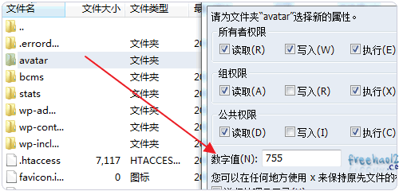

## 提升WordPress的Gravatar头像加载速度方法:缓存本地化国内服务器

http://ztmao.com/wpjy/5208.html


Gravatar头像已经成为了博客、论坛等一种非常流行的通用头像，不管是WordPress还是Z-Blog、Typecho、Emlog等，留言或者登录注册等都支持Gravatar头像，拥有一个Gravatar头像已经成为草根博主一种必选项目。

每位留言者根据自己的邮箱会显示不同的Gravatar头像，如果一篇文章的留言者非常多，比如几百个以上，就会显示几百个Gravatar头像图片，图片越多，HTTP请求也就越多，容易导致网页加载缓慢、网站出现打不开的现象。

另外一个不容忽视的问题是Gravatar头像的服务器全部位于国外，由于受到各种因素的影响，有时国内是无法连接到Gravatar头像服务器上，也就是无法显示Gravatar头像，大量的无法显示的图片会导致网页直接打不开。

基于以上两个原因，部落已经看到了不少的有名气的博客已经取消了显示Gravatar头像，目的就是为了最大限度地加快网页的加载速度，毕竟在浏览网页内容和留言两者之间，获取网页内容才是第一位的，评论只是一种交互方式。

在当前Gravatar头像服务器位于国外的情况下，要想要加快WordPress显示Gravatar头像的速度，首先可以做的就是将Gravatar头像图片缓存到自己的虚拟主机或者VPS上，这样用户访问的就是直接读取自己服务器的图片文件了。

这样做的好处是可以避免Gravatar头像服务器被Q的情况下导致网页无法打开，但是部落用这个方法后发现，过了一段时间后，大量的Gravatar头像图片会占用非常多的空间，且不容易删除。另外过多的图片反而会增加服务器压力。

所以提升WordPress的Gravatar头像加载速度进阶的方法就是将Gravatar头像的服务器变身为国内的，最好是外链形式，例如放在国内一些大公司的服务器上或者专业的CDN服务器上，本篇文章就来介绍此种方法。

WordPress是一个定制性非常强的博客程序，各种WordPress加速方法也是层出不穷，加速效果不错的方式有：

**提升WordPress的Gravatar头像加载速度方法:缓存本地化国内服务器**

**一、WordPress的Gravatar头像图片缓存到本地**

1、此方法来自Willin Kan博主，这位在WordPress很有名气的博主因为讨厌WordPress程序越来越低效率而毅然决定关站放弃WP的行为，实在让部落觉得敬佩。

2、要想将WordPress的Gravatar头像图片缓存到本地，先在网站的根据目录新建一个avatar 的文件夹，读写权限设置为755。





3、有些留言者的邮箱可能没有注册Gravatar头像，我们需要用到一个默认的图片替代这样的留言者的头像，将一张default.jpg 的图片作为默认头像放在avatar文件夹中。


4、打开你的主题的 functions.php 文件，编辑内容。


5、将以下代码复制粘贴到你的functions.php最后，默认的是14天更新一次头像图片，你可以自己修改为更短时间。

```
function my_avatar($avatar) {$tmp = strpos($avatar, 'http');$g = substr($avatar, $tmp, strpos($avatar, "'", $tmp) - $tmp);$tmp = strpos($g, 'avatar/') + 7;$f = substr($g, $tmp, strpos($g, "?", $tmp) - $tmp);$w = get_bloginfo('wpurl');$e = ABSPATH .'avatar/'. $f .'.jpg';$t = 1209600; //設定14天, 單位:秒if ( !is_file($e) || (time() - filemtime($e)) > $t ) { //當頭像不存在或文件超過14天才更新copy(htmlspecialchars_decode($g), $e);} else $avatar = strtr($avatar, array($g => $w.'/avatar/'.$f.'.jpg'));if (filesize($e) < 500) copy($w.'/avatar/default.jpg', $e);return $avatar;}add_filter('get_avatar', 'my_avatar');
```

6、WordPress的Gravatar头像图片缓存到本地后，图片的路径不再是Gravatar官网的URL了，而是本地服务器的图片地址了。


**二、将WordPress的Gravatar头像缓存到百度BAE空间**

1、利用上述方法，WordPress的Gravatar头像会自动生成图片保存到本地的avatar 的文件夹。


2、看过百度BAE全平台Layer镜像CDN加速安装使用一定可以立即想到将Gravatar头像缓存到百度BAE空间上。

3、利用百度BAE空间的速度可以大量加快图片的加载速度，同时也可以避免过多的图片请求拖慢服务器。

4、因为所有的Gravatar头像图片都保存在avatar 的文件夹中，安装了Wp Super Cache插件的朋友可以直接到后台的CDN选项中将avatar文件目录包含中缓存加速中。


5、还有安装或者使用Wp Super Cache插件的朋友，请参考：WordPress加速缓存插件WP Super cache安装方法及使用技巧

6、使用百度BAE空间加速后，Gravatar头像图片显示出来的URL就是百度空间上了。


**三、将WordPress的Gravatar头像缓存到七牛云存储CDN**

1、七牛云存储CDN和上面的百度BAE全平台Layer镜像工作原理是一样的，没用过七牛的参考：七牛云存储国内免费CDN加速10GB空间

2、先到七牛中添加你的源网站。


3、然后在Wp Super Cache中将缓存URL设置为七牛的就可以了。


**四、利用多说Gravatar头像国内镜像服务器实现缓存加速**

1、上面两种方法操作有点繁琐，图片太多的话缓存到BAE空间或者七牛CDN也要消耗不少的流量，这里再分享一个在 yuxiaoxi.com 博主上的方法：将WordPress头像缓存到多说Gravatar头像国内镜像服务器。

2、方法的原理是：官方的Gravatar 头像所在的路径一般都是www.gravatar.com、0.gravatar.com、1.gravatar.com、2.gravatar.com 这四个，我们只需要将头像默认的URL换成多说的就行了。

3、打开主题下的functions.php 文件，将以下代码复制粘贴保存即可。

```
function mytheme_get_avatar($avatar) {$avatar = str_replace(array("www.gravatar.com","0.gravatar.com","1.gravatar.com","2.gravatar.com"),"gravatar.duoshuo.com",$avatar);return $avatar;}add_filter( 'get_avatar', 'mytheme_get_avatar', 10, 3 );
```

4、效果见下图，Gravatar 头像的外链地址已经全部到了多说的国内服务器了。


5、同理利用此方法，我们还可以在七牛中自己建立一个Gravatar官网头像服务器，然后将以下代码复制到functions.php 文件中，就可以让Gravatar 头像的外链地址变成七牛的CDN了。

```
function mytheme_get_avatar($avatar) {$avatar = str_replace(array("www.gravatar.com","0.gravatar.com","1.gravatar.com","2.gravatar.com"),"freehao123.qiniudn.com",$avatar);return $avatar;}add_filter( 'get_avatar', 'mytheme_get_avatar', 10, 3 );
```

**五、Gravatar头像缓存加速方法总结**

1、部落在使用Gravatar缓存到本地时发现当用户在Gravatar中更新了自己的头像时或者用邮箱注册了Gravatar头像时，留言后显示的原头像会迟迟得不到更新，因为得等14天内主机才会重新获取新的Gravatar头像。

2、第二种利用多说Gravatar头像国内镜像服务器实现缓存加速貌似有点风险，因为如果用的人多的话，不排除多说会禁止此种方法，毕竟不带来利益的交易谁也不愿意做。当然即使以后禁止了也没有什么可怕的，大不了我们再换回来。

文章出自：免费资源部落http://www.freehao123.com/ 版权所有。本站文章除注明出处外，皆为作者原创文章，可自由引用，但请注明来源。