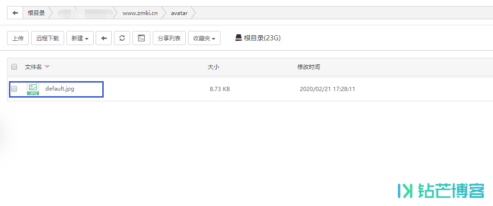
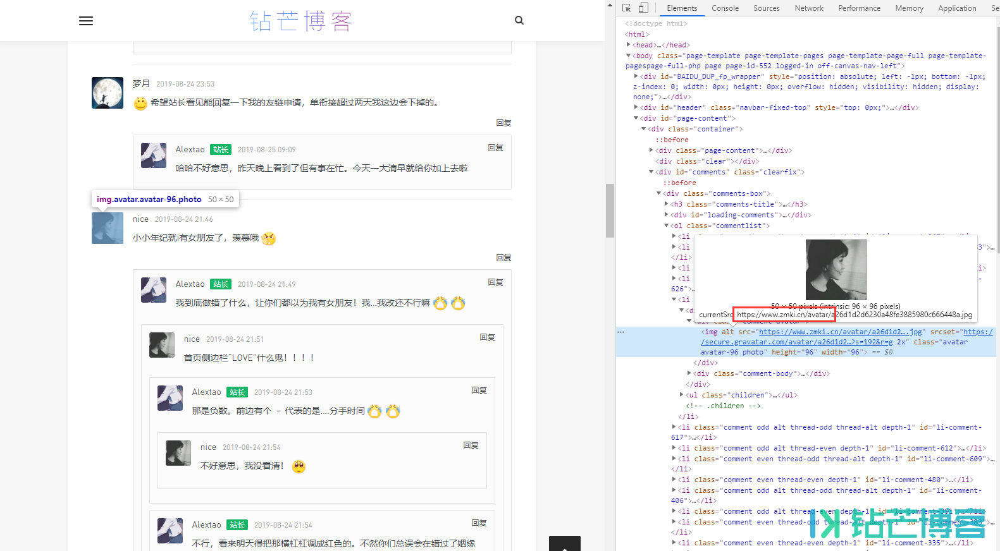

## 解决WordPress头像优化Gravatar加载延迟高本地化保存加速

https://www.zmki.cn/5397.html


说到网站速度[优化](https://www.zmki.cn/tag/638)，一直以来都有一个小小的问题，那就是[Gravatar](https://www.zmki.cn/tag/636)头像，这个东西加载时快时慢，某一时候加载不正常延迟非常高，十分拖累网站加载速度，而网上很多之前的加速接口好像也都已失效。今天来让这个东西加载后自动保存在本地，下次加载直接使用本地链接。放在自己这里稳定高效。

### 一，创建缓存目录

在你的WordPress根目录创建一个`avatar` 的文件夹，权限调整为755

[](https://a-oss.zmki.cn/2020/20200221-64b67c84f76c8.png)

### 二，设置默认头像

并不是所有人都设置了Gravatar头像，我们给那些没有头像的设置一个默认图片，没有头像就显示这个图片。

在`avatar文件夹`放入一张名称为`default.jpg`的图片，默认没有头像即使用这个图片。

**#:**这里钻芒这里并默认没有调用这张图片，而是依然使用Gravatar头像。可能是之前魔改导致的，这一步仅供参考

[](https://a-oss.zmki.cn/2020/20200221-9932879717df2.png)

### 三，将下边的代码放到 functions.php

把下边的代码放到你主题的`functions.php`内，默认14天刷新一下本地头像缓存，可根据自己自定义。

```php
//Gravatar 头像本地化加速
function my_avatar($avatar) {
$tmp = strpos($avatar, 'http');
$g = substr($avatar, $tmp, strpos($avatar, "'", $tmp) - $tmp);
$tmp = strpos($g, 'avatar/') + 7;
$f = substr($g, $tmp, strpos($g, "?", $tmp) - $tmp);
$w = get_bloginfo('wpurl');
$e = ABSPATH .'avatar/'. $f .'.jpg';
$t = 1209600; //14天刷新一次缓存, 单位:秒
if ( !is_file($e) || (time() - filemtime($e)) > $t ) { //當頭像不存在或文件超過14天才更新
copy(htmlspecialchars_decode($g), $e);
} else $avatar = strtr($avatar, array($g => $w.'/avatar/'.$f.'.jpg'));
if (filesize($e) < 500) copy($w.'/avatar/default.jpg', $e);
return $avatar;
}
add_filter('get_avatar', 'my_avatar');
```

全选

复制

## 最终实现效果查看

[](https://a-oss.zmki.cn/2020/20200221-a0f4825ee89f5.png)

 

- 代码来源:主题猫: [提升WordPress的Gravatar头像加载速度方法:缓存本地化国内服务器](https://www.zmki.cn/go/?url=http://ztmao.com/wpjy/5208.html)