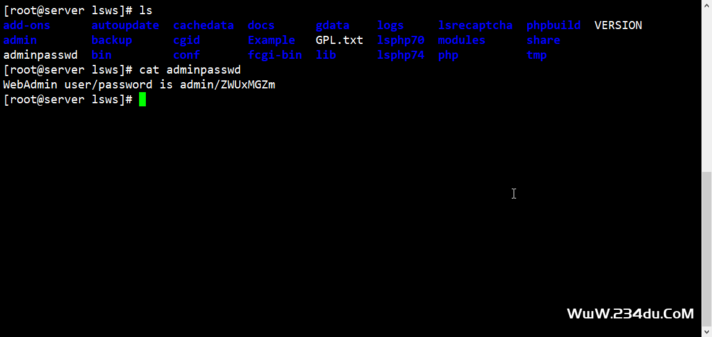
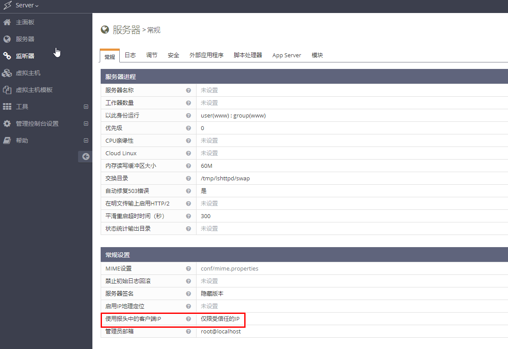
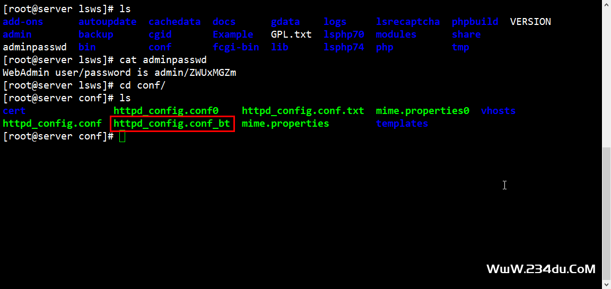
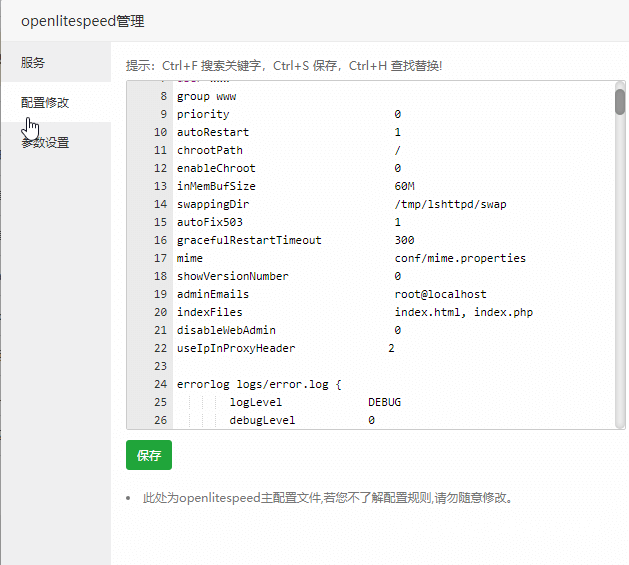
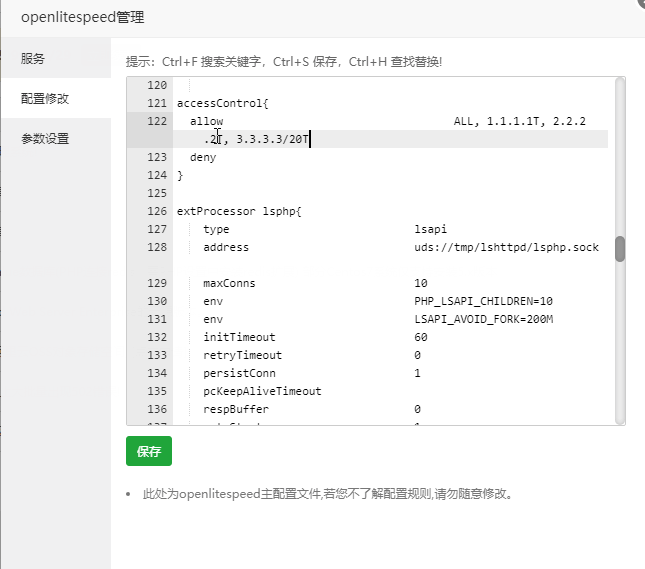
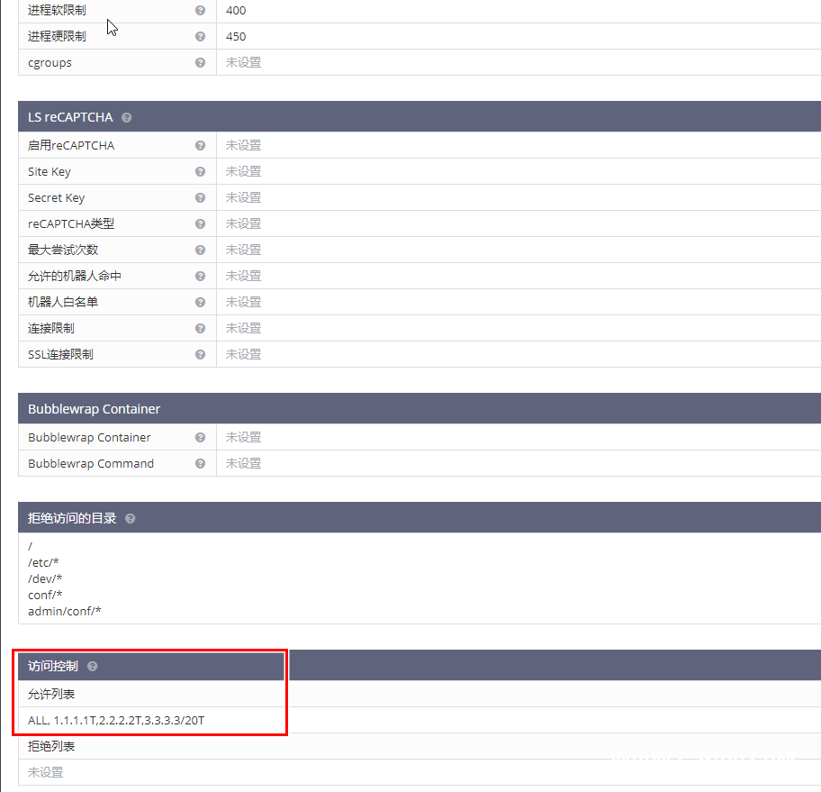
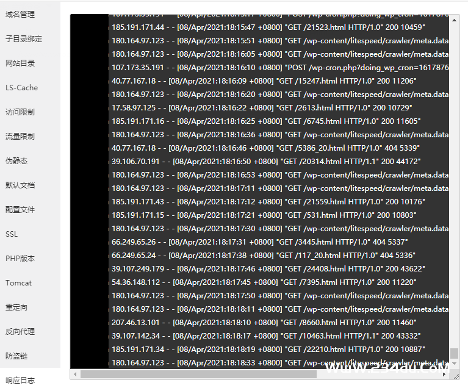

## （原创）OpenLiteSpeed在BT宝塔面板中获取CDN真实IP

https://www.234du.com/1203.html

环境配置

> 系统：CentOS7
>
> 宝塔（BT）：7.5.1
>
> OpenLiteSpeed：1.6.20


起因：《CentOS下 inotify+rsync 文件实时同步&用宝塔面板自建CDN加速境外网站》

过程：之前在配置网站的时候OpenLiteSpeed和Apache一样，所以按照这个思路去找，百度+Google各种查询，找到的资料寥寥无几。而且多是你采集我、我采集你，排版一塌糊涂。

### OpenLiteSpeed控制台

在宝塔面板中放行7080端口

查找登录密码

```
cd /usr/local/lsws
cat adminpasswd
```



控制面板右上角切换显示语言



登录后台之后，所有的设置都不能修改，因为是只读文件的原因，我们可以宝塔面板中修改。只要不是通过编译安装的OpenLiteSpeed，基本都不能使用控制面板修改配置项。

切换到conf目录，可以看到有以bt结尾的config文件，可以直接在SSH中修改，或在宝塔面板中修改，加入以下配置（在第22行）。

```
useIpInProxyHeader              2
```





### 添加上游CDN_IP

把IP地址加进去，加在allow后面以英文逗号分割，并且最后一定要加上一个大写的T。deny 是阻止的IP。



控制面板-->服务器-->安全，查看添加的IP。



查看效果



特别注意：上游CDN中一定要在配置中把IP传递过来，以Nginx为例：

```
{
    proxy_pass http://www.domain.com;
    proxy_set_header Host www.domain.com;
    proxy_set_header X-Real-IP $remote_addr;
    proxy_set_header X-Forwarded-For $proxy_add_x_forwarded_for;
    proxy_set_header REMOTE-HOST $remote_addr;
    add_header X-Cache $upstream_cache_status;
}
```

> 文章参考：
>
> https://git.69cdn.com/post/openlitespeed-behind-cloudflare-show-user-real-ip/