# CloudFlare免费CDN加速-CloudFlare加速,DNS解析,SSL证书和防DDoS攻击
最近因为用上了[Cloudflare Partner](https://wzfou.com/tag/cloudflare-partner/)，感觉CloudFlare在CDN这条道路上已经远远地甩开国内某些CDN一条街了。CloudFlare最开始运营于2010年，2011年因成功抵御了黑客组织LulzSec的攻击后开始展露头脚，到现在只要是被攻击的网站基本上可以看到CloudFlare的身影。

回顾当年，与[CloudFlare](https://wzfou.com/tag/cloudflare/)一起存在的有什么加速x、XX卫士、XX宝，现在要么被收购，要么被关闭，要么就是“原地踏步”，依然是老样子。CloudFlare有免费版的付费版，不过CloudFlare的免费版已经足够我们个人网站使用了，抵御一般的DDos一直开启5秒盾即可。

这篇文章主要是介绍一下CloudFlare的基本使用方法，因为不少的朋友已经开始使用cdn.wzfou.com提供的[Railgun](https://wzfou.com/cloudflare-railgun/)加速了，但是某些操作例如CDN解析、免费SSL证书生成以及CloudFlare的安全防护规则等遇到了不少的问题，这里就来做一个简单的问题解答。

[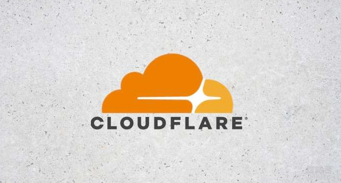](https://wzfou.com/wp-content/uploads/2018/12/cloudflare-cdn_00.jpg)

更多的关于[CDN加速](https://wzfou.com/cdn/)，可以看看：

1. [又拍云CDN加速申请使用教程-一键镜像,静态动态CDN和免费SSL](https://wzfou.com/upyun/)
2. [百度云存储BOS和百度云CDN使用体验-自动镜像存储和送加速域名](https://wzfou.com/baidu-bos-cdn/)
3. [自建CDN加速-Nginx反向绑定,缓存加速,自动更新缓存和获取真实IP](https://wzfou.com/nginx-cdn/)

> **PS：2019年12月25日更新，**如果你在使用cloudflare时出现签发SSL证书提供CAA错误，解决办法：[CloudFlare出现CAA证书失败的错误解决办法](https://wzfou.com/question/20329/)。
> 
> **PS：2020年1月4日更新，**Cloudflare Railgun是 Cloudflare 专门为 Business 和 Enterprise 企业级客户提供的终极加速方案。不过通过Cloudflare Partner可以免费开启：[免费开启Cloudflare Railgun加速-减少连接延迟 实现动态页面缓存和加速](https://wzfou.com/cloudflare-railgun-jiasu/)。

## 一、CloudFlare DNS解析

网站：

1. 官网：https://www.cloudflare.com/
2. 接入：https://cdn.wzfou.com/
3. 演示：https://losa.wzfou.net/

**接入CloudFlare CDN方式一：**修改NS服务器接入。直接到CloudFlare官网，添加你的域名，然后CloudFlare就会出NS服务器，你需要到你的域名注册商那里将域名的NS服务器修改为CloudFlare的就行了。

[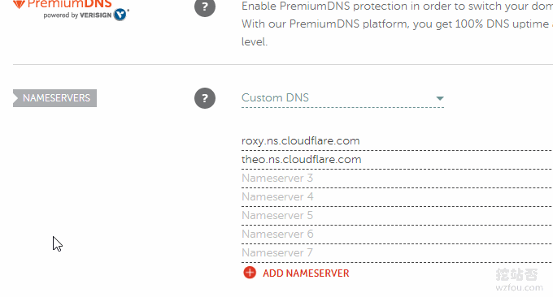](https://wzfou.com/wp-content/uploads/2018/12/cloudflare-cdn_02.gif)

**接入CloudFlare CDN方式二：**使用A记录或者CNAME记录。不想修改自己的NS服务器，而是想要使用A记录或者CNAME记录，你可以使用CloudFlare Partner，这是官方推出的一项合作服务。

[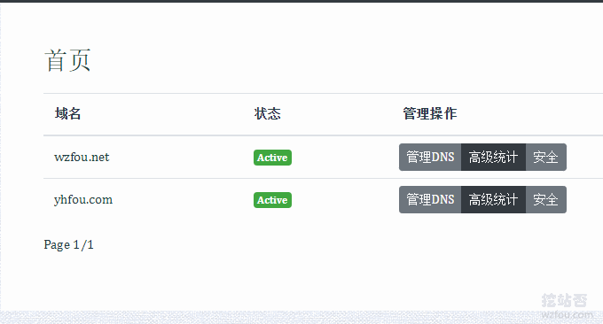](https://wzfou.com/wp-content/uploads/2018/12/cloudflare-cdn_17.gif)

有不少人的担心CloudFlare Partner安全与隐私问题，其实这是CloudFlare官方推出的合作方式，只是一个API接口，不会存储数据，你也可以自己申请一个给自己用或者提供给他人：[Cloudflare Partner接入管理Cloudflare CDN](https://wzfou.com/cloudflare-railgun/)。

[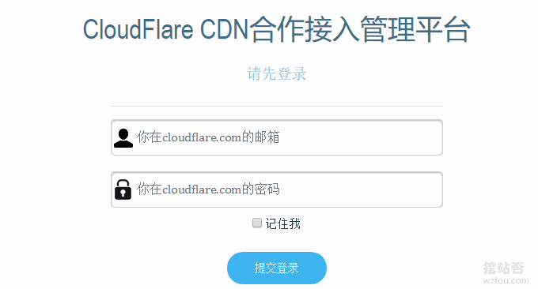](https://wzfou.com/wp-content/uploads/2018/12/cloudflare-cdn_18.gif)

在CloudFlare Partner添加的域名解析，都是可以在CloudFlare官网中继续管理，有一点不同的就是DNS不能使用的，其它的功能都是一样的。点击DNS一项会提示你到第三方的CloudFlare Partner进行设置。

[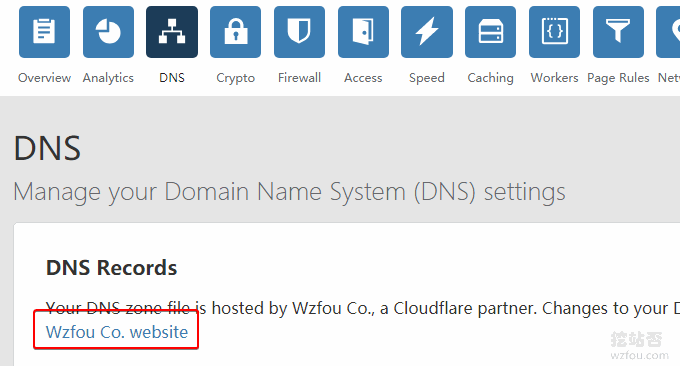](https://wzfou.com/wp-content/uploads/2018/12/cloudflare-cdn_19.gif)

在CloudFlare Partner设置DNS就和我们平时使用DNS域名解析是一样的了。（点击放大）

如果不是使用的CloudFlare Partner，则可以在CloudFlare 官网平台中管理DNS。

[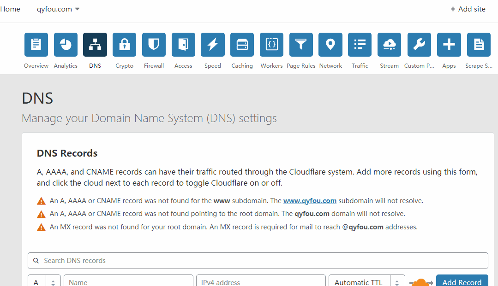](https://wzfou.com/wp-content/uploads/2018/12/cloudflare-cdn_03.gif)

CloudFlare 支持绝大多数的DNS域名解析记录。

[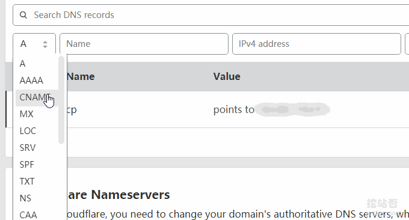](https://wzfou.com/wp-content/uploads/2018/12/cloudflare-cdn_04.gif)

## 二、CloudFlare开启DNSSEC

DNSSEC是为解决DNS欺骗和缓存Wu染而设计的一种安全机制，英文名称叫Domain Name System Security Extensions，利用密码技术，使得域名解析服务器可以验证它所收到的应答(包括域名不存在的应答)是否来自于真实的服务器，或者是否在传输过程中被篡改过。

CloudFlare支持一键开启DNSSEC，前提是你必须使用CloudFlare的NS服务器。

[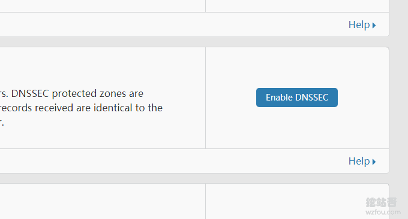](https://wzfou.com/wp-content/uploads/2018/12/cloudflare-cdn_05.gif)

在CloudFlare开启了DNSSEC后，会提供相关的CloudFlare记录。

[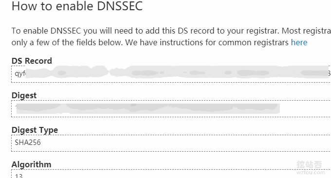](https://wzfou.com/wp-content/uploads/2018/12/cloudflare-cdn_06.gif)

将这些记录填写到你的域名注册商（前提是你的域名注册商支持DNSSEC）即可。

[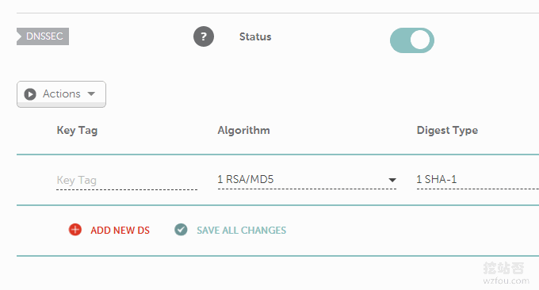](https://wzfou.com/wp-content/uploads/2018/12/cloudflare-cdn_07.gif)

更多关于[CloudFlare DNSSEC](https://wzfou.com/tag/cloudflare-dnssec/)的详细的介绍可以参考：[DNS域名解析启用DNSSEC防止DNS劫持-Google Cloud DNS设置DNSSEC](https://wzfou.com/dnssec-dns/)。

## 三、CloudFlare免费SSL证书

点击“Crypto”可以管理SSL证书，CloudFlare为大家提供免费的SSL证书，如果你的服务器上没有SSL证书，你可以选择**Flexible SSL**模式，这样用户访问到的依然是https,而CDN与你的服务器之间通信用Http。

[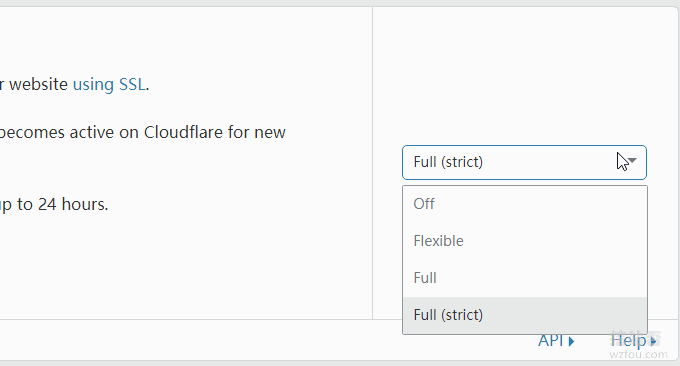](https://wzfou.com/wp-content/uploads/2018/12/cloudflare-cdn_08.gif)

**Always Use HTTPS**可以让你的网站实现Http自动跳转到Https上，如果你的网站已经有301自动跳转，则可以将此关闭。

[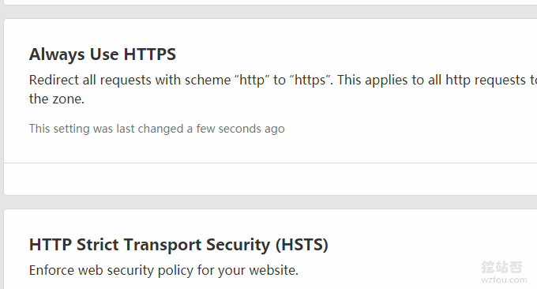](https://wzfou.com/wp-content/uploads/2018/12/cloudflare-cdn_09.gif)

**HSTS**可以让你的网站在第一次访问时就使用Https连接，而不是由Http跳转到Https。该功能与之间介绍的[启用HSTS并加入HSTS Preload List让网站Https访问更加安全](https://wzfou.com/hsts-preload/)差不多，只不过这是由CloudFlare CDN提供的。

[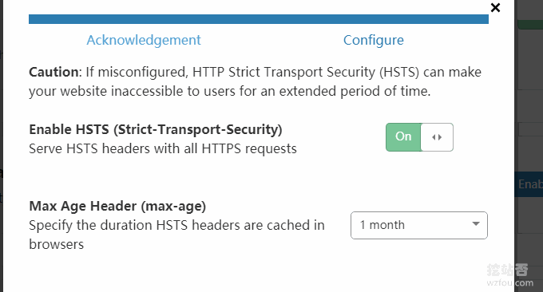](https://wzfou.com/wp-content/uploads/2018/12/cloudflare-cdn_10.gif)

对于不想使用[CloudFlare免费SSL](https://wzfou.com/tag/cloudflare-ssl/)证书的朋友，可以选择关闭CloudFlare的SSL证书。

## 四、CloudFlare防护模式

当你的网站已经被DDos打得不行的时候，可以在CloudFlare的安全选项中将防护模式设置为“我正在遭受攻击”。

[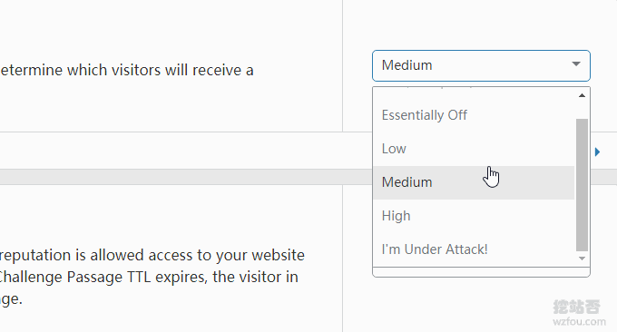](https://wzfou.com/wp-content/uploads/2018/12/cloudflare-cdn_12.gif)

这样就可以开启CloudFlare经典的5秒盾，此功能已经被[经典VPS](https://wzfou.com/bvps/)等采用，防护效果非常好，如下图：

[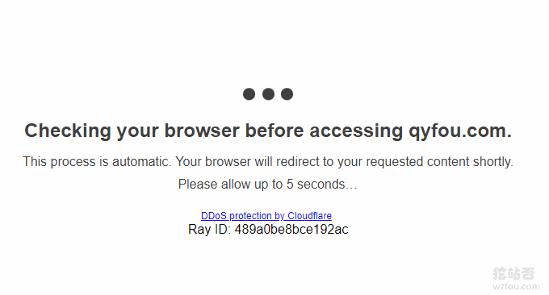](https://wzfou.com/wp-content/uploads/2018/12/cloudflare-cdn_21.gif)

## 五、CloudFlare加速设置

由于CloudFlare的服务器在国外，所以如果用的是[CN2 VPS](https://wzfou.com/cn2-vps-list/)、[香港VPS](https://wzfou.com/tag/hk-vps/)、[韩国VPS](https://wzfou.com/tag/kr-vps/)以及[日本VPS](https://wzfou.com/tag/jp-vps/)等，使用CloudFlare后加速效果不明显，但是如果你用的是欧洲或者其它地方的VPS，那么CloudFlare加速效果是非常好的。

[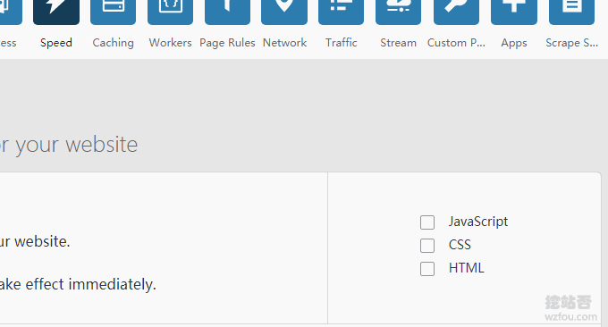](https://wzfou.com/wp-content/uploads/2018/12/cloudflare-cdn_13.gif)

[CloudFlare Railgun](https://wzfou.com/tag/cloudflare-railgun/)加速服务需要付费才能使用，Railgun可以大大提升网站的响应速度，尤其对于动态内容的网站非常有效。使用cdn.wzfou.com都可以免费享受CloudFlare Railgun加速服务，请添加域名后联系我或者在本文留言。

[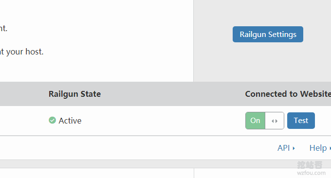](https://wzfou.com/wp-content/uploads/2018/12/cloudflare-cdn_22.gif)

## 六、CloudFlare缓存设置

CloudFlare可以设置浏览器缓存以及永久在线功能，你也可以直接在CloudFlare官网中一键清除缓存。

[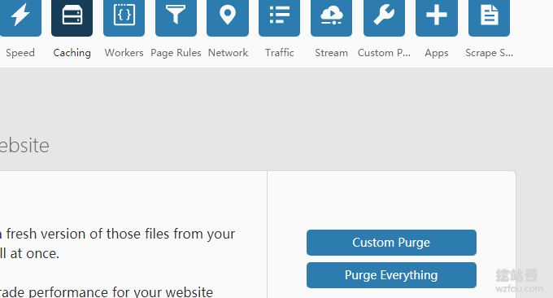](https://wzfou.com/wp-content/uploads/2018/12/cloudflare-cdn_15.gif)

## 七、CloudFlare Page Rules

文档：

1. https://support.cloudflare.com/hc/en-us/articles/218411427

[CloudFlare Page Rules](https://wzfou.com/tag/cloudflare-page-rules/)主要是用来方便你更加精准地控制好网站的某一个页面适用CloudFlare的CDN或者缓存规则，免费用户有3条规则可以添加。

[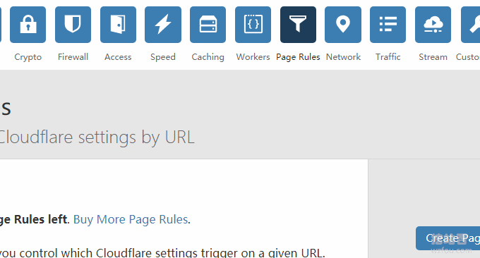](https://wzfou.com/wp-content/uploads/2018/12/cloudflare-cdn_23.gif)

从我个人的使用体验来看，CloudFlare Page Rules比较实用的功能有实现页面301跳转、控制某些经常更新的页面不生成缓存、调整特定的页面的安全防护等级等。

[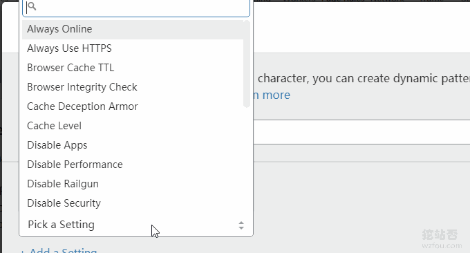](https://wzfou.com/wp-content/uploads/2018/12/cloudflare-cdn_24.gif)

## 八、总结

如果你的国外主机空间速度很慢的话，不妨用CloudFlare来实现访问加速，效果可以看看我的演示，如果自己申请到了CloudFlare Partner的话，可以参考此文[Cloudflare Partner接入管理](https://wzfou.com/cloudflare-railgun/)搭建WEB平台。

[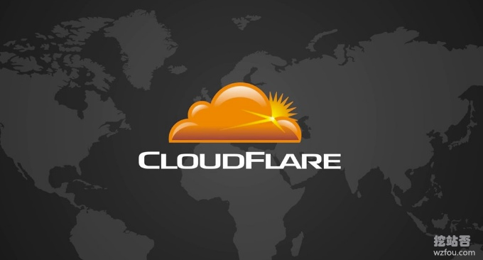](https://wzfou.com/wp-content/uploads/2018/12/cloudflare-cdn_02.jpg)

CloudFlare使用起来也有不少的问题，例如DNS解析速度慢以及DNS修改后生效慢等，另外虽然说现在CloudFlare的CDN服务在国内还可以正常访问，不排除以后滥用后CloudFlare的CDN节点无法访问的问题。