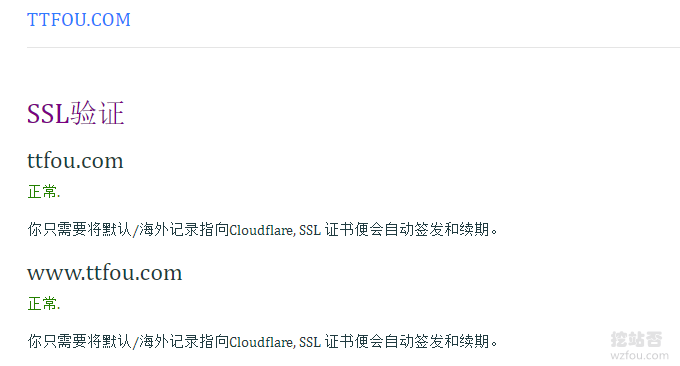

# CloudFlare免费CDN加速自定义节点-CloudFlare自选IP加快CDN速度
关于[CloudFlare](https://wzfou.com/tag/cloudflare/)自定义加速节点IP的方法，我们在分享[Cloudflare Partner](https://wzfou.com/cloudflare-partner/)的文章里就已经提到过。虽然CloudFlare官网不提供CNAME和A记录接入CDN的方式，但是CloudFlare的Self-Serve Partner计划，却可以免费使用CNAME和A记录接入到CloudFlare。

而我们也正好利用[CloudFlare](https://wzfou.com/tag/cloudflare/)使用A记录接入CDN的方式，自定义节点IP，例如1.0.0.1。使用CloudFlare自定义节点IP的好处就是可以一定程度上缓解CloudFlare免费套餐拥堵的问题，实测CloudFlare免费套餐节点比较少，且“鱼龙混杂”，容易被阶段性QQ。

这篇文章就来分享一下如何设置CloudFlare[免费CDN](https://wzfou.com/tag/free-cdn/)加速自定义节点，更多的关于[CDN加速](https://wzfou.com/cdn/)的方法，这里有：

1. [Psychz免费CDN加速-日本美国欧洲节点可自定义 SSL支持Layer-7 DDOS防护](https://wzfou.com/psychz-cdn/)
2. [启用CDN后网站获取用户真实IP:Cloudflare CDN真实IP地址(Nginx,Apache)](https://wzfou.com/cdn-real-ip/)
3. [自建CDN加速-Nginx反向绑定,缓存加速,自动更新缓存和获取真实IP](https://wzfou.com/nginx-cdn/)

## 一、接入CloudFlare CDN

平台：

1. https://cdn.wzfou.com/（来自挖站否）
2. https://cdn.bnxb.com/
3. https://cdn.kevsrv.com/
4. https://cf.tlo.xyz/

### 1.1 添加域名

上面几个都是利用[CloudFlare Partner](https://wzfou.com/tag/cloudflare-partner/) API开发的CloudFlare CDN接入平台，如果你也想自己申请CloudFlare Partner ，参考：[Cloudflare Partner接入管理Cloudflare CDN](https://wzfou.com/cloudflare-railgun/)。首先，添加你的域名。

然后，添加A记录，该记录为你源站的IP地址。

添加完成后，会生成CNAME、Anycast IPv4和NS设置三种方式。

一般来说我们选择CNAME或者是Anycast IPv4来接入。现在到你的域名DNS管理处，添加CNAME记录，这个CNAME记录就是刚刚生成的记录值。

### 1.2 检测生效

按照上面的方法，请先耐心等待DNS解析生效，进入到CloudFlare Partner 接入平台，点击“安全”。

当看到SSL证书生成成功时，CloudFlare CDN接入成功了。

## 二、自定义CDN节点IP

### 2.1 1.0.0.1

1. https://1.1.1.1/zh-Hans/

`1.1.1.1/1.0.0.1`是CloudFlare联合APNIC推出的公共DNS解析服务，官网说这是地球最快的DNS：`1.1.1.1 the fastest DNS resolver on Earth`，但是这个IP也可以当成CloudFlare CDN的IP。

部分运营商1.1.1.1可能无法访问因为他们把1.1.1.1认为路由器的IP了，所以添加域名解析记录 IPV4指向1.0.0.1。

记得删除原来的CNAME或者A记录，待所有的DNS解析生效到1.0.0.1就可以正常访问了。1.0.0.1的路由线路如下（测试网址：ttfou.com）：

相对于没有使用1.0.0.1作为自定义IP地址，而是使用CloudFlare默认的CNAME或者Anycast IPv4，线路还是不同的。（点击放大）

### 2.2 优选节点IP

CloudFlare的百度云合作ip

> 162.159.208.4-162.159.208.103  
> 162.159.209.4-162.159.209.103  
> 162.159.210.4-162.159.210.103  
> 162.159.211.4-162.159.211.103

网友收集的CloudFlare国内线路友好IP：

> 108.162.236.1/24 联通 走美国  
> 172.64.32.1/24 移动 走香港  
> 104.16.160.1/24 电信 走美国洛杉矶  
> ———  
> 172.64.0.0/24 电信 美国旧金山  
> 104.20.157.0/24 联通 走日本  
> 104.28.14.0/24 移动 走新加坡

网友关于各线路推荐列表：

> **电信：**推荐走圣何塞，例：104.16.160.* 或者上面的百度云合作 ip。  
> **移动：**推荐走移动香港，例：172.64.32.* 141.101.115.* 或者 104.23.240.0-104.23.243.254。  
> **联通：**没发布什么好线路，可走圣何塞。例：104.16.160.* 或者 104.23.240.0-104.23.243.254。也可以试一下走亚特兰大 108.162.236.* 。

### 2.3 其它节点IP

这些IP不一定可以用，请测试后再使用：

> 104.18.62.1/24 香港hkix.net  
> 104.16.35.1/24 香港hkix.net  
> 104.16.36.1/24 香港hkix.net  
> 104.18.35.1/24 香港hkix.net  
> 104.18.36.1/24 香港hkix.net  
> 104.16.54.1/24 香港  
> 104.16.55.1/24 香港  
> 104.18.128.1/24 香港  
> 104.18.129.1/24 香港  
> 104.18.130.1/24 香港  
> 104.18.131.1/24 香港  
> 104.18.132.1/24 香港  
> 104.19.195.1/24 香港  
> 104.19.196.1/24 香港  
> 104.19.197.1/24 香港  
> 104.19.198.1/24 香港  
> 104.19.199.1/24 香港

## 三、自定义节点IP问题

### 3.1 三网智能解析

CloudFlare自定义CDN节点IP，移动、电信和联通会出现不同的访问情况，我们可以利用DNS的智能解析服务，将移动、联通、电信用户解析到不同的IP地址上。

### 3.2 防止被CF封

自定义CloudFlare的节点IP，有可能被CloudFlare封掉，解决的办法也很简单，利用DNS智能解析，将国外访问按照正常的CloudFlare给的CNAME记录解析，而国内我们则按照自定义IP来解决。

现在，不管是国内还是国外的DNS，都基本上是支持分地域解析了，这里有更多：[国内外免费DNS域名解析服务汇总列表](https://wzfou.com/mianfei-dns/)。

## 四、总结

[CloudFlare CDN](https://wzfou.com/tag/cloudflare-cdn/)可以用来解决一些线路不好的VPS主机在国内的访问速度，例如一些欧洲或者美国VPS，而且cdn.wzfou.com提供免费的Railgun加速，需要启用的朋友在这里留言：[https://wzfou.com/question/17493/](https://wzfou.com/question/17493/)

CloudFlare自定义CDN节点IP可以在一定程度上解决免费套餐线路拥堵的问题，不过随之而来的风险也有不少，例如可能自定义的IP会失效，出现一些莫名其妙的错误，经常观察1.0.0.1这个IP是目前最稳定的。