# Cloudflare Partner接入管理Cloudflare CDN-启用Railgun动态加速
Cloudflare Partner是Cloudflare推出的分销合作计划，目前分为两种：Self-Serve Partner和Enterprise Reseller，两种在功能上存在差别，Enterprise Reseller拥有更多的定价权、可选功能以及更好的产品服务。

现在大家见到的Cloudflare Partner多数为Self-Serve Partner，刚开始推出时申请门槛不高，通过率还是不错的，随着申请的人越来越多，[Cloudflare](https://wzfou.com/tag/cloudflare/) Partner现在审核也慢了不少，而且条件也提高了，个人想通过的话还是有些麻烦。

当然对于不关心[Cloudflare Partner](https://wzfou.com/cloudflare-partner/)而只想要使用CNAME、IP接入Cloudflare CDN，而不是修改NS，你可以直接放心地使用第三方的Cloudflare Partner。我们知道，Cloudflare 官网提供的CDN需要修改域名的NS服务器。

而使用Cloudflare Partner的话，可以只修改域名的A或者CNAME记录，就可以使用Cloudflare CDN了，同时Cloudflare Partner不存储用户数据，只是一个管理接口，更多的Cloudflare安全防护服务，也可同时在Cloudflare官网操作。

[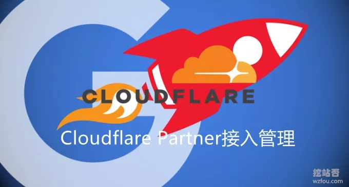](https://wzfou.com/wp-content/uploads/2018/11/cloudflare-railguns_000.jpg)

本篇文章就来分享一下如何搭建[Cloudflare Partner](https://wzfou.com/tag/cloudflare-partner/)接入管理系统，以及Cloudflare CDN使用方法，更多的CDN加速有：

1. [百度云存储BOS和百度云CDN使用体验-自动镜像存储和送加速域名](https://wzfou.com/baidu-bos-cdn/)
2. [又拍云CDN加速申请使用教程-一键镜像,静态动态CDN和免费SSL](https://wzfou.com/upyun/)
3. [自建CDN加速-Nginx反向绑定,缓存加速,自动更新缓存和获取真实IP](https://wzfou.com/nginx-cdn/)

> **PS：2018年12月4日更新，**有了免费CDN，还想要免费域名的，可以参考此篇文章注册一个免费顶级域名：[免费域名.tk,.ml,.ga,.cf,.gq申请注册和DNS解析-绑定免费空间教程](https://wzfou.com/tk-ml/)。
> 
> **PS：2019年9月7日更新**，免费申请加入Railgun加速，欢迎请进入此处讨论：[https://wzfou.com/question/17493/](https://wzfou.com/question/17493/)

## 一、申请Cloudflare Partner

**PS：如果只要想使用** [https://cdn.wzfou.com/](https://cdn.wzfou.com/) 的朋友，请直接跳到[第三部分](https://wzfou.com/cloudflare-railgun/#ftoc-heading-6)，前两部分是分享如何搭建Cloudflare Partner的。

网站：

1. 官网：https://www.cloudflare.com/
2. 申请：https://www.cloudflare.com/partners/become-a-partner/

在填写申请表的过程中，根据几个朋友的提醒，使用域名邮箱以及填写主机域名相关产品网站，会得到较大的通过率，教程：[加入Cloudflare Partner免费提供CloudFlare CDN加速服务](https://wzfou.com/cloudflare-partner/)。

[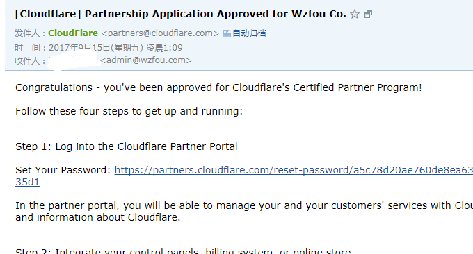](https://wzfou.com/wp-content/uploads/2018/11/cloudflare-railguns_00.gif)

Cloudflare Partner面板。如果是个人自用的话完全不用搞这个面板了，请参考[加入Cloudflare Partner](https://wzfou.com/cloudflare-partner/)教程使用命令操作即可，如果想提供给他人使用的话，可以用以下开源面板：

1. https://github.com/ZE3kr/Cloudflare-CNAME-Setup

此面板的特性

> 管理你的所有 DNS 记录。此面板使用了 Cloudflare API v4，所以支持各种格式的 DNS 记录。
> 
> 高级统计。你可以查看**过去一整年的统计信息**，而不仅仅是一个月。
> 
> 同时支持 NS 接入。此面板提供了 NS 接入信息，所以你可以随时切换到 Cloudflare DNS。此外，这个面板也支持 DNSSEC。
> 
> 同时支持 IP 接入。你可以看到 DNS 的 Anycast IPv4 和 IPv6 信息，这样你可以安全地在根域名下使用第三方 DNS。
> 
> 适配移动设备。
> 
> 支持多种语言。

面板管理界面如下：

[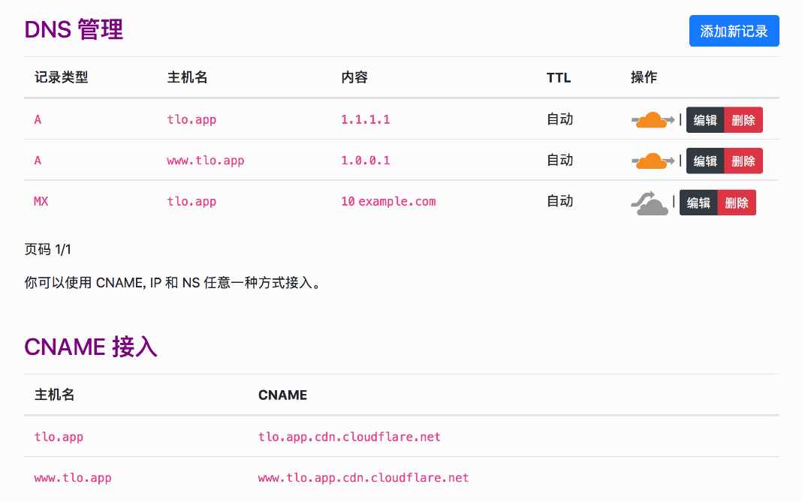](https://wzfou.com/wp-content/uploads/2018/11/cloudflare-railguns_00_1.gif)

## 二、启用CloudFlare Railgun

安装文档：

1. https://www.cloudflare.com/docs/railgun/installation.html

作为Cloudflare Partner的福利是可以开启CloudFlare Railgun（该服务原为CloudFlare的付费服务），登录到Cloudflare Partner管理面板。

[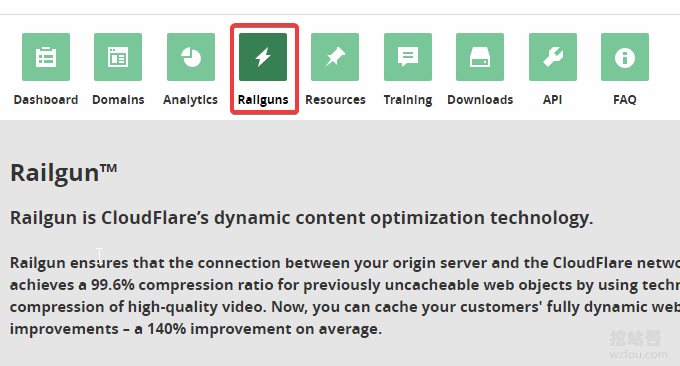](https://wzfou.com/wp-content/uploads/2018/11/cloudflare-railguns_01.gif)

然后同意协议。

[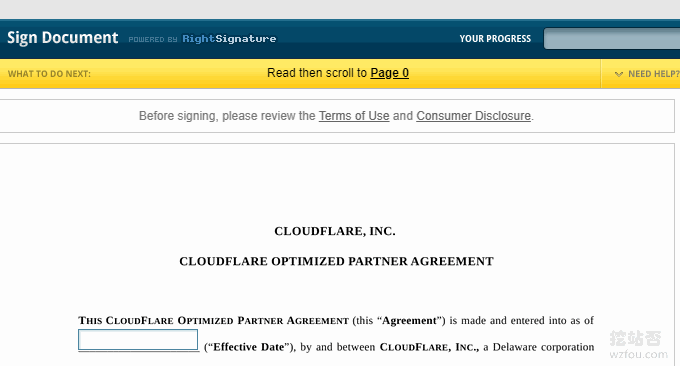](https://wzfou.com/wp-content/uploads/2018/11/cloudflare-railguns_02.gif)

关于CloudFlare Railgun安装的中文文档相当少，比较快速的方法是使用Docker，这里提供官方的安装方法。

### 2.1  添加repository与安装方法

Updating repository GPG key

The Cloudflare public packaging GPG key was updated in March of 2015 and will need to be updated if you are using the old key with an ID of 8e5f9a5d..

**apt-based OS**

Install the new key:

```
$ curl -C - https://pkg.cloudflare.com/pubkey.gpg | sudo apt-key add -
```

Remove the old key:

```
$ sudo apt-key del 8e5f9a5d
```

**yum-based OS**

Install the new key:

```
$ sudo rpm --import https://pkg.cloudflare.com/pubkey.gpg
```

Remove the old key:

```
$ sudo rpm -e gpg-pubkey-8e5f9a5d-*
```

**Ubuntu操作系统**

Add the repository (替换 <RELEASE> with the Ubuntu release name):

```
$ echo 'deb http://pkg.cloudflare.com/ <RELEASE> main' |
sudo tee /etc/apt/sources.list.d/cloudflare-main.list
```

举例:

```
$ echo 'deb http://pkg.cloudflare.com/ xenial main' |
sudo tee /etc/apt/sources.list.d/cloudflare-main.list
```

Import GPG key:

```
$ curl -C - https://pkg.cloudflare.com/pubkey.gpg | sudo apt-key add -
```

Update apt cache:

```
$ sudo apt-get update
```

**Debian操作系统**

Add the repository (替换 <RELEASE> with the Debian release name):

```
$ echo 'deb http://pkg.cloudflare.com/ <RELEASE> main' |
sudo tee /etc/apt/sources.list.d/cloudflare-main.list
```

举例:

```
$ echo 'deb http://pkg.cloudflare.com/ jessie main' |
sudo tee /etc/apt/sources.list.d/cloudflare-main.list
```

Import GPG key:

```
$ curl -C - https://pkg.cloudflare.com/pubkey.gpg | sudo apt-key add -
```

Update apt cache:

```
$ sudo apt-get update
```

**Red Hat Enterprise Linux 和CentOS操作系统**

Install RPM to add repository (替换 <VERSION> with the release version number):

```
$ sudo rpm -ivh http://pkg.cloudflare.com/cloudflare-release-latest.el<VERSION>.rpm
```

举例:

```
$ sudo rpm -ivh http://pkg.cloudflare.com/cloudflare-release-latest.el7.rpm
$ sudo rpm -ivh http://pkg.cloudflare.com/cloudflare-release-latest.el6.rpm
```

CloudFlare Railgun目前只支持64位系统，安装命令：

**RPM-based**

$ yum install railgun-stable

**DEB-based**

$ apt-get install railgun-stable

### 2.2  启动CloudFlare Railgun

安装成功后并自动将/etc/init.d/railgun添加到开机自启动中。修改配置：

```
vi /etc/railgun/railgun.conf

```

找到如下两行进行修改：

```
activation.token = <这里填写 Railgun 的 Token>
activation.railgun_host = <这里填写服务器的公网 ip>

```

然后启动 Railgun，命令如下：

(GNU/Linux)
$ /etc/init.d/railgun start
Starting railgun:                                          \[  OK  \]

$ service railgun start
Starting railgun:                                          \[  OK  \]

命令启动后，你就可以看到一个rg-listener 进程端口了(2408 by default). 你可以用以下命令查看:

(GNU/Linux)
$ netstat -plnt | grep 2408
tcp        0      0 :::2408                     :::*                        LISTEN      2981/rg-listener

请在防火墙中开启默认的端口，同时建议将CloudFlare的CDN节点IP全部加入到iptables防火墙当中，代码示例如下：

#开放2408端口
/sbin/iptables -I INPUT -p tcp --dport 2408 -j ACCEPT
#把CloudFlare的CDN节点IP加入防火墙中，其它的IP在这里可以找到：https://www.cloudflare.com/ips/
iptables -I INPUT -s 198.41.128.0/17 -j ACCEPT

#保存防火墙
service iptables save

#重启防火墙
service iptables restart

#如果用的是ubuntu，可以使用以下命令永久保存防火墙规则
#安装iptables-persistent
sudo apt-get install iptables-persistent
#持久化规则
sudo netfilter-persistent save
sudo netfilter-persistent reload

如果有错误，请到日志文件中 to /var/log/railgun/panic.log 查看, 或者直接使用以下命令直接显示错误:

(GNU/Linux)
$ sudo -u railgun /usr/bin/rg-listener -config=/etc/railgun/railgun.conf

如下图：

[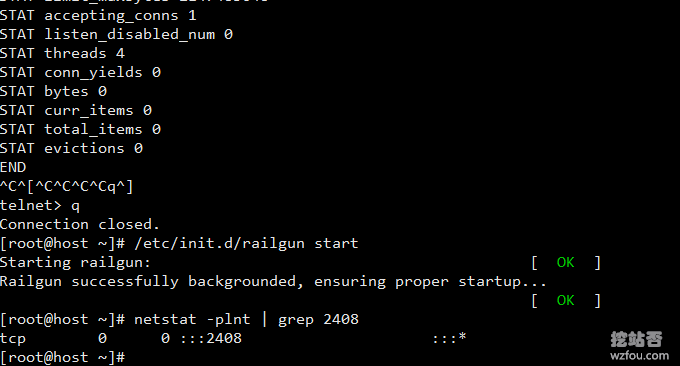](https://wzfou.com/wp-content/uploads/2018/11/cloudflare-railguns_03.gif)

### 2.3  激活CloudFlare Railgun

启用了CloudFlare Railgun后，你就可以到Cloudflare Partner后台看到CloudFlare Railgun已经是激活状态了，你可以添加IP范围，这样只要使用了该IP的域名就可以自动接入CloudFlare Railgun了。

[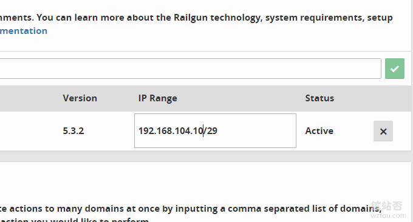](https://wzfou.com/wp-content/uploads/2018/11/cloudflare-railguns_04.gif)

## 三、Cloudflare Partner使用

### 3.1  添加域名解析

网站：

1. [https://cdn.wzfou.com/](https://cdn.wzfou.com/)

打开Cloudflare Partner登录地址，输入你在Cloudflare的账号与密码，如果是没有注册账号，会自动注册Cloudflare账号。

[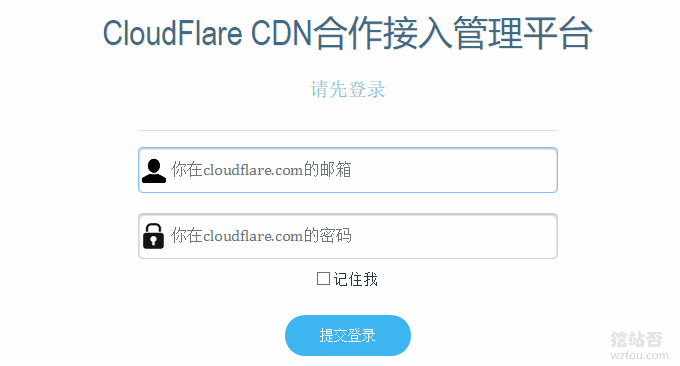](https://wzfou.com/wp-content/uploads/2018/11/cloudflare-railguns_05.gif)

登录后，就可以添加域名了。要求是域名没有在Cloudflare系统中，如果已经存在，请到Cloudflare官网将域名删除。

[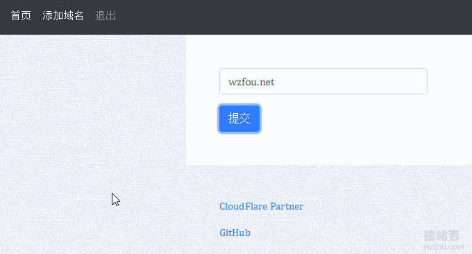](https://wzfou.com/wp-content/uploads/2018/11/cloudflare-railguns_06.gif)

这是Cloudflare Partner的DNS管理界面。

[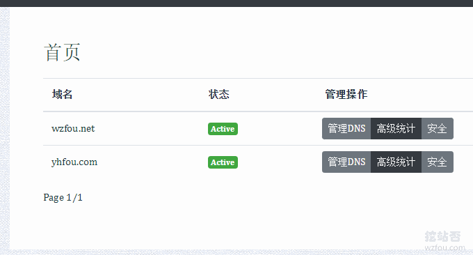](https://wzfou.com/wp-content/uploads/2018/11/cloudflare-railguns_08.gif)

在这里就可以修改添加A、CNAME等记录了，和其它的DNS管理是一样的。

[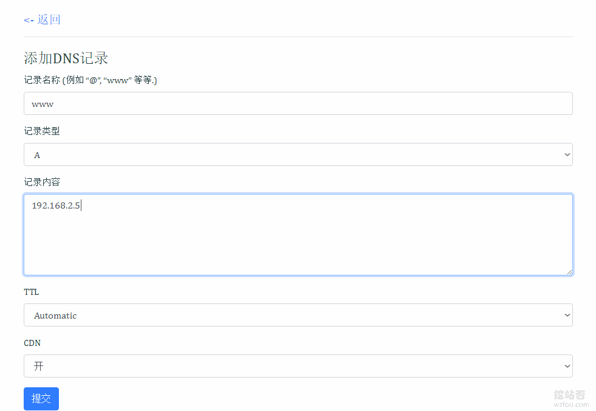](https://wzfou.com/wp-content/uploads/2018/11/cloudflare-railguns_09.gif)

Cloudflare Partner生成记录如下：（点击放大）

[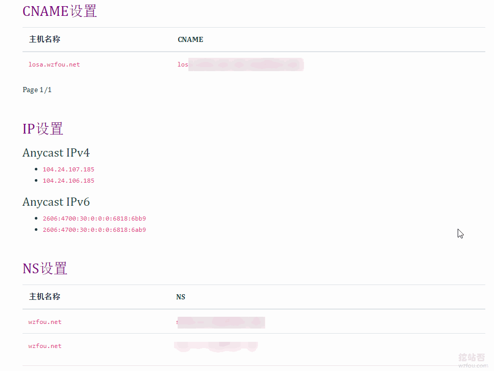](https://wzfou.com/wp-content/uploads/2018/11/cloudflare-railguns_10.gif)

### 3.2  启用Cloudflare CDN

我们添加了域名DNS后，就可以返回到自己的域名DNS处，将A记录或者CNAME修改为Cloudflare Partner提供给我们的。

[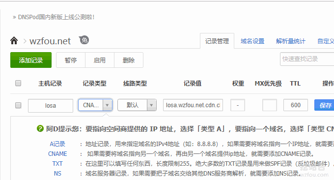](https://wzfou.com/wp-content/uploads/2018/11/cloudflare-railguns_12.gif)

现在你还可以指定1.0.0.1作为A记录，也是可以正常接入[Cloudflare CDN](https://wzfou.com/tag/cloudflare-cdn/)的。

[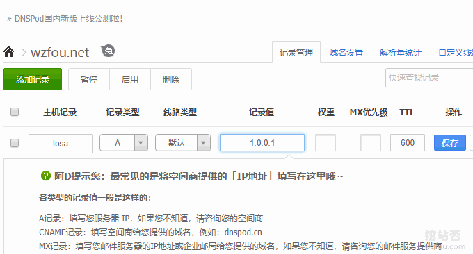](https://wzfou.com/wp-content/uploads/2018/11/cloudflare-railguns_11.gif)

指定1.0.0.1后访问的效果是这样的。

[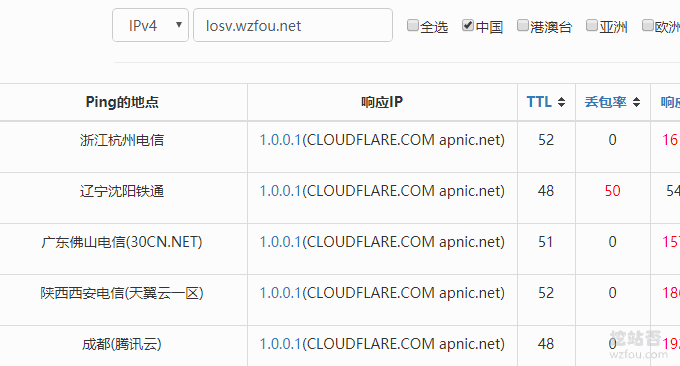](https://wzfou.com/wp-content/uploads/2018/11/cloudflare-railguns_11_1.gif)

### 3.3  启用Cloudflare SSL

在Cloudflare Partner添加了域名后，点击“安全”就可以看到是否成功配置好了SSL证书了，一般地修改了A或者CNAME记录后，稍等一会儿就可以看到成功了。

[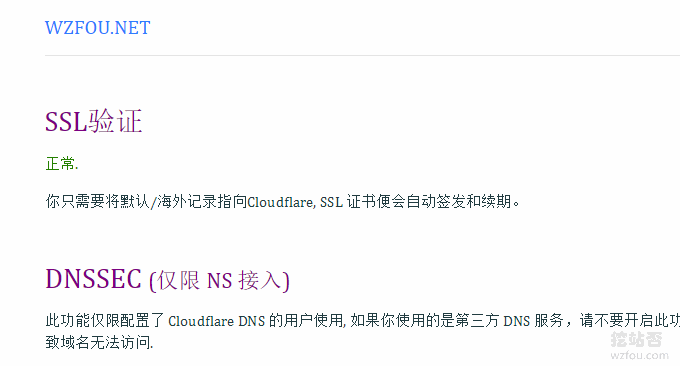](https://wzfou.com/wp-content/uploads/2018/11/cloudflare-railguns_13.gif)

你也可以进入到Cloudflare官网，在SSL一栏中看到已经给域名生成证书了。

[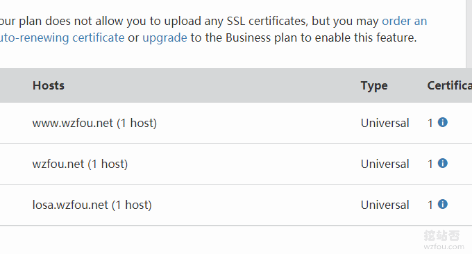](https://wzfou.com/wp-content/uploads/2018/11/cloudflare-railguns_21.gif)

用浏览器访问就可以看到用的是Cloudflare SSL证书了。

[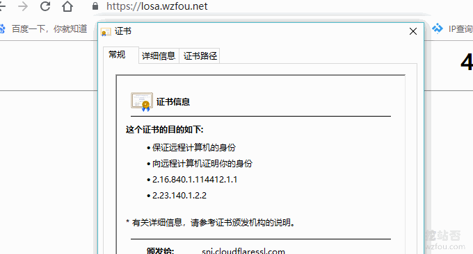](https://wzfou.com/wp-content/uploads/2018/11/cloudflare-railguns_16.gif)

首次颁发Cloudflare SSL证书的话，需要先验证你的域名是否已经指向了Cloudflare。

[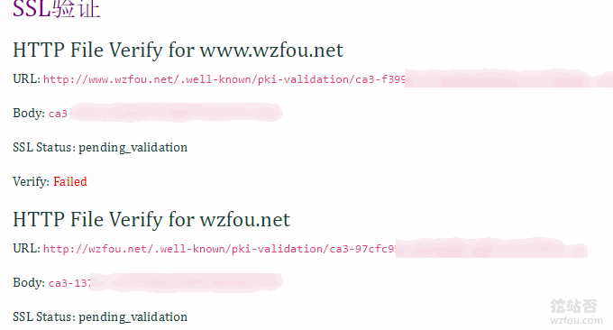](https://wzfou.com/wp-content/uploads/2018/11/cloudflare-railguns_19.gif)

验证成功后，然后就可以看到SSL证书签发成功了。

[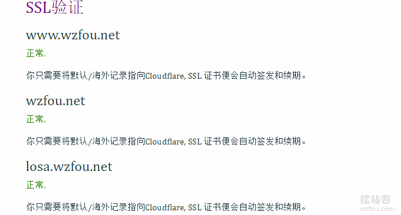](https://wzfou.com/wp-content/uploads/2018/11/cloudflare-railguns_20.gif)

### 3.4  Cloudflare Railgun设置

Cloudflare Railgun需要申请才能开通，详情：[免费开启Cloudflare Railgun加速-减少连接延迟 实现动态页面缓存和加速](https://wzfou.com/cloudflare-railgun-jiasu/)。如果你是使用的[其云否](https://qyfou.com/)的主机+cdn.wzfou.com管理接入，默认是已经开启了Cloudflare Railgun加速的，不想用的话也可以关闭它。

[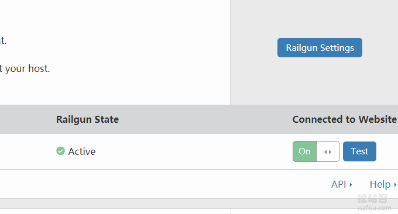](https://wzfou.com/wp-content/uploads/2018/11/cloudflare-railguns_18.gif)

其它的暂时没有使用其云否的主机，但是使用了cdn.wzfou.com管理接入的，想要使用[Cloudflare Railgun](https://wzfou.com/tag/cloudflare-railgun/)的话，可以单独联系我，需要手动激活。加速效果如下：

[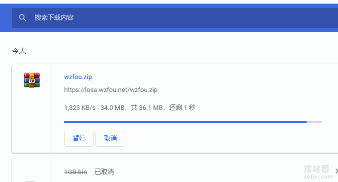](https://wzfou.com/wp-content/uploads/2018/11/cloudflare-railguns_07.gif)

Cloudflare Railgun体验地址：

1. https://losa.wzfou.net/

**PS：2018年12月28日更新**，其它的一些功能例如CC和DDos防护、页面规则以及缓存清除等都需要在官网进行操作，相关的说明：[CloudFlare免费CDN加速-CloudFlare加速,DNS解析,SSL证书和防DDoS攻击](https://wzfou.com/cloudflare-cdn/)。

## 四、总结

Cloudflare Partner是一个非常有用的服务，对于不想修改NS服务器但是想要使用Cloudflare CDN的朋友来说是相当好的，经过我的测试，Cloudflare Partner+DNSPOD，切换DNS记录可以即时生效。

[Cloudflare Railgun](https://wzfou.com/tag/cloudflare-railgun/)可以让源站的动态内容几乎全部静态化，进而大大加快加载的速度，也能一定程度上缓解对于动态页面的 CC 攻击，土豪可以利用Cloudflare Railgun搭建自己的CDN加速服务了。