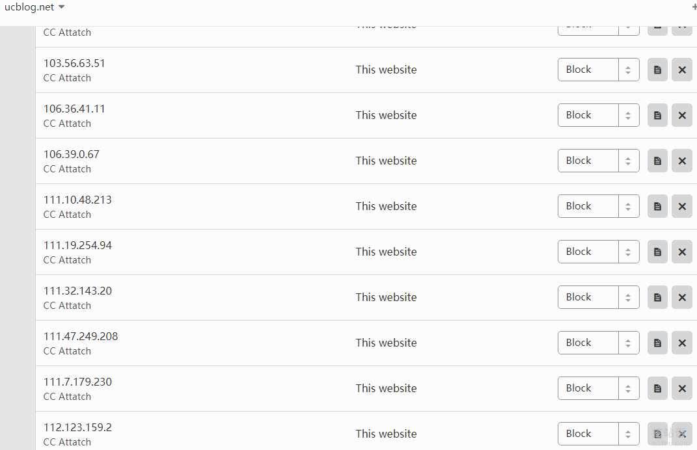
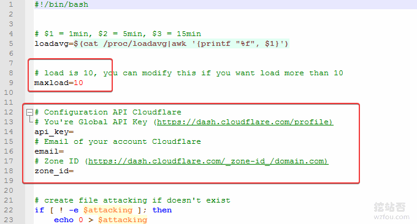

# Cloudflare自动拉黑恶意IP到防火墙和自动切换5秒盾脚本防CC攻击
一个朋友将自己的企业站放在[其云否主机](https://wzfou.com/qyfou-cheap-vps/)上，流量不大，但由于使用的是经常受到CC攻击，主要表现就是IO和CPU爆增，最后就是数据库挂掉导致网站无法访问。一开始启用了Cloudflare，但是攻击者疯狂地扫描，防御效果一般。

为了能够精确地识别恶意IP，在启用了[Cloudflare CDN](https://wzfou.com/tag/cloudflare-cdn/)后需要在Nginx和Apache中启用Real IP模块，然后利用脚本分析网站日志，从日志中搜集异常IP，然后使用Cloudflare API批量将恶意IP添加到Cloudflare的防火墙当中。

当然，当网站遭遇非常强大的CC和DDoS攻击时，我们可以启用Cloudflare经典的5秒盾防攻击，如果把握不了攻击的频率的话，可以设置一个定时任务，当系统负载超过某一个值（一般来攻击会导致系统负载爆增），调用[Cloudflare API](https://wzfou.com/tag/cloudflare-api/)启用5秒盾。

更多的关于[网站安全](https://wzfou.com/tag/wz-anquan/)和优化，这里有：

1. [五条关于使用免费VPS控制面板的安全建议-不让黑客有可趁之机](https://wzfou.com/vps-control-panel/)
2. [Linux的php-fpm优化心得-php-fpm进程占用内存大和不释放内存问题](https://wzfou.com/php-fpm/)
3. [启用HSTS并加入HSTS Preload List让网站Https访问更加安全-附删除HSTS方法](https://wzfou.com/hsts-preload/)

> **PS：2019年3月25日更新，**对于VPS的安全问题，很朋友可能会忽视VPS本身的SSH配置，这里有强化策略：[VPS主机和服务器安全防护:SSH修改端口,添加白名单,仅限密钥登录](https://wzfou.com/linux-vps-sh/)。
> 
> **PS：2020年1月4日更新，**Cloudflare Railgun是 Cloudflare 专门为 Business 和 Enterprise 企业级客户提供的终极加速方案。不过通过Cloudflare Partner可以免费开启：[免费开启Cloudflare Railgun加速-减少连接延迟 实现动态页面缓存和加速](https://wzfou.com/cloudflare-railgun-jiasu/)。

## 一、Cloudflare自动拉黑恶意IP

### 1.1  找出恶意IP

利用脚本分析在一分钟单个IP访问的频率，超过一定的频率（一般来正常的访问，一分钟内应该不超过60次，你可以设置为更小），即认定为恶意IP。脚本如下：

#/bin/bash

#日志文件，你需要改成你自己的路径

logfile=/data/wwwlogs/

last_minutes=1 

#开始时间1分钟之前（这里可以修改,如果要几分钟之内攻击次数多少次，这里可以自定义）

start_time= date +"%Y-%m-%d %H:%M:%S" -d '-1 minutes'

echo $start_time

#结束时间现在

stop_time=\`date +"%Y-%m-%d %H:%M:%S"\`

echo $stop_time

cur_date="\`date +%Y-%m-%d\`" 

echo $cur_date

#过滤出单位之间内的日志并统计最高ip数，请替换为你的日志路径

tac $logfile/sky.ucblog.net\_nginx.log | awk -v st="$start\_time" -v et="$stop\_time" '{t=substr($2,RSTART+14,21);if(t>=st && t<=et) {print $0}}' | awk '{print $1}' | sort | uniq -c | sort -nr > $logfile/log\_ip_top10

ip\_top=\`cat $logfile/log\_ip_top10 | head -1 | awk '{print $1}'\`

ip=\`cat $logfile/log\_ip\_top10 | awk '{if($1>2)print $2}'\`

\# 单位时间\[1分钟\]内单ip访问次数超过2次的ip记录入black.txt,这里wzfou.com为了测试设置了2，你需要改成其它的数字

for line in $ip

do

echo $line >> $logfile/black.txt

echo $line

\# 这里还可以执行CF的API来提交数据到CF防火墙

done

### 1.2  批量添加IP到防火墙

使用以下代码就可以将恶意IP批量添加到[Cloudflare](https://wzfou.com/tag/cloudflare/)的防火墙了，记得替换为你的Cloudflare API。

#!/bin/bash
\# Author: Zhys
\# Date  : 2018

\# 填Cloudflare Email邮箱
CFEMAIL="freehao123@gmail.com"
\# 填Cloudflare API key
CFAPIKEY="xxxxxxxxxxxxxxxx"
\# 填Cloudflare Zones ID 域名对应的ID
ZONESID="xxxxxxxxxxxxxxxxxxxx"

\# /data/wwwlogs/black.txt存放恶意攻击的IP列表
\# IP一行一个。
IPADDR=$(</data/wwwlogs/black.txt)

\# 循环提交 IPs 到 Cloudflare  防火墙黑名单
\# 模式（mode）有 block, challenge, whitelist, js_challenge
for IPADDR in ${IPADDR\[@\]}; do
echo $IPADDR
curl -s -X POST "https://api.cloudflare.com/client/v4/zones/$ZONESID/firewall/access_rules/rules" \
  -H "X-Auth-Email: $CFEMAIL" \
  -H "X-Auth-Key: $CFAPIKEY" \
  -H "Content-Type: application/json" \
  --data '{"mode":"block","configuration":{"target":"ip","value":"'$IPADDR'"},"notes":"CC Attatch"}'
done

\# 删除 IPs 文件收拾干净
rm -rf /data/wwwlogs/black.txt

### 1.3  自动找出恶意IP并添加到防火墙

直接将上面两个脚本合并到一个脚本即可。

#/bin/bash

#日志文件，你需要改成你自己的路径

logfile=/data/wwwlogs/

last_minutes=1 

#开始时间1分钟之前（这里可以修改,如果要几分钟之内攻击次数多少次，这里可以自定义）

start_time= date +"%Y-%m-%d %H:%M:%S" -d '-1 minutes'

echo $start_time

#结束时间现在

stop_time=\`date +"%Y-%m-%d %H:%M:%S"\`

echo $stop_time

cur_date="\`date +%Y-%m-%d\`" 

echo $cur_date

#过滤出单位之间内的日志并统计最高ip数，请替换为你的日志路径

tac $logfile/sky.ucblog.net\_nginx.log | awk -v st="$start\_time" -v et="$stop\_time" '{t=substr($2,RSTART+14,21);if(t>=st && t<=et) {print $0}}' | awk '{print $1}' | sort | uniq -c | sort -nr > $logfile/log\_ip_top10

ip\_top=\`cat $logfile/log\_ip_top10 | head -1 | awk '{print $1}'\`

ip=\`cat $logfile/log\_ip\_top10 | awk '{if($1>2)print $2}'\`

\# 单位时间\[1分钟\]内单ip访问次数超过2次的ip记录入black.log,这里为了测试设置2，你需要改成其它的数字

for line in $ip

do

echo $line >> $logfile/black.txt

echo $line

\# 这里还可以执行CF的API来提交数据到CF防火墙

done

\# 填Cloudflare Email邮箱
CFEMAIL="freehao123@gmail.com"
\# 填Cloudflare API key
CFAPIKEY="xxxxxxxxxxxxxxxxxxxxxxxx"
\# 填Cloudflare Zones ID 域名对应的ID
ZONESID="xxxxxxxxxxxxxxxxxxxxxxxxxxx"

\# /data/wwwlogs/black.txt存放恶意攻击的IP列表
\# IP一行一个。
IPADDR=$(</data/wwwlogs/black.txt)

\# 循环提交 IPs 到 Cloudflare  防火墙黑名单
\# 模式（mode）有 block, challenge, whitelist, js_challenge
for IPADDR in ${IPADDR\[@\]}; do
echo $IPADDR
curl -s -X POST "https://api.cloudflare.com/client/v4/zones/$ZONESID/firewall/access_rules/rules" \
  -H "X-Auth-Email: $CFEMAIL" \
  -H "X-Auth-Key: $CFAPIKEY" \
  -H "Content-Type: application/json" \
  --data '{"mode":"block","configuration":{"target":"ip","value":"'$IPADDR'"},"notes":"CC Attatch"}'
done

\# 删除 IPs 文件收拾干净
 rm -rf /data/wwwlogs/black.txt

上面的脚本我已经放在我的下载中心，可以提供给大家下载使用，代码如下：

wget https://www.ucblog.net/shell/attack-ip.sh
chmod +x /qicmd/cfblockip.sh
./cfblockip.sh

wget https://www.ucblog.net/shell/attack-ip.sh
chmod +x /qicmd/attack-ip.sh
./attack-ip.sh

wget https://www.ucblog.net/shell/cf-block-attack-ip.sh
chmod +x /qicmd/cf-block-attack-ip.sh
./cf-block-attack-ip.sh

最后，设置一个定时任务，让脚本每过一分钟检测一次（请根据需要来调整，关于定时任务的使用参考：[Linux Crontab命令定时任务基本语法](https://wzfou.com/crontab/)）

\* \* \* \* \* /bin/bash /root/cf-block-attack-ip.sh > /tmp/ou1t.log 2>&1

自动添加恶意IP到CloudFlare防火墙的效果如下：

## 二、Cloudflare自动切换5秒盾脚本

网站：

1. https://github.com/Machou/Cloudflare-Block

当你的服务器受到攻击时，系统负载就会爆增，利用脚本自动检测系统负载，当压力超过一定的值时就可以切换为” I’m Under Attack! “模式了。操作步骤如下：

#下载
cd /root && git clone https://github.com/Machou/Cloudflare-Block.git DDoS

#打开Cloudflare.sh，修改配置
API_KEY			You're Global API Key (https://dash.cloudflare.com/profile)
MAIL_ACCOUNT		Email of your Cloudflare account
DOMAIN			Zone ID (https://dash.cloudflare.com/\_zone-id\_/domain.com)

#设置定时任务
crontab -e

*/1 * * * * /root/DDoS/Cloudflare.sh 0 # check every 1 minute if protection is not enabled
*/20 * * * * /root/DDoS/Cloudflare.sh 1 # check every 20 minutes if protection is enabled

脚本默认的是检测系统负载为10，启动” I’m Under Attack! “模式，你以根据需要来调整。如下图：

完整的脚本代码如下：

#!/bin/bash

\# $1 = 1min, $2 = 5min, $3 = 15min
loadavg=$(cat /proc/loadavg|awk '{printf "%f", $1}')

\# load is 10, you can modify this if you want load more than 10
maxload=10

\# Configuration API Cloudflare
\# You're Global API Key (https://dash.cloudflare.com/profile)
api_key=
\# Email of your account Cloudflare
email=
\# Zone ID (https://dash.cloudflare.com/\_zone-id\_/domain.com)
zone_id=     

\# create file attacking if doesn't exist
if \[ ! -e $attacking \]; then
  echo 0 > $attacking
fi

attacking=./attacking

hasattack=$(cat $attacking)

if \[ $(echo "$loadavg > $maxload"|bc) -eq 1 \]; then

  if \[\[ $hasattack = 0 && $1 = 0 \]\]; then

    # Active protection
    echo 1 > $attacking
    curl -s -X PATCH "https://api.cloudflare.com/client/v4/zones/$zone\_id/settings/security\_level" \
            -H "X-Auth-Email: $email" \
            -H "X-Auth-Key: $api_key" \
            -H "Content-Type: application/json" \
            --data '{"value":"under_attack"}'
  fi

  else
    if \[\[ $hasattack = 1 && $1 = 1 \]\]; then

    # Disable Protection
    echo 0 > $attacking
    curl -s -X PATCH "https://api.cloudflare.com/client/v4/zones/$zone\_id/settings/security\_level" \
            -H "X-Auth-Email: $email" \
            -H "X-Auth-Key: $api_key" \
            -H "Content-Type: application/json" \
            --data '{"value":"high"}'
  fi
fi

exit 0

## 三、总结

Cloudflare是一个非常好用的防御DDos和CC攻击的工具，免费版本的Cloudflare结合API可以实现更加灵活的功能，对于普通的防御足够自己使用了。

[Cloudflare](https://wzfou.com/tag/cloudflare/)防护也有一定的问题，那就是启用了Cloudflare后获取到用户的IP都是Cloudflare CDN节点的IP，我们还需要在服务器配置中做进一步的优化。