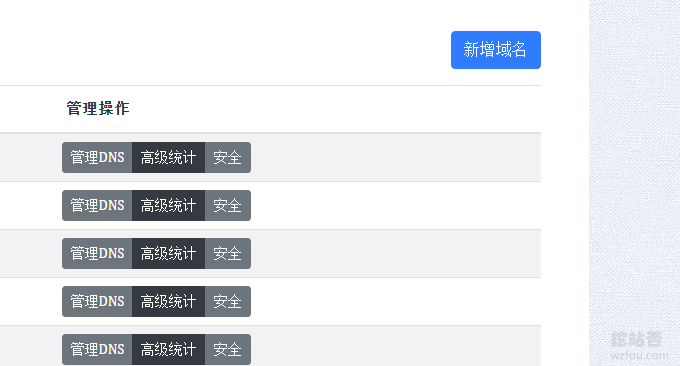
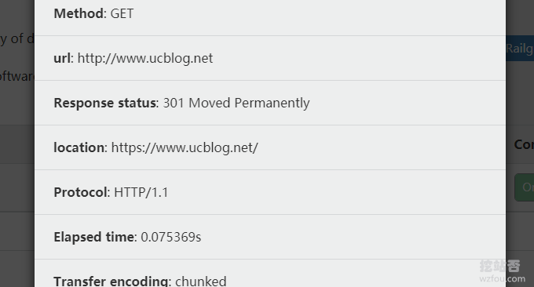

# 免费开启Cloudflare Railgun加速 减少连接延迟 实现动态页面缓存和加速
Cloudflare Railgun是 Cloudflare 专门为 Business 和 Enterprise 企业级客户提供的终极加速方案。要使用它，先需要升级网站套餐为 Business 或 Enterprise，然后还需要在服务器上安装必要软件并在 Cloudflare 上完成配置。Cloudflare的商业套餐适合土豪使用。

不过，我们还有一个方法就是申请[Cloudflare Partner](https://wzfou.com/tag/cloudflare-partner/)，提供了免费的Cloudflare Railgun加速功能。关于如何申请Cloudflare Partner和安装Cloudflare Railgun请参考这篇文章：[Cloudflare Partner接入管理Cloudflare CDN-启用Railgun动态加速](https://wzfou.com/cloudflare-railgun/)。

这篇文章主要面向想要使用[Cloudflare Railgun加速](https://wzfou.com/tag/cloudflare-railgun-jiasu/)的朋友的，主要分享一下免费开启Cloudflare Railgun加速的方法，更多的[CDN加速](https://wzfou.com/cdn/)方法有：

1. [Backblaze B2免费10GB云存储申请与使用-接入Cloudflare CDN提速](https://wzfou.com/backblaze-b2/)
2. [G-Core Labs免费CDN加速-日本韩国香港美国等全球加速免费100GB](https://wzfou.com/gcorelabs-cdn-pingce/)
3. [自建CDN加速-Nginx反向绑定,缓存加速,自动更新缓存和获取真实IP](https://wzfou.com/nginx-cdn/)

## 一、Cloudflare Railgun介绍

网站：

1. 官网：https://www.cloudflare.com/zh-cn/
2. Partner：https://cdn.wzfou.com/
3. 动态加速演示：https://ping.wzfou.com/
4. 图片加速演示：https://ttfou.com/
5. 下载加速演示：https://www.ucblog.net/

Cloudflare Railgun相当于是一个双边加速的软件。其实现原理是让服务器与 [Cloudflare](https://wzfou.com/tag/cloudflare/) 建立一个长久的 TCP 加密连接，使用 Railgun 独有协议而不是 HTTP 协议，这样显然能减少连接延迟。

此外，Cloudflare Railgun还会对动态页面缓存，经过挖站否自己的测试，这个功能对于访问速度非常慢的国外主机空间，例如欧洲、日本等冷门线路加速效果非常明显。

## 二、接入Cloudflare Partner

### 2.1 添加域名

进入：https://cdn.wzfou.com/，用你的Cloudflare账号和密码登录（没有的话请到Cloudflare官网注册一个账号，数据是相通的。）

然后点击添加域名。

### 2.2 设置DNS

完成域名添加，返回到域名面板，点击DNS管理。

然后点击添加记录。

这里就是填空你的域名DNS解析了，记录内容填写你的源站IP地址，记得选择开启CDN。（点击放大）

### 2.3 激活域名

添加了域名DNS解析记录后，现在Cloudflare会给出三种激活域名的方式：CNAME、A和NS，一般来说我们推荐使用CNAME或者是A记录，这样免去了修改NS服务器的麻烦。

到你的DNS解析商那里，将原来的A记录或者CNAME替换为Cloudflare给的CNAME或者A记录。如果你像挖站否一样使用的是[ClouDNS](https://wzfou.com/cloudns/)的DNS解析服务，可以参考：[ClouDNS便宜好用的DNS解析服务](https://wzfou.com/cloudns/)。

一般来说当CNAME记录生效后，你点击SSL就可以看到SSL证书签发成功了，如果你之前设置了CAA，可能会出现CAA错误，解决办法：[CloudFlare出现CAA证书失败的错误解决办法](https://wzfou.com/question/20329/)。

## 三、Cloudflare Railgun开通

### 3.1 提交申请

因为Cloudflare Partner面板并没有提供[Cloudflare Railgun](https://wzfou.com/tag/cloudflare-railgun/)开通功能，所以这一项额外的功能还需要手动开启。如果你的其云否VPS和虚拟主机的使用者，请直接在qyfou.com中提交工单，其它的朋友可以在论坛中提交（可匿名域名）：

1. https://wzfou.com/question/17493/

### 3.2 测试Railgun

登录到你的**Cloudflare官网账户**下，点击加速选项栏。

这时在Railgun这一项中看到是已经激活了。

点击测试可以看到Railgun已经成功启用。

### 3.3 加速效果

使用Cloudflare官方的测试可能提示失败，不过没有关系，你可以打开你的网站，使用Chrome审查元素能够看到网页请求是通过Cloudflare Railgun的，也表示成功了。

## 四、总结

[Cloudflare Railgun](https://wzfou.com/tag/cloudflare-railgun/)宣称使用 Railgun 能够实现 99.6% 的压缩率，并实现两倍的速度。实际测试中Cloudflare Railgun确实可以降低TTFB时间，尤其是对于国内访问慢的主机空间加速效果很明显。

目前Cloudflare Partner提供的Cloudflare Railgun只能设置一个加速节点，如果土豪的话可以购买官方的付费套餐，官方提供的Cloudflare Railgun是可以同时启用多个节点，加速会更加明显。