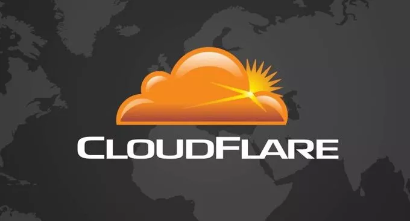
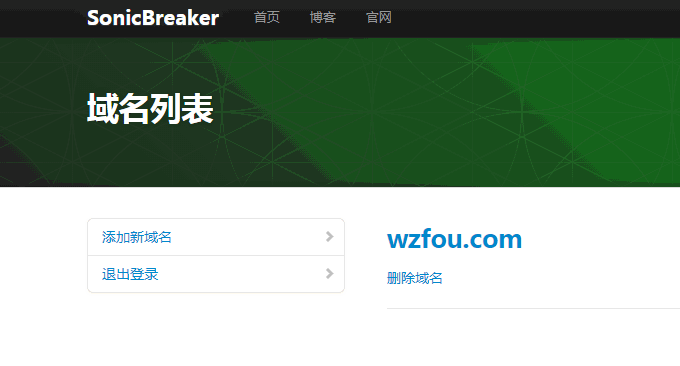
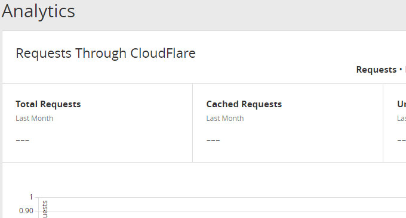

# 加入Cloudflare Partner免费提供CloudFlare CDN加速服务-无需修改NS支持SSL
Cloudflare Partner可以视作Cloudflare的合作分销计划，由Cloudflare官网提供API，你可以在WHMCS、Cpanel等面板中集成Cloudflare CDN加速服务。用户不需要进入到Cloudflare，就可以使用Cloudflare Partner管理CDN加速，使用效果和Cloudflare官网一样。

使用[Cloudflare Partner](https://wzfou.com/tag/cloudflare-partner/)有一个好处就是不需要修改域名的NS服务器就可以用上Cloudflare CDN，Cloudflare Partner会生成一个CNAME记录，你只需要将域名解析到这个CNAME记录即可。并且也支持SSL加密，没有启用SSL的网站也可以免费用上Https。

当然使用Cloudflare Partner也有不好的地方，一个就是Cloudflare Partner只能是之前没有在Cloudflare官网中添加过的域名，否则会提示重复不能继续下一步。解决的办法只能到Cloudflare官网中删除此域名。另外，Cloudflare Partner需要一个源域名，这一点对于非www域名加速不利。

[Cloudflare](https://wzfou.com/tag/cloudflare/) 本文就来分享一下如何加入Cloudflare Partner，同时分享自建Cloudflare CDN接入管理平台方法，利用Cloudflare Partner你也可以为大家提供免费的CDN加速服务了。作为站长，与其去找那些不靠谱的第三方服务，还不如自建网盘、CDN加速和RSS阅读器，自己用得还省心。如下：

1. [用Fikker自建CDN-支持Https,页面缓存,实时监控,流量统计,防CC攻击](https://wzfou.com/fikker/)
2. [手动安装NextCloud教程-免费开源的私有云存储网盘可播放图片音乐](https://wzfou.com/nextcloud-install/)
3. [利用Huginn抓取任意网站RSS和微信公众号更新-打造一站式信息阅读平台](https://wzfou.com/huginn-rss/)

**PS：2018年3月1日更新，**想要使用CloudFlare免费CDN加速的朋友，可以看看：[十个你可能不知道的CloudFlare免费CDN加速技巧-SSL\\DDOS\\Cache](https://wzfou.com/cloudflare/)。

**PS：2018年12月2日更新，**关于使用cloudflare Railgun加速的方法可参考这里：[Cloudflare Partner接入管理Cloudflare CDN-启用Railgun动态加速](https://wzfou.com/cloudflare-railgun/)。

## 一、加入Cloudflare Partner方法

官网：

1. https://www.cloudflare.com/partners/become-a-partner/

打开Cloudflare Partner注册地址，按照页面上的要求填写基本的信息，主要要注意的就是填写邮箱时要使用域名邮箱，类似于admin@wzfou.com这样的。

大约等上一天后，你就可以收到Cloudflare Partner发来的审核通过的邮件了。

点击邮件中的链接，会要求你重置Cloudflare Partner管理密码。

接着，会有一个简短的问卷调查。

填写完后，点击到下一步，你就会看到你的Cloudflare Partner API，再返回到主页，你就可以看到Cloudflare Partner面板了，主要有域名、统计、下载、API等等。（点击放大）

## 二、Cloudflare Partner：个人自用

Cloudflare Partner CLI

1. https://github.com/fffonion/cloudflare-partner-cli

如果是想要自己用Cloudflare Partner的话，那么你就可以直接下载使用Cloudflare Partner CLI，简单几句命令就可以使用上Cloudflare CDN加速了。运行 `python ./cloudflare-partner-cli.py`。

输入 `host_key`。输入要用来管理域名的账号 (你的Cloudflare个人账号，不是Cloudflare Partner账号)。账户信息保存在`.cfhost`文件中，然后按照屏幕提示添加域名、生成CNAME记录然后解析即可。（如下图）

## 三、Cloudflare Partner：集成WHMCS和cPanel

Cloudflare Partner提供了WHMCS、cPanel集成插件，你可以自己参考官网的的教程添加Cloudflare Partner。

1. cPanel [Download »](https://www.cloudflare.com/resources-downloads#cpanel) | [Instructions »](https://www.cloudflare.com/static/media/pdf/cloudflare-cpanel-installation-activation-guide.pdf)
2. Parallels Plesk Panel [Download »](https://www.cloudflare.com/static/misc/plesk_extension/plesk_extension.zip)
3. Parallels Plesk Automation [Download »](http://dev.apsstandard.org/apps/?name=cloudflare)
4. Parallels Automation [Download »](http://dev.apsstandard.org/apps/?name=cloudflare)
5. Interworx [Download »](http://www.interworx.com/community/cloudflare-plugin-now-out-of-beta/)
6. HostBill [Download »](http://hostbillapp.com/products-services/cloudflare/)

Cloudflare Partner集成WHMCS模块下载地址：http://www.cloudflare.com/static/misc/cloudflare_whmcs-latest.zip。解压到modules/addons目录下，然后在WHMCS中激活。

接着，你就可以在附加组件中配置Cloudflare Partner的API。详细的还可以参考官网的PDF教程：https://www.cloudflare.com/media/downloads/Cloudflare-Training-WHMCS-Installation-Guide.pdf

对WHMCS不了解的朋友，可以看看我之前写的：[WHMCS从入门到精通](https://wzfou.com/whmcs-jiaocheng/)。WHMCS不仅可以用来售卖虚拟主机、VPS、服务器，也可以用来售卖CDN加速。

## 四、Cloudflare Partner：共享使用

利用Cloudflare Partner提供的API，我们可以自己搭建Cloudflare Partner接入管理平台，让更多人的免费使用[Cloudflare CDN](https://wzfou.com/tag/cloudflare-cdn/)加速。这是我搭建的Cloudflare Partner管理平台：https://cdn.wzfou.com/。更多的还有:su.geekzu.org和cdn.kevsrv.com。

### 4.1  SonicBreaker

项目地址：

1. https://github.com/AxelPanda/SonicBreaker/

这是一个基于OneThink开发的Cloudflare Partner接入管理平台程序，需要PHP和MysqL数据库的支持。经过我的测试PHP 7可能不能正常运行。从GitHub上下载源代码，编Application/Home/Controller/CFController.class.php中的’your\_Cloudflare\_Partner\_host\_key’为你的Host_Key。

运行安装向导，填写数据库信息。

这是Cloudflare Partner SonicBreaker版本管理后台，你可以看到可以自己添加加速CDN域名。

添加的域名后会生成CNAME记录，按照提示要求做CNAME解析即可，想要SSL支持的话还需要添加SSL CNAME解析记录。

### 4.2   WeiUZ CloudFlare Partners

下载地址：

1. https://www.ucblog.net/wzfou/WeiUZ%20CloudFlare%20Partners.zip

这是一个简单的PHP开源程序，下载后修改cloudflare.class.php里的Partners KEY，登录界面填写的是cloudflare个人账号，如果账号不存在会自动创建。

登录后，就可以添加域名了。添加域名时候不要加 www 。

添加域名后，你需要填写回源地址。回源地址不能直接写IP要写成域名。例如，你想要对www和@ wzfou.com使用CloudFlare CDN，你需要先添加一个新的解析域名：yuan.wzfou.com到你的服务器IP。

然后，在配置页面的 `请输入 @xxx.com 回源地址，不更新无需修改` 填入 `yuan.wzfou.com` 。在 `请务必严格按照如下格式填写 【 域名:回源地址 】英文,分割` 填入 `www:yuan.wzfou.com,XXXX(此处为 Comodo SSL 认证地址，不需要改动)` 。

修改后的效果就是这样的。

然后到 DNS 解析那里，将 `wzfou.com` CNAME 到 `xxx.com.cdn.cloudflare.net`，将 `www.wzfou.com` CNAME 到 `www.xxx.com.cdn.cloudflare.net`。需要SSL的要解析下那个长的 例如：`_9546626e1e79dfa2945fa56a4b9af07e.xxx.com` CNAME 到 `_9546626e1e79dfa2945fa56a4b9af07e.xxx.com.cdn.cloudflare.com`

最后，我们就可以看到CloudFlare CDN加速效果了。

## 五、总结

加入Cloudflare Partner并不难，主要需要注意的是使用你的域名邮箱作为申请邮箱。提交申请后你会收到一封确认的邮件，然后再过1个工作日就可以收到成功加入Cloudflare Partner的邮件了。

Cloudflare Partner管理CDN还是挺方便的，不需要修改NS服务器直接使用CNAME解析即可用上Cloudflare CDN。回源地址你可以新建一个，注意不能使用IP地址，CDN加速统计管理员可以Cloudflare Partner中看到。

