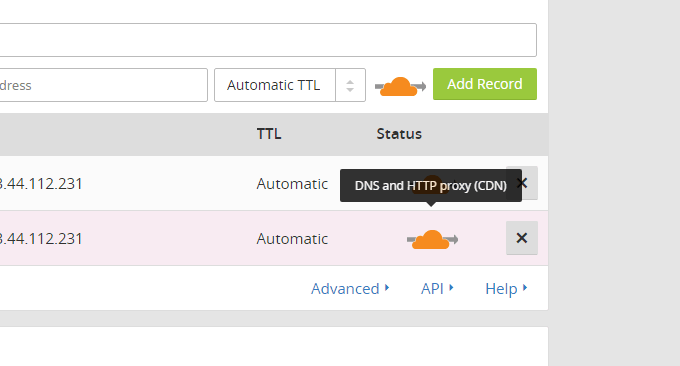

# 十个你可能不知道的CloudFlare免费CDN加速技巧-SSL DDOS Cache
要说[免费CDN](https://wzfou.com/tag/free-cdn/)服务的“大牛”恐怕就只能当数CloudFlare了。CloudFlare是一家美国的以提供CDN加速和网站安全防护为主的网络公司，经过不断的发展，目前CloudFlare CDN受到世界各地的欢迎，同时CloudFlare还与Google、微软等大公司有深度合作。

[Cloudflare](https://wzfou.com/tag/cloudflare/)提供DNS服务给六百万个网站，其中著名的网站包括Uber、OKCupid与Fitbit，截止目前Cloudflare已拥有77个位于全球各地的数据中心，其中包括亚太地区的韩国、日本、香港、台北、新加坡等。国内的话CloudFlare据说是与百度合作，也就是百度云加速。

CDN加速仅仅是CloudFlare的一项业务，DDoS保护才是Cloudflare最大的吸引力，如果你的网站正在遭受DDOS攻击接入到CloudFlare即可享受免费的防护。当然如果你的攻击者足够“强大”你可以升级CloudFlare的付费用户。CloudFlare防护DDOS的能力有目共睹。

历史上CloudFlare就成功防护了每秒500Gbit的流量攻击，Cloudflare 为所有客户提供“我正遭受攻击模式”设置，一旦开启此模式Cloudflare 要求用户必须先通过 JavaScript 计算式查问的验证才能访问网站，进而减轻高级第 7 层攻击的影响，从而达到阻止DDOS攻击的目的。

本篇文章就来分享一下CloudFlare十个可能还不被广为人知的使用技巧，涉及到[免费SSL证书](https://wzfou.com/tag/free-ssl/)、DDOS保护、DNS解析、网页防火墙、Cache缓存加速等。

更多的[站长工具](https://wzfou.com/tag/zhanzhang-gongju/)你可能还会需要：

1. [国内外免费DNS域名解析服务汇总列表-寻找更多免费DNS域名解析](https://wzfou.com/mianfei-dns/)
2. [三大原因让我放弃腾讯阿里云企业邮箱-附国内外企业(域名)邮箱汇总](https://wzfou.com/qiye-youxiang/)
3. [接入CN2线路VPS主机商和机房汇总-鉴别真假CN2线路主机参考手册](https://wzfou.com/cn2-vps-list/)

> **PS：2018年12月2日更新，**关于使用cloudflare Railgun加速的方法可参考这里：[Cloudflare Partner接入管理Cloudflare CDN-启用Railgun动态加速](https://wzfou.com/cloudflare-railgun/)。
> 
> **PS：2020年1月4日更新，**Cloudflare Railgun是 Cloudflare 专门为 Business 和 Enterprise 企业级客户提供的终极加速方案。不过通过Cloudflare Partner可以免费开启：[免费开启Cloudflare Railgun加速-减少连接延迟 实现动态页面缓存和加速](https://wzfou.com/cloudflare-railgun-jiasu/)。

## 一、CloudFlare无须修改NS接入CDN

CloudFlare官网：

1. https://www.cloudflare.com/

### 1.1  普通模式-修改NS服务器

登录到CloudFlare，添加你想要接入[CloudFlare CDN](https://wzfou.com/tag/cloudflare-cdn/)的网站域名。

接着CloudFlare就会扫描域名的DNS解析，没有问题的点击继续。

然后CloudFlare就会给出你要修改的NS服务器了。

修改好了NS服务器待DNS生效后，你就可以在CloudFlare控制面板中看到已经激活，这时你的网站就成功接入到了CloudFlare的CDN了。

### 1.2  专家模式-修改CNAME接入

看过我之前写的[加入Cloudflare Partner免费提供CloudFlare CDN加速服务](https://wzfou.com/cloudflare-partner/)，就知道用户不需要进入到Cloudflare，就可以使用Cloudflare Partner管理CDN加速，不需要修改域名的NS服务器修改CNAME接入即可，使用效果和Cloudflare官网一样。

这里有几个Cloudflare Partner接入平台，如果有自己的服务器你可以申请加入到Cloudflare Partner平台。

1. https://cdn.wzfou.com/
2. https://su.geekzu.org/
3. https://cdn.kevsrv.com/

## 二、CloudFlare Anycast加速效果明显

CloudFlare采用Anycast技术进行加速，这样做的好处就是当攻击者发起攻击时，CloudFlare Anycast可以将“内力”化解到不同的“受众”上，从而最大限度地抵御攻击。下面一张图可以看出采用与没有采用Anycast技术的区别。（点击放大）

[CloudFlare Anycast](https://wzfou.com/tag/cloudflare-anycast/)有一个问题就是用户访问的都是一个IP地址，目前从国内访问CloudFlare CDN加速后的网站显示的是美国西海岸的节点，速度还是比较快的，国内的Ping值基本上在200左右。

这是世界各地访问CloudFlare CDN节点的响应时间，可以看出使用了[CloudFlare CDN](https://wzfou.com/tag/cloudflare-cdn/)后国外加速效果也是非常明显的。

以前CloudFlare CDN不少的节点在国内无法使用，不过我在测试过程中发现采用了CloudFlare CDN后国内加速明显，用站长工具测试下载速度都非常不错。

这是测试网站的下载速度。（点击放大）

## 三、CloudFlare可作免费DNS域名解析

很多人印象当中CloudFlare是一个CDN加速的网站，实际上CloudFlare提供的DNS域名解析服务不亚于专业的第三方DNS解析服务商，你只需要在DNS设置中关闭CDN加速即可。

## 四、CloudFlare DNSSEC确保解析正确

DNSSEC全称是Domain Name System Security Extensions，也就是DNS安全扩展，主要目的就是确保DNS能够解析到正确的IP地址上。**通俗地说，给DNS解析做像访问Https那样的加密，避免DNS出现干扰。**

目前DNSSEC在国内暂未发现有支持他们的DNS第三方服务商，CloudFlare 也是国外少数几个提供免费DNSSEC的服务之一。在CloudFlare可以一键开启DNSSEC。

然后，你只需要将[CloudFlare DNSSEC](https://wzfou.com/tag/cloudflare-dnssec/)生成的密钥等文件填入到域名注册商那里，这样你就可以成功用上DNSSEC了。

## 五、CloudFlare提供免费SSL证书服务

无论你的网站服务器是否有SSL，你都可以在CloudFlare中一键开启SSL证书。

CloudFlare的[免费SSL](https://wzfou.com/tag/free-ssl/)证书分为三种模式。如果你的服务器没有SSL，你可以选择Flexible模式。如果你的服务器已经安装了SSL证书或者有自签名SSL，则可以选择Full模式。最后，如果你的服务器的SSL证书是购买的付费SSL，则可以选择Full（严格）模式。（点击放大）

## 六、CloudFlare一键开启HSTS模式

HSTS即HTTP Strict Transport Security，主要目的就是为了解决SSL剥离攻击，只要浏览器曾经与服务器创建过一次安全连接，之后浏览器会强制使用HTTPS，即使链接被换成了HTTP。

CloudFlare可以一键开启HSTS，你可以设置HSTS Header过期时间，这样可以强制浏览器使用Https来访问你的网站。不过，在开启之间需要谨慎些。

## 七、CloudFlare自动开启AMP加速

AMP即Accelerated Mobile Pages Project，这是Google提出的移动设备加速项目，百度的MIP就是模仿谷歌的AMP建立的。很多的站长为了得到搜索引擎的信赖，都想加入到AMP中，例如挖站否的AMP：https://wzfou.com/qiye-youxiang/amp/

CloudFlare提供了一键开启AMP模式，这样当你的移动用户访问你的网站时就会自动进入到[CloudFlare AMP](https://wzfou.com/tag/cloudflare-amp/)模式，从而达到加速的目的。

## 八、CloudFlare Page Rules自定义功能

CloudFlare Page Rules，是CloudFlare一个非常有用的工具。很多朋友之所以不想上CDN，主要就是自己的网站或者服务还有不少的动态内容，而一旦上了CDN上容易造成网页出错或者数据请求出错。

CloudFlare Page Rules允许你自定义页面规则，例如你可以自定义不同的页面采用不同的策略，包括强制Https、301重定向、安全等级、缓存等级、浏览器缓存时间、永久在线等。这样你可以手动将自己的网站实现“动静分离”了。

CloudFlare 支持通配符，最简单的就是域名重定向了，你无须在自己的服务器编写复杂的规则，只要在CloudFlare Page Rules开启即可。

## 九、CloudFlare丰富的第三方应用

CloudFlare提供了Google Analytics、PACE、Hardenize等第三方应用，你可以在开启CloudFlare CDN的同时无需修改代码直接在CDN启用即可。

例如想要安装Google Analytics，你直接在CloudFlare中开启谷歌统计服务，相当地方便。

## 十、CloudFlare有免费网页防火墙

一旦你的网站受到了攻击，可以根据攻击的强烈程度在CloudFlare中开启不同级别的网页防火墙，你也可以直接在CloudFlare看到攻击者的IP地址，一键将它们列入黑名单中。

## 总  结

CloudFlare可以说是一个非常优秀的CDN服务商，不仅提供了免费的CDN加速服务，同时可以免费开启SSL证书、[AMP加速](https://wzfou.com/tag/amp-jiasu/)、支持DNSSEC解析、Google Analytics等相应的服务，相当于给自己的网站做了全方位的加速与保护。

CloudFlare不足的地方也有不少，例如只能通过修改NS的方式才能使用CloudFlare服务。由于CloudFlare CDN节点基本上在国外，所以国内的网站想要使用CloudFlare CDN加速基本上没有什么价值，而不少的节点还可能无法访问。