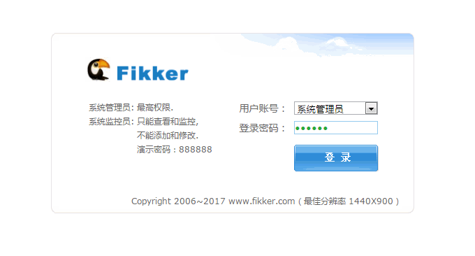
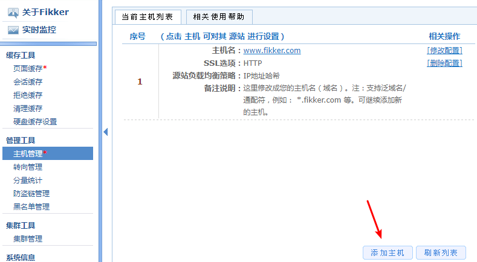
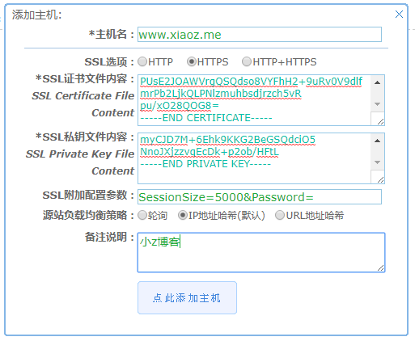
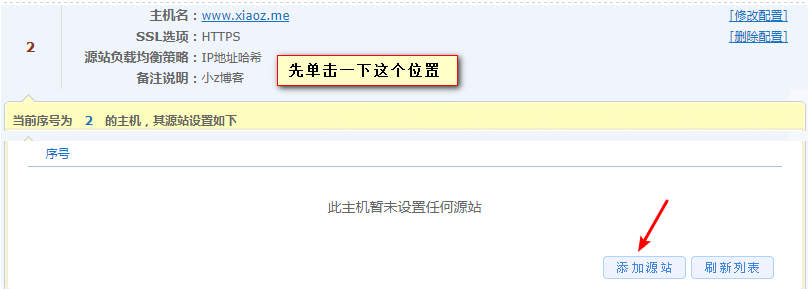
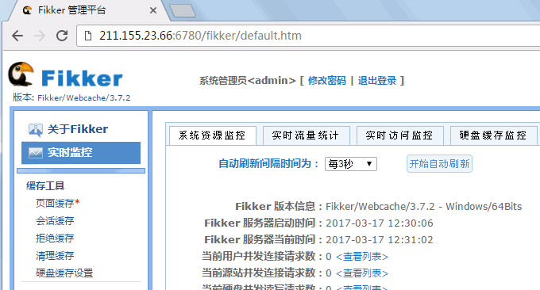
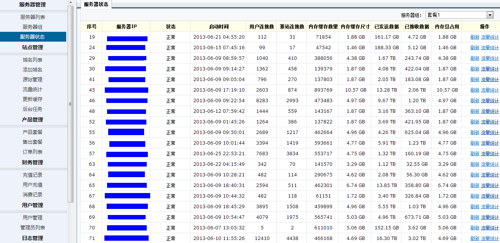
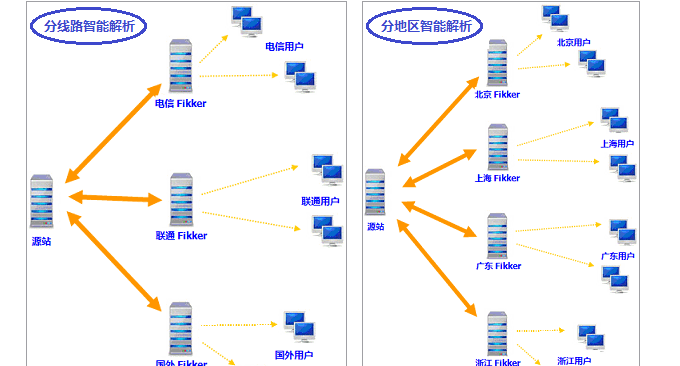

# 用Fikker自建CDN-支持Https,页面缓存,实时监控,流量统计,防CC攻击
收到好友[xiaoz.me](https://www.xiaoz.me/archives/8709)博主发来的消息：安装Fikker 缓存自建CDN加速，因为前几天一直忙着修改网站主题，趁现在赶紧把这个自建CDN的工具分享出来。仔细研究了一下官网的介绍，发现Fikker安装方便，使用简单，是自己搭建CDN的好软件。

按照官网的说法，[Fikker](https://wzfou.com/tag/fikker/) 是一款面向 CDN/站长 的专业级网站缓存（Webcache）和反向代#理服务器软件（Reversed Proxy Server），可以实现的功能有反向代#理 + 页面缓存 + 实时监控 + 流量统计 + 转向管理 + HTTPS + 防CC攻击。

不过看了一下免费版本的Fikker，貌似页面缓存这一项功能是没有的，所以免费版本只能用来给图片、JS、CSS等静态资源作CDN加速。Fikker还有一个主控系统，利用它可以将多个Fikker缓存节点进行统一管理，组建成一个全新的CDN缓存系统。

[](https://wzfou.com/wp-content/uploads/2017/06/fikker_00.jpg)

更多的关于建站软件和程序的选择，你可以看看：

1. LNMP:[OneinStack一键安装脚本-轻松部署Let’s Encrypt证书配置Https站点](https://wzfou.com/oneinstack/)
2. [用JW Player,ckplayer,Smartideo搭建视频直播站-支持各大视频网站和rtmp](https://wzfou.com/wp-video/)
3. [Linux VPS建站工具LNMP 1.4安装与使用-SSL自动配置续期和多版本PHP支持](https://wzfou.com/lnmp-1-4/)

**PS：2017年11月17日更新，**著名的CDN服务商Cloudflare推出了合作分销计划，你也可加入到Cloudflare Partner来为大家提供免费CDN服务了：[加入Cloudflare Partner免费提供CloudFlare CDN加速服务-无需修改NS支持SSL](https://wzfou.com/cloudflare-partner/)。

## 一、Fikker安装方法

Fikker官网：https://www.fikker.com，由广州市非客网络科技有限公司，创建于2010年。

**安装准备：**Fikker需要监听80/443/6780端口，若您的服务器已经安装过Nginx/Apache等服务，需要先停用，推荐使用一台全新的VPS进行安装。

```
#安装wget，若已经安装这一步可省略
yum -y install wget 
#下载安装包
wget -c http://www.fikker.com/dl/fikkerd-3.7.3-linux-x86-64.tar.gz
#解压
tar zxvf fikkerd-3.7.3-linux-x86-64.tar.gz
#进入安装目录
cd fikkerd-3.7.3-linux-x86-64
#运行Fikker
./fikkerd.sh start
```

**开始安装：**依次复制下面的命令（需要root用户）执行，注意：适用于CentOS 6.x/7.x 等操作系统 64 位版本，对 CPU 无要求，内存 4GB 以上。

上面已经提到，Fikker监听80/443/6780端口，请注意在防火墙放行端口,输入下面的命令：

```
#如果防火墙使用的iptables（Centos 6）
iptables -I INPUT -p tcp --dport 80 -j ACCEPT
iptables -I INPUT -p tcp --dport 443 -j ACCEPT
iptables -I INPUT -p tcp --dport 6780 -j ACCEPT
service iptables save
service iptables restart
#如果使用的是firewall（CentOS 7）
firewall-cmd --zone=public --add-port=80/tcp --permanent 
firewall-cmd --zone=public --add-port=443/tcp --permanent 
firewall-cmd --zone=public --add-port=6780/tcp --permanent 
firewall-cmd --reload
```

完成后访问http://IP:6780，初始密码为123456，如果打不开，请输入命令netstat -apn|grep ‘6780’查看端口是否监听，检查防火墙是否放行端口。

[](https://wzfou.com/wp-content/uploads/2017/06/fikker_01.gif)

## 二、Fikker使用教程

**添加站点：**在Fikker 后台 – 管理工具 – 主机管理 – 右下角添加主机，添加一个需要CDN加速的域名（支持HTTP/HTTPS），如下截图。（点击放大）

[](https://wzfou.com/wp-content/uploads/2017/06/fikker_2.png)

**上传SSL证书：**如果是添加Https站点，你需要上传你的证书和密钥。

[](https://wzfou.com/wp-content/uploads/2017/06/fikker_3.png)

**设置源站：**添加主机后，还需要设置回源地址，告知CDN节点从哪里获取数据，源站添加完毕后大功告成，您可以将DNS解析至CDN节点了。（点击放大）

[](https://wzfou.com/wp-content/uploads/2017/06/fikker_4.png)

**其它操作：**如果您需要将Fikker注册为服务，请执行下面的命令：

```
#注册服务
./fikkerd.sh install
#停止服务
./fikkerd.sh stop
#删除服务
./fikkerd.sh uninstall
```

## 三、自建CDN系统

**第一步：**先安装 Fikker 缓存（支持 Linux/Windows 系统） 。将 Fikker 缓存安装在一个或多个缓存节点服务器上，用于缓存加速/反向代#理等。

[](https://wzfou.com/wp-content/uploads/2017/06/fikker_11.gif)

**第二步：**再安装 Fikker CDN 主控。用于管理多个缓存节点，用于同步各个节点的配置/域名流量统计/用户管理/套餐管理等。注：可选安装项，节点很少时，可以不用主控。（点击放大）

[](https://wzfou.com/wp-content/uploads/2017/06/fikker_10.gif)

**第三步：**最后利用第三方智能解析（例如 Cloudxns/DNSpod/51DNS/DNSla 等） 。利用第三方智能解析，将网站的域名以轮询/分地区/分线路的方式，分别解析到各个缓存节点服务器IP上即可。注：不要解析到主控IP上。

[](https://wzfou.com/wp-content/uploads/2017/06/fikker_09.gif)

## 四、总结

[Fikker CDN](https://wzfou.com/tag/fikker-cdn/)可以很方便的搭建自己的CDN服务，并且支持HTTP/HTTPS，但是Fikker占用了80/443，导致无法和自己的WEB服务共存。如果您不想折腾还是老老实实用第三方CDN吧。

启用了CDN后你会发现你的的程序获取到的用户的IP都变成了缓存节点的IP了。想要获取到用户的真实IP，请参考以下代码进行相应的调整。

```
#php 获得用户真实 IP 代码举例：
function getRemoteIP()
{
    if (!isset($_SERVER["HTTP_X_FORWARDED_FOR"])) /* 存在 X-Forwarded-For 吗? */ 
    {
        return $_SERVER["REMOTE_ADDR"]; /* 兼容已有程序 */
    }
    
    return $_SERVER["HTTP_X_FORWARDED_FOR"]; /* 返回用户真实 IP, 如为多个 IP 时, 则取第一个 */
}

#asp.net 获得用户真实 IP 代码举例：
void getRemoteIP() 
{ 
    string SourceIP = Request.ServerVariables["HTTP_X_FORWARDED_FOR"]; /* 存在 X-Forwarded-For 吗? */
    if (string.IsNullOrEmpty(SourceIP)) 
    {
        SourceIP = Request.ServerVariables["REMOTE_ADDR"]; /* 兼容已有程序 */
    }
    
    Response.Write(SourceIP); /* 返回用户真实 IP, 如为多个 IP 时, 则取第一个 */
}

#asp 获得用户真实 IP 代码举例：
<%
Private Function getRemoteIP()
Dim strIPAddr 
If Request.ServerVariables("HTTP_X_FORWARDED_FOR") = "" OR InStr(Request.ServerVariables("HTTP_X_FORWARDED_FOR"), "unknown") > 0 Then 
strIPAddr = Request.ServerVariables("REMOTE_ADDR") 
ElseIf InStr(Request.ServerVariables("HTTP_X_FORWARDED_FOR"), ",") > 0 Then 
strIPAddr = Mid(Request.ServerVariables("HTTP_X_FORWARDED_FOR"), 1, InStr(Request.ServerVariables("HTTP_X_FORWARDED_FOR"), ",")-1) 
ElseIf InStr(Request.ServerVariables("HTTP_X_FORWARDED_FOR"), ";") > 0 Then 
strIPAddr = Mid(Request.ServerVariables("HTTP_X_FORWARDED_FOR"), 1, InStr(Request.ServerVariables("HTTP_X_FORWARDED_FOR"), ";")-1) 
Else 
strIPAddr = Request.ServerVariables("HTTP_X_FORWARDED_FOR") 
End If 
getIP = Trim(Mid(strIPAddr, 1, 30)) 
End Function

ip=getRemoteIP()
response.write(ip)
%>
```
