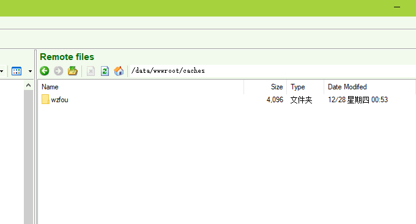
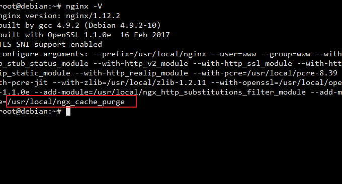
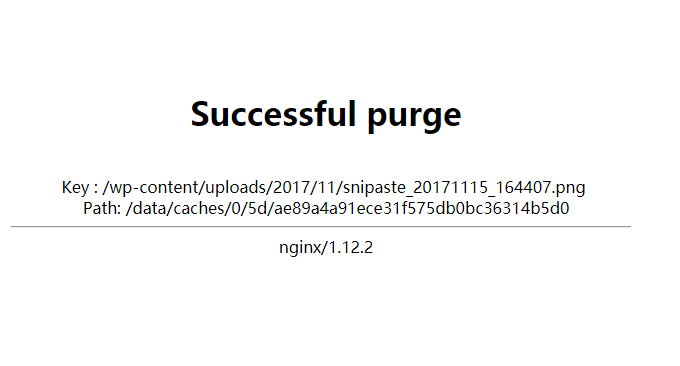
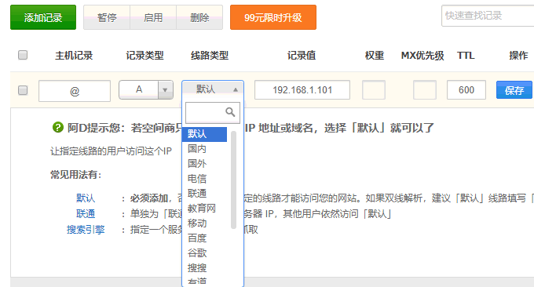
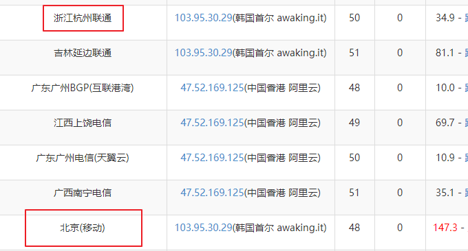
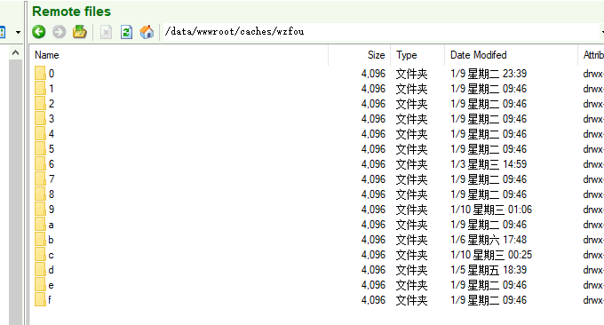

# 自建CDN加速-Nginx反向绑定,缓存加速,自动更新缓存和获取真实IP
虽然现在博客放在[阿里云香港CN2 VPS](https://wzfou.com/aliyun-alibabacloud/)主机上，电信由于走的是CN2线路，所以访问速度会比较快（不过也收到过电信的朋友反馈说有访问慢的(⊙﹏⊙)）。而联通、移动用户访问起来会比较慢了，尤其是晚高峰期不少朋友说根本无法打开。

而从官方的公告来看，[阿里云香港CN2 VPS](https://wzfou.com/aliyun-alibabacloud/)也确实遭遇过联通线路或者电信线路节点出现问题，从而导致整个机房访问出现状况。当然，阿里云自然会把“锅”甩给运营商。之前也一段时间联通用户访问阿里云香港VPS就是绕道日本或者其它地方。

当初从[Kdatacenter韩国VPS](https://wzfou.com/kdatacenter/)搬家到阿里云香港VPS，一是觉得阿里云香港VPS确实便宜，吸引力足够大；二是CN2线路感觉可能会不错，至少比美国线路会快不少。现在看来，除了电信用户访问会顺畅些，其它的运营商的用户会时不时地出点问题。

为了解决这个问题，自然想到的就是给网站做[CDN加速](https://wzfou.com/tag/cdn-jiasu/)。国内的VPS没有BA号自然不能使用，于是找到韩国VPS利用Nginx反向-代-理的方法，将移动、联通用户的访问请求转到CDN服务器上，这样可以最大限度地加快网站访问速度。

[](https://wzfou.com/wp-content/uploads/2018/01/nginx-cdn_00.jpg)

本篇文章就来详细讲解一下如何给网站[自建CDN](https://wzfou.com/tag/zijian-cdn/)加速并缓存相应的页面和文件，同时当网站内容有更新时利用ngx\_cache\_purge来及时更新CDN服务器上的缓存，最后在使用过程中解决源服务器获取用户真实IP的问题。更多CDN加速及[建站工具](https://wzfou.com/tag/jianzhan-gongju/)有：

1. [加入Cloudflare Partner免费提供CloudFlare CDN加速服务-无需修改NS支持SSL](https://wzfou.com/cloudflare-partner/)
2. [用Fikker自建CDN-支持Https,页面缓存,实时监控,流量统计,防CC攻击](https://wzfou.com/fikker/)
3. [两款优秀的服务器网络流量监控工具：Ntopng和Munin-功能强大直观](https://wzfou.com/ntopng-munin/)

**PS：2018年4月27日更新，**目前挖站否的图片与JS、CSS等静态文件采用的是又拍云CDN，评测文章：[又拍云CDN加速申请使用教程-一键镜像,静态动态CDN和免费SSL](https://wzfou.com/upyun/)。

**PS：2018年3月6日更新，**不想自己搭建CDN的可以试试第三方的CDN加速服务，我们熟悉的CloudFlare就是一个非常不错的选择：[十个你可能不知道的CloudFlare免费CDN加速技巧-SSL\\DDOS\\Cache](https://wzfou.com/cloudflare/)。

## 一、安装Nginx

你可以手动安装配置Nginx，或者使用LNMP一键安装包来安装Nginx，比较好用的有：[Oneinstack](https://wzfou.com/tag/oneinstack/)、[LNMP](https://wzfou.com/tag/lnmp/)。如果您都不想使用，可以试试[xiaoz](https://www.xiaoz.me/archives/8775)的一键Nginx安装包（适用于Centos 7、Deebian 8）。

1. https://github.com/helloxz/nginx-cdn

Linux一键安装Nginx并开启CDN（反向代#理），执行下面的命令安装即可。

```
wget https://raw.githubusercontent.com/helloxz/nginx-cdn/master/nginx.sh
chmod +x nginx.sh && ./nginx.sh

```

## 二、Nginx相关配置

这里我以wzfou.com作加速为例，有一台源站VPS，还有一台用作CDN反向代#理的VPS，它两者对应的IP如下：

> 1、源站:192.168.1.100，就是wzfou.com网站数据真实存放的地方
> 
> 2、CDN:192.168.1.101  CDN节点，如果有多台操作方法是一样的

先在CDN节点上修改Hosts，目的就是告知CDN节点从那里去获取网站数据，也就是回源地址，修改如下：

```

vi /etc/hosts
192.168.1.100	www.wzfou.com
```

然后在CDN节点创建nginx配置文件`wzfou.com.conf`

```
#创建缓存目录
mkdir -p /data/wwwroot/caches/wzfou.com
#设置缓存目录权限
chown -R www:www /data/wwwroot/caches/wzfou.com
#创建wzfou.com.conf
vi /usr/local/nginx/conf/vhost/wzfou.com.conf
```

[](https://wzfou.com/wp-content/uploads/2018/01/nginx-cdn_01.gif)

在`wzfou.com.conf`中添加下面的内容，缓存目录/缓存时间请根据实际情况调整，后面会详细说明各参数含义。

```
proxy_cache_path /data/wwwroot/caches/wzfou.com levels=1:2 keys_zone=wzfou:50m inactive=30m max_size=50m;
server {
    listen 80;
    server_name wzfou.com;
    charset utf-8,gbk;
        location / {
        proxy_set_header Accept-Encoding "";
           proxy_pass https://wzfou.com;
           proxy_redirect off;
           proxy_set_header X-Real-IP $remote_addr;
           proxy_set_header X-Forwarded-For $proxy_add_x_forwarded_for;
           proxy_cache wzfou;
           proxy_cache_valid  200 304  30m;
           proxy_cache_valid  301 24h;
           proxy_cache_valid  500 502 503 504 0s;
           proxy_cache_valid any 1s;
           proxy_cache_min_uses 1;
           expires 12h;
    }
}

```

相关的说明如下：

> 1、`/data/wwwroot/caches/wzfou.com`:为缓存目录
> 
> 2、`levels`:指定该缓存空间有两层hash目录，第一层目录为1个字母，第二层为2个字母。
> 
> 3、`keys_zone=wzfou:50m`:为缓存空间起个名字，这里取名为“wzfou”，后面的50m指内存缓存空间 。
> 
> 4、`inactive=30m`:如果30分钟内该资源没有被访问则删除
> 
> 5、`max_size=50m`:指硬盘缓存大小为50MB
> 
> 6、`proxy_cache_valid`:指定状态码缓存时间，前面写状态码，后面写缓存时间。

最后重载nginx使配置生效，如果使用的oneinstack直接输入命令：`service nginx reload`，如果是xiaoz一键脚本输入:`/usr/local/nginx/sbin/nginx -s reload`。  

## 三、Https站点反向代-理

上面分享的是Http站点的Nginx反向代-理设置，如果你是想反向代-理Https站点，你需要先为你的域名**申请好SSL证书**，接着你只需要设置好SSL证书路径，参考如下配置进行调整即可：

```
proxy_cache_path /data/wwwroot/caches/wzfou.com levels=1:2 keys_zone=wzfou:50m inactive=30m max_size=50m;
server {
  	listen 443 ssl http2;
	ssl_certificate	/data/ssl/wzfou/wzfou.com.crt;
	ssl_certificate_key	/data/ssl/wzfou/wzfou.com.key;
	ssl_session_timeout 1d;
	ssl_session_cache builtin:1000 shared:SSL:10m;
    #ssl_dhparam /data/ssl/dhparam.pem;
    ssl_protocols TLSv1 TLSv1.1 TLSv1.2;
    ssl_ciphers 'ECDHE-ECDSA-CHACHA20-POLY1305:ECDHE-RSA-CHACHA20-POLY1305:ECDHE-ECDSA-AES128-GCM-SHA256:ECDHE-RSA-AES128-GCM-SHA256:ECDHE-ECDSA-AES256-GCM-SHA384:ECDHE-RSA-AES256-GCM-SHA384:DHE-RSA-AES128-GCM-SHA256:DHE-RSA-AES256-GCM-SHA384:ECDHE-ECDSA-AES128-SHA256:ECDHE-RSA-AES128-SHA256:ECDHE-ECDSA-AES128-SHA:ECDHE-RSA-AES256-SHA384:ECDHE-RSA-AES128-SHA:ECDHE-ECDSA-AES256-SHA384:ECDHE-ECDSA-AES256-SHA:ECDHE-RSA-AES256-SHA:DHE-RSA-AES128-SHA256:DHE-RSA-AES128-SHA:DHE-RSA-AES256-SHA256:DHE-RSA-AES256-SHA:ECDHE-ECDSA-DES-CBC3-SHA:ECDHE-RSA-DES-CBC3-SHA:EDH-RSA-DES-CBC3-SHA:AES128-GCM-SHA256:AES256-GCM-SHA384:AES128-SHA256:AES256-SHA256:AES128-SHA:AES256-SHA:DES-CBC3-SHA:!DSS';
    ssl_prefer_server_ciphers on;


    ssl_stapling on;
    ssl_stapling_verify on;

    server_name wzfou.com;
    access_log /data/wwwlogs/wzfou.com_nginx.log combined;
   
    charset utf-8,gbk;
        location / {
        proxy_set_header Accept-Encoding "";
           proxy_pass https://wzfou.com;
           proxy_redirect off;
           proxy_set_header X-Real-IP $remote_addr;
           proxy_set_header X-Forwarded-For $proxy_add_x_forwarded_for;
           proxy_cache wzfou;
           proxy_cache_valid  200 304  30m;
           proxy_cache_valid  301 24h;
           proxy_cache_valid  500 502 503 504 0s;
           proxy_cache_valid any 1s;
           proxy_cache_min_uses 1;
           expires 12h;
    }
}
server {
    listen 80 default_server;
    return 301 https://$host$request_uri;
}
```

## 四、ngx\_cache\_purge清除更新缓存

清理Nginx缓存需要ngx\_cache\_purge模块帮助，可输入命令`nginx -V`查看已经编译的模块，如果没有`ngx_cache_purge`说明模块没有安装，则需要重新编译一下Nginx。

[](https://wzfou.com/wp-content/uploads/2018/01/nginx-cdn_03.gif)

### 4.1  配置ngx\_cache\_purge

在server段内加入下面的配置，并重载Nginx，下面的`wzfou`请与`keys_zone`定义的值保持一致，否则nginx将无法启动。

```
location ~ /purge(/.*) {
allow all;
proxy_cache_purge wzfou $proxy_host$1$is_args$args;
error_page 405 =200 /purge$1;
}
```

如果想清理缓存，添加`purge`参数即可，如`https://www.xiaoz.me/purge/xxx.png`，如果该文件存在缓存，则会提示如下截图。若不存在缓存，则返回404，若无论什么情况均返回404，可能配置没成功。

[](https://wzfou.com/wp-content/uploads/2018/01/nginx-cdn_04.gif)

### 4.2  WordPress自动刷新缓存

对于Wordpress博客，如果启用CDN后页面被缓存，用户提交评论后无法马上显示出来，可以使用Ajax异步请求ngx\_cache\_purge接口，当用户提交评论的时候则清除该页面缓存。只需要下面的这段js添加到`footer.php`即可。

```
<script>
		$(document).ready(function(){
			$("#submit").click(function(){
				var uri = "https://wzfou.com/purge" + window.location.pathname;
				$.get(uri,function(data,status){
					return true;
				});
			});
		});
	</script>

```

以下是小z博客CDN完整配置，仅供参考，你需要替换好Keys_zone、SSL路径、域名等：

```
proxy_cache_path /data/caches levels=1:2 keys_zone=xiaozcdn:100m inactive=30m max_size=100m;
server
    {
    listen 443 ssl http2;
    listen [::]:443 ssl http2;
    ssl on;
    ssl_certificate /xxx/www_xiaoz_me.crt;
    ssl_certificate_key /xxx/www_xiaoz_me.key;
    ssl_session_timeout 1d;
    ssl_session_cache shared:SSL:50m;
    ssl_session_tickets off;
    ssl_protocols TLSv1 TLSv1.1 TLSv1.2;
    ssl_ciphers 'ECDHE-ECDSA-CHACHA20-POLY1305:ECDHE-RSA-CHACHA20-POLY1305:ECDHE-ECDSA-AES128-GCM-SHA256:ECDHE-RSA-AES128-GCM-SHA256:ECDHE-ECDSA-AES256-GCM-SHA384:ECDHE-RSA-AES256-GCM-SHA384:DHE-RSA-AES128-GCM-SHA256:DHE-RSA-AES256-GCM-SHA384:ECDHE-ECDSA-AES128-SHA256:ECDHE-RSA-AES128-SHA256:ECDHE-ECDSA-AES128-SHA:ECDHE-RSA-AES256-SHA384:ECDHE-RSA-AES128-SHA:ECDHE-ECDSA-AES256-SHA384:ECDHE-ECDSA-AES256-SHA:ECDHE-RSA-AES256-SHA:DHE-RSA-AES128-SHA256:DHE-RSA-AES128-SHA:DHE-RSA-AES256-SHA256:DHE-RSA-AES256-SHA:ECDHE-ECDSA-DES-CBC3-SHA:ECDHE-RSA-DES-CBC3-SHA:EDH-RSA-DES-CBC3-SHA:AES128-GCM-SHA256:AES256-GCM-SHA384:AES128-SHA256:AES256-SHA256:AES128-SHA:AES256-SHA:DES-CBC3-SHA:!DSS';
    ssl_prefer_server_ciphers on;
    ssl_stapling on;
    ssl_stapling_verify on;

    server_name     www.xiaoz.me;
    charset utf-8,gbk;

   #删除缓存
    location ~ /dcache(/.*) {
    allow all;
    proxy_cache_purge xiaozcdn $proxy_host$1$is_args$args;
    error_page 405 =200 /purge$1;
    }

       location / {
       #proxy_set_header Accept-Encoding "";
       proxy_pass https://www.xiaoz.me;
       proxy_redirect off;
       proxy_set_header X-Real-IP $remote_addr;
       proxy_set_header X-Forwarded-For $proxy_add_x_forwarded_for;
       proxy_cache xiaozcdn;
       proxy_cache_valid  200 304  30m;
       proxy_cache_valid  301 24h;
       proxy_cache_valid  500 502 503 504 0s;
       proxy_cache_valid any 1s;
       #达到第几次被缓存？
       proxy_cache_min_uses 1;
       expires 12h;
       proxy_cache_key    $uri$is_args$args;
    }
}
server
{
    listen 80;
    server_name www.xiaoz.me;
    rewrite ^(.*) https://www.xiaoz.me$1 permanent;
}
```

## 五、做好DNS域名解析

利用DNS域名解析提供的线路、地域、客户端等DNS解析功能，我们可以将不同的宽带用户、省份用户还有客户端用户解析到CDN节点上了。

[](https://wzfou.com/wp-content/uploads/2018/01/nginx-cdn_02.gif)

使用站长工具测试看到wzfou.com不同地方的用户访问到了不同的CDN节点就表示我们的CDN加速部署成功了。

[](https://wzfou.com/wp-content/uploads/2018/01/nginx-cdn_05.gif)

## 六、启用CDN后无法获取真实IP

如果是Wordpress用户，当你启用了Nginx CDN加速后，你会发现WP后台获取到的用户评论IP都变成了CDN节点的，解决这个问题也很简单，只需要将下面一段代码加入到wp-config.php文件中即可：

if (isset($\_SERVER\['HTTP\_X\_REAL\_IP'\])) {
$\_SERVER\['REMOTE\_ADDR'\] = $\_SERVER\['HTTP\_X\_REAL\_IP'\];
}

## 七、总结

Nginx反向绑定域名搭建CDN加速服务器低成本安装配置简单，特别适合不想使用付费CDN的朋友，事实上很多的专业CDN加速也是采用Nginx反向代#理的方式来加速网站访问，可以说Nginx CDN是非常有效的加速方法。

[](https://wzfou.com/wp-content/uploads/2018/01/nginx-cdn_07.gif)

[Nginx CDN](https://wzfou.com/tag/nginx-cdn/)加速在使用过程中有两个需要注意的问题，一个是缓存更新问题，如果你的网页更新频率的话，可以设置一个更新时间间隔，第二个就是用户真实IP的问题，我们可以使用PHP或者Nginx等直接获取真实的IP地址。