# ClouDNS便宜好用的DNS解析服务-DNSSEC,主从DNS和亚太Anycast节点
自从用上了国外的DNS后，发现了不少优秀的DNS域名解析服务。最开始用过[NS1 DNS](https://wzfou.com/tag/ns1-dns/)，最大的体验就是好用但是超贵。NS1优势是全球多个Anycast节点，国内用的话会走香港、日本等线路，保证了DNS解析的速度，但是默认的免费额度实在太少，容易超标。

后来改用了[DNS Made Easy](https://wzfou.com/tag/dns-made-easy/)，价格便宜一些，而且主从DNS和亚太Anycast节点也都具备，但是[DNS Made Easy](https://wzfou.com/tag/dns-made-easy/)没有DNSSEC功能，进而转用了[Google cloud DNS](https://wzfou.com/tag/google-cloud-dns/)。[Google cloud DNS](https://wzfou.com/tag/google-cloud-dns/)出自谷歌，DNS功能都应有尽有，用过一段时间也**没有遇到在国内域名无法解析的现象。**

但是[Google cloud DNS](https://wzfou.com/tag/google-cloud-dns/)不支持主从DNS也是一个遗憾，好在[ClouDNS](https://wzfou.com/tag/cloudns/)从2019年6月份开始推出了DNSSEC，正好[DNS Made Easy](https://wzfou.com/tag/dns-made-easy/)也即将到期，于是最近又把域名DNS解析搬到了ClouDNS上了，这篇文章就是来分享ClouDNS的域名解析操作过程的。

[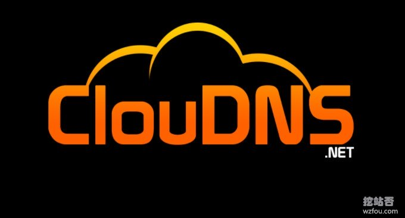](https://wzfou.com/wp-content/uploads/2019/08/cloudns_00.jpg)

关于挖站否的主机、域名、DNS以及服务器优化经验与教训可以看我之前写的：[博客主要应用技术及支持特性](https://wzfou.com/readme/)，更多的[DNS域名解析](https://wzfou.com/dns-jiexi/)服务，这里还有：

1. [国内外免费DNS域名解析服务汇总列表-寻找更多免费DNS域名解析](https://wzfou.com/mianfei-dns/)
2. [NS1 DNS域名解析使用-Master/Slave主从DNS和世界各地分区解析](https://wzfou.com/ns1-dns/)
3. [He.net DNS域名解析申请使用-免费DDNS、IPv6 地址和Slave DNS](https://wzfou.com/he-net-dns/)

> **PS：2019年9月29日更新，**国内华为云DNS新推出，原DNSPOD的地域划分、自定义线路等功能都免费开放，详情：[华为云免费DNS域名解析-智能DNS线路,地域,国家省市DNS解析区分](https://wzfou.com/huaweicloud-dns/)。

## 一、ClouDNS DNS基本介绍

网站：

1. 官网：[https://asia.cloudns.net/](https://wzfou.com/go/cloudns)
2. 推荐：[https://asia.cloudns.net/aff/id/222417/](https://asia.cloudns.net/aff/id/222417/)

### 1.1 免费与付费版

[ClouDNS DNS](https://wzfou.com/tag/cloudns-dns/)有免费版和付费版，不追求速度的话其实免费版也足够用了，付费版主要是可以用上Anycast，国内的话会走香港等亚太节点。（点击放大）

[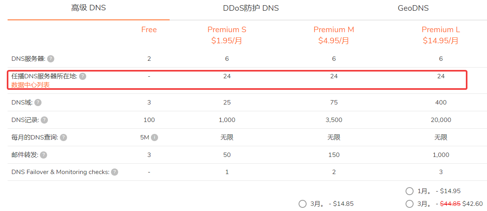](https://wzfou.com/wp-content/uploads/2019/08/cloudns_01.png)

### 1.2 亚太Anycast

**高级DNS列表：**

> pns101.cloudns.net  
> IPv4: 185.136.96.99  
> IPv6: 2a06:fb00:1::1:99
> 
> pns102.cloudns.net  
> IPv4: 185.136.97.99  
> IPv6: 2a06:fb00:1::2:99
> 
> pns103.cloudns.net  
> IPv4: 185.136.98.99  
> IPv6: 2a06:fb00:1::3:99
> 
> pns104.cloudns.net  
> IPv4: 185.136.99.99  
> IPv6: 2a06:fb00:1::4:99

ClouDNS DNS宣称在全球部署了23个DNS节点，亚太有香港、日本、印度等，经过测试电信用户走的是ClouDNS DNS香港节点。

[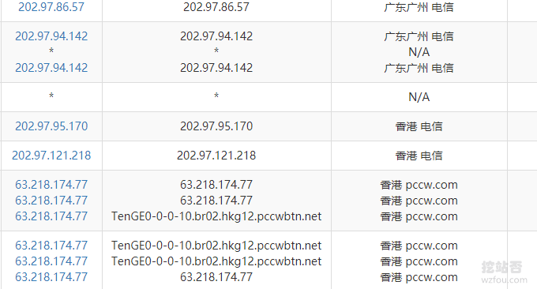](https://wzfou.com/wp-content/uploads/2019/08/cloudns_03.png)

联通用户也是走ClouDNS DNS香港节点。

[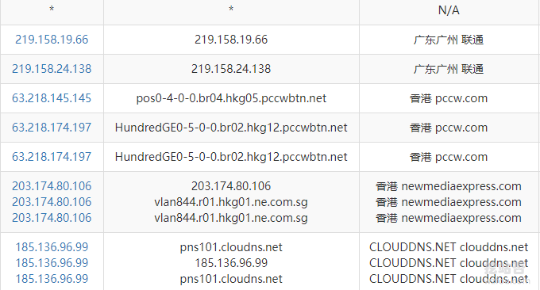](https://wzfou.com/wp-content/uploads/2019/08/cloudns_04.png)

不过移动用户没有分配好路线，走的是ClouDNS DNS欧洲节点。

[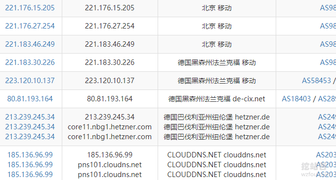](https://wzfou.com/wp-content/uploads/2019/08/cloudns_05.png)

### 1.3 支持支付宝

ClouDNS DNS不知道什么时候开始已经可以使用支付宝付款，我在升级ClouDNS DNS付费账户中才发现。

[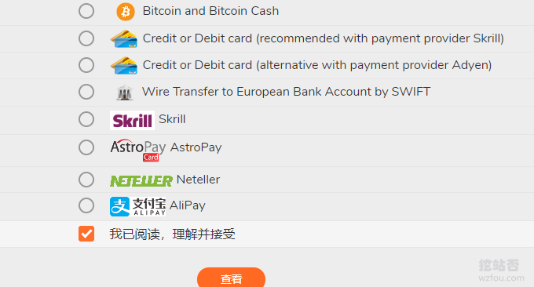](https://wzfou.com/wp-content/uploads/2019/08/cloudns_02.png)

## 二、ClouDNS DNS使用操作

### 2.1 添加DNS记录

ClouDNS DNS有中文，所以使用起来没有什么 难度。下面是ClouDNS DNS控制面板。（点击放大）

[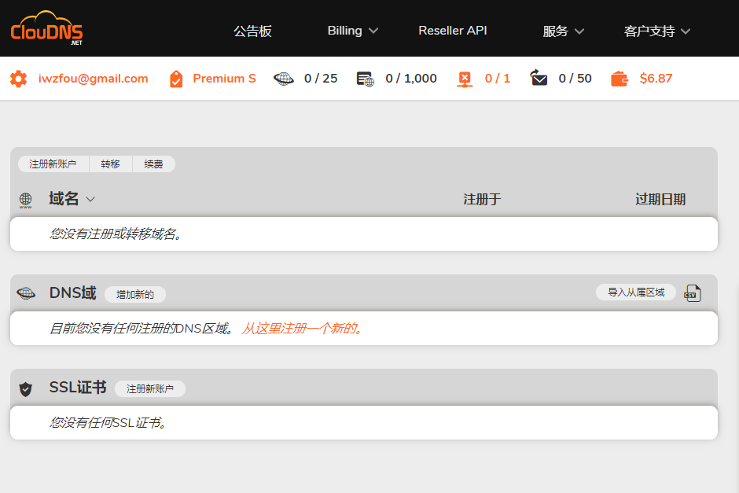](https://wzfou.com/wp-content/uploads/2019/08/cloudns_06.png)

ClouDNS DNS支持的域名解析类型以下几个，我们主要用到的是Primary DNS 和Secondary DNS ：

> 主区域 ：Primary DNS – 记录只能从我们提供的操作界面进行管理。
> 
> 从/备份区域 ：Secondary DNS – 只能在主服务器上管理记录。
> 
> 主反向区域 ：主IPv4或IPv6反向区域。
> 
> 从属反向区域 ：从属IPv4或IPv6反向区域。
> 
> Primary ENUM zone ：Primary zone for E.164 numbers
> 
> Secondary ENUM zone ：Secondary zone for E.164 numbers
> 
> 已停放的区域 ：简单的网页包含联系表单，标题和说明
> 
> 免费区域 ：含有免费域名的DNS区域。记录只能从我们的界面进行管理。

点击添加Primary DNS 类型。

[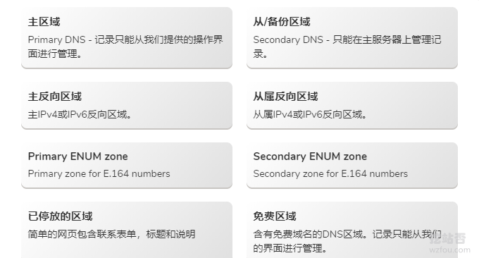](https://wzfou.com/wp-content/uploads/2019/08/cloudns_07.png)

然后填写你的域名，完成。

[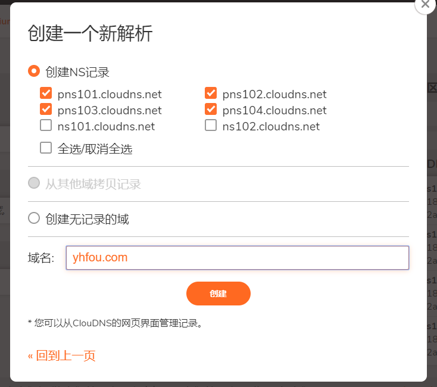](https://wzfou.com/wp-content/uploads/2019/08/cloudns_08.png)

[ClouDNS DNS](https://wzfou.com/tag/cloudns-dns/)支持DNS记录、DNSSEC、SOA设置、云域、邮件转发、DNS统计、Zone转移、导出区域文件、导入区域等，如下图：（点击放大）

[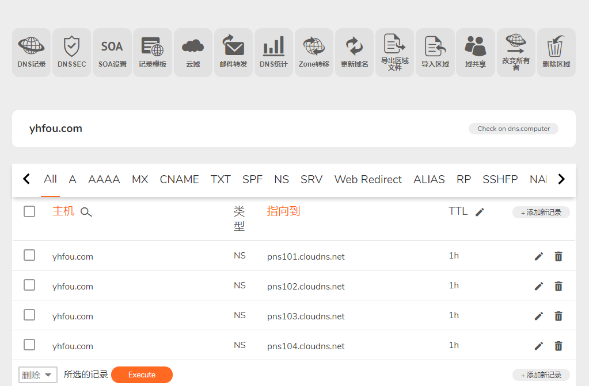](https://wzfou.com/wp-content/uploads/2019/08/cloudns_09.png)

### A记录

ClouDNS DNS添加A记录如下：

[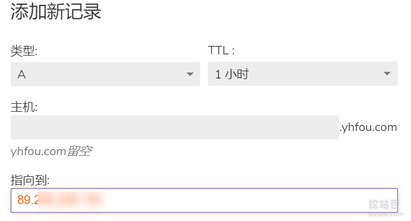](https://wzfou.com/wp-content/uploads/2019/08/cloudns_10.png)

### CAA记录

ClouDNS DNS添加CAA记录如下（PS：关于CAA的重要性这篇文章有解读：[京东云DNS免费域名解析-支持线路\\地域细分 可添加CAA解析记录](https://wzfou.com/jdcloud-dns/)）：

[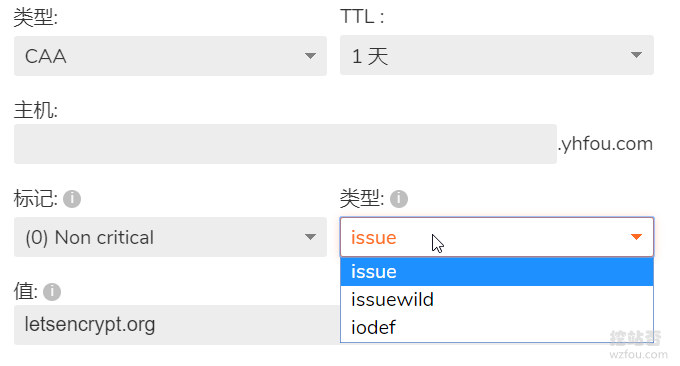](https://wzfou.com/wp-content/uploads/2019/08/cloudns_11.png)

MX记录

ClouDNS DNS添加MX记录，一般地使用域名邮箱时需要用到，例如：[Zoho企业(域名)邮箱申请使用教程](https://wzfou.com/zoho-mail/)。

[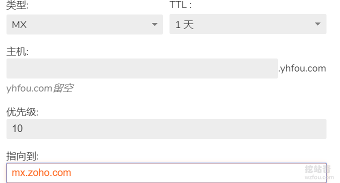](https://wzfou.com/wp-content/uploads/2019/08/cloudns_12.png)

### TXT记录

TXT记录应用广泛，平时wzfou.com在申请SSL证书时需要用到，如：[三个在线免费SSL证书申请](https://wzfou.com/ssl-for-free/)。

[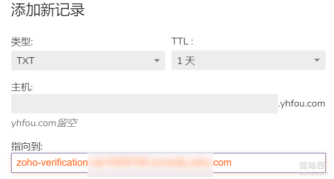](https://wzfou.com/wp-content/uploads/2019/08/cloudns_13.png)

### 2.2 修改NS服务器

添加完了DNS解析记录后，现在你需要到你的域名注册处将NS服务器切换成ClouDNS DNS的了。这里我用的是[Name.com](https://wzfou.com/tag/name-com/)的域名，修改如下：

[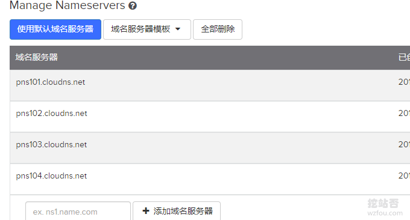](https://wzfou.com/wp-content/uploads/2019/08/cloudns_14.png)

## 三、ClouDNS DNS实用功能

### 3.1 激活DNSSEC

ClouDNS DNS提供了DNSSEC功能，你只需要在域名管理处激活DNSSEC即可。

[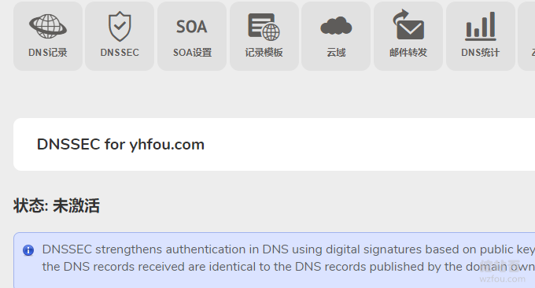](https://wzfou.com/wp-content/uploads/2019/08/cloudns_15.png)

ClouDNS DNSSEC激活完毕后，会生成密钥，你只需要到你的域名注册商那里填入即可，以下是[Name.com](https://wzfou.com/tag/name-com/)的DNSSEC设置页面。

[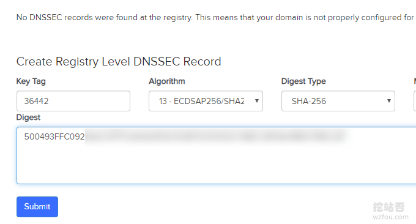](https://wzfou.com/wp-content/uploads/2019/08/cloudns_16.png)

如果你的域名是[Namesilo](https://wzfou.com/tag/namesilo/)，在域名管理页面找到DNSSEC设置选项。

[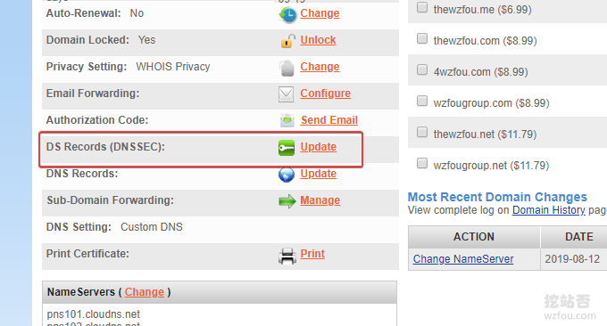](https://wzfou.com/wp-content/uploads/2019/08/cloudns_17.png)

然后按照格式填入域名的DNSSEC信息，如下图：

[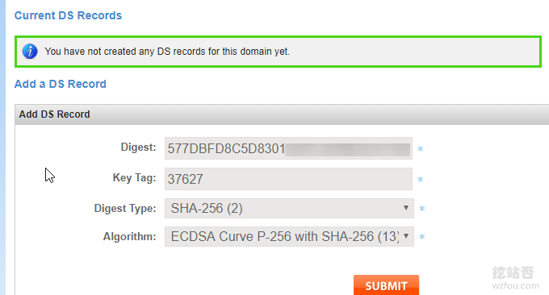](https://wzfou.com/wp-content/uploads/2019/08/cloudns_18.png)

检测DNSSEC生效可以使用在线工具，例如：https://dnssec-analyzer.verisignlabs.com/wzfou.com

[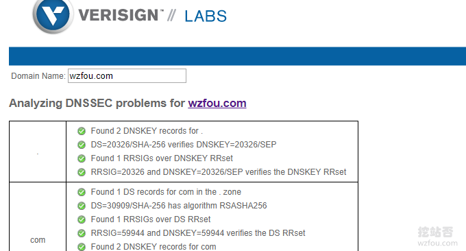](https://wzfou.com/wp-content/uploads/2019/08/cloudns_24.png)

### 3.2 主/从DNS

**阿里云辅助DNS。**如果想用国内的辅助DNS，目前阿里云DNS的付费版有这一项功能。

[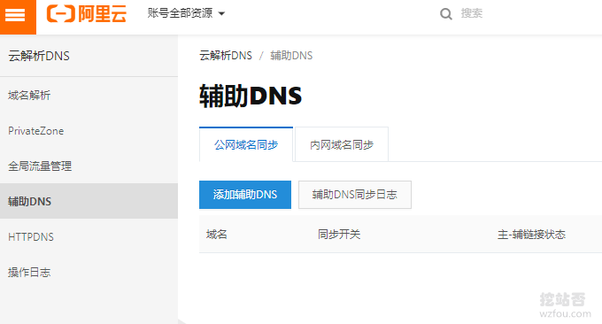](https://wzfou.com/wp-content/uploads/2019/08/cloudns_19.png)

**NS1从属DNS。**国外的话支持主从DNS的域名DNS服务比较多，之前分享的[DNS Made Easy](https://wzfou.com/tag/dns-made-easy/)、[NS1.com](https://wzfou.com/tag/ns1-com/)等都可以的，在ClouDNS DNS点击“Zone转移”。

[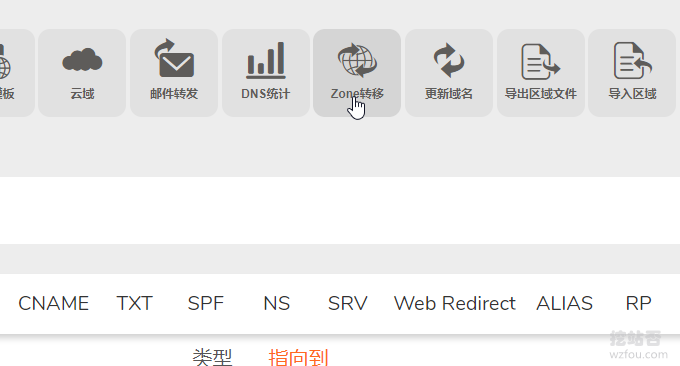](https://wzfou.com/wp-content/uploads/2019/08/cloudns_21.png)

然后ClouDNS DNS要你填写从属DNS的IP地址，这个IP地址需要到你从属DNS处找到。

[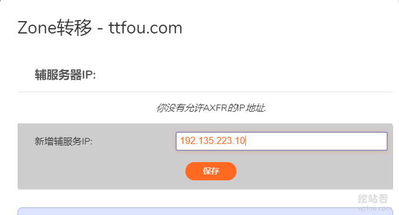](https://wzfou.com/wp-content/uploads/2019/08/cloudns_22.png)

这里以NS1的DNS为演示，到NS1里添加DNS解析为从属，然后NS1会给出IP地址，这个IP地址就可以填入到ClouDNS DNS了。

[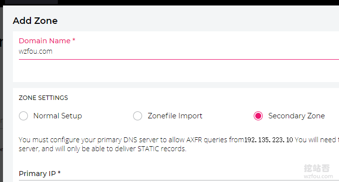](https://wzfou.com/wp-content/uploads/2019/08/cloudns_20.png)

设置完成后，稍等一会儿ClouDNS DNS解析记录就会全部同步到了NS1了，最后你**需要到你的域名注册商那里把NS1的NS服务器新建至原有的NS服务器列表**即可。

[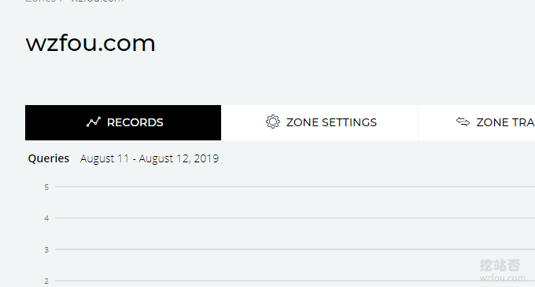](https://wzfou.com/wp-content/uploads/2019/08/cloudns_23.png)

## 四、总结

国内域名商很少有提供DNSSEC设置的，想要体验DNSSEC带来的安全性请把域名转移到国外域名商那里，常见的[Name.com](https://wzfou.com/tag/name-com/)、[NameCheap](https://wzfou.com/tag/namecheap/)、[Namesilo](https://wzfou.com/tag/namesilo/)等都支持设置DNSSEC。

[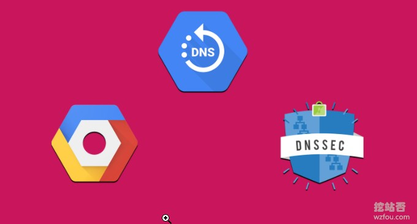](https://wzfou.com/wp-content/uploads/2019/08/cloudns_000.jpg)

ClouDNS的DNS域名解析服务价格适中，免费版本的各个功能也具备，只不过少了Anycast，付费版本可以最多添加25个域名，比起国内的域名DNS商单个卖域名DNS解析套餐真的是好太多了。