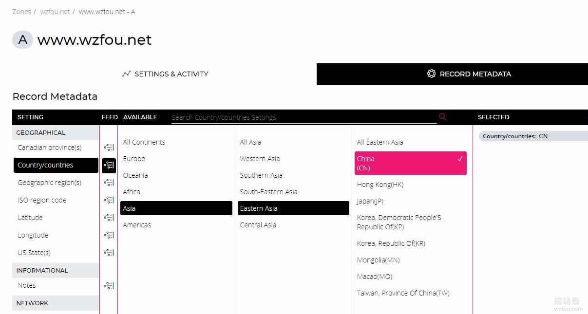

# NS1 DNS域名解析使用-Master Slave主从DNS和世界各地分区解析
[NS1.com](https://wzfou.com/tag/ns1-com/)是国外一家提供专业的DNS域名解析服务商，除了付费的DNS域名解析外，还提供了免费的DNS域名解析套餐，免费额度为500k Queries 、50 Records 、1 Built-in Monitor 、1 Filter Chain 和NS1 API，基本上可以满足日常建站的需要了。

NS1 DNS功能齐全，比较突出的就是支持Master/Slave主从DNS，你就可以将NS1 DNS当成主要的DNS解析服务，也可以当成从属DNS，即第二DNS。这样的组合一般会应用在对DNS解析可靠性极高的场景，还有就是用来对付网络攻击和流量攻击。

作为一个免费的[NS1 DNS](https://wzfou.com/tag/ns1-dns/)，支持分区解析，可以精确到各大洲的各个国家，如果是美国和加拿大还可以精确到省、市。当然，亚洲的话只能精确到中国，无法精确到国内各省。但就是这样的分区解析，如果你的网站的访客是来自世界各地，NS1 DNS还是会帮到你的。

更多的关于[DNS域名解析](https://wzfou.com/tag/dns-yuming/)有关技术教程，还有：

1. [京东云DNS免费域名解析-支持线路\\地域细分 可添加CAA解析记录](https://wzfou.com/jdcloud-dns/)
2. [国内外免费DNS域名解析服务汇总列表-寻找更多免费DNS域名解析](https://wzfou.com/mianfei-dns/)
3. [DNS域名解析启用DNSSEC防止DNS劫持-Google Cloud DNS设置DNSSEC](https://wzfou.com/dnssec-dns/)

**PS：2018年9月6日更新**，如果想要使用付费的DNS解析服务，这里有两个比较便宜的比较适合个人的DNS服务：[两款适合个人使用的DNS产品:ClouDNS和DNS Made Easy域名解析](https://wzfou.com/cloudns-dnsmadeeasy/)。

## 一、NS1 DNS申请使用

网站：

1. https://ns1.com/

这是NS1 DNS的控制面板界面，直接点击右上角按钮添加你想要使用NS1 DNS解析的域名。（点击放大）

输入你的域名，然后你会看到有四个选项，分别是正常设置、导入Bind配置、第二DNS和Linked zone。一般地我们选择“正常设置”即可。

添加了域名后，再到你的域名注册商那里修改NS服务器为NS1 DNS的：

> dns1.p03.nsone.net  
> dns2.p03.nsone.net  
> dns3.p03.nsone.net  
> dns4.p03.nsone.net

以[NameCheap](https://wzfou.com/tag/namecheap/)修改NS为例，如下图：

## 二、NS1 DNS添加解析记录

这是NS1 DNS的记录解析设置页面，可以看到分四大块：添加记录、DNS设置、DNS转出和NS。我们要添加A、CNAME等记录直接点击“Records”就可以了。

这是设置记录的页面，这里选择你的记录类型，然后设置TTL时间，貌似没有最低时间限制，我设置了10秒都通过了。（点击放大）

NS1 DNS支持的解析记录非常多，包括A、AAAA、ALIAS、AFSDB、CAA、CERT、CNAME、DS、HINFO、MX、NAPTR、NS、PTR、RP、SPF、SRV、TXT。

NS1 DNS拥有强大的DNS解析统计。

## 三、NS1 DNS设置分区解析

NS1 DNS设置分区解析非常地简单，点击你要设置的解析记录，然后点击“Record Metadata”，在这里你就可以设置不同的地区和国家使用不同的DNS解析记录了。（点击放大）

目前只有美国和加拿大可以精确到省，其它的只能精确到国家，亚洲也只能精确到中国。不过，就这一点已经超过了大多数的国外[免费DNS](https://wzfou.com/tag/mianfei-dns/)域名解析所提供的服务了。

## 四、NS1设置Slave DNS\\Secondary DNS

Slave DNS也可以叫Secondary DNS， 即备用DNS或者从DNS。首先确保你的主DNS支持AXFR request，并且支持DNS Data Transfer，并192.135.223.10加入到白名单中。我们在NS1 DNS添加域名时选择“Secondary DNS”就可以了。（点击放大）

填写你的主DNS的IP地址，默认是53端口，如果不是此端口可以改成其它的。另外如果有多个主DNS，可以勾选“Enable Additional Primaries”。添加完成后，稍等一会儿[NS1 Slave DNS](https://wzfou.com/tag/ns1-slave-dns/)就会从主DNS处同步DNS记录解析了。

## 五、NS1设置Master DNS\\Primary DNS

想要将NS1 DNS作为主DNS，即Master DNS或者Primary DNS，只需要在DNS管理界面点击”Zone Transfers”，勾选”Enable Zone Transfer”，然后填写你的从DNS的IP地址。如果DNS记录改变时通知从DNS的服务器，选择是的话就打开“NOTIFY”。

这里我以He.net DNS作为Slave DNS来演示说明（详细教程：[He.net DNS域名解析申请使用](https://wzfou.com/he-net-dns/)。  
），在He.net DNS处点击添加Slave DNS，接着你会看到要求你填写主DNS的IP或者服务器地址，这里你就把NS1 DNS的`xfr01.nsone.net (``192.135.223.10 )`填写进去。

同时，He.net DNS会提醒你把He.net DNS的NS服务器IP添加到[NS1 Master DNS](https://wzfou.com/tag/ns1-master-dns/)的IP白名单中。也就是我在上图中”Zone Transfers”添加的IP地址。双方都添加完毕后，你就可以看到He.net DNS作为Slave DNS已经添加成功了，并且将NS1 DNS的解析记录全部同步过来了。

接还需要到NS1 DNS那里添加NS记录，NS记录为He.net DNS的NS服务器址。

最后，到你的域名注册处那里把He.net DNS的NS服务器地址添加进去就可以了。

## 六、总结

NS1 DNS采用了anycast技术，所以DNS在国内的响应也是非常地快，从监控数据来看国内使用NS1 DNS响应都是在70MS以内。监控地址：https://ping.wzfou.com/?target=dnsjk.ns1dns

NS1 DNS目前已经支持DNSSEC，但是需要单独联系客服开通：support@ns1.com，详细说明见官网：https://ns1.com/knowledgebase/dnssec

开通了DNSSEC后，你就可以在NS1 DNS中看到DNSSEC功能了。如下图：

如果有嫌麻烦的朋友，可以直接使用[Google Cloud DNS设置DNSSEC](https://wzfou.com/dnssec-dns/)，默认就可以使用，不需要单独申请。总之，NS1 DNS是一个支持解析记录齐全、NS服务器响应快和统计功能强大的DNS域名解析服务。

