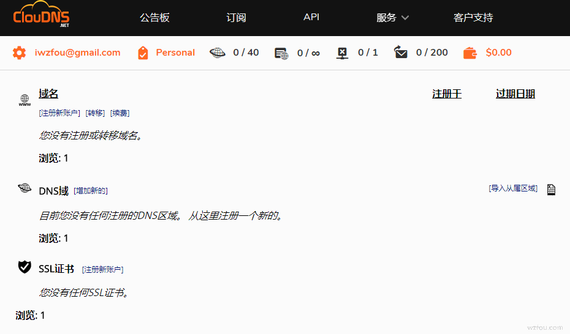
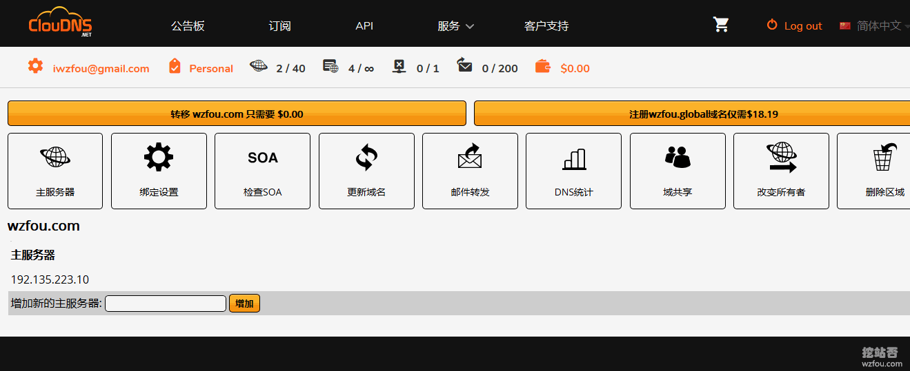
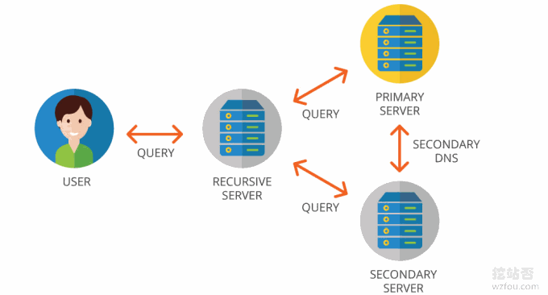

# 两款适合个人使用的DNS产品 ClouDNS和DNS Made Easy域名解析
以前使用DNS首先想到的是[免费DNS](https://wzfou.com/tag/mianfei-dns/)，因为DNS域名解析相对于主机、域名来说付不付费真的看起来不是那么重要。而实际中，也存不少的免费DNS，例如DNSPOD、Cloudxns、阿里云解析、[京东云DNS](https://wzfou.com/jdcloud-dns/)等，在这篇文章[国内外免费DNS域名解析服务汇总列表](https://wzfou.com/mianfei-dns/)可以找到更多。

自从把网站放在国外后，发现DNS解析还是蛮重要的。一开始使用的是DNSPOD，免费的并且在国内响应肯定是最快的，但是DNSPOD不支持DNSSEC，甚至连CAA都不支持。于是改用国外的DNS：[Google Cloud DNS设置DNSSEC](https://wzfou.com/dnssec-dns/)，DNSSEC、CAA都可以用上了。

用了一段时间后发现了NS1.com的Anycast节点非常多，而且还支持Master/Slave主从DNS，于是就上了[NS1 DNS域名解析](https://wzfou.com/ns1-dns/)了。不过，可惜的是NS1.com的免费额度非常少，一个月肯定是要超额被扣费的，于是就用上了ClouDNS和DNS Made Easy了。

本篇文章就来分享一下[ClouDNS](https://wzfou.com/tag/cloudns/)和[DNS Made Easy](https://wzfou.com/tag/dns-made-easy/)域名解析服务，两个域名解析服务都比较便宜，如果是个人使用一个月2美元还是可以接受的。更多的[DNS解析](https://wzfou.com/dns-jiexi/)见专题列表：[国内外免费DNS域名解析服务汇总列表](https://wzfou.com/mianfei-dns/)，比较好用的有：

1. [He.net DNS域名解析申请使用-免费DDNS、IPv6 地址和Slave DNS](https://wzfou.com/he-net-dns/)
2. [NS1 DNS域名解析使用-Master/Slave主从DNS和世界各地分区解析](https://wzfou.com/ns1-dns/)
3. [DNS域名解析启用DNSSEC防止DNS劫持-Google Cloud DNS设置DNSSEC](https://wzfou.com/dnssec-dns/)

> **PS：2019年2月22日更新，**这里还有一篇收集了国内外优秀的免费公共DNS解析服务：[国内外公共DNS服务整理汇总-更快更安全更稳定本地DNS解析服务](https://wzfou.com/gonggong-dns/)。
> 
> **PS：2019年9月29日更新，**国内华为云DNS新推出，原DNSPOD的地域划分、自定义线路等功能都免费开放，详情：[华为云免费DNS域名解析-智能DNS线路,地域,国家省市DNS解析区分](https://wzfou.com/huaweicloud-dns/)。

## 一、ClouDNS域名解析服务

网站：

1. [https://asia.cloudns.net/](https://wzfou.com/go/cloudns)

### 1.1  ClouDNS介绍

ClouDNS有[免费DNS](https://wzfou.com/tag/mianfei-dns/)额度，但是与付费的DNS相比，主要是没有Anycast和从属DNS的DNSSCE（注意：~ClouDNS的Master DNS无论付费与否暂时都不支持DNSSEC~，**从2019年6月开始ClouDNS的Master DNS支持DNSSEC**）。（点击放大）

ClouDNS自带了中文面板，对国人相当友好，这是ClouDNS的DNS控制面板，在这里就可以添加和绑定域名实现DNS解析了。

ClouDNS目前支持添加的DNS类型主要有以下几个：

> **1.主区域：**Primary DNS – 记录只能从我们提供的操作界面进行管理。
> 
> **2.从/备份区域：**Secondary DNS – 只能在主服务器上管理记录。
> 
> **3.免费区域：**含有免费域名的DNS区域。记录只能从我们的界面进行管理。
> 
> **4.主反向区域：**主IPv4或IPv6反向区域。
> 
> **5.从属反向区域：**从属IPv4或IPv6反向区域。
> 
> **6.已停放的区域：**简单的网页包含联系表单，标题和说明。

ClouDNS有23个Anycast节点，亚洲的话有香港、新加坡两个不错的节点。

国内电信、联通用户如果使用ClouDNS NS的话请求都是到中国香港。

ClouDNS的NS服务器监控还是比较稳定，响应在200以内，监控地址：

1. https://ping.wzfou.com/?target=dnsjk.cloudnsdns

### 1.2  ClouDNS添加DNS解析

点击添加域名，然后选择Primary DNS。

输入你的域名，注意勾选你要使用的NS记录，如果是免费的DNS只有两条NS记录：ns101和ns102，付费的话会有其它的NS记录。

ClouDNS的DNS控制面板的主要功能有：DNS记录、SOA设置、记录模板、云域、邮件转发、DNS统计、Zone转移、更新域名、导出区域文件、导入区域、域共享、改变所有者、删除区域。（点击放大）

ClouDNS支持的DNS解析记录有：A 、AAAA 、MX 、CNAME 、TXT 、SPF 、NS 、SRV、Web Redirect、ALIAS、RP、SSHFP、NAPTR、CAA。

### 1.3  ClouDNS Master/Slave主从DNS

如果你想ClouDNS 当成[Master DNS](https://wzfou.com/tag/master-dns/)，你可以在DNS面板中点击“Zone转移”，然后添加AXFR允许的IP。接下来就到你的Slave从属DNS处开始设置了。

如果你想ClouDNS 当成[Slave DNS](https://wzfou.com/tag/slave-dns/)，那么你可以在添加绑定域名时选择“从/备份区域：Secondary DNS ”，然后输入你的域名还有你的Master主要DNS的IP地址。

添加完成后，进入到从/备份区域：Secondary DNS ，然后点击“绑定设置”这里会给出ClouDNS Slave从属DNS的IP，请将这些IP加入到你的Master主要DNS允许的范围内。

这里wzfou.com以[NS1 DNS域名解析](https://wzfou.com/ns1-dns/)为演示，进入到DNS后台，然后在“Zone Transfers”中将这几个IP加入到允许的名单中。

这个就是ClouDNS Slave从属DNS管理面板。（点击放大）

## 二、DNS Made Easy域名解析

网站：

1. [https://dnsmadeeasy.com/](https://wzfou.com/go/dnsmadeeasy)

### 2.1  DNS Made Easy介绍

DNS Made Easy没有免费的额度，只有付费DNS，最便宜的是30美元一年，10个域名、100个记录、5百万/月查询。

这个就是DNS Made Easy的控制面板，界面有点丑，右下角可以添加“DNS”和“Slave DNS”。

这是[DNS Made Easy](https://wzfou.com/tag/dns-made-easy/)的DNS管理添加解析记录的界面，支持的记录有A 、AAAA 、MX 、CNAME 、TXT 、SPF 、NS 、SRV、Web Redirect、CAA等等。

这里有DNS Made Easy的NS服务器监控，响应时间都在200以内。

1. https://ping.wzfou.com/?target=dnsjk.dnsmadeeasydns

### 2.2  DNS Made Easy从属DNS

从属DNS即[Secondary DNS](https://wzfou.com/tag/secondary-dns/)，你可以直接DNS Made Easy点击“Secondary DNS”。

在添加从属DNS前，你还需要设置一个IP Set，这个IP就是你的主DNS的IP，wzfou.com以[NS1 DNS域名解析](https://wzfou.com/ns1-dns/)为演示，在此处添加ns1的IP地址。

然后，你就可以开始添加[Secondary DNS](https://wzfou.com/tag/secondary-dns/)了，添加过程中指定IP Set。

添加完成后，DNS Made Easy还会给出自己的DNS服务器IP地址。

将这些IP地址添加到你的主DNS允许AXFR请求的IP范围内，wzfou.com以ns1的设置为演示。

完成以上操作后，稍等一会儿你就可以看到DNS Made Easy同步DNS成功了。

现在，你就可以回到你的主DNS处，在NS记录那里把DNS Made Easy的NS服务器添加进去。

最后，到你的域名注册商那里，把[DNS Made Easy](https://wzfou.com/tag/dns-made-easy/)的NS服务器新增加进去。

待DNS解析生效后，此时你的域名就会同时由主DNS和从属DNS接管了，你在主DNS处修改DNS记录会实时同步到从属DNS。

## 三、总结

[ClouDNS.net](https://wzfou.com/tag/cloudns-net/)和DNS Made Easy这两个DNS解析服务，年付价格都差不多，比较适合个人站长使用。主要的功能如CAA、DNSSEC以及[Anycast DNS](https://wzfou.com/tag/anycast-dns/)等都具备，并且都在亚洲香港开设了节点，国内使用效果还不错。

需要指出的是ClouDNS和DNS Made Easy目前只支持Secondary DNS DNSSEC，而[Primary DNS](https://wzfou.com/tag/primary-dns/)不支持DNSSEC。另外，通过路由追踪发现，NS1的NS走香港59节点，ClouDNS和DNS Made Easy走的直连。