# 京东云DNS免费域名解析-支持线路 地域细分 可添加CAA解析记录
[京东云](https://wzfou.com/tag/jd-yun/)推出了DNS域名解析服务，但是由于习惯问题一直在使用DNSPOD。最近，收到了不少朋友的反馈，提示说挖站否在个别地区无法访问。排除了主机线路的问题后，猜测可能是出在了DNS解析这一环节上，毕竟服务器放在国外或多或少地存问题。

于是想到给DNS添加CAA记录。CAA全称为DNS Certification Authority Authorization，即DNS证书颁发机构授权，借助互联网的域名系统（DNS），使域持有人可以指定允许为其域签发证书的数字证书认证机构（CA）的技术。

CAA记录在一定程度上可以防止中间人伪造SSL证书劫持网址连接，可以最大限度地保护正常的DNS解析。很可惜的是，国内最大的免费DNS解析服务商DNSPOD居然不支持CAA记录，截止目前cloudxns、京东云DNS已经支持了CAA记录解析。

本篇文章就来分享一下[京东云DNS](https://wzfou.com/tag/jd-dns/)的域名解析服务，目前京东云DNS可以免费升级到企业版，支持电信、移动、联通、方正、华数、铁通、长宽等智能线路解析。最低TTL为60秒，支持泛解析，流量防护为2GB，QPS防护5W，总得来说企业版本京东云DNS要强于DNSPOD。

关于[免费DNS解析](https://wzfou.com/tag/mianfei-dns-jiexi/)服务，大家还可以看看这些：

1. [放弃免费DNS改用付费DNS-Google cloud DNS申请使用与解析效果](https://wzfou.com/google-cloud-dns/)
2. [国内外免费DNS域名解析服务汇总列表-寻找更多免费DNS域名解析](https://wzfou.com/mianfei-dns/)
3. [国外域名商Name和Namecheap使用对比-便宜.com域名和Whois保护](https://wzfou.com/name-namecheap/)

**PS：2018年6月26日更新，**感谢好友 [日杂记](https://wzfou.com/jdcloud-dns/#comment-6623) 的热心提醒，目前国内支持CAA的免费DNS有以下几个：DNS.com、阿里云（万网）DNS、DNSDUN.com。其中DNSDUN还支持国内分区解析和DNSSEC（不过需要付费才能使用）

**PS：2018年7月4日更新，**京东云虽然支持CAA，但是不支持DNSSEC，想要体验更加安全的DNS解析，可以试试GCP DNS：[DNS域名解析启用DNSSEC防止DNS劫持-Google Cloud DNS设置DNSSEC](https://wzfou.com/dnssec-dns/)。

## 一、京东云DNS注册使用

网站：

1. [https://www.jdcloud.com/](https://wzfou.com/go/jcloud)

DNS域名解析服务是京东云的一项主要业务，你只要登录到京东云管理后台就可以找到DNS域名解析页面了，关于京东云VPS可以看我之前的评测：[Jcloud京东云VPS主机性能与速度评测-价格便宜但VPS硬盘IO读写慢](https://wzfou.com/jcloud/)。

目前京东云DNS企业版还处在免费当中，现在添加域名直接升级为京东云DNS企业版本，以下是京东云DNS免费版与企业版的功能区别。（点击放大）

[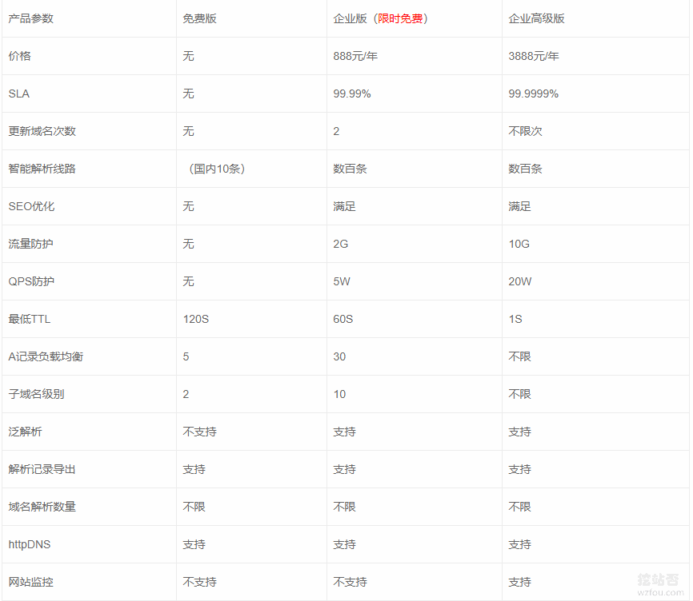](https://wzfou.com/wp-content/uploads/2018/06/jdcloud-DNS_01_0.gif)

进入到京东云DNS管理平台，然后就可以添加域名了。

[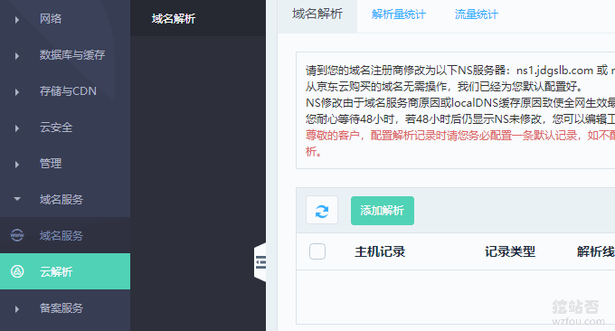](https://wzfou.com/wp-content/uploads/2018/06/jdcloud-DNS_01.gif)

目前添加域名没有限制，添加的域名会直接显示使用的是企业版本。

[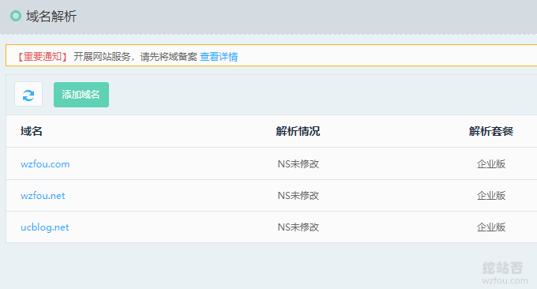](https://wzfou.com/wp-content/uploads/2018/06/jdcloud-DNS_01_1.gif)

## 二、京东云DNS域名解析

添加域名后，会要求你将域名的NS服务器更换为京东云DNS的：

> ns1.jdgslb.com
> 
> ns2.jdgslb.com

修改好了NS服务器后，你就可以开始添加解析记录了，这是A记录添加的界面，结合说明文字操作起来还是挺简单的。

[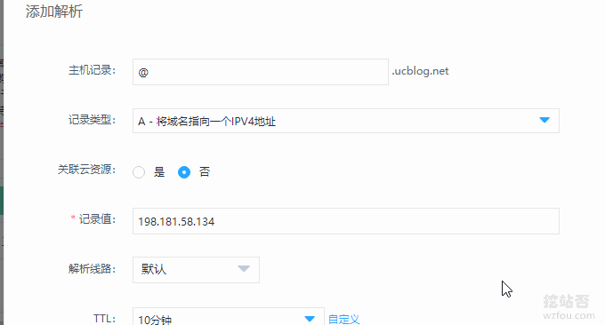](https://wzfou.com/wp-content/uploads/2018/06/jdcloud-DNS_02.gif)

京东云DNS支持添加的记录类型非常多，包括A、CNAME、AAAA、NS、MX、TXT、SRA、CAA、显性URL、隐性URL等。

[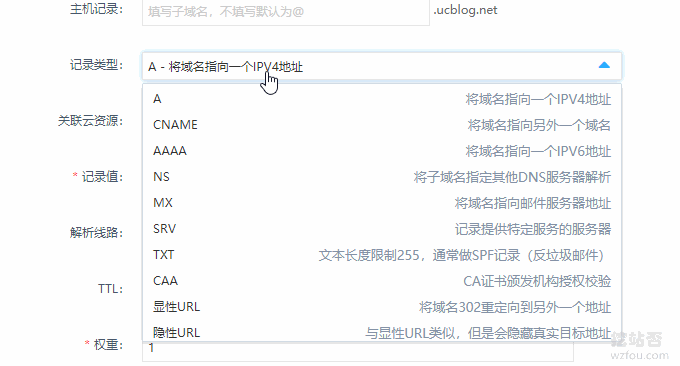](https://wzfou.com/wp-content/uploads/2018/06/jdcloud-DNS_02_1.gif)

在线路划分这一块，**除了移动、电信、联通、海外线路、搜索引擎线路等划分外，还有地域划分，例如华北、华南、华中、西北等**，可以说线路划分相当地详细了。

[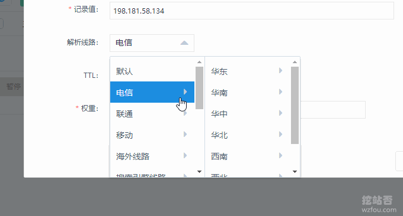](https://wzfou.com/wp-content/uploads/2018/06/jdcloud-DNS_03.gif)

搜索引擎划分也相当详细，有百度搜索、谷歌搜索、360搜索等等。

[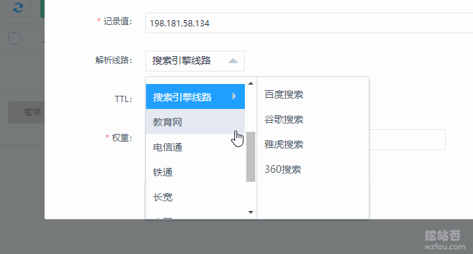](https://wzfou.com/wp-content/uploads/2018/06/jdcloud-DNS_05.gif)

TTL时间最短可以设置为60秒。

[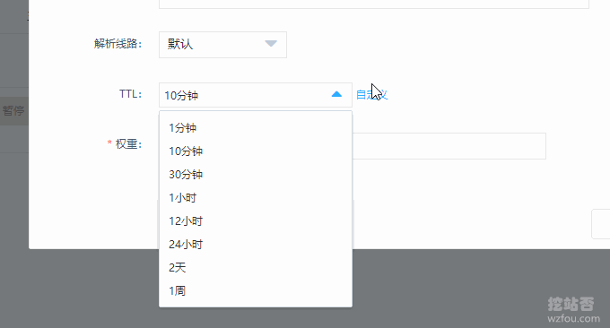](https://wzfou.com/wp-content/uploads/2018/06/jdcloud-DNS_06.gif)

## 三、京东云DNS设置CAA

京东云DNS算是**国内”唯二“的支持DNS CAA记录的DNS解析服务商**（另一个是cloudxns），更多的国外的DNS域名解析服务见：[国内外免费DNS域名解析服务汇总列表](https://wzfou.com/mianfei-dns/)。

如果你不知道自己的DNS域名解析服务是否支持CAA，可以查看以下汇总图。（点击放大）

[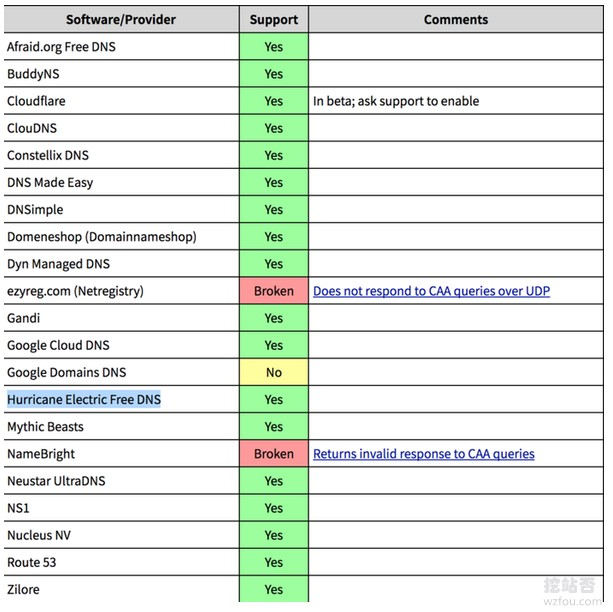](https://wzfou.com/wp-content/uploads/2018/06/jdcloud-DNS_0001.jpg)

添加 CAA 记录的说明如下：

> 主机记录 直接填写顶级域名，会自动应用到多级域名。
> 
> CAA data 填写 `0 issue "证书颁发机构域名"`。  
> 如果如果你用 Let’s Encrypt 颁发的免费证书，`CAA data` 部分直接填写 `0 issue "letsencrypt.org"` 即可。
> 
> 你还可以添加一条为 `0 iodef mailto:iwzfou@gmail.com` 的 CAA 记录，表示如果发现违背 CAA 记录的情况给这个邮箱发邮件通知。

[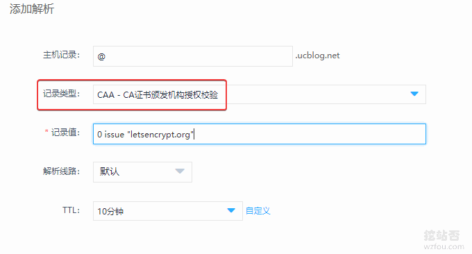](https://wzfou.com/wp-content/uploads/2018/06/jdcloud-DNS_09.gif)

除了Google Cloud DNS, Route 53, DNSimple等常见了DNS解析服务外，如果你用的是BIND、PowerDNS、dnsmasq等，添加域名CAA记录与上面会有所不同，建议使用CAA记录自动在线生成来搞定。

1. https://sslmate.com/caa/

[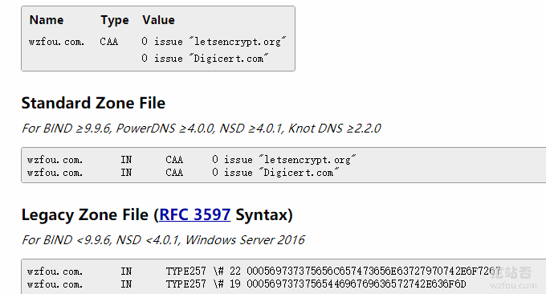](https://wzfou.com/wp-content/uploads/2018/06/jdcloud-DNS_11.gif)

直接输入域名，工具会自动查询你的网站使用了什么证书，然后你就可以看到你要填写的CAA记录了，以下是wzfou.com添加CAA记录后的效果。

[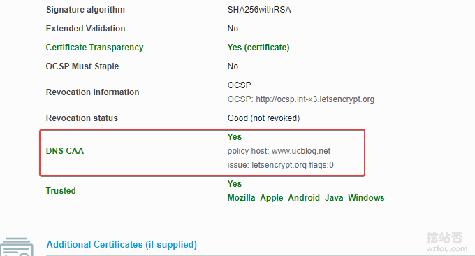](https://wzfou.com/wp-content/uploads/2018/06/jdcloud-DNS_10.gif)

最后，我们可以使用SSL证书在线检测网站来查看自己的域名CAA记录是否生效：https://www.ssllabs.com/ssltest/index.html。

## 四、总结

目前在京东云DNS添加域名都可以免费升级到企业版本，企业版的京东云DNS功能上相对于免费版本的DNS更多也更加实用，例如线路划分、CAA记录、地域划分等，这些都是DNSPOD所没有的了。

对于DNS CAA记录，可以说在一定程度上可以防止中间人伪造SSL证书劫持DNS解析，为了确保DNS“万无一失”，建议[启用HSTS并加入HSTS Preload List让网站Https访问更加安全](https://wzfou.com/hsts-preload/)。效果见wzfou.com网站。