# 华为云免费DNS域名解析-智能DNS线路,地域,国家省市DNS解析区分
[华为云DNS](https://wzfou.com/tag/huaweiyun-dns/)域名解析服务，是华为云服务下的提供高可用、高扩展的权威DNS服务和DNS管理服务。一直以来，提及免费的DNS域名解析服务必须要说到DNSPOD，不过随着腾讯云收购了DNSPOD后，各项功能开发就停滞不前了，基本上是“炒冷饭”了。

之后，阿里云的[免费DNS](https://wzfou.com/tag/mianfei-dns/)服务也得到了不少人的认可，不过阿里云DNS偏重于收费，免费版本的DNS解析有各种限制，例如最低TTL值限制为600秒，DNS节点仅限国内4个，不支持按照国家、省级区分等。前一段时间有朋友在博客留言说可以试用一下华为云[免费DNS](https://wzfou.com/tag/mianfei-dns/)服务。

[华为云DNS](https://wzfou.com/tag/huaweiyun-dns/)域名服务创建于2017年，最近几年华为云开始发力云计算市场，DNS解析服务近期也很得到了很大的改进。相对来说，华为云免费DNS有几大特点：一是支持移动、电信、联通等智能线路解析；二是支持国内与国外、省市级DNS解析区分。

[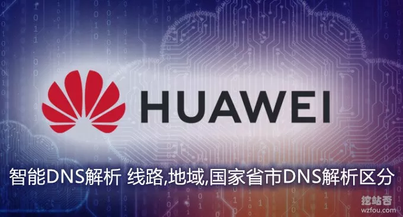](https://wzfou.com/wp-content/uploads/2019/09/huawei-dns_00.jpg)

三是华为云[免费DNS](https://wzfou.com/tag/mianfei-dns/)支持自定义线路，你可以让DNS解析指定范围。总得来说华为云免费DNS是一个非常不错的选择，更多的免费国内外DNS域名解析可查看专题：[国内外免费DNS域名解析服务汇总列表](https://wzfou.com/mianfei-dns/)，这里有：

1. [两款适合个人使用的DNS产品:ClouDNS和DNS Made Easy域名解析](https://wzfou.com/cloudns-dnsmadeeasy/)
2. [He.net DNS域名解析申请使用-免费DDNS、IPv6 地址和Slave DNS](https://wzfou.com/he-net-dns/)
3. [ClouDNS便宜好用的DNS解析服务-DNSSEC,主从DNS和亚太Anycast节点](https://wzfou.com/cloudns/)

## 一、华为云DNS解析操作

网站：

1. 官网：[https://www.huaweicloud.com/](https://wzfou.com/go/huawei)

### 1.1 添加域名

首先是注册并登录华为云，然后在产品列表中找到域名DNS解析，也可以直接打开：https://www.huaweicloud.com/product/dns.html ，点击添加域名。

[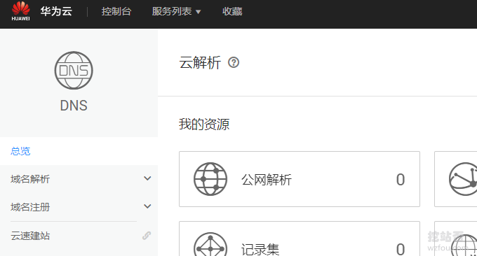](https://wzfou.com/wp-content/uploads/2019/09/huawei-dns_01.png)

填写你要使用华为云DNS的域名，也可以设置一个邮箱。

[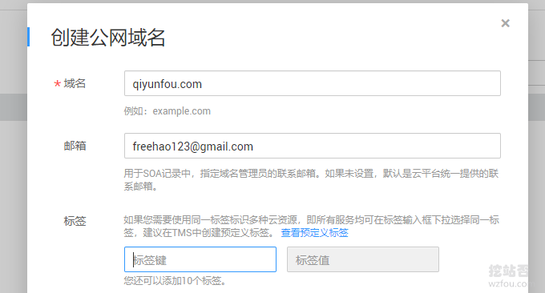](https://wzfou.com/wp-content/uploads/2019/09/huawei-dns_02.png)

最后，到你的域名注册商那里修改一下域名的NS服务器，改成：`ns1.hwclouds-dns.com，ns1.hwclouds-dns.net`。如下图：

[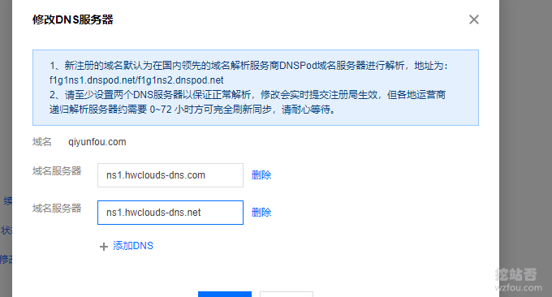](https://wzfou.com/wp-content/uploads/2019/09/huawei-dns_03.png)

### 1.2 DNS解析记录

到华为云DNS管理面板中，点击添加DNS记录集，填写主机记录、选择DNS类型、线路类型、TTL时间以及权重等。

[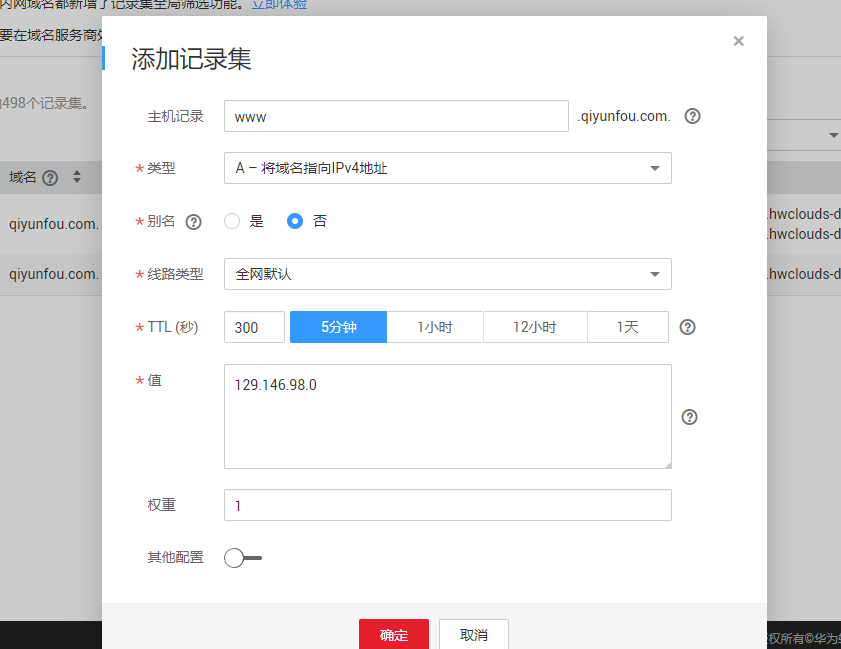](https://wzfou.com/wp-content/uploads/2019/09/huawei-dns_04.png)

华为云DNS支持的DNS记录主要包括：

> A – 将域名指向IPv4地址  
> CNAME – 将域名指向另外一个域名  
> MX – 将域名指向邮件服务器地址  
> AAAA – 将域名指向IPv6地址  
> TXT – 设置文本记录  
> SRV – 记录提供特定服务的服务器  
> NS – 将子域名授权给其他NS服务器解析  
> CAA – CA证书颁发机构授权校验

值得一提的是华为云DNS支持CAA记录，CAA（Certification Authority Authorization，证书颁发机构授权）是一项防止HTTPS证书错误颁发的安全措施，国内的话目前也就[京东云DNS免费域名解析](https://wzfou.com/jdcloud-dns/)支持。

[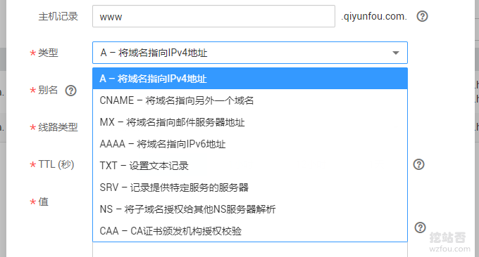](https://wzfou.com/wp-content/uploads/2019/09/huawei-dns_05.png)

### 1.3 反向域名解析

华为云DNS解析支持反向域名解析，不过需要使用华为云的VPS才行。

## 二、华为云DNS智能解析

### 2.1 线路类型区分

华为云DNS支持区分电信、联通、移动、教育网、铁通等线路类型。

[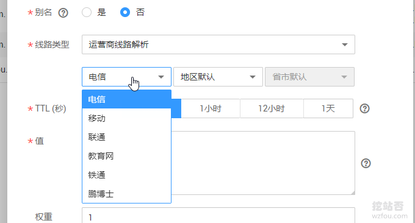](https://wzfou.com/wp-content/uploads/2019/09/huawei-dns_07.png)

### 2.2 国内地域区分

华为云DNS支持国内华北、东北、华南、华东等区域DNS划分。

[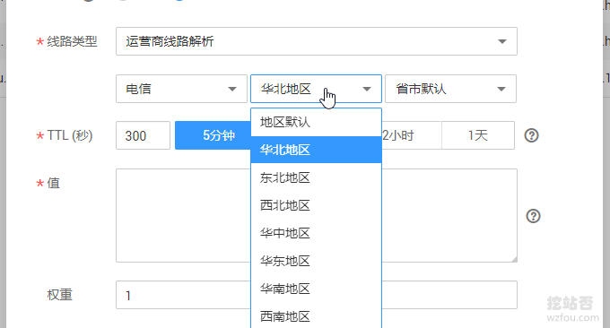](https://wzfou.com/wp-content/uploads/2019/09/huawei-dns_08.png)

同时可以精确到省市级的DNS区分。

[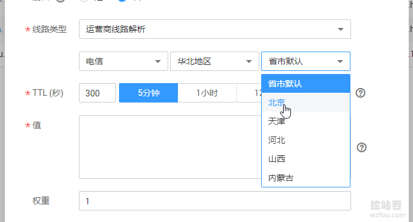](https://wzfou.com/wp-content/uploads/2019/09/huawei-dns_09.png)

### 2.3 国外地域区分

华为云DNS支持国外的区域DNS划分，可以选择亚太、美洲、欧洲等区域。

[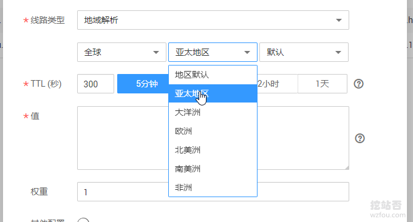](https://wzfou.com/wp-content/uploads/2019/09/huawei-dns_12.png)

也可以精确到国家，例如美国、英国、法国、日本等。

[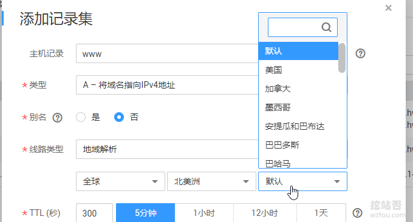](https://wzfou.com/wp-content/uploads/2019/09/huawei-dns_13.png)

### 2.4 最短TTL时间

华为云DNS支持设置最短TTL时间1秒，这项设置比起DNSPOD等第三方的DNS服务还是不错的。

[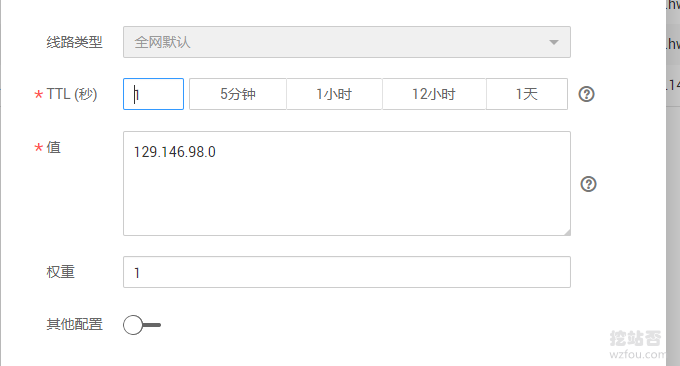](https://wzfou.com/wp-content/uploads/2019/09/huawei-dns_06.png)

### 2.5 自定义线路

如果上面的电信、移动、联通等线路区分、国家、省级的区域划分还是无法满足你的DNS解析需要，你可以使用华为云DNS的自定义线路。

[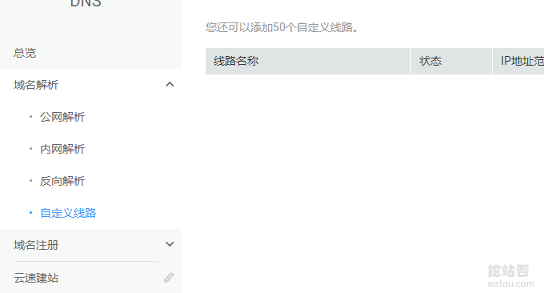](https://wzfou.com/wp-content/uploads/2019/09/huawei-dns_15_1.png)

自定义线路允许你单独设置IP范围，并对这些IP范围有针对性地设置DNS解析，如下图：

[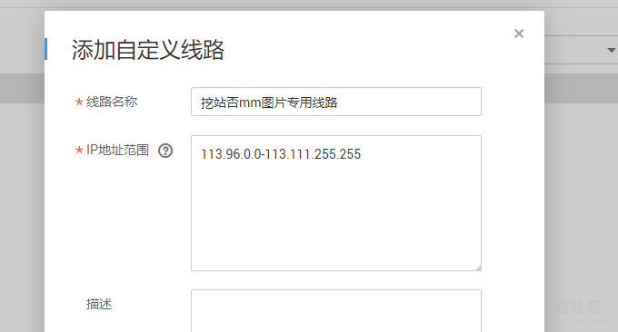](https://wzfou.com/wp-content/uploads/2019/09/huawei-dns_16.png)

例如你想让某一个IP范围的DNS解析为指定的域名解析记录，就可以DNS设置中添加线路为自定义线路了。

[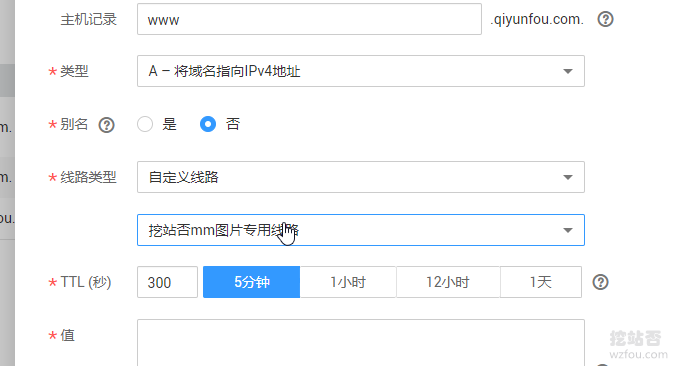](https://wzfou.com/wp-content/uploads/2019/09/huawei-dns_17.png)

### 2.6 DNS节点多

经过测试，免费版本的华为云DNS的DNS节点在境内有3-4个，另外还有香港DNS节点，有利于国外的域名DNS解析。

[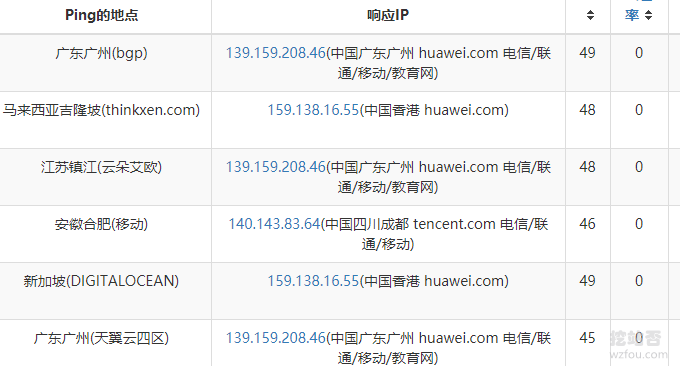](https://wzfou.com/wp-content/uploads/2019/09/huawei-dns_14.png)

## 三、总结

华为云DNS目前来看功能是相当不错的，以DNSPOD对比为例，免费版本的DNSPOD就没有地域区分功能，必须付费才可以使用。而且华为云DNS最大的吸引力就对免费用户开放了自定义线路功能，非常地实用。

华为云DNS的DNS节点在广东、四川等BGP机房都有设立，同时也有香港DNS节点，有利于海外的DNS域名解析加速。总得来说，华为云DNS提供的各项功能比较给力，作为免费的DNS，这个服务是值得称赞的。