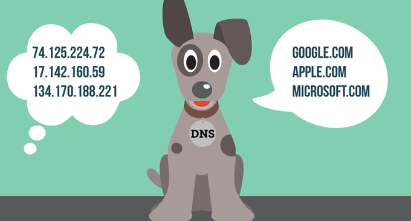

# 国内外免费DNS域名解析服务汇总列表-寻找更多免费DNS域名解析
CloudXNS宣布“暂停免费用户域名DNS解析”后，我觉得很有必要整理一下国内外那些免费的DNS域名解析服务。CloudXNS“粗暴”地要求用户转移出去真心是我用了这么年的DNS的头一回，无论原因是什么，给用户造成这样的“麻烦”CloudXNS至少要承担一定的责任。

不过，少了一个CloudXNS也没有关系，毕竟DNS域名解析服务并不只有一家，免费的DNS域名解析服务在国外也非常地常见，除了没有地理位置和线路识别功能，国外的DNS域名解析服务其实也可以用于网站域名解析，基本上可以满足大部分的网站DNS解析需求。

之前在做部落博客时曾经试用过不少的免费DNS服务，本篇就来整理一下国内外现在可用的[免费DNS](https://wzfou.com/tag/mianfei-dns/)域名解析服务，从功能用途、稳定性、免费等方面对各大DNS域名作一下简单的综合评比，你可以根据自己的DNS域名解析需要来自由选择。

更多的关于VPS主机和建站资源等专题汇总，你还可以看看：

1. [VPS主机排行榜单](https://wzfou.com/vps-bangdan/)
2. [CN2 VPS主机商汇总](https://wzfou.com/cn2-vps-list/)
3. [服务器控制面板榜单](https://wzfou.com/vps-mianban/)
4. [WHMCS从入门到精通](https://wzfou.com/whmcs-jiaocheng/)

> **更新记录：**2019.10.2增加华为云DNS；

## 国内外免费DNS域名解析服务汇总列表

搜索:

|                         服务商                         | 位置 |                                                                                        点评                                                                                        | 评分 |
| ----------------------------------------------------- | --- | --------------------------------------------------------------------------------------------------------------------------------------------------------------------------------- | --- |
| [He.net DNS](https://wzfou.com/go/hedns)              | 美国 | Hurricane Electric公司产品，同时支持IPv4 和 IPv6 ，稳定性相当好，功能非常强大，推荐使用。教程：[He.net DNS域名解析申请使用](https://wzfou.com/he-net-dns/)。                                | 9.2 |
| [Cloudflare DNS](https://wzfou.com/go/cloudflare)     | 美国 | 著名CDN服务商Cloudflare产品，只要在添加域名到Cloudflare后关掉其CDN服务就可以使用Cloudflare给域名作DNS域名解析了，在国内不稳定。教程：[CloudFlare免费CDN加速](https://wzfou.com/cloudflare/)。 | 8.9 |
| [Ns1.com](https://wzfou.com/go/ns1)                   | 美国 | 本身是一个付费DNS解析服务商，不过同时也提供免费套餐，支持AXFR请求和Secondary DNS。教程：[NS1 DNS域名解析使用](https://wzfou.com/ns1-dns/)                                                  | 8.7 |
| [GeoScaling](https://wzfou.com/go/geoscaling)         | 美国 | 支持多达20中解析类型，并支持“Smart Subdomains”功能，按运营商/as号、国家、城市、经纬度来区分访客                                                                                           | 8.7 |
| [DNSPod.cn](https://wzfou.com/go/dnspodcn)            | 国内 | 腾讯旗下产品，国内第一大DNS解析服务提供商，功能丰富，稳定性好，有搜索引擎优化、电信联通线路等智能解析                                                                                        | 8.6 |
| [华为云DNS](https://wzfou.com/go/huawei)               | 国内 | 华为云DNS域名解析服务，支持国内与国外、省市级DNS解析区分，支持自定义线路。教程：[华为云免费DNS](https://wzfou.com/huaweicloud-dns/)                                                         | 8.6 |
| [cloudns.net](https://wzfou.com/go/cloudns)           | 美国 | 美国一家DNS域名解析商，支持动态域名解析，对个人有免费额度。教程：[ClouDNS域名解析](https://wzfou.com/cloudns/)                                                                            | 8.6 |
| [Godaddy DNS](https://wzfou.com/go/godaddy)           | 美国 | 世界上第一的域名注册商和主机托管商Godaddy产品，在国内存在不稳定的情况                                                                                                                    | 8.5 |
| [No-IP DNS](https://wzfou.com/go/noip)                | 美国 | 美国一家老牌的DNS域名解析商，提供免费动态域名解析服务                                                                                                                                   | 8.4 |
| [NameCheap](https://wzfou.com/go/namecheap)           | 美国 | 著名域名注册商NameCheap产品，既可以用于NameCheap注册的域名，也可以添加在别的域名注册商注册的域名                                                                                           | 8.3 |
| [ZoneEdit](https://wzfou.com/go/zoneedit)             | 美国 | 国外老牌DNS服务，成立于1999年，功能强大，稳定性不错。                                                                                                                                   | 8.2 |
| [afraid.org](https://wzfou.com/go/afraid)             | 美国 | 老牌免费二级域名afraid.org提供的DNS服务，同时支持动态域名解析                                                                                                                           | 8.1 |
| [京东云DNS](https://wzfou.com/go/jcloud)               | 国内 | 京东云DNS，支持电信、移动、联通、方正、华数、铁通、长宽等智能线路解析，支持泛解析。详细见：[京东云DNS免费域名解析](https://wzfou.com/jdcloud-dns/)                                            | 8.1 |
| [DNSPod.com](https://wzfou.com/go/dnspodcom)          | 美国 | DNSPod国际版，自从被腾讯收购后就一直没有更新了，但是功能上还是不错，适合国人使用                                                                                                           | 8.0 |
| [Value-domain](https://wzfou.com/go/value-domain)     | 日本 | 日本GMO DigiRock公司产品，Value-domain是GMO专门提供域名注册服务的，同时也提供免费DNS域名解析。                                                                                            | 8.0 |
| [Eurodns](https://wzfou.com/go/eurodns)               | 欧洲 | 欧洲著名的域名注册商，总公司在卢森堡，提供免费DNS域名解析服务                                                                                                                            | 7.9 |
| [Linode DNS](https://wzfou.com/go/linode)             | 美国 | 著名主机商Linode产品，稳定性不错，但是只是作为主机的附属产品，不像专业的DNS那样功能全面。                                                                                                  | 7.9 |
| [XName.org](https://wzfou.com/go/xname)               | 欧洲 | 欧洲一家老牌的DNS服务商，支持 IPv6 AAAA 记录功能、DNS动态更新、自动化管理等                                                                                                              | 7.8 |
| [DigitalOcean](https://wzfou.com/go/digitalocean)     | 美国 | 著名VPS主机商DigitalOcean产品，采用anycast技术，响应速度快                                                                                                                            | 7.8 |
| [Sitelutions](https://wzfou.com/go/sitelutions)       | 美国 | 在全美各地分布有5个DNS服务节点，支持动态域名解析，并支持URL转发                                                                                                                          | 7.8 |
| [buddyns](https://wzfou.com/go/buddyns)               | 美国 | 美国一家DNS服务商                                                                                                                                                                   | 7.8 |
| [ChangeIP](https://wzfou.com/go/changeip)             | 美国 | 美国一家老牌的DNS服务商，提供Dynamic DNS（动态域名解析服务），不限URL。                                                                                                                 | 7.7 |
| [DNSzi.com](https://wzfou.com/go/dnszi)               | 韩国 | 韩国的免费DNS解析服务，公司成立于2010年。特点是注册后分配给每个会员的5个免费DNS服务器地址均与其他会员不同，且分散在三个IDC进行管理,不用担心域名解析出现问题                                       | 7.5 |
| [DNS.com](https://wzfou.com/go/dnscom)                | 国内 | 厦门帝恩思公司产品，搜索引擎线路支持，对域名数量和子域名数量均没有数量限制                                                                                                                 | 7.3 |
| [freedns.42.pl](https://wzfou.com/go/42pl)            | 欧洲 | 波兰的免费DNS域名解析服务，使用的两个NS都在不同的IP段。                                                                                                                                 | 7.3 |
| [DNS.LA](https://wzfou.com/go/dnsla)                  | 国内 | 河南度网科技有限公司产品，要提供免费智能DNS解析，不限解析记录数，支持显性URL转发                                                                                                           | 7.3 |
| [网宿CloudDNS](https://wzfou.com/go/wangsucloud)      | 国内 | 网宿科技股份有限公司产品，支持设置分省和自定义线路                                                                                                                                      | 7.1 |
| [八戒DNS](https://wzfou.com/go/bajiedns)              | 国内 | 杭州速联公司产品，智能解析线路，支持运营商(电信、联通、移动、铁通、教育)。最小TTL为600秒，URL转发2条。                                                                                      | 7.0 |
| [freedns.vn](https://wzfou.com/go/freednsvn)          | 越南 | 越南一家免费DNS解析服务商                                                                                                                                                            | 6.7 |
| [沈阳360DNS](https://wzfou.com/go/360dns)             | 国内 | 沈阳迅云网络公司产品，不是360卫士那个DNS，以前听说过，但是看名字就容易与360混淆                                                                                                           | 6.3 |
| [ZNDNS](https://wzfou.com/go/zndns)                   | 国内 | 前身是zn-dns.com，2006年开始运营，从备案信息看为个人所有，官网公告停止在2013年。                                                                                                         | 6.2 |
| [CloudXNS](https://wzfou.com/go/cloudxns)             | 国内 | 北京快网公司产品，多元化智能DNS解析服务，功能上与DNSPOD类似，用户口碑评价不一。**2019年7月16日正式关闭个人免费DNS服务。**                                                                   | 付费 |
| [Dnsever](https://wzfou.com/go/dnsever)               | 韩国 | 韩国知名的DNS服务商之一，提供的服务很稳定，设置记录几分钟完成解析，界面支持韩语和英文                                                                                                       | 付费 |
| [阿里云DNS](https://wzfou.com/go/aliyun)               | 国内 | 原来的万网DNS，被阿里云收购后变身为阿里云解析，此产品为付费产品。                                                                                                                        | 付费 |
| [Route 53](https://wzfou.com/go/route53)              | 美国 | Amazon 旗下产品，功能强大，稳定性好，适合企业用户，因为Route 53是付费产品                                                                                                                | 付费 |
| [DNS Made Easy](https://wzfou.com/go/dnsmadeeasy)     | 美国 | DNS Made Easy是美国一家付费DNS服务商，价格便宜，支持CAA、DNSSEC以及Anycast DNS等。教程：[DNS Made Easy域名解析](https://wzfou.com/cloudns-dnsmadeeasy/)                                  | 付费 |
| [Dyn DNS](https://wzfou.com/go/dyn)                   | 美国 | 著名Dyn公司产品，付费产品，适合企业使用                                                                                                                                               | 付费 |
| [Google Cloud DNS](https://wzfou.com/go/googledns)    | 美国 | 谷歌公司产品，价格低廉，提供 100% 的 SLA，使用了 Anycast 保证最低的延迟。**教程：**[Google Cloud DNS申请使用](https://wzfou.com/google-cloud-dns/)                                        | 付费 |
| [Rage4](https://wzfou.com/go/rage4)                   | 美国 | Route53 的完美替代品，同时支持 DNSSEC 和分区解析，使用了 Anycast 保证最低的延迟。                                                                                                        | 付费 |
| [Rackspace Cloud DNS](https://wzfou.com/go/rackspace) | 美国 | 著名主机商Rackspace的产品，付费。                                                                                                                                                    | 付费 |
