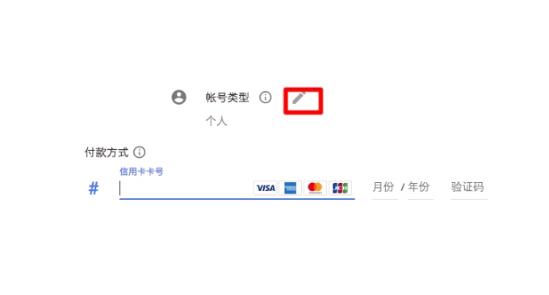

# 放弃免费DNS改用付费DNS-Google cloud DNS申请使用与解析效果
提起[免费DNS](https://wzfou.com/tag/mianfei-dns/)服务，之前受到许多站长青睐的CloudXNS应该是一个很好的选择。但是这一切都在前几天改变了，由于一些“众所周知”的原因，cloudxns在没有任何通知的情况下暂停了绝大多数用户的解析。我也是这星期从学校回来后才发现这个问题。

在考虑一段时间之后，我还是决定把解析迁移到其他厂商。闻名的[Google Cloud DNS](https://wzfou.com/tag/google-cloud-dns/)是一个不错的选择，它主要有以下优势：NS服务器采用Anycast技术，确保用户能得到来自最近服务器的解析,支持DNSSEC ,100%的SLA ,支持所有主流记录类型，TTL最低允许设置为1s 。

当然，这些先进的功能（尤其是100%SLA）不是没有代价的——Google Cloud DNS并不是一款免费服务。虽然如此，就像我们总有一天会选择从免费空间转入付费虚拟主机或VPS一样，我并不想再次看到因为一些特有因素影响到我的解析，因而我最终选择了[付费DNS](https://wzfou.com/tag/fufei-dns/)解析。

虽然如此，但Google Cloud DNS的价格非常低廉。1个DNS Zone（可以简单理解为托管一个域名）每月仅需\\$0.2，每100万次DNS查询仅需\\$0.4。并且GCP还附有50000次/天的免费额度。对于个人博客来说，免费配额都已经相当充足，即每月只需支付0.2美元的托管费用即可。这个价格对于绝大多数使用付费主机的站长来说都已经低廉到可以忽略了。

更多有关于[VPS主机](https://wzfou.com/vps/)还有建站方面的文章，你还可以看看：

1. [国内外免费DNS域名解析服务汇总列表-寻找更多免费DNS域名解析](https://wzfou.com/mianfei-dns/)
2. [接入CN2线路VPS主机商和机房汇总-鉴别真假CN2线路主机参考手册](https://wzfou.com/cn2-vps-list/)
3. [日本Xrea免费空间申请与使用-优秀稳定的免费主机1GB空间免费SSL](https://wzfou.com/xrea/)

**PS：2018年6月26日更新，**不想使用国外的DNS服务，也不喜欢DNSPOD的各种功能限制，可以试试京东云的DNS域名解析服务：[京东云DNS免费域名解析-支持线路\\地域细分 可添加CAA解析记录](https://wzfou.com/jdcloud-dns/)。

## 一、Google cloud DNS申请

官网：

1. https://cloud.google.com/dns/

想要使用GCP DNS，你需要：

> 正常的互联网连接（基本技能）  
> 一张支持美元支付的VISA或者Mastercard信用卡（这可能是仅有的一个门槛），当然，也可以找人代付  
> 一个Google账户

在使用GCP之前，有一些关于GCP平台费用的概念需要理解。

> **项目 ：**项目是GCP上的资源（计算、存储、网络等）的组织单元。和我们通常所理解的概念类似。要使用GCP上的所有资源，你需要先建立至少一个项目，然后再在该项目中进行操作。项目的设立是为了让开发者针对不同的应用更好地管理资源，例如，需要大量CPU的应用和存储型应用应该放到不同的项目中管理。当然，一个项目中有多少应用没有什么硬性规定，这只是为了用户管理方便而已。  
> **结算账号：**这是GCP上关于资费的组织单元。与项目类似，它也仅仅是为了管理的方便。它的操作方式和项目有点相似，只不过管理的是和支付有关的功能。有点像我们网购时可以使用不同的支付宝账户来支付一样。不过，结算账号内只支持绑定信用卡。  
> **启用计费（Enable Billing）：**启用计费是将一个项目与一个可用的结算账号关联的过程。换句话说，一个项目建立时，默认是没有启用支付功能的，这可以防止意料之外的费用产生；与此相应的，如果不启用计费，这个项目就只能使用免费的资源，许多高级功能都会被禁用。一个项目可以关联一个结算账号，而一个结算账号可以被多个项目所关联——如果你需要的话。

首先打开GCP网站，登陆Google账户。如果你是新用户，也可以点击“Try it free”按钮获得1年内\\$300 的免费额度以及一些其他的永久免费资源。这里不再赘述。

登陆GCP后，如下图操作即可进入新建项目页面。

项目ID是GCP全平台上的唯一标识。如果你使用了一个没有人使用过的项目名称，则ID默认与名称相同。否则就会和上图一样得到一个随机ID。可以点击修改来选择需要的ID。点击创建之后，右上角的通知栏会开始旋转。这表明我们的项目正在创建中。一旦创建成功，这里就会显示一条新的消息。

点击这条消息即可进入项目管理首页。（点击放大）

为了使用Google Cloud DNS，我们需要先为项目启用计费。点击左上角的导航栏，选择“结算”：

如果你已经有了一个结算账号，可以直接点击“关联结算账号”选择需要关联的条目。如果没有，点击“管理结算账号”并创建一个新的：

在上图的下一步，需要填写一些有关资料，最好如实填写。注意在类型一栏改成“个人”：在“付款方式”处填写信用卡信息。

点击“提交并启用结算”之后，会自动将该项目与该结算账号相关联。（为什么？因为我们刚刚一直都是在新的项目内操作的）。注意，为了验证卡的有效性，会自动向卡内收取\\$1，就我的使用体验来看，这1\\$会在短时间内退还。

## 二、Google cloud DNS使用

启用计费后还不能直接使用Google Cloud DNS，我们需要首先启用该API。进入API界面后，选择Cloud DNS API。

如果你还没有凭据（相当于API KEY，只不过使用了不同的方式），需要点击上图左边第三个钥匙形图标创建一个新的凭据。如下图操作：

由于我们只是为了使用DNS功能，不需要过多的权限控制，“角色”直接选择Project-所有者即可，如字面意思所示，其拥有项目内的最高权限。密钥类型默认JSON即可，这是为了自动化的脚本使用所设计的，需要保存好该文件。当然，如果只是使用DNS，很有可能不需要用到它。如下图操作：

之后就可以启用Google Cloud DNS API了。启用完成之后，点击左侧菜单-网络服务-云端DNS就可以开始使用DNS，如图：

其中，“地区名称”可以任意配置，“DNS名称”就是你要使用Cloud DNS的域名。如果Google Cloud DNS上已经有用户托管了该域名，就不能再次创建（该项目内的域名除外，例如，我可以多次创建zby.io的有关Zone）

之后就是更换DNS服务器的常规动作了。到域名注册商处修改NS服务器即可。GCP DNS的NS服务器可以如下图看到：

如上图所述，必须配置为完全使用4组NS服务器，才能得到100%SLA的保证。混杂的NS服务器或只用3组或更少是无法得到保证的。

Google cloud DNS添加DNS解析记录。Google Cloud DNS支持*解析，但是我们习惯的@解析在这里是不需要特意填写@的，直接留空即可，如下图：

Google Cloud DNS添加记录会给出样例数据，对于特定记录的某些选项，不一定像国内DNS厂商一样有专门的输入框，而是按格式输入对应值。如添加MX记录时，CloudXNS会专门显示一个“优先级”框，但GCP DNS使用的格式是”优先级 目标”。

Google Cloud DNS有名为”记录集“的组织方式。对一些特定记录，如A CNAME等，支持同时为一个子域添加多条记录。

## 三、Google cloud DNS效果

这是挖站否wzfou.com编辑后补充的内容，使用Google cloud DNS最大的担心恐怕就是DNS服务器被Q的问题了。以下是目前Google cloud DNS的NS服务器。

> NS-CLOUD-A1.GOOGLEDOMAINS.COM  
> NS-CLOUD-A2.GOOGLEDOMAINS.COM  
> NS-CLOUD-A3.GOOGLEDOMAINS.COM  
> NS-CLOUD-A4.GOOGLEDOMAINS.COM

其中，第一个已经无Ping通了，其它三个正常Ping通。这是采用了Google cloud DNS的DNS解析响应时间，从图表中可以看出国内各地响应正常。（点击放大）

这是使用DNSPOD免费DNS解析服务的解析响应时间，通过这两张图表对比我们可以发现Google cloud DNS与DNSPOD免费版的域名解析响应时间都差不多。（点击放大）

这是采用了Google cloud DNS的DNS监控图。（点击放大）

这是DNSPOD免费DNS解析的DNS监控图，通过对比，我们可以发现Google cloud DNS的解析时间波动范围大一些，但也基本上在接受范围内。

## 四、总结

就目前的使用体验来看，Google Cloud DNS还是相当令人满意的。唯一的缺点可能就是它不支持像CloudXNS或DNSPOD那样分线路分区域解析，而是用Anycast代替。如果需要该功能，另一个值得考虑的是Amazon Route53，价格也非常低廉。一个Zone+100万次解析每月仅需$0.8。

Google cloud DNS目前有多组NS服务器，所以国内解析都正常，不用担心被Q的问题。相对于DNSPOD等国内的NS服务器，在解析响应时间上可能要逍逊一些，但是从全球范围内来看，Google cloud DNS的DNS解析还是非常有优势的，对于国内的用户我们可以将TTL设置长一些，有利于加快解析速度。