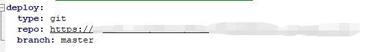
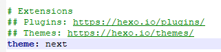
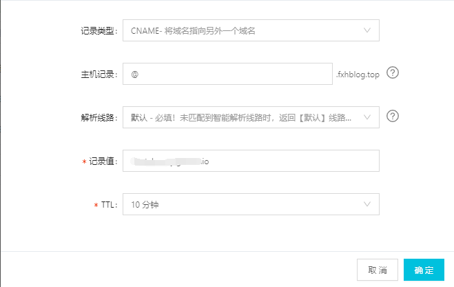

# GitHub pages + Hexo 搭建自己的个人博客
hexo是一个非常简单简洁的博客系统，因为不喜欢wordpress的臃肿然后就转Hexo。

[这是](https://fxhblog.top/)我自己搭建好的博客

# 第一步：配置GitHub pages

首先需要一个GitHub账号  
然后可以  
具体可参照[官方教程](https://pages.github.com/)

# 第二步：安装node.js

[下载](https://nodejs.org/zh-cn/download/)安装包

安装的时候选择一下路径就可以了，其他就可以直接点下一步。

现在使用

```
node -v
```

以及

```
npm -v
```

可以查看到node以及npm的版本  
因为npm比较慢，可以安装cnpm替代之后的npm命令。

安装cnpm

```
npm install -g cnpm --registry=https://registry.npm.taobao.org
```

# 第三步：现在安装Hexo

```
cnpm install -g hexo-cli
```

进入clone下来的目录  
执行

```
hexo init blog
```

然后进入刚刚创建目录

```
cd blog
```

可以看到这个目录

```
├── _config.yml
├── package.json
├── scaffolds
├── source
|   ├── _drafts
|   └── _posts
└── themes
```

执行

```
cnpm install
```

之后执行

```
hexo clean
hexo g
hexo s
```

然后打开本地的localhost:4000就可以看到博客的样子了。  
打开配置文件_config.yml  
改变下面的地方  


修改文件时冒号后面要跟一个空格

repo修改为clone的地址，可以是ssh也可以https的clone地址。  
然后执行

```
hexo d
```

```
如果报错 ERROR Deployer not found: git
先执行cnpm install hexo-deployer-git --save
```

提交过会儿之后就可以访问到了。

# 其他

## 1、常用操作

新建一篇文章：

```
hexo new post 文章名字
```

使用Markdown编辑后就可以看到了。

```
hexo clean  清理缓存

hexo generate 进行渲染 简写 hexo g

hexo server 部署到本地(调试使用) 简写 hexo s。然后浏览器输入 http://localhost:4000

调试完毕后使用 hexo deploy 简写为 hexo d来部署到git服务器。
```

## 2、改变主题

[这是](https://hexo.io/themes/)官方的主题网站  
将主题clone到你的theme，在配置文件中



将theme改变为你下载的主题名称  
然后编译，运行，发布。

## 3、解析域名

### 第一步域名解析：

需要一个域名，然后在解析的时候选择记录类型为CNAME

如图  


> 记录值填你的github的主页网址  
> 添加两个解析，主机记录有两个@和www

解析完之后需要等一段时间，可以在控制台ping你的域名，如果成功了就解析成功了。

### 第二步：github上配置你的域名

然后在public目录下添加CNAME这个文件  
内容为你的域名

然后清除缓存，编译，部署。

由于使用的主题不一样，更多的个性化，使用next主题的可以参考[官方网址](https://theme-next.iissnan.com/)