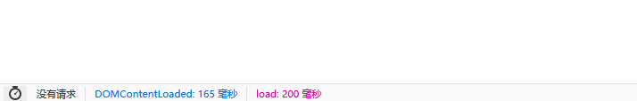

# pic+js+gh图床

本文章介绍一个目前我认为最稳定的免费图床方案：PicGo+jsdelivr+github准备写一个文字版教程然后录个教程在B站，你们可以搜索301技术关注我。

***

[PicGo](https://github.com/Molunerfinn/PicGo)

[jsdelivr](https://www.jsdelivr.com/)

[github](https://github.com/)

***

## 速度对比

Github的速度：

jsdelivrCDN的速度：

***

首先进入PicGo的[下载地址](https://github.com/Molunerfinn/PicGo/releases) 选择最新版本下载，根据自己的系统下载对应的安装包，我这里是Windows

如果你下载的时候很慢，可以用特殊的方式下载，也可以用我的快速链接

> [https://www.lanzous.com/i5avbgd](https://www.lanzous.com/i5avbgd) //2.1.2Windows版本

***

## 创建仓库

首先创建一个github仓库，名字可以随便取，然后勾选README初始化仓库

## 生成token

【进入github】-【点击头像】-【settings】-【developer settings】-【Personal access tokens】

***

点击【Generate new token】

自定义一个名字，然后勾选【repo】最后点绿色按钮创建即可

请复制你的token，它只显示一次，请妥善保管

***

## 配置github图床

先打开你安装好的picgo然后左栏依次选择【图床设置】-【github图床】

|   |   |
| --- | --- |
| 1   | 如果你打开picgo时没有直接出来界面，它可能藏在你的托盘图标处   |

- 仓库名格式是你的用户名/仓库名
- 分支是master
- token填我们刚刚生成的
- 存储路径可以填也可以不填，如果你填了img/，它就会上传到你仓库的img目录下
- 自定义域名的格式：[https://cdn.jsdelivr.net/gh/用户名/仓库名](https://cdn.jsdelivr.net/gh/%E7%94%A8%E6%88%B7%E5%90%8D/%E4%BB%93%E5%BA%93%E5%90%8D)
- 最后记得确定保存

***

点击上传区记得图床选【github图床】

直接将图片拖入即可上传

可以看到在你的仓库有了第一张图片，我上传了一个为1.png的图片

***

> 链接格式：[https://cdn.jsdelivr.net/gh/你的用户名/仓库名/文件路径](https://cdn.jsdelivr.net/gh/%E4%BD%A0%E7%9A%84%E7%94%A8%E6%88%B7%E5%90%8D/%E4%BB%93%E5%BA%93%E5%90%8D/%E6%96%87%E4%BB%B6%E8%B7%AF%E5%BE%84)
> 
> 例如：[https://cdn.jsdelivr.net/gh/kjhuanhao/testcdn/1.png](https://cdn.jsdelivr.net/gh/kjhuanhao/testcdn/1.png)

我们在上传的时候会自动复制这个格式的链接，大家可以可以直接复制查看

然后你就可以通过这个链接访问你的图片了