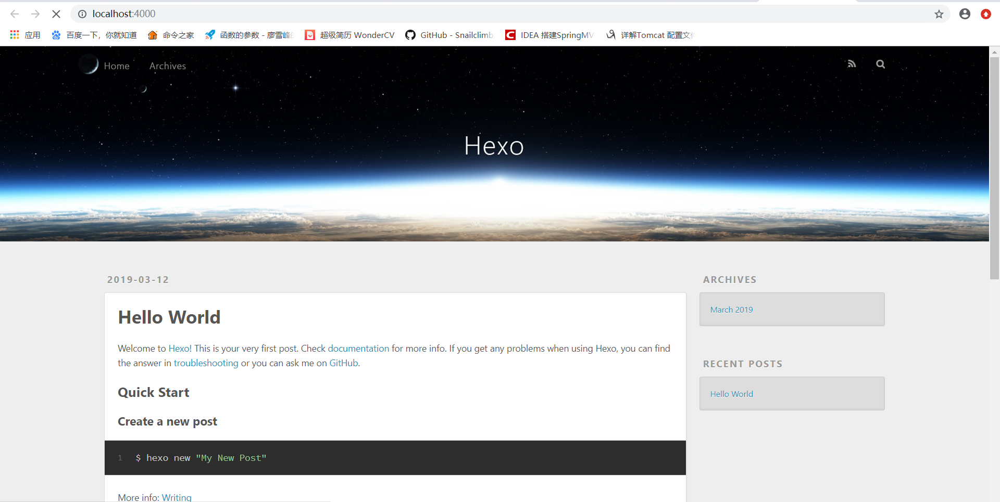
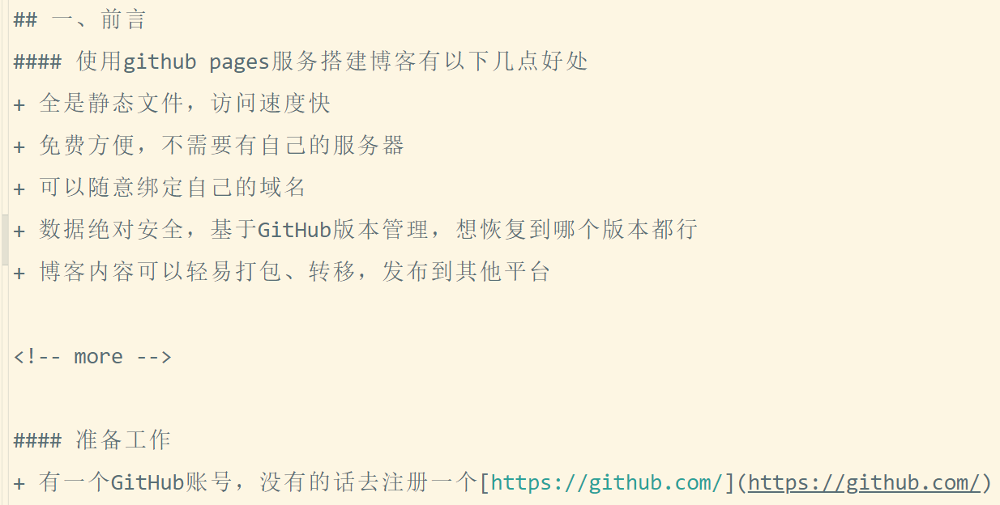

# win10使用Hexo+GitHub搭建个人博客
## 一、前言

#### 使用github pages服务搭建博客有以下几点好处

- 全是静态文件，访问速度快
- 免费方便，不需要有自己的服务器
- 可以随意绑定自己的域名
- 数据绝对安全，基于GitHub版本管理，想恢复到哪个版本都行
- 博客内容可以轻易打包、转移，发布到其他平台

#### 准备工作

- 有一个GitHub账号，没有的话去注册一个[https://github.com/](https://github.com/)
- 安装git for Windows（或者其他的客户端）
- 安装node.js、npm

#### 安装node.js和npm

[官网下载](https://nodejs.org/en/download/)相应的安装版本，我下的是win64的msi文件  
下载后直接安装，在选择安装路径步骤可以自定义安装路径，其余全部按照默认配置，一路next（注意：msi文件按以上步骤安装后会自动配置环境变量，会如果之前下载的是zip文件，则需要手动配置环境变量）  
验证安装是否成功，在cmd或Git Bush中输入  
`node -v`  
如果出现相应版本号，则安装成功！！！由于新版的nodejs已经集成了npm，所以npm在之前也一并安装了，命令行键入  
`npm -v`  
如果出现相应版本号，则安装成功！！！  
**修改npm的默认安装位置**  
如果不修改npm下载模块的默认位置，默认的安装路径是：C:\\Users\\Administrator\\AppData\\Roaming下的npm和npm-cache,所有的模块都安装在这里（当然你也可以不修改）。  
修改方式：找到node安装路径，依次进入node_modules->npm，找到**npmrc**文件修改prefix，不知道是由于版本问题还是什么，网上很多教程里的npmrc文件里都有prefix和cache两个，而我npmrc文件却只有一个prefix。  
`prefix=D:\NodeJS\node_global`

## 二、创建GitHub博客仓库

**创建仓库**  
新建一个名为 “你的用户名.github.io” 的仓库，如果你的 github 用户名是 test，那么你就新建 test.github.io 的仓库（必须是你的用户名，其它名称无效），将来你的网站访问地址就是 http://test.github.io 了。（注意：创建的仓库可能不会立即生效，大概需要10~20分钟）

**配置SSH key**  
第一步：创建SSH key。在用户主目录下，看看有没有.ssh目录，如果有，再看看这个目录下有没有id\_rsa和id\_rsa.pub这两个文件，如果已经有了，可直接跳到下一步。如果没有，打开Shell（Windows下打开Git Bash），创建SSH Key：  
`ssh-keygen -t rsa -C "youremail@example.com"`  
你需要把邮件地址换成你自己的邮件地址，然后一路回车，使用默认值即可。如果一切顺利的话，可以在用户主目录里找到.ssh目录，里面有id\_rsa和id\_rsa.pub两个文件，这两个就是SSH Key的秘钥对，id\_rsa是私钥，不能泄露出去，id\_rsa.pub是公钥，可以放心地告诉任何人。  
第二步：登陆GitHub，打开你的github主页，进入个人设置 -> SSH and GPG keys -> New SSH key，title随意填，将第一步生成的id_rsa.pub中的内容复制到key中，最后点击Add SSH key。  
可以参照：[配置SSH key](https://www.liaoxuefeng.com/wiki/0013739516305929606dd18361248578c67b8067c8c017b000/001374385852170d9c7adf13c30429b9660d0eb689dd43a000)

## 三、使用hexo写博客

**hexo简介**  
Hexo是一个简单、快速、强大的基于 Github Pages 的博客发布工具，支持Markdown格式，有众多优秀插件和主题。由于github pages存放的都是静态文件，博客存放的不只是文章内容，还有文章列表、分类、标签、翻页等动态内容，假如每次写完一篇文章都要手动更新博文目录和相关链接信息，相信谁都会疯掉，所以hexo所做的就是将这些md文件都放在本地，每次写完文章后调用写好的命令来批量完成相关页面的生成，然后再将有改动的页面提交到github。

**安装hexo**  
`npm install -g hexo`  
因为下载源在国外，所以可能出现安装不成功或网速较慢的情况，这时就可以将npm的注册表源设置为国内的镜像。

```
#获得原来的镜像地址
npm get registry
#设置为淘宝镜像
npm config set registry http://registry.npm.taobao.org/
#换成原来的
npm config set registry https://registry.npmjs.org/
```

**初始化**  
在电脑的某个地方新建一个名为hexo的文件夹（名字可以随便取），比如我的是D:\\Git\\myHexo，由于这个文件夹将来就作为你存放代码的地方，所以最好不要随便放。

```
cd D:/Git/myHexo
hexo init
hexo g    #生成
hexo s    #启动
```

执行以上命令之后，hexo就会在public文件夹生成相关html文件，这些文件将来都是要提交到github去的。hexo s是开启本地预览服务，打开浏览器访问 http://localhost:4000 即可看到内容，很多人会碰到浏览器一直在转圈但是就是加载不出来的问题，一般情况下是因为端口占用的缘故，因为4000这个端口太常见了，解决端口冲突问题请参考[这篇文章](http://blog.liuxianan.com/windows-port-bind.html),第一次初始化的时候hexo已经帮我们写了一篇名为 Hello World 的文章，默认的主题比较丑，打开时就是这个样子：  


**修改主题**  
如果不喜欢默认的主题，可以在[官网下载](https://hexo.io/themes/)换个好看点的。  
例如换上[hexo-theme-yilia](https://github.com/litten/hexo-theme-yilia)，首先下载主题

```
cd D:/Git/myHexo
git clone https://github.com/litten/hexo-theme-yilia.git themes/yilia
```

下载的主题都会放在···/myHexo/themes中，修改myHexo中_config.yml中的theme: landscape改为theme: yilia，然后重新执行hexo g来重新生成。  
如果出现一些莫名其妙的问题，可以先执行hexo clean来清理一下public的内容，然后再来重新生成和发布。

**上传到GitHub**  
第一步：配置_config.yml中有关deploy的部分

```
deploy:
  type: git
  repository: git@github.com:liuxianan/liuxianan.github.io.git
  branch: master
```

第二步：安装插件  
`npm install hexo-deployer-git`  
其它命令不确定，部署这个命令一定要用git bash，否则会提示Permission denied (publickey)。  
第三步：打开你的git bash，输入hexo d就会将本次有改动的代码全部提交。

**写博客**  
在source/_posts目录下使用hexo new命令，或者手动新建.md文件，写好后使用hexo d -g生成并上传，这样就可以通过yourname.github.io访问博客了！！！

**常用命令**

```
hexo new "postName" #新建文章
hexo new page "pageName" #新建页面
hexo generate #生成静态页面至public目录
hexo server #开启预览访问端口（默认端口4000，'ctrl + c'关闭server）
hexo deploy #部署到GitHub
hexo help  # 查看帮助
hexo version  #查看Hexo的版本

#缩写
hexo n == hexo new
hexo g == hexo generate
hexo s == hexo server
hexo d == hexo deploy

#组合命令
hexo s -g #生成并本地预览
hexo d -g #生成并上传
```

## 四、相关配置

**图片的使用**  
hello-world.md 文件在生成静态页面后放在public的子目录中，例如我的是/public/2019/03/12/hello-world/index.html，所以图片的链接可以写为 (../../../../img/img.png)，即链接到 public/img 文件下的图片。

**修改网站icon**

- 修改步骤：
    
    - 找一张自己喜欢的icon，命名为favicon.png
    - 将图片放在myHexo/themes/yilia/source/img/中（myHexo是我的hexo空间，yilia是我的主题）
    - 找到myHexo/themes/yilia/layout/_partial/head.ejs，找到以下内容并修改为：
    
    ```
    <% if (theme.favicon){ %>
      <link rel="icon" href="/img/favicon.png">
    <% } %>
    ```
    

**如何让博文列表不显示全部内容**  
默认情况下，生成的博文目录会显示全部的文章内容，如果想要让博文不显示全部内容，在博文合适的位置加上 标签即可。（注意：改标签前后最好都加上一行空行）  


**hexo系列问题之部署到github时会删掉README文件**

- 原因
    - 我们执行命令hexo g之后，会把source文件里的.md格式的文件渲染为html文件并放到public下面
    - 继续执行命令hexo d之后，会把public下面的所有文件提交到对应的XXX.github.io这个仓库
    - 由于本地public文件夹里没有README.md这个文件，所以在提交public文件时，github会认为你把README.md文件删掉了，同时github也会删掉仓库里的README.md文件，这就是具体的原因
- 解决办法
    - 我们在本地的source文件里新建一个README.md文件
    - 修改Hexo根目录下的\_config.yml文件，将skip\_render参数的值设置为README.md

```
skip_render: README.md

//  为什么需要设置这一步呢？
//  因为你执行hexo g命令时，hexo会默认将source文件里的所有md文件渲染为html文件放到public中，
//  同时README.md会被渲染为README.html文件放到public文件里
//  加上这段设置，就是告诉hexo的解析器，你在渲染source文件里的md文件时，跳过README.md文件
```

[参考这里](https://blog.csdn.net/wxl1555/article/details/79291865/)

## 五、后记

很久之前就搭建一次，但是因为弄得很乱，所以一直没用（主要是因为不怎么会用，也不怎么写博客）。但现在正在找实习当中，经常看一些别人的面经，也试着去回答那些问题，但发现很多知识点自己都会，但是不能清晰、精准的表达出来，所以准备重新搭建起这个博客，希望能把自己每天的积累到的一些重要知识用文字的形式表达出来，以此来锻炼一下自己的表达能力，同时也是对知识的一个消化、总结。  
上次搭建博客花了很多时间，由于对node.js、npm、hexo不了解，所以总感觉哪里不对头，就算按照别人的教程来，也会出现各种各样的错误（感觉自己有强迫症！！！）。今天搭这个东西也花了一两个小时，最后总算搞出来了！！！

[博客参考：https://www.cnblogs.com/liuxianan/p/build-blog-website-by-hexo-github.html#%E4%B8%8A%E4%BC%A0%E5%88%B0github](https://www.cnblogs.com/liuxianan/p/build-blog-website-by-hexo-github.html#%E4%B8%8A%E4%BC%A0%E5%88%B0github)  
[Git教程：https://www.liaoxuefeng.com/wiki/0013739516305929606dd18361248578c67b8067c8c017b000](https://www.liaoxuefeng.com/wiki/0013739516305929606dd18361248578c67b8067c8c017b000)