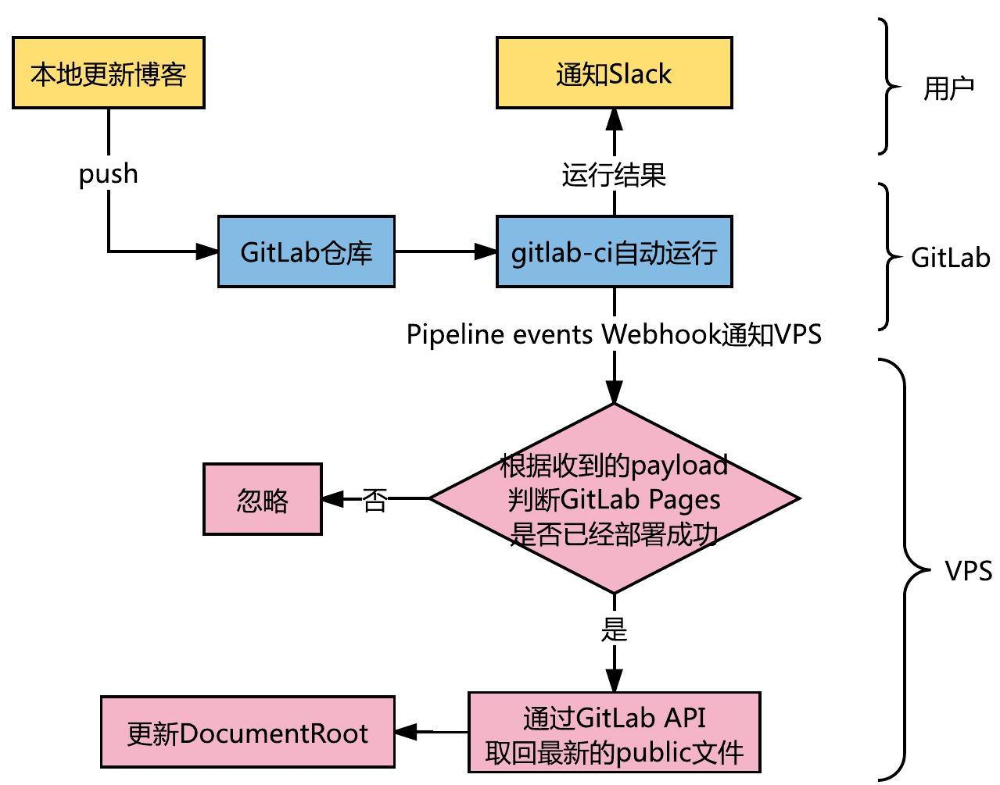
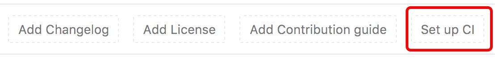
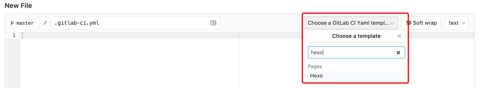
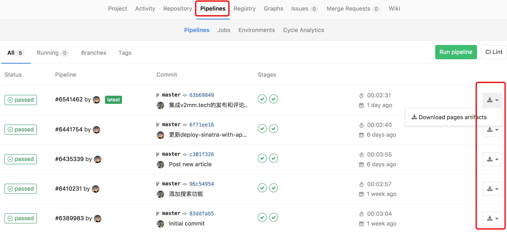
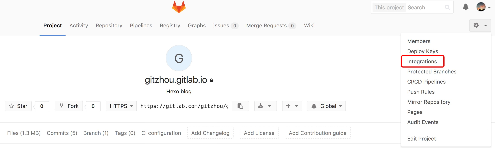
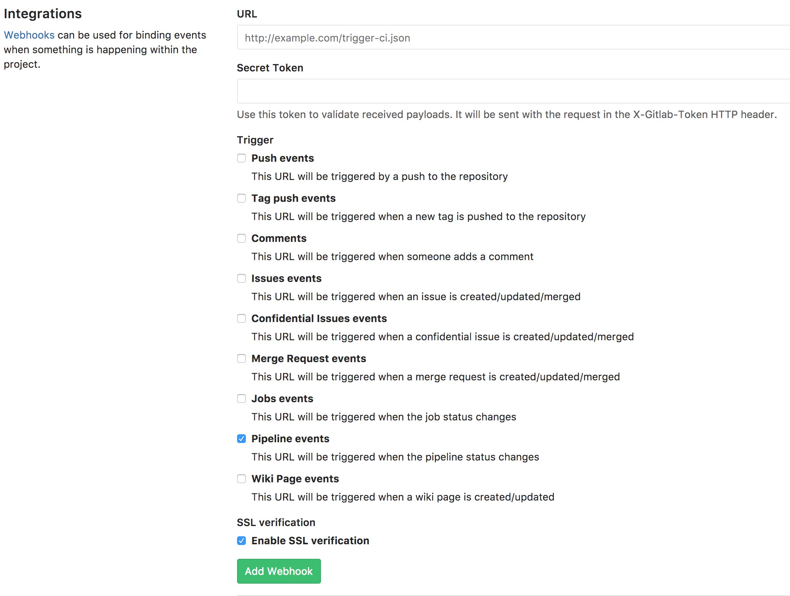
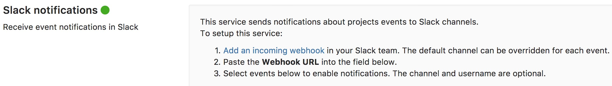

# 基于 GitLab CI 和 Webhook 的 Hexo 备份及部署方案
这是一套适合懒人的 Hexo 备份及部署解决方案。

结合具体情况，

- Hexo 本身适合用 Git 管理
- 静态文件要部署在 VPS 上
- 我习惯用 Git 管理代码

这套方案要满足的点有：

- 用 Git 管理 Hexo 的源码和主题，换了电脑也要能更新博客
- 发布文章时，VPS 上的静态文件要能被优雅的更新

系好安全带，下面要开始飙车了。 😝

# 写在前面

## 关于备份

[Hexo](https://hexo.io/) 是一款基于 [Node.js](https://nodejs.org/) 的静态博客框架，简单来说包括三部分。

1. 源码，包括项目框架、自己写的文章等
2. 主题
3. 部署用的静态文件，根据源码和主题自动生成

复制

|   |
| --- |
| .  ├── _config.yml     # \[1\]  ├── db.json         # hexo generate 时被自动更新  ├── node_modules/   # 依赖的 npm 包，npm install 时根据 package.json 自动下载  ├── package.json    # \[1\]  ├── public/         # \[3\]  ├── scaffolds/      # \[1\]  ├── source/         # \[1\]  └── themes/         # \[2\]   |

所以，备份 \[1\] 和 \[2\] 是关键。搜索了不少文章，备份的套路五花八门。

- 使用各种云存储直接备份整个文件夹
- 将源码放在 GitHub 仓库的 A 分支，静态文件通过`hexo deploy`自动更新到 B 分支
- 将源码和静态文件分开存放到不同的 GitHub 仓库

除了用云存储直接备份的方式，使用 Git 仓库托管，需要注意：

- 如果要保留主题仓库的 Git 历史，方便在上游更新时同步，需要使用 Git 子模块特性。因为主题本身以 Git 仓库的形式提供，而 Git 仓库不能嵌套
- 自定义主题后推送修改到子模块，要求用户有子模块仓库的写权限

因此，如果要使用子模块方案，在安装 Hexo 主题时，不同于原来直接 clone 主题仓库到本地，你需要先在 GitHub 上 fork 原作者的仓库，再在本地 clone 自己 fork 出来的仓库，这样你才有子模块的写权限。

考虑到，

- GitHub 的 private 仓库收费
- 不使用 GitHub 就不能 fork 主题
- Next 主题已经相对成熟和稳定，以后的一些简单改动，自己也能照着来，所以保留原仓库的 Git 历史显得不那么重要
- GitLab 的 private 仓库免费，并且也提供了类似 GitHub Pages 的服务

最后决定：

- 不单独管理主题，不保留原主题的 Git 历史，不使用子模块方案
- 博客整体（源码和主题）作为一个仓库，托管到 GitLab private

## 关于部署

在使用这套方案前，原来的部署过程如下。

1. 本地更新博客
2. `hexo generate`生成最新的 public 文件夹
3. 通过 FTP 上传 public 文件夹到 VPS 家目录
4. 跑一个脚本，更新 Apache 的 DocumentRoot

部署脚本为

复制

|   |
| --- |
| #!/bin/sh  sudo rm -rf /var/www/aaron67.cc/*  sudo cp -R public/* /var/www/aaron67.cc/.  rm -rf public   |

这样虽然也挺方便，但每次都要做重复的操作。

## 最后的方案

看了不少文章，趟了不少坑，做了不少实验，最终的方案如下。

# 配置 GitLab CI

基本概念（GitLab CI、Runners、Pipeline 等）不多说了，网上资料一大把。

在仓库下添加`.gitlab-ci.yml`。

稍加修改官方提供的`Pages --> Hexo`模板。

复制

|   |
| --- |
| \# This file is a template, and might need editing before it works on your project.  \# Full project: https://gitlab.com/pages/hexo  image: node:4.2.2    pages:   cache:   paths:   - node_modules/     script:   - npm install hexo-cli -g   - npm install   - hexo deploy   artifacts:   expire_in: 3 days  \# <== !!!   paths:   - public  \# <== 每次会将生成的 public 文件夹当成附件，保存起来   only:   - master   |

注意给`artifacts`添加`expire_in`，GitLab 9.0 Release 之后，Pages artifacts 默认会在部署后删除。

- [Why pipeline missed generating artifacts](https://gitlab.com/gitlab-com/support-forum/issues/1807)
- [GitLab Pages artifacts cleaned after deployment](https://about.gitlab.com/2017/03/22/gitlab-9-0-released/#gitlab-pages-artifacts-cleaned-after-deployment-ce-ee)
- [artifacts:expire_in](https://docs.gitlab.com/ce/ci/yaml/README.html#artifacts-expire_in)

GitLab CI 配好后，仓库的 master 分支每次收到 push 后会自动运行 pipeline，生成静态文件（public 文件夹）并当成附件保存起来，随后更新 GitLab Pages 完成部署。

下图能看到 pipeline 的运行结果，每次都生成了对应的 artifacts。

# 在 VPS 上实现 Webhook 服务端

这块的实现方式因人而异，只要是自己用着顺手的技术栈就好。在 VPS 监听 webhook payload，当需要更新 DocumentRoot 时，通过 GitLab API 取回最新的 artifacts，然后更新即可。

我这里用的是 Ruby 的 Sinatra，关于如何部署，可以参考[这篇文章](https://aaron67.cc/2017/02/13/deploy-sinatra-with-apache-passenger-on-ubuntu-server-1604/)。

复制

|   |
| --- |
| require 'rubygems'  require 'sinatra/base'  require 'open-uri'  require 'json'    def download\_gitlab\_artifact(filename, url)   data = open(url, 'PRIVATE-TOKEN' =\> ENV\['GITLAB\_PRIVATE\_TOKEN'\]) { |f| f.read }   File.open(filename, 'w+') do |f|   f.binmode   f << data   end  end    class Webhook < Sinatra::Base   post '/gitlab' do   status 204 \# successful request with no body content     request.body.rewind   payload = JSON.parse(request.body.read)     now = Time.new.strftime("%Y%m%d%H%M%S")   File.open("logs/#{now}.log", 'w+') do |f|   f.puts request.env\['HTTP\_X\_GITLAB_TOKEN'\]   f.puts   f.puts payload   end     return unless payload\['project'\]\['name'\] == 'gitzhou.gitlab.io' &&   payload\['object_attributes'\]\['status'\] == 'success' &&   payload\['object_attributes'\]\['stages'\].length == 2   return unless request.env\['HTTP\_X\_GITLAB_TOKEN'\] == ENV\['X\_GITLAB\_TOKEN_PAGES'\]     puts '\-\-\-\-\-\-\-\-\-\-\-\-\-\-\-\-\-\-\-\-\- start auto-deploy ---------------------'   puts now     artifacts_url = "https://gitlab.com/api/v4/projects/2670720/jobs/artifacts/master/download?job=pages"   download\_gitlab\_artifact('tmp/artifacts.zip', artifacts_url)     system 'unzip tmp/artifacts.zip -d tmp/'   system 'rm -rf /var/www/aaron67.cc/*'   system 'cp -R tmp/public/* /var/www/aaron67.cc/.'   system 'cp tmp/.htaccess /var/www/aaron67.cc/.'   system 'rm -rf tmp/public tmp/artifacts.zip'     puts '-------------------------------------------------------------'   end  end   |

# 配置 Pipeline Events Webhook

在`Integrations`下，添加一个 webhook 即可。

# 配置 Slack 通知

在`Integrations --> Project services`下，找到`Slack notifications`。

根据提示，设置好 incoming webhook URL。每当仓库有对应的 event 发生时，Slack 就可以收到消息啦。

# 最后

现在事情就变得简单多了，

- 更新博客，`git add`，`git commit`，`git push`，剩下的都交给自动化
- 换了电脑，`git clone`，`npm install`，同样的配置，熟悉的环境又回来了
- 通过 Slack App，随时了解仓库的 events

完美，哈哈~

# 参考

- [使用hexo，如果换了电脑怎么更新博客？](https://www.zhihu.com/question/21193762)
- [关于博客同步的解决办法](http://devtian.me/2015/03/17/blog-sync-solution/)
- [利用git 解决hexo博客多PC 间同步问题](http://rainnie.me/2016/03/13/%E5%88%A9%E7%94%A8git-%E8%A7%A3%E5%86%B3hexo%E5%8D%9A%E5%AE%A2%E5%A4%9APC-%E9%97%B4%E5%90%8C%E6%AD%A5%E9%97%AE%E9%A2%98/)
- [Hexo博客(3)源码备份及不同电脑上的同步问题](http://masikkk.com/blog/hexo-3-source-backup-and-sync-between-diff-computer/)
- [基于Gitlab CI搭建持续集成环境](https://www.jianshu.com/p/705428ca1410)
- [用 GitLab CI 进行持续集成](https://scarletsky.github.io/2016/07/29/use-gitlab-ci-for-continuous-integration/)
- [使用Travis CI自动构建Hexo静态博客](http://yeziahehe.com/2015/12/13/use_Travis_CI_auto_build_Hexo_static_blog/)
- [使用Git的Webhooks进行服务器自动部署代码](http://blog.csdn.net/diandianxiyu_geek/article/details/51395895)
- [Simple Webhook Testing Using Sinatra and ngrok](https://sendgrid.com/blog/simple-webhook-testing-using-sinatra-ngrok/)
- [GitLab Community Edition documentation / GitLab API / Builds API](https://docs.gitlab.com/ce/api/builds.html#get-build-artifacts)