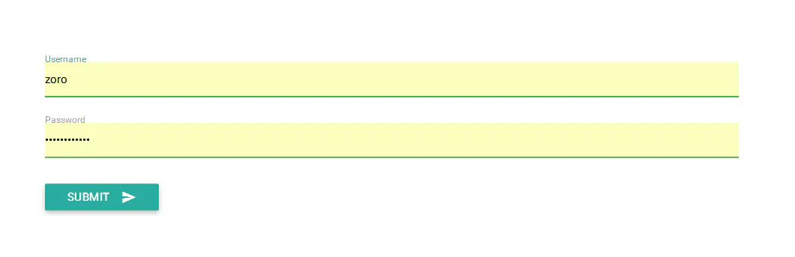
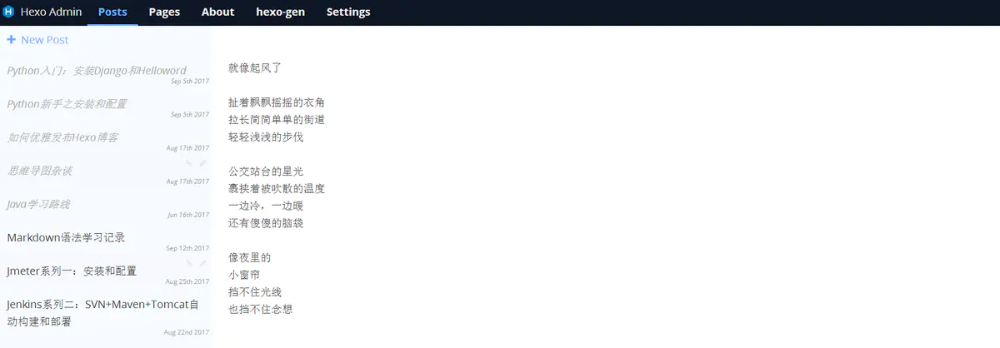

# 如何优雅地发布Hexo博客
> 次优雅的发布hexo博客方式，为什么说是次优雅，因为它是目前我自己所知道的比较优雅的发布方式，可能存在其他更好的方式，欢迎指教~  转载请注明出处：[http://blog.lzoro.com](https://link.jianshu.com?t=http://blog.lzoro.com)，谢谢~

## 前言

就目前而言，我所知道的发布Hexo的博客有如下几种：  1、原始方式，也就是在服务器上编写md文件，然后利用`hexo g`来生成；  2、利用github+hook来管理，[小锅](https://link.jianshu.com?t=http://www.swiftyper.com/)这里有[一篇教程](https://link.jianshu.com?t=http://www.swiftyper.com/2016/04/17/deploy-hexo-with-git-hook/)；  3、其他(hexo-admin or other plugins)；  我所用的这个方式就属于第三种，略微改进版。也许你已经看过\[那么可以概览之后忽略\]，也许你没看过，那么请耐心看完，反正都点进来了，也许有福利呢，who knows...

## 环境说明

格子这里所使用的环境如下：

1、阿里云 Linux 3.10.0-514.6.2.el7.x86_64  
2、NodeJs 6.10.3  
3、Hexo-cli: 1.0.2  
4、Hexo 3.3.7  
5、Hexo-admin   
6、Nginx1.9.9

本篇博客的重点在于Hexo博客的优雅发布，所以其他必需环境的安装大部分会简短带过。如果还未安装过相关环境或者不会安装相关环境的请自行百度，网上有特别丰富的教程资料，这里只给出部分链接供参考。

重要说明：格子未直接使用`hexo server`启动hexo服务来对外提供博客的访问，而是通过nginx作为web服务器对外提供服务。

## NodeJs

**下载地址**

http://nodejs.cn/download/

**安装**  请参考[这里](https://link.jianshu.com?t=http://www.cnblogs.com/8765h/p/4777746.html)，注意自己选择的安装包。

## Hexo

**官网**

https://hexo.io/

**安装**  请参考[这里](https://link.jianshu.com?t=http://ibruce.info/2013/11/22/hexo-your-blog/)。需要注意的是，格子这里是将环境搭建在阿里云机器上，并不是通过GitHub托管，毕竟用GitHub的子域名感觉不够高大上，毕竟装(chui)比(niu)要装一整套的。所以我就花重金买了域名，买了云主机，买了oss，这样装备齐全之后，感觉逼格都提高了。

另：安装完博客之后，有很多主题可供挑选，点击[这里](https://link.jianshu.com?t=https://hexo.io/themes/)，找到自己喜欢的主题，并给hexo换上，舒舒服服地来一发吧。

## Hexo-admin

主角登场了，前面也有提到过，管理Hexo博客，我所知道的有几种方式。用手动管理的方式未免显得太过于原始人，即便你用本地的Markdown编辑器洋洋洒洒地写完了一篇博客，还是得屁颠屁颠地连接到服务器，然后将文件上传到博客服务器，再然后谄媚地告诉服务器，乖，帮我执行一下`hexo g`，命令执行完，静态页面生成后一篇博客才叫告一段落。  也许你不嫌麻烦，觉得这样也挺好的，没那么多屁事儿折腾，那么就坚持自己的做法也未尝不可。  但是，如果你跟我一样嫌(tai)麻(lan)烦(le)的话，那么利用Hexo-admin插件，加上自己部分diy，也许一个自己比较满意的Hexo博客发布方式就到手了，岂不是一大爽事。

> 就是这个feel~倍儿爽

反正我就是懒，不要拉我，让我懒。其实有时候这种“懒”往往能促使人进步，如果不嫌麻烦甘于重复劳动，虽然会少掉很多折腾，但也会少掉很多发现和进步。  好了，鸡汤喝完，该说正事儿了。

**hexo-admin官网**  [https://jaredforsyth.com/hexo-admin/](https://link.jianshu.com?t=https://jaredforsyth.com/hexo-admin/)

### step 1

安装必要环境，请参照上面

### step 2

初始化博客，一般到这里你应该是已经初始化自己的博客了，如果还没有的话，请看下面

cd /usr/local/  
hexo init yourblog  
cd yourblog  
npm install

### step 3

安装hexo-admin插件，并且启动hexo服务，打开浏览器访问能看到基本的界面

npm install --save hexo-admin  
hexo server -d  
open http://localhost:4000/admin/

**登录界面**

到这里，没进行配置的小伙伴可能还无法登录，请接着往下看。

### step 4

在hexo的_config.yml配置hexo-admin

admin:  
 username: zoro  
 password_hash:be121740bf988b2225a313fa1f107ca1  
 secret: hey hexo  
 deployCommand: './admin_script/hexo-generate.sh'  
 \# expire: 60*1

`注`  1、password_hash就是密码，通过bcrypt hash，你可以用尽你一切手段对自己的密码做一个bcrypt加密，C/Java/Python都可以，做人嘛，重要的是嗨森；  2、secret用以cookies安全；  3、deployCommand就是一个关键点，不要着急，下面给出说明；

**主页**

- Post：博客文章列表，包括已经发布的和还在草稿箱等待宠幸的；
    
- Pages：就是诸如标签云之类的页面管理；
    
- About：关于admin插件的说明
    
- hexo-gen：这个原来是Deploy，被我修改了，关键节点；
    
- Settings:配置；
    

### step 5

先解释一下上面配置的那个`deployCommand`的用处，目的在于页面上你点击了Deploy页面下面的Deploy按钮的时候，所执行的脚本，这里格子拿它来作为执行`hexo g`的载体。  说到这里，可能有些人不是很理解为什么要这么做，看官莫急，听我细细道来。  其实，当你以`hexo server -d`启动了hexo服务的时候，hexo-admin插件在你修改了 某篇博已发布博客，或者新发布博客的时候，会在后台帮你执行一系列操作，所以这个时候，你可以通过`http://localhost:4000`访问就可以看到刚才发布到博客了，看到这里，有读者应该就要心里问候格子声：那你是不是傻，为什么还要折腾？容我说一句，原因只有一点：以`hexo server`启动的hexo对外提供的服务，并不是特别稳定，访问略慢，毕竟不是专门的web服务容器，而且如果你不以`nohup`方式启动的话，一旦关掉Xshell等操作界面的时候，就会被迫关掉，所以带来了一系列令人不喜的体验，这就是我折腾的唯一原因。  因此，其实格子是以Nginx为web服务容器对外提供博客服务，每次将新博客生成静态Html放到Nginx配置的目录下，速度不要太快；格子的云主机只有`1G内存 单核CPU`,还是能有不俗的访问体验，所以觉得还算没白折腾。  有点走题，话说回来，大体的步骤是这样：  1、Nginx提供web服务  2、hexo-admin提供博客管理  3、利用hexo-admin在浏览器实现博客编写，或者自己本地md编辑器写好之后粘贴到hexo-admin，后者可能更为保险，防止丢失。  4、利用hexo-admin留下来的deploy按钮，去执行我们放在博客服务器上的脚本，来生成html页面；

所以，**重点**来了，在_config.yml里面填写好deployCommand的存储路径之后，在该路径下生成脚本；

touch hexo-generate.sh;  
vim hexo-generate.sh;

输入以下内容

#!/usr/bin/env sh  
hexo g

保存退出，并赋予执行权限

执行Shift+:，输入q，如下  
:q  
chmod +x hexo-generate.sh

### step 6

验证效果，这里我没有贴出Nginx的配置，稍等给出，可以先行验证是否有效果  1、启动hexo server  2、访问`http://localhost:4000/admin`并登陆  3、进入Posts页面，新建博客并编写发布；  4、进入Deploy页面（如果你还没改掉改名称的话），点击下面的Deploy按钮  5、进入博客目录->public，查看相应的html是否有生成，如果有，那么恭喜你成功了。

这里有两个问题：  ①、hexo-admin的作者将hexo-admin的服务依赖于hexo来运行\[`hexo s`\]，个人觉得有点浪费资源，但有碍于没时间，只好暂时将就这样。有兴趣的人，可以去阅读源码，然后将hexo-admin处理成独立的服务。  ②、Deploy页面的功能其实被我们diy成`hexo generate`的执行者了，所以有强迫症的小伙伴可以将页面内容改成具体含义的，比如格子改成了`hexo-gen`，修改路径在hexo目录下，`node_modules/hexo-admin/www/bundle.js`；  差不多就是这样，突然觉得有点没头没尾，因为没有讲Nginx部分，下面给出，这样大家应该不会觉得特别乱；

## Nginx

**下载**  [http://nginx.org/en/download.html](https://link.jianshu.com?t=http://nginx.org/en/download.html)  **安装**  请搜索网上安装教程，特别多，这里不做重复劳动了。如果有什么问题可以留言指出。  **配置**

 server {  
 listen 80;  
 #域名，多个用空格隔开  
 server_name lzoro.com blog.lzoro.com;  
 #配置hexo博客目录  
 root /usr/local/hexo/public;  
 location / {  
 index  index.html index.htm;  
 }  
 access_log /tmp/logs/nginx/hexo.access.log;  
 }

启动nginx，访问自己的域名[http://blog.lzoro.com](https://link.jianshu.com?t=http://blog.lzoro.com)，如果没出问题的情况下，会出现自己的[博客](https://link.jianshu.com?t=http://blog.lzoro.com)，然后可以看到各篇博客的情况。

## 小结

发布Hexo博客的方式有好几种，每个人的喜好不一样，所以也无关优劣。  格子这里带来的方式是利用Nginx作为web容器，利用Hexo-admin作为web后台管理来管理hexo博客，然后通过hexo-admin留下来的脚本执行按钮执行`hexo g`生成博客静态页面，相当于，你只需要一个浏览器，无需远程连接博客服务器，就可以轻松发布自己的博客了。  如果文章对你帮助，无妨留个言让格子知道呗。

作者：格子Lin  链接：[https://www.jianshu.com/p/68e727dda16d](https://www.jianshu.com/p/68e727dda16d)  来源：简书  著作权归作者所有。商业转载请联系作者获得授权，非商业转载请注明出处。