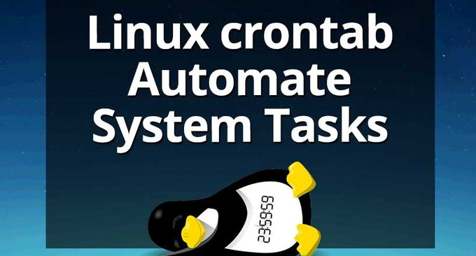
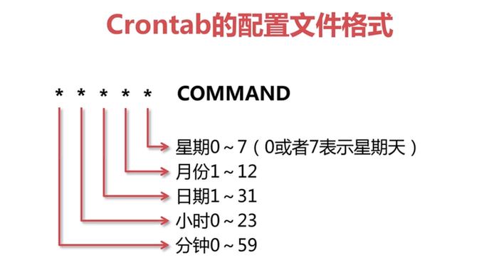

# Linux Crontab命令定时任务基本语法与操作教程-VPS 服务器自动化
Crontab是一个Unix/Linux系统下的常用的定时执行工具，可以在无需人工干预的情况下运行指定作业。很多时候我们都要用到Crontab命令，例如在[Let’s Encrypt Wildcard 免费泛域名SSL证书](https://wzfou.com/lets-encrypt-wildcard-ssl/)中提到了acme.sh 脚本就是利用了Crontab定时任务的形式来更新SSL证书。

通过crontab命令，我们可以在固定的间隔时间执行指定的系统指令或 shell script脚本，在[Linux VPS挂载Google Drive和Dropbox](https://wzfou.com/linux-vps-drive/)中就可以用Crontab命令实现定时同步备份，用Crontab实现每天定时重启VPS、服务器或者是Nginx、PHP、MysqL服务等。

总之，掌握基本的Crontab命令语法对于我们管理自己的[VPS主机](https://wzfou.com/vps/)是非常有必要的，本篇文章通过实例来讲解如何使用[Linux Crontab](https://wzfou.com/tag/linux-crontab/)命令，不作深入的探究，主要是方便日后的快速查询与参考。

[](https://wzfou.com/wp-content/uploads/2018/03/crontab_00.jpg)

更多的关于[VPS主机](https://wzfou.com/vps/)有关的命令使用方法与应用，可以看看：

1. [Linux系统监控命令整理汇总-掌握CPU,内存,磁盘IO等找出性能瓶颈](https://wzfou.com/linux-jiankong/)
2. [三个命令工具Rsync,SCP,Tar-快速解决VPS远程网站搬家与数据同步](https://wzfou.com/rsync-scp-tar/)
3. [Linux共享文件夹目录三种方法-NFS远程挂载,GlusterFS共享存储和samba共享目录](https://wzfou.com/nfs-glusterfs-samba/)

## 一、Crontab查看编辑重启

1、查看crontab定时执行任务列表

```
crontab -l
```

2、编辑crontab定时执行任务

```
crontab -e
```

3、删除crontab定时任务

crontab -r

4、相关命令：

```
sudo service crond start     #启动服务
sudo service crond stop      #关闭服务
sudo service crond restart   #重启服务
sudo service crond reload    #重新载入配置
sudo service crond status    #查看服务状态
```

## 二、Crontab基本格式语法

crontab 的时间表达式：

```
基本格式 :
*　　*　　*　　*　　*　　command
分　时　日　月　周　命令

```

先来看一个例子。每天凌晨1:00执行备份程序：`0 1 * * * /root/wzfou.com/backup.sh` 。其中`/root/wzfou.com/backup.sh` 这是脚本路径，要使用绝对路径，前面的日期格式请直接看下图就知道了。

[](https://wzfou.com/wp-content/uploads/2018/03/crontab_01.gif)

[crontab](https://wzfou.com/tag/crontab/)还有操作符，用来实现一些复杂的时间设定需要。操作符有：

> **1、*** 取值范围内的所有数字 ，代表所有。
> 
> **2、/** 每过多少个数字 ，代表每隔n长时间。
> 
> **3、-** 从X到Z ，代表一段时间范围。
> 
> **4、，**散列数字，代表分割开多个值。

**PS：2018年4月15日更新，**感谢好友[云落](https://wzfou.com/crontab/#comment-5954)提醒，如果还有搞不懂代码公式的，可以使用这个在线Cron表达式生成器：http://cron.qqe2.com/

## 三、20个经典Crontab应用实例

以脚本`/root/wzfou.com/backup.sh` 为演示，大家在使用时记得替换为自己的脚本路径。感谢[bukai.men](https://wzfou.com/crontab/#comment-6017)提醒，请在相应的脚本第一行加上`#!/bin/bash`，否则脚本在定时任务中无法执行。

[](https://wzfou.com/wp-content/uploads/2018/03/crontab_03.jpg)

**实例1：**每1分钟执行一次

\* \* \* \* \* `/root/wzfou.com/backup.sh`

**实例2：**每小时的第3和第15分钟执行一次

3,15 * * * * `/root/wzfou.com/backup.sh`

**实例3：**每天的8点到11点的第3和第15分钟执行一次

3,15 8-11 * * * `/root/wzfou.com/backup.sh`

**实例4：**每隔两天的上午8点到11点的第3和第15分钟执行一次

3,15 8-11 */2  *  * `/root/wzfou.com/backup.sh`

**实例5：**每周一上午8点到11点的第3和第15分钟执行一次

3,15 8-11 * * 1 /root/wzfou.com/backup.sh

**实例6：**每晚的21:30执行一次

30 21 * * * `/root/wzfou.com/backup.sh`

**实例7：**每月1、10、22日的4 : 45执行一次

45 4 1,10,22 * * `/root/wzfou.com/backup.sh`

**实例8：**每周六、周日的1 : 10执行一次

10 1 * * 6,0 `/root/wzfou.com/backup.sh`

**实例9：**每天18 : 00至23 : 00之间每隔30分钟执行一次

0,30 18-23 * * * `/root/wzfou.com/backup.sh`

**实例10：**每星期六的晚上23: 00 pm执行一次

0 23 * * 6 `/root/wzfou.com/backup.sh`

**实例11：**每一小时执行一次

\* */1 * * * `/root/wzfou.com/backup.sh`

**实例12：**每天晚上23点到第二天7点之间，每隔一小时执行一次

\* 23-7/1 * * * /root/wzfou.com/backup.sh

**实例13：** 每个星期的第一天执行一次（即每个星期天晚上24：00开始执行）.

@weekly /root/wzfou.com/backup.sh

**实例14：**每个月的15日执行一次.

0 11 15 * * /root/wzfou.com/backup.sh

**实例15：**每个月的第一天执行一次（即每个月的1日凌晨0点开始执行）.

@monthly /root/wzfou.com/backup.sh

**实例16：** 在指定的月份执行一次（在1月,4月和 6月每天晚上0点执行一次）.

0 0 * jan,apr,jun * /root/wzfou.com/backup.sh

**实例17：** 重启后执行一次.

@reboot /root/wzfou.com/backup.sh

**实例18：**定时任务执行后发一封邮件通知.

MAILTO="raj"
1 1 * * * /root/wzfou.com/backup.sh

**实例19：**指定shell （默认的是/bin/bash）

SHELL=/bin/sh
1 1 * * * /root/wzfou.com/backup.sh

**实例20：**指定环境变量.

PATH=/sbin:/bin:/usr/sbin:/usr/bin 
1 1 * * * /root/wzfou.com/backup.sh

## 四、Crontab可能存在的问题

### 4.1  Crontab不立即生效

大家新建的Crontab定时任务保存后需要等待2分钟后才会执行，当然如果想要立即执行可以重启Crontab。当crontab失效时，可以尝试/etc/init.d/crond restart解决问题，或者查看日志看某个任务有没有执行/报错tail -f /var/log/cron。

### 4.2  Crontab不执行

脚本中涉及文件路径时写全局路径，更新系统时间时区后需要重启cron。当手动执行脚本OK，但是crontab死活不执行时很有可能是环境变量，可尝试在crontab中直接引入环境变量解决问题，例如：

0 * * * * . /etc/profile;/bin/sh `/root/wzfou.com/backup.sh`

### 4.3  Crontab无权限执行

要注意系统级任务调度与用户级任务调度。只有 root 用户和 **crontab** 文件的所有者可以在 **-e** 、**-l**、**-r** 和 **-v** 标志后面使用 *UserName* 以编辑、列出、除去或验证指定用户的 **crontab** 文件。

root用户的任务调度操作可以通过”crontab –uroot –e”来设置，也可以将调度任务直接写入/etc/crontab文件。

想编辑别的用户的 crontab, 使用root运行下面的命令，同一个格式 (追加 “-u *username*” 到命令后) 也可以用来列出或删除 crontabs。

 crontab -u *username* -e

### 4.4  Crontab执行后通知

当[Crontab定时任务](https://wzfou.com/tag/crontab-dingshi/)在你所指定的时间执行后，系统会寄一封信给你，显示该程序执行的内容，可以在日志中**/var/log/cron**看到。若是你不希望收到这样的通知，请在每一行空一格之后加上` > /dev/null 2>&1 `即可。