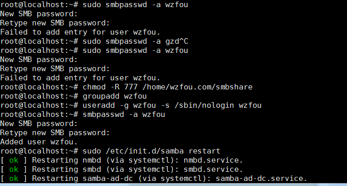
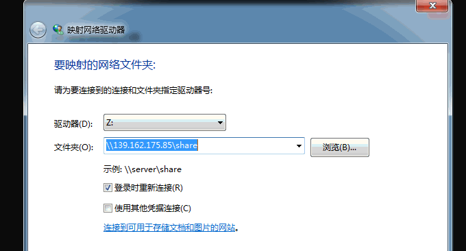

# Linux共享文件夹目录三种方法-NFS远程挂载,GlusterFS共享存储和samba共享目录
因为喜欢寻找[便宜VPS](https://wzfou.com/tag/pianyi-vps/)和要经常更换服务器的问题，所以网站搬家就成了家常便饭的事情了。对于大型的网站数据，最好直接在机房与机房之间进行数据传递，常用的[三个命令工具Rsync,SCP,Tar](https://wzfou.com/rsync-scp-tar/)，可以帮助我们快速解决VPS远程网站搬家与数据同步。

不过，多亏[小Z博客](https://wzfou.com/rsync-scp-tar/#comment-2313)提醒，我们除了使用命令工具来实现数据传输，还可以使用硬盘挂载的方式来解决数据迁移的问题。利用NFS，即网络文件系统（Network File System）分布式文件系统协议，我们可以将不同的VPS主机的目录实现远程挂载，这样拷贝复制文件就方便多了。

[GlusterFS](https://wzfou.com/tag/glusterfs/)是Scale-Out存储解决方案Gluster的核心，它是一个开源的分布式文件系统，具有强大的横向扩展能力，通过扩展能够支持数PB存储容量和处理数千客户端。GlusterFS一般用作企业级的文件存储方案，但是我们也可以利用GlusterFS在不同的VPS主机之间共享存储。

最后一个就是[samba](https://wzfou.com/tag/samba/)了。SAMBA 最初发展的主要目就是要用来沟通Windows 与 Unix Like 这两个不同的操作平台之间的共享，Samba配置简单，操作直观。NFS远程挂载、GlusterFS共享存储和samba共享服务器还可以用于文件协作、服务器镜像等，总之可扩展性非常强。

[](https://wzfou.com/wp-content/uploads/2017/10/Linux-nfs_00.jpg)

本文就来简单地分享一下[NFS远程挂载](https://wzfou.com/tag/nfs-guazai/)、GlusterFS共享存储和samba共享服务器操作方法，更多的关于[云存储](https://wzfou.com/wangpan-cunchu/)和[站长工具](https://wzfou.com/tag/zhanzhang-gongju/)，还可以了解：

1. [Nextcloud个人云存储绝佳选择：一键自动安装方法和云盘使用体验](https://wzfou.com/nextcloud/)
2. [Lsyncd搭建同步镜像-用Lsyncd实现本地和远程服务器之间实时同步](https://wzfou.com/lsyncd/)
3. [Linux VPS挂载Google Drive和Dropbox-实现VPS主机数据同步备份](https://wzfou.com/linux-vps-drive/)

## 一、NFS远程挂载

演示环境，服务端A：172.104.184.98，客户端B：107.161.18.176，如果你没有VPS，可以看看我自己用过的VPS主机榜单：[VPS主机排行榜单](https://wzfou.com/vps-bangdan/)。

相关的命令操作如下：

```

#在两台VPS上安装执行安装
sudo apt-get install -y  nfs-kernel-server
#在A上创建文件夹
mkdir -p /media/wzfou/asus
#在A上编辑并添加授权B读写
vim /etc/exports
/media/wzfou/asus 107.161.18.176(rw,no_root_squash,async)
#在A上重启
sudo systemctl restart nfs-server.service

#在B上创建文件夹
sudo mkdir -p /home/wzfou/share
#在B上将刚刚创建的文件夹挂载到A上共享文件夹
sudo mount -t nfs 172.104.184.98:/media/wzfou/asus /home/wzfou/share

```

如果没有任何提示，就表示挂载成功了。

[](https://wzfou.com/wp-content/uploads/2017/10/Linux-nfs_01.gif)

现在A和B上共享文件就已经实现挂载并实时同步了，往共享文件夹上传或者删除文件就可以看到双向同步了。

[](https://wzfou.com/wp-content/uploads/2017/10/Linux-nfs_02.gif)

## 二、GlusterFS共享存储

### 2.1  GlusterFS Repository

**Debian:**

sudo apt-get install -y lsb-release
sudo apt-get install -y apt-transport-https

Add the public key for GlusterFS repository.

wget -O - http://download.gluster.org/pub/gluster/glusterfs/LATEST/rsa.pub | sudo apt-key add -
echo deb https://download.gluster.org/pub/gluster/glusterfs/LATEST/Debian/$(lsb\_release -sc)/apt $(lsb\_release -sc) main | sudo tee /etc/apt/sources.list.d/gluster.list

**Ubuntu 16.04 / 14.04:**

sudo apt-get install -y software-properties-common
sudo add-apt-repository ppa:gluster/glusterfs-3.8

### 2.2  安装 GlusterFS

更新 repository cache.

sudo apt-get update

安装 GlusterFS package.

sudo apt-get install -y glusterfs-server

启动glusterfs-server service .

sudo service glusterfs-server start

确认 glusterfs service 是否运行.

sudo service glusterfs-server status

[](https://wzfou.com/wp-content/uploads/2017/10/Linux-nfs_04.gif)

**以下命令在服务端执行**，添加客户端节点（107.161.18.176）.

raj@gluster1:~$ sudo gluster peer probe 107.161.18.176
peer probe: success.

确认状态.

sudo gluster peer status

列出节点.

sudo gluster pool list

配置 Firewall。禁用防火墙或者将客户端的IP添加到允许范围内.

sudo iptables -I INPUT -p all -s <ip-address> -j ACCEPT

安装成功如下:

[](https://wzfou.com/wp-content/uploads/2017/10/Linux-nfs_05.gif)

### 2.3  创建共享存储卷

现在我们就需要创建好了共享存储卷，首先是在服务端上进行如下操作：

```

#创建文件夹
sudo mkdir -p /data/gluster/gvol0
#创建共享卷volume，并分别挂载服务端（139.162.175.85）和客户端（107.161.18.176）
sudo gluster volume create gvol0 replica 2 139.162.175.85:/data/gluster/gvol0 107.161.18.176:/data/gluster/gvol0 force
#启用卷
sudo gluster volume start gvol0
#查看卷
sudo gluster volume info gvol0

```

现在到客户端（107.161.18.176）挂载服务端（139.162.175.85），命令如下：

```

#安装客户端
apt-get install -y glusterfs-client
#创建文件夹
mkdir -p /mnt/glusterfs
#挂载服务端（139.162.175.85）
mount -t glusterfs 139.162.175.85:/gvol0 /mnt/glusterfs

#开机自动挂载
vim  /etc/fstab
139.162.175.85:/gvol0 /mnt/glusterfs glusterfs  defaults,_netdev 0 0

```

执行命令：`df -hP /mnt/glusterfs`，你就可以看到挂载成功了。

[](https://wzfou.com/wp-content/uploads/2017/10/Linux-nfs_07.gif)

使用df命令也能看出来。

[](https://wzfou.com/wp-content/uploads/2017/10/Linux-nfs_08.gif)

现在你就可以实现不同的VPS主机共享存储了，新增或者修改文件都可以看到同步。

[](https://wzfou.com/wp-content/uploads/2017/10/Linux-nfs_09.gif)

## 三、samba实现Linux与Windows共享

上面说到了两种共享方法适用于Linux之间，那么Windows与Linux如何共享呢？目前比较流行的方式就是通过一个跨平台网络文件共享协议：SMB/CIFS。Windows原生的支持SMB/CIFS，Linux也通过开源的软件Samba实现了SMB/CIFS协议。

### 3.1  安装samba

```
sudo apt-get install samba
```

### 3.2  创建共享目录

```
// 创建的目录即之后能够在Windows主机上直接访问的目录。
// 例如：在用户wzfou的主目录下新建share文件夹为共享目录
mkdir /home/wzfou/smbshare
// 由于Windows下的文件夹需可读可写可执行，需更改权限为777
sudo chmod 777 /home/wzfou/smbshare
```

### 3.3  修改samba配置文件

```
// 修改 /etc/samba/smb.conf
sudo vim /etc/samba/smb.conf
// 在smb.conf文件最后加上以下内容
```

> \[share\]  
> path = /home/wzfou/smbshare  
> public = yes  
> writable = yes  
> valid users = wzfou  
> create mask = 0644  
> force create mode = 0644  
> directory mask = 0755  
> force directory mode = 0755  
> available = yes

**关于smb.conf说明如下：**

(1) \[share\]表示共享文件夹的别名，之后将直接使用这个别名。

(2) `force create mode` 与 `force directory mode`的设置是因为Windows下与Linux下文件和文件夹的默认权限不同造成的，Windows下新建的文件是可执行的，必须强制设定其文件权限。

(3) valid users 设置为你当前的Linux用户名，例如我的是wzfou，因为第一次打开共享文件夹时，需要验证权限。

### 3.4  设置登录密码

```
// 新建/etc/samba/smbpasswd文件
sudo touch /etc/samba/smbpasswd
// 根据3.3设置的valid users，设置用户密码
// wzfou 替换为你在3.3中设置的用户名
sudo smbpasswd -a wzfou
//输入两次密码后，会提示 Added user wzfou. 表示设置成功
// 若用户名非当前登录系统的用户名，可能会提示Failed
```

[](https://wzfou.com/wp-content/uploads/2017/10/Linux-nfs_10.gif)

### 3.5  启动samba服务器

```
sudo /etc/init.d/samba restart
```

### 3.6  测试是否共享成功

```
sudo apt-get install smbclient 
smbclient -L //xx.xx.xx.xx/share
//还记得吗？share为3.3中设置的共享文件夹的别名
//如果共享成功，将要求输入之前设置的密码
```

  
[](https://wzfou.com/wp-content/uploads/2017/10/Linux-nfs_11.gif)

### 3.7 在windows和Linux上使用samba

Windows 资源管理器->映射网络驱动器。输入格式是： \\\ip地址\\配置的名称，然后输入账号密码就连接成功。

[](https://wzfou.com/wp-content/uploads/2017/10/Linux-nfs_12.gif)

如果是Windows 7可能出现无法连接Samba的情况，你可以采取以下方法解决：

> 1、修改本地安全策略：运行secpol.msc打开“本地安全策略”窗体，依次点开“本地策略”-》“安全选项”，修改“网络安全: LAN 管理器身份验证级别”的值为“发送 LM 和 NTLM – 如果已协商，则使用NTLMv2 会话安全”，一路确定即可。
> 
> 2、修改注册表：修改HKEY\_LOCAL\_MACHINE\\SYSTEM\\CurrentControlSet\\Control\\Lsa下的LmCompatibilityLevel的值为1。

[](https://wzfou.com/wp-content/uploads/2017/10/Linux-nfs_14.gif)

Linux的话，在Thunar中通过 `smb://<samba-server-IP-address>/share` 这个地址来访问。

[](https://wzfou.com/wp-content/uploads/2017/10/Linux-nfs_13.gif)

## 四、总结

Linux共享文件夹方法中，NFS远程挂载方法是最方便的，特别适合在不同的VPS主机服务器之间迁移网站数据，一旦远程挂载成功了我们就可以像本地复制数据一样方便了，这个比[三个命令工具Rsync,SCP,Tar-快速解决VPS远程网站搬家与数据同步](https://wzfou.com/rsync-scp-tar/)还要便捷。

GlusterFS创建共享卷的方法特别适合集群服务器，GlusterFS集群文件系统还可以应用到企业级的Docker分布式存储中。samba则实现了Linux与Windows之间的文件共享，之前我们分享了[树莓派Raspberry Pi安装NextCloud教程-自建家庭私有云局域网共享](https://wzfou.com/raspberry-nextcloud/)，实际上我们也可以samba实现树莓派与其它设备共享。