# Linux系统监控命令整理汇总-掌握CPU,内存,磁盘IO等找出性能瓶颈
不知道是不是之前用了配置高的VPS主机，还是新搬进的[阿里云香港VPS](https://wzfou.com/tag/aliyun-guoji-hk/)主机的性能有问题，总之，每到晚上挖站否的主机就出现了不稳定的情况，系统负载忽高忽低。利用[服务器日志分析利器:ngxtop和GoAccess](https://wzfou.com/ngxtop-goaccess/)也能查出有一些IP一直在不断地扫描服务器端口还有WP后台。

但是，最让人不解的是，我自己在进入WP后台后然后用浏览器同时打开十几个页面，用Top命令实时跟踪VPS系统负载，发现负载呈直线上升，由原来的零点几直接上升到3以上。接着，就会发现网站访问变慢和响应延迟了。这简直让我怀疑是不是买了个假的阿里云的VPS主机。

如果你也有遇到像我一样的问题，可以尝试着按照本文介绍的Linux系统监控命令来对自己的VPS主机的CPU、内存、磁盘IO、网卡流量、系统进程、端口占用等作一个全面的“体验”。VPS主机还是真是一分钱一分货，便宜的VPS主机真的不适合跑Wordpress等动态程序。

更多的关于Linux VPS[实用工具](https://wzfou.com/shiyong-gongju/)，你还可以试试：

1. [Linux VPS挂载Google Drive和Dropbox-实现VPS主机数据同步备份](https://wzfou.com/linux-vps-drive/)
2. [三大免费工具助你检测VPS服务器真伪-VPS主机性能速度测试方法](https://wzfou.com/vps-ceping-gongju/)
3. [WordPress评论微信通知和邮件提醒-Server酱和第三方SMTP发信](https://wzfou.com/wp-weixin-mail/)

**本文分为两大块：**如果你已经知晓如果使用某一个监控命令，可以直接在[Linux系统监控命令速查手册](https://wzfou.com/linux-jiankong/#Linux)中快速查找，表格右上角有搜索框，你可以输入快速查找自己想的功能或者命令。如对某一个命令不熟悉，你可以使用Chrome浏览器的网页查看功能快速键：ctrl+f，输入命令直接跳到详情部分。

**PS：2018年4月14日更新，**Linux 还有一个非常有用的命令Crontab，用来定时执行任务，参考：[Linux Crontab命令定时任务基本语法与操作教程-VPS/服务器自动化](https://wzfou.com/crontab/)。

## 零、Linux系统监控命令速查手册

搜索:

| 命令 | 功能作用 | 用法举例 |
| --- | --- | --- |
| free | 查看内存使用情况，包括物理内存和虚拟内存 | free -h或free -m |
| vmstat | 对系统的整体情况进行统计，包括内核进程、虚拟内存、磁盘、陷阱和 CPU 活动的统计信息 | vmstat 2 100 |
| top | 实时显示系统中各个进程的资源占用状况及总体状况 | top |
| mpstat | 实时系统监控工具，它会报告与CPU相关的统计信息 | mpstat |
| sar | 收集、报告和保存CPU、内存、输入输出端口使用情况 | sar -n DEV 3 100 |
| netstat | 检验本机各端口的网络连接情况，用于显示与IP、TCP、UDP和ICMP协议相关的统计数据 | netstat -a |
| tcpdump | 用于捕捉或者过滤网络上指定接口上接收或者传输的TCP/IP包 | tcpdump -i eth0 -c 3 |
| IPTraf | 用来生成包括TCP信息、UDP计数、ICMP和OSPF信息、以太网负载信息、节点状态信息、IP校验和错误等等统计数据 | iptraf |
| df | 检查linux的文件系统的磁盘空间占用情况 | df -h |
| iostat | 收集显示系统存储设备输入和输出状态统计 | iostat -x -k 2 100 |
| iotop | 用来监视磁盘I/O使用状况的top类工具 | iotop |
| lsof | 用于以列表的形式显示所有打开的文件和进程 | lsof |
| atop | 显示的是各种系统资源（CPU, memory, network, I/O, kernel）的综合，并且在高负载的情况下进行了彩色标注 | atop |
| htop | 它和top命令十分相似，高级的交互式的实时linux进程监控工具 | htop |
| ps | 最基本同时也是非常强大的进程查看命令 | ps aux |
| glances | 监视 CPU，平均负载，内存，网络流量，磁盘 I/O，其他处理器 和 文件系统 空间的利用情况 | glances |
| dstat | 全能系统信息统计工具，可用于替换vmstat、iostat、netstat、nfsstat和ifstat这些命令的工具 | dstat |
| uptime | 用于查看服务器运行了多长时间以及有多少个用户登录，快速获知服务器的负荷情况 | uptime |
| dmesg | 主要用来显示内核信息。使用dmesg可以有效诊断机器硬件故障或者添加硬件出现的问题。 | dmesg |
| mpstat | 用于报告多路CPU主机的每颗CPU活动情况，以及整个主机的CPU情况。 | mpstat 2 3 |
| nmon | 监控CPU、内存、I/O、文件系统及网络资源。对于内存的使用，它可以实时的显示 总/剩余内存、交换空间等信息。 | nmon |
| mytop | 用于监控 mysql 的线程和性能。它能让你实时查看数据库以及正在处理哪些查询。 | mytop |
| iftop | 用来监控网卡的实时流量（可以指定网段）、反向解析IP、显示端口信息等 | iftop |
| jnettop | 以相同的方式来监测网络流量但比 iftop 更形象。它还支持自定义的文本输出，并能以友好的交互方式来深度分析日志。 | jnettop |
| ngrep | 网络层的 grep。它使用 pcap ，允许通过指定扩展正则表达式或十六进制表达式来匹配数据包。 | ngrep |
| nmap | 可以扫描你服务器开放的端口并且可以检测正在使用哪个操作系统 | nmap |
| du | 查看Linux系统中某目录的大小 | du -sh 目录名 |
| fdisk | 查看硬盘及分区信息 | fdisk -l |

## 一、内存监控

### 1.1  free命令

`free`可以用来快速查看VPS主机的内存使用情况，包括了物理内存和虚拟内存。后面可以加上参数：-h和-m，否则默认会以kb为单位显示。运行命令结果如下：

[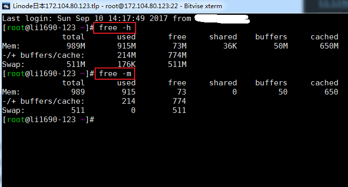](https://wzfou.com/wp-content/uploads/2017/09/linux-jiankong_01.gif)

相关参数说明：

> **total：**物理内存大小，就是机器实际的内存
> 
> **used：**已使用的内存大小，这个值包括了 cached 和 应用程序实际使用的内存
> 
> **free：**未被使用的内存大小
> 
> **shared：**共享内存大小，是进程间通信的一种方式
> 
> **buffers：**被缓冲区占用的内存大小
> 
> **cached：**被缓存占用的内存大小

### 1.2  vmstat命令

`vmstat`（Virtual Meomory Statistics，虚拟内存统计）是对系统的整体情况进行统计，包括内核进程、虚拟内存、磁盘、陷阱和 CPU 活动的统计信息。命令格式：`vmstat 2 100`，其中2表示刷新间隔，100表示输出次数。运行命令结果如下：

[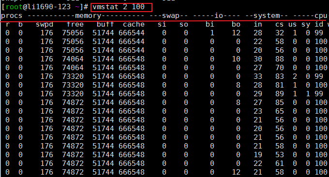](https://wzfou.com/wp-content/uploads/2017/09/linux-jiankong_02.gif)

相关参数说明：

> **1 procs**
> 
> 1. **r列**表示运行和等待CPU时间片的进程数，这个值如果长期大于系统CPU个数，就说明CPU资源不足，可以考虑增加CPU；
> 2. **b列**表示在等待资源的进程数，比如正在等待I/O或者内存交换等。
> 
> **2 memory**
> 
> 1. **swpd列**表示切换到内存交换区的内存数量（以KB为单位）。如果swpd的值不为0或者比较大，而且si、so的值长期为0，那么这种情况一般不用担心，不会影响系统性能；
> 2. **free列**表示当前空闲的物理内存数量（以KB为单位）；
> 3. **buff列**表示buffers cache的内存数量，一般对块设备的读写才需要缓冲；
> 4. **cache列**表示page cached的内存数量，一般作文件系统的cached，频繁访问的文件都会被cached。如果cached值较大，就说明cached文件数较多。如果此时IO中的bi比较小，就说明文件系统效率比较好。
> 
> **3 swap**
> 
> 1. **si列**表示由磁盘调入内存，也就是内存进入内存交换区的数量；
> 2. **so列**表示由内存调入磁盘，也就是内存交换区进入内存的数量
> 3. 一般情况下，si、so的值都为0，如果si、so的值长期不为0，则表示系统内存不足，需要考虑是否增加系统内存。
> 
> **4 IO**
> 
> 1. **bi列**表示从块设备读入的数据总量（即读磁盘，单位KB/秒）
> 2. **bo列**表示写入到块设备的数据总量（即写磁盘，单位KB/秒）  
>     这里设置的bi+bo参考值为1000，如果超过1000，而且wa值比较大，则表示系统磁盘IO性能瓶颈。
> 
> **5 system**
> 
> 1. **in列**表示在某一时间间隔中观察到的每秒设备中断数；
> 2. **cs列**表示每秒产生的上下文切换次数。  
>     上面这两个值越大，会看到内核消耗的CPU时间就越多。
> 
> **6 CPU**
> 
> 1. **us列**显示了用户进程消耗CPU的时间百分比。us的值比较高时，说明用户进程消耗的CPU时间多，如果长期大于50%，需要考虑优化程序啥的。
> 2. **sy列**显示了内核进程消耗CPU的时间百分比。sy的值比较高时，说明内核消耗的CPU时间多；如果us+sy超过80%，就说明CPU的资源存在不足。
> 3. **id列**显示了CPU处在空闲状态的时间百分比；
> 4. **wa列**表示IO等待所占的CPU时间百分比。wa值越高，说明IO等待越严重。如果wa值超过20%，说明IO等待严重。
> 5. **st列**一般不关注，虚拟机占用的时间百分比。

## 二、CPU监控

### 2.1  TOP命令

top命令是Linux下常用的性能分析工具，能够实时显示系统中各个进程的资源占用状况及总体状况。运行结果如下：

[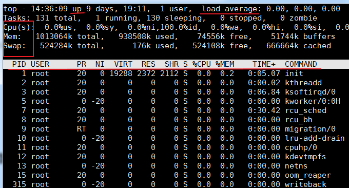](https://wzfou.com/wp-content/uploads/2017/09/linux-jiankong_03.gif)

相关的参数说明：

> **第一行：**
> 
> 1. **14:36:09**： 这是wzfou.com测试时系统时间
> 2. **up xxx days, 11:13**：系统运行时间，系统已经运行了xx天11小时13分钟了。
> 3. **2 users**：当前登录用户数
> 4. **load average**：系统负载，即任务队列的平均长度。三个数值分别为最近1分钟、最近5分钟、最近15分钟的平均负载 —— 超过N（CPU核数）说明系统满负荷运行。也可以通过`$w`或`$uptime`命令查看load average。
> 
> **第二行：**
> 
> 1. 显示进程总数、正在运行的进程数、休眠的进程数、停止的进程数、僵尸进程数
> 
> **第三行：**
> 
> 1. **%us**：用户进程消耗的CPU百分比
> 2. **%sy**：内核进程消耗的CPU百分比
> 3. **%ni**：改变过优先级的进程占用CPU的百分比
> 4. **%id**：空闲CPU的百分比
> 5. **%wa**：IO等待消耗的CPU百分比

### 2.2  mpstat命令

**mpstat（Multiprocessor Statistics，多处理器统计）**是实时系统监控工具，它会报告与CPU相关的统计信息，这些信息存放在/proc/stat文件中。格式：`mpstat -P ALL 2 `\# ALL表示显示所有CPUs，也可以指定某个CPU；2表示刷新间隔。

命令效果如下：

[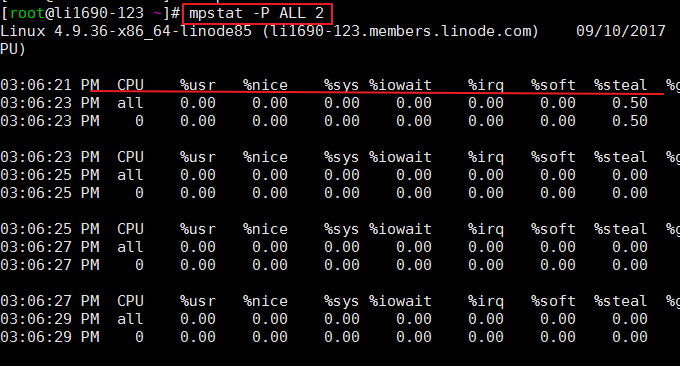](https://wzfou.com/wp-content/uploads/2017/09/linux-jiankong_05.gif)

## 三、网络监控

### 3.1  sar命令

SAR是一个在Unix和Linux操作系统中用来收集、报告和保存**CPU**、**内存**、**输入输出端口**使用情况的命令。SAR命令可以动态产生报告，也可以把报告保存在日志文件中。命令格式：`sar -n DEV 3 100`。效果如下：

[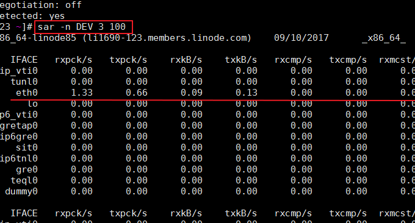](https://wzfou.com/wp-content/uploads/2017/09/linux-jiankong_07.gif)

相关参数说明如下：

> IFACE：网络设备的名称
> 
> rxpck/s：每秒钟接收到的包数目
> 
> txpck/s：每秒钟发送出去的包数目
> 
> rxkB/s：每秒钟接收到的字节数
> 
> txkB/s：每秒钟发送出去的字节数

### 3.2  netstat

`netstat`命令一般用于检验本机各端口的网络连接情况，用于显示与IP、TCP、UDP和ICMP协议相关的统计数据。

选取部分选项说明如下：

-a, --all, --listening     显示所有连接中的Socket。  
-n, --numeric              以数字形式显示地址和端口号。  
-t, -–tcp                  显示TCP传输协议的连线状况。  
-u, -–udp                  显示UDP传输协议的连线状况。  
-p, --programs             显示正在使用socket的程序名/进程ID  
-l, --listening            显示监控中的服务器的Socket。  
-o, --timers               显示计时器。  
-s, --statistics           显示每个网络协议的统计信息(比如SNMP)  
-i, --interfaces           显示网络界面信息表单（网卡列表）  
-r, --route                显示路由表  

常用的几种：

$ netstat -aup        # 输出所有UDP连接状况  
$ netstat -atp        # 输出所有TCP连接状况  
$ netstat -s          # 显示各个协议的网络统计信息  
$ netstat -i          # 显示网卡列表  
$ netstat -r          # 显示路由表信息  

**netstat在防御攻击时非常有用。**以wzfou.com平常用到的示例如下：

netstat -n -p|grep SYN_REC | wc -l

上面命令可以查找出当前服务器有多少个活动的 SYNC_REC 连接。正常来说这个值很小，最好小于5。 当有Dos攻击或者邮件炸弹的时候，这个值相当的高。另外这个值和系统有很大关系，有的服务器值就很高，也是正常现象。

netstat -n -p | grep SYN_REC | sort -u

上面命令可以列出所有连接过的IP地址。

netstat -n -p | grep SYN_REC | awk '{print $5}' | awk -F: '{print $1}'

上面命令可以列出所有发送SYN_REC连接节点的IP地址。

netstat -ntu | awk '{print $5}' | cut -d: -f1 | sort | uniq -c | sort -n

上面命令可以使用netstat命令计算每个主机连接到本机的连接数。

netstat -anp |grep 'tcp|udp' | awk '{print $5}' | cut -d: -f1 | sort | uniq -c | sort -n

上面命令可以列出所有连接到本机的UDP或者TCP连接的IP数量。

netstat -ntu | grep ESTAB | awk '{print $5}' | cut -d: -f1 | sort | uniq -c | sort -nr

上面命令可以检查 ESTABLISHED 连接并且列出每个IP地址的连接数量。

netstat -plan|grep :80|awk {'print $5'}|cut -d: -f 1|sort|uniq -c|sort -nk 1

上面命令可以列出所有连接到本机80端口的IP地址和其连接数。80端口一般是用来处理HTTP网页请求。

**防御CC攻击还可以用以下方法检测：**

> **查看所有80端口的连接数**
> 
> 1. netstat -nat|grep -i “80”|wc -l
> 
> **对连接的IP按连接数量进行排序**
> 
> 1. netstat -anp | grep ‘tcp\\|udp’ | awk ‘{print $5}’ | cut -d: -f1 | sort | uniq -c | sort -n
> 2. netstat -ntu | awk ‘{print $5}’ | cut -d: -f1 | sort | uniq -c | sort -n
> 3. netstat -ntu | awk ‘{print $5}’ | egrep -o “\[0-9\]{1,3}\\.\[0-9\]{1,3}\\.\[0-9\]{1,3}\\.\[0-9\]{1,3}” | sort | uniq -c | sort -nr
> 
> **查看TCP连接状态**
> 
> 1. netstat -nat |awk ‘{print $6}’|sort|uniq -c|sort -rn
> 2. netstat -n | awk ‘/^tcp/ {print $NF}’|sort|uniq -c|sort -rn
> 3. netstat -n | awk ‘/^tcp/ {++S\[$NF\]};END {for(a in S) print a, S\[a\]}’
> 4. netstat -n | awk ‘/^tcp/ {++state\[$NF\]}; END {for(key in state) print key,”\\t”,state\[key\]}’
> 5. netstat -n | awk ‘/^tcp/ {++arr\[$NF\]};END {for(k in arr) print k,”\\t”,arr\[k\]}’
> 6. netstat -ant | awk ‘{print $NF}’ | grep -v ‘\[a-z\]’ | sort | uniq -c
> 
> **查看80端口连接数最多的20个IP**
> 
> 1. cat /www/web\_logs/wzfou.com\_access.log|awk ‘{print $1}’|sort|uniq -c|sort -nr|head -100
> 2. tail -n 10000 /www/web\_logs/wzfou.com\_access.log|awk ‘{print $1}’|sort|uniq -c|sort -nr|head -100
> 3. cat /www/web\_logs/wzfou.com\_access.log|awk ‘{print $1}’|sort|uniq -c|sort -nr|head -100
> 4. netstat -anlp|grep 80|grep tcp|awk ‘{print $5}’|awk -F: ‘{print $1}’|sort|uniq -c|sort -nr|head -n20
> 5. netstat -ant |awk ‘/:80/{split($5,ip,”:”);++A\[ip\[1\]\]}END{for(i in A) print A,i}’ |sort -rn|head -n20
> 
> **用tcpdump嗅探80端口的访问看看谁最高**
> 
> 1. tcpdump -i eth0 -tnn dst port 80 -c 1000 | awk -F”.” ‘{print $1″.”$2″.”$3″.”$4}’ | sort | uniq -c | sort -nr |head -20
> 
> **查找较多time_wait连接**
> 
> 1. netstat -n|grep TIME_WAIT|awk ‘{print $5}’|sort|uniq -c|sort -rn|head -n20
> 
> **查找较多的SYN连接**
> 
> 1. netstat -an | grep SYN | awk ‘{print $5}’ | awk -F: ‘{print $1}’ | sort | uniq -c | sort -nr | more
> 
> linux下实用iptables封ip段的一些常见命令：
> 
> **封单个IP的命令是：**
> 
> 1. iptables -I INPUT -s 211.1.0.0 -j DROP
> 
> **封IP段的命令是：**
> 
> 1. iptables -I INPUT -s 211.1.0.0/16 -j DROP
> 2. iptables -I INPUT -s 211.2.0.0/16 -j DROP
> 3. iptables -I INPUT -s 211.3.0.0/16 -j DROP
> 
> **封整个段的命令是：**
> 
> 1. iptables -I INPUT -s 211.0.0.0/8 -j DROP
> 
> **封几个段的命令是：**
> 
> 1. iptables -I INPUT -s 61.37.80.0/24 -j DROP
> 2. iptables -I INPUT -s 61.37.81.0/24 -j DROP

### 3.3  tcpdump命令

Tcpdump是最广泛使用的网络包分析器或者包监控程序之一，它用于捕捉或者过滤网络上指定接口上接收或者传输的TCP/IP包。格式：`tcpdump -i eth0 -c 3`

该命令不是系统自带的，可能需要自己搬运安装。命令执行效果如下：

[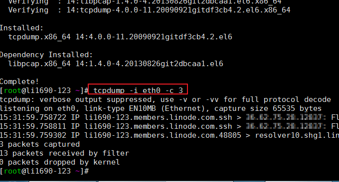](https://wzfou.com/wp-content/uploads/2017/09/linux-jiankong_08.gif)

### 3.4  IPTraf

iptraf是一个基于ncurses的IP局域网监控器，用来生成包括TCP信息、UDP计数、ICMP和OSPF信息、以太网负载信息、节点状态信息、IP校验和错误等等统计数据。简单的和详细的接口统计数据，包括IP、TCP、UDP、ICMP、非IP以及其他的IP包计数、IP校验和错误，接口活动、包大小计数。

命令格式：`iptraf`。接着就会显示几个监控菜单，效果如下：

[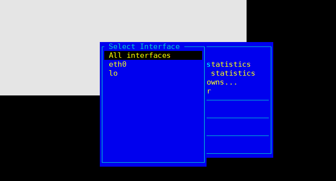](https://wzfou.com/wp-content/uploads/2017/09/linux-jiankong_11.gif)

## 四、磁盘监控

### 4.1  df命令

`df`命令的功能是用来检查linux的文件系统的磁盘空间占用情况。如果没有文件名被指定，则显示当前所有被挂载的文件系统，默认以 KB 为单位。常用格式：`$ df -h`。效果如下：

[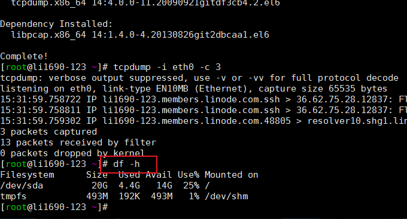](https://wzfou.com/wp-content/uploads/2017/09/linux-jiankong_09.gif)

相关参数说明如下：

> -a  全部文件系统列表
> 
> -h  以方便阅读的方式显示
> 
> -i  显示inode信息
> 
> -T  显示文件系统类型
> 
> -l  只显示本地文件系统
> 
> -k  以KB为单位
> 
> -m  以MB为单位

### 4.2  iostat命令

iostat是一个用于收集显示系统存储设备输入和输出状态统计的简单工具。这个工具常常用来追踪存储设备的性能问题，其中存储设备包括设备、本地磁盘，以及诸如使用NFS等的远端磁盘。常用格式：

$ iostat -x -k 2 100        # 2表示刷新间隔，100表示刷新次数  

效果如下图：

[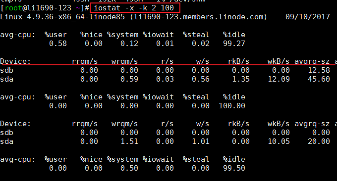](https://wzfou.com/wp-content/uploads/2017/09/linux-jiankong_10.gif)

`iostat`主要是用来监控磁盘I/O，首先输出了CPUs的平均数据（avg-cpu），我们可以看`%iowait`这一项，除此之外iostat还提供了一些更详细的I/O状态数据，比如：

> r/s: 每秒完成的读 I/O 设备次数。
> 
> w/s: 每秒完成的写 I/O 设备次数。
> 
> rkB/s: 每秒读K字节数.是 rsect/s 的一半,因为每扇区大小为512字节。
> 
> wkB/s: 每秒写K字节数.是 wsect/s 的一半。
> 
> avgrq-sz: 平均每次设备I/O操作的数据大小 (扇区)。
> 
> avgqu-sz: 平均I/O队列长度。
> 
> await: 平均每次设备I/O操作的等待时间 (毫秒)。
> 
> svctm: 平均每次设备I/O操作的服务时间 (毫秒)。
> 
> %util: 一秒中有百分之多少的时间用于 I/O 操作,或者说一秒中有多少时间 I/O 队列是非空的。

### 4.3  iotop命令

iotop命令是一个用来监视磁盘I/O使用状况的top类工具。iotop具有与top相似的UI，其中包括PID、用户、I/O、进程等相关信息。Linux下的IO统计工具如iostat，nmon等大多数是只能统计到per设备的读写情况，如果你想知道每个进程是如何使用IO的就比较麻烦，使用iotop命令可以很方便的查看。

iotop的常用参数如下：

> –version 查看程序版本号  
> -h, –help 查看帮助信息  
> -o, –only 只查看有IO操作的进程  
> -b, –batch 非交互模式  
> -n, –iter= 设置迭代次数  
> -d, –delay 刷新频率，默认是1秒  
> -p, –pid 查看指定的进程号的IO，默认是所有进程  
> -u, –user 查看指定用户进程的IO，默认是所有用户  
> -P, –processes 只看进程，不看线程  
> -a, –accumulated 看累计IO，而不是实时IO  
> -k, –kilobytes 以KB为单位查看IO，而不是以最友好的单位显示  
> -t, –time 每行添加一个时间戳，默认便开启–batch  
> -q, –quit 不显示头部信息

执行效果如下：

[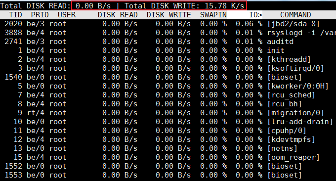](https://wzfou.com/wp-content/uploads/2017/09/linux-jiankong_12.gif)

### 4.4  lsof命令

列出打开的文件：lsof。它常用于以列表的形式显示所有打开的文件和进程。打开的文件包括磁盘文件、网络套接字、管道、设备和进程。使用这条命令的主要情形之一就是在无法挂载磁盘和显示正在使用或者打开某个文件的错误信息的时候。使用这条命令，你可以很容易地看到正在使用哪个文件。

## 五、进程监控

### 5.1  aTOP命令

atop命令是一个终端环境的监控命令。它显示的是各种系统资源（CPU, memory, network, I/O, kernel）的综合，并且在高负载的情况下进行了彩色标注。atop可以看成是top的加强版，如果执行atop命令显示不存在你需要yum或者apt-get 来安装它。效果如下：

[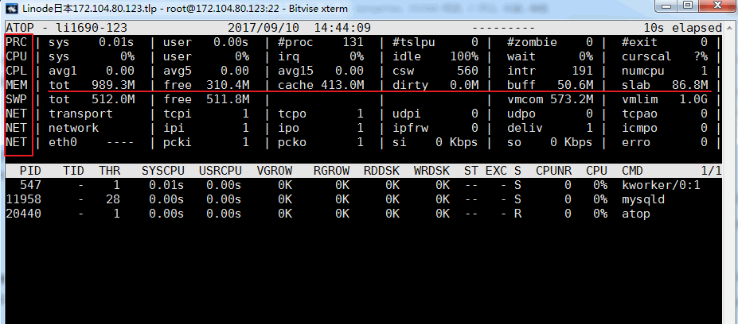](https://wzfou.com/wp-content/uploads/2017/09/linux-jiankong_04.gif)

相关的参数说明：

> **ATOP列**：该列显示了主机名、信息采样日期和时间点
> 
> **PRC列**：该列显示进程整体运行情况
> 
> 1. sys、usr字段分别指示进程在内核态和用户态的运行时间
> 2. #proc字段指示进程总数
> 3. #zombie字段指示僵死进程的数量
> 4. #exit字段指示atop采样周期期间退出的进程数量
> 
> **CPU列**：该列显示CPU整体(即多核CPU作为一个整体CPU资源)的使用情况，我们知道CPU可被用于执行进程、处理中断，也可处于空闲状态(空闲状态分两种，一种是活动进程等待磁盘IO导致CPU空闲，另一种是完全空闲)
> 
> 1. sys、usr字段指示CPU被用于处理进程时，进程在内核态、用户态所占CPU的时间比例
> 2. irq字段指示CPU被用于处理中断的时间比例
> 3. idle字段指示CPU处在完全空闲状态的时间比例
> 4. wait字段指示CPU处在“进程等待磁盘IO导致CPU空闲”状态的时间比例
> 
> CPU列各个字段指示值相加结果为N00%，其中N为cpu核数。
> 
> **cpu列**：该列显示某一核cpu的使用情况，各字段含义可参照CPU列，各字段值相加结果为100%
> 
> **CPL列**：该列显示CPU负载情况
> 
> 1. avg1、avg5和avg15字段：过去1分钟、5分钟和15分钟内运行队列中的平均进程数量
> 2. csw字段指示上下文交换次数
> 3. intr字段指示中断发生次数
> 
> **MEM列**：该列指示内存的使用情况
> 
> 1. tot字段指示物理内存总量
> 2. free字段指示空闲内存的大小
> 3. cache字段指示用于页缓存的内存大小
> 4. buff字段指示用于文件缓存的内存大小
> 5. slab字段指示系统内核占用的内存大小
> 
> **SWP列**：该列指示交换空间的使用情况
> 
> 1. tot字段指示交换区总量
> 2. free字段指示空闲交换空间大小
> 
> **PAG列**：该列指示虚拟内存分页情况
> 
> swin、swout字段：换入和换出内存页数
> 
> **DSK列**：该列指示磁盘使用情况，每一个磁盘设备对应一列，如果有sdb设备，那么增多一列DSK信息
> 
> 1. sda字段：磁盘设备标识
> 2. busy字段：磁盘忙时比例
> 3. read、write字段：读、写请求数量
> 
> **NET列**：多列NET展示了网络状况，包括传输层(TCP和UDP)、IP层以及各活动的网口信息
> 
> 1. XXXi  字段指示各层或活动网口收包数目
> 2. XXXo 字段指示各层或活动网口发包数目

### 5.2  htop命令

htop 是一个非常高级的交互式的实时linux进程监控工具。 它和top命令十分相似，但是它具有更丰富的特性，例如用户可以友好地管理进程，快捷键，垂直和水平方式显示进程等等。

命令效果如下：

[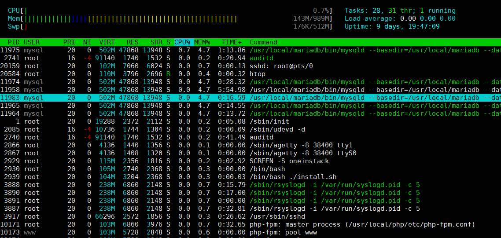](https://wzfou.com/wp-content/uploads/2017/09/linux-jiankong_06.gif)

### 5.3  ps命令

**ps（Process Status，进程状态）**命令是最基本同时也是非常强大的进程查看命令，最常用的命令就是`ps aux`——显示当前所有进程

$ ps aux | grep root       # 输出root用户的所有进程  
$ ps -p <pid> -L            # 显示进程<pid>的所有线程  
$ ps -e -o pid,uname,pcpu,pmem,comm  # 定制显示的列  
$ ps -o lstart <pid>        # 显示进程的启动时间  

ps命令的输出可以按任意某一列进行排序，通过使用内部排序键（列的别名），例如：

$ ps aux --sort=+rss         # 按内存升序排列  
$ ps aux --sort=-rss        # 按内存降序排列  
$ ps aux --sort=+%cpu        # 按cpu升序排列  
$ ps aux --sort=-%cpu       # 按cpu降序排列  

## 六、系统监控全能工具

上面分享的都是单个查看Linux系统磁盘、CPU、内存等指标的工具，如果我们想要迅速找出来VPS主机的性能瓶颈所在，我们可以采用以下几个“全能”工具：

### 6.1  glances工具

Glances 是一个用来监视 GNU/Linux 和 FreeBSD 操作系统的 GPL 授权的免费软件，通过 Glances，我们可以监视 CPU，平均负载，内存，网络流量，磁盘 I/O，其他处理器 和 文件系统 空间的利用情况。wzfou.com就是用这个来监控的。语法：`glances`

[Glances](https://wzfou.com/tag/glances/) 会用一下几种颜色来代表状态：绿色：OK（一切正常） 蓝色：CAREFUL（需要注意） 紫色：WARNING（警告） 红色：CRITICAL（严重）。阀值可以在配置文件中设置，一般阀值被默认设置为（careful=50、warning=70、critical=90）。效果如下：（点击放大）

[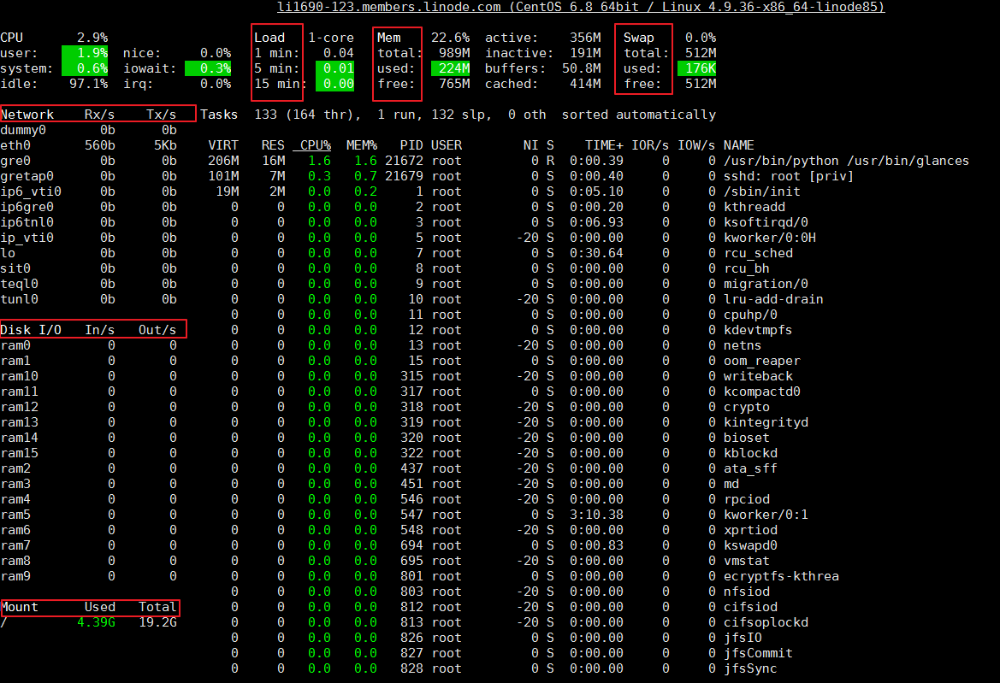](https://wzfou.com/wp-content/uploads/2017/09/linux-jiankong_13.gif)

Glances 还提供了更多的可在其运行时开关输出信息选项的**快捷键**，例如：

> a – 对进程自动排序
> 
> c – 按 CPU 百分比对进程排序
> 
> m – 按内存百分比对进程排序
> 
> p – 按进程名字母顺序对进程排序
> 
> i – 按读写频率（I/O）对进程排序
> 
> d – 显示/隐藏磁盘 I/O 统计信息
> 
> f – 显示/隐藏文件系统统计信息
> 
> n – 显示/隐藏网络接口统计信息
> 
> s – 显示/隐藏传感器统计信息
> 
> y – 显示/隐藏硬盘温度统计信息
> 
> l – 显示/隐藏日志（log）
> 
> b – 切换网络 I/O 单位（Bytes/bits）
> 
> w – 删除警告日志
> 
> x – 删除警告和严重日志
> 
> 1 – 切换全局 CPU 使用情况和每个 CPU 的使用情况
> 
> h – 显示/隐藏这个帮助画面
> 
> t – 以组合形式浏览网络 I/O
> 
> u – 以累计形式浏览网络 I/O
> 
> q – 退出（‘**ESC**‘ 和 ‘**Ctrl&C**‘ 也可以）

### 6.2  dstat工具

[dstat](https://wzfou.com/tag/dstat/)命令是一个用来替换vmstat、iostat、netstat、nfsstat和ifstat这些命令的工具，是一个全能系统信息统计工具。与sysstat相比，dstat拥有一个彩色的界面，在手动观察性能状况时，数据比较显眼容易观察；而且dstat支持即时刷新，譬如输入dstat 3即每三秒收集一次，但最新的数据都会每秒刷新显示。

直接使用dstat，默认使用的是-cdngy参数，分别显示cpu、disk、net、page、system信息，默认是1s显示一条信息。可以在最后指定显示一条信息的时间间隔，如dstat 5是没5s显示一条，dstat 5 10表示没5s显示一条，一共显示10条。如下：

[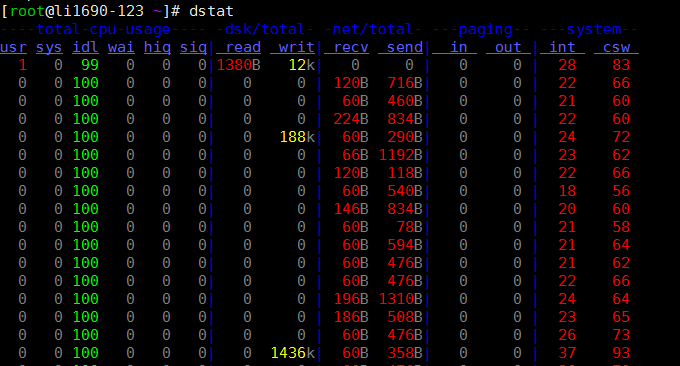](https://wzfou.com/wp-content/uploads/2017/09/linux-jiankong_14.gif)

默认输出显示的信息说明：

> **Procs**
> 
> 1. r:运行的和等待(CPU时间片)运行的进程数，这个值也可以判断是否需要增加CPU(长期大于1)
> 2. b:处于不可中断状态的进程数，常见的情况是由IO引起的
> 
> **Memory**
> 
> 1. swpd: 切换到交换内存上的内存(默认以KB为单位)。如果 swpd 的值不为0，或者还比较大，比如超过100M了，但是 si, so 的值长期为 0，这种情况我们可以不用担心，不会影响系统性能。
> 2. free: 空闲的物理内存
> 3. buff: 作为buffer cache的内存，对块设备的读写进行缓冲
> 4. cache: 作为page cache的内存, 文件系统的cache。如果 cache 的值大的时候，说明cache住的文件数多，如果频繁访问到的文件都能被cache住，那么磁盘的读IO bi 会非常小。
> 
> **Swap**
> 
> 1. si: 交换内存使用，由磁盘调入内存
> 2. so: 交换内存使用，由内存调入磁盘
> 
> 内存够用的时候，这2个值都是0，如果这2个值长期大于0时，系统性能会受到影响。磁盘IO和CPU资源都会被消耗。
> 
> 我发现有些朋友看到空闲内存(free)很少或接近于0时，就认为内存不够用了，实际上不能光看这一点的，还要结合si,so，如果free很少，但是si,so也很少(大多时候是0)，那么不用担心，系统性能这时不会受到影响的。
> 
> **磁盘IO**
> 
> 1. bi: 从块设备读入的数据总量(读磁盘) (KB/s)
> 2. bo: 写入到块设备的数据总理(写磁盘) (KB/s)
> 
> 注:随机磁盘读写的时候，这2个 值越大（如超出1M），能看到CPU在IO等待的值也会越大
> 
> **System**
> 
> 1. in: 每秒产生的中断次数
> 2. cs: 每秒产生的上下文切换次数
> 
> 上面这2个值越大，会看到由内核消耗的CPU时间会越多
> 
> **Cpu**
> 
> 1. usr: 用户进程消耗的CPU时间百分比
> 
> us 的值比较高时，说明用户进程消耗的CPU时间多，但是如果长期超过50% 的使用，那么我们就该考虑优化程序算法或者进行加速了(比如 PHP/Perl)
> 
> 1. sys: 内核进程消耗的CPU时间百分比
> 
> *sys 的值高时，说明系统内核消耗的CPU资源多，这并不是良性的表现，我们应该检查原因。*
> 
> 1. wai: IO等待消耗的CPU时间百分比
> 
> wa 的值高时，说明IO等待比较严重，这可能是由于磁盘大量作随机访问造成，也有可能是磁盘的带宽出现瓶颈(块操作)。
> 
> 1. idl: CPU处在空闲状态时间百分比

## 七、总结

对于上面的命令，有些是Linux系统自带的，你可以直接执行。有些是第三方命令，不过绝大多数可以直接**通过Yum install xxx或者apt-get intall xxx来安装**。这些命令虽然小巧，但是在我们的服务器出现问题将会显得特别有用。

排查服务器问题，我们一般需要结合多项指标来进行综合分析研判。例如如果你怀疑VPS主机的IO读写有问题，你可以通过iotop来查看读写实时速度，同时用top命令查看哪些进程来占用CPU和内存，这样结合多项数据就会得到正确的结果。