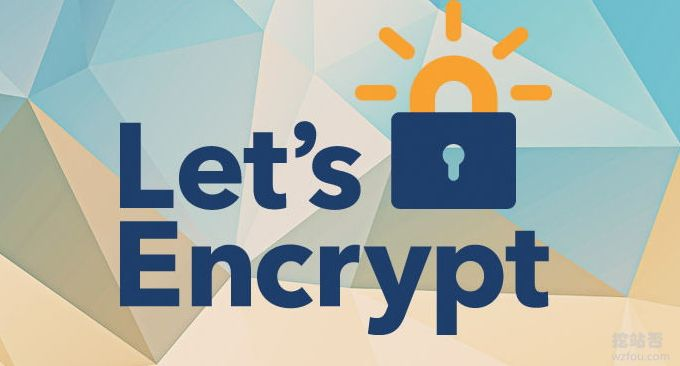
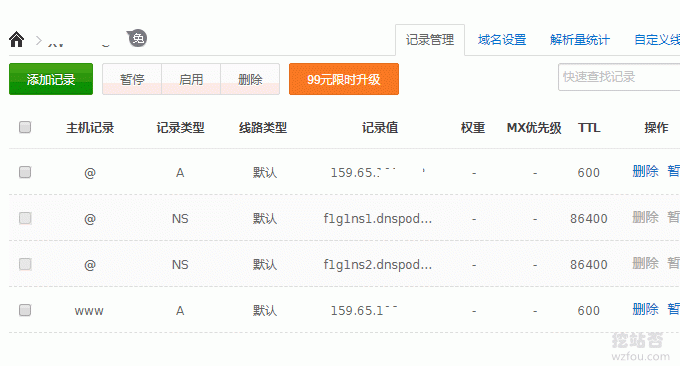
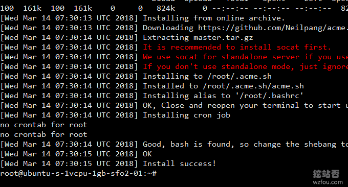
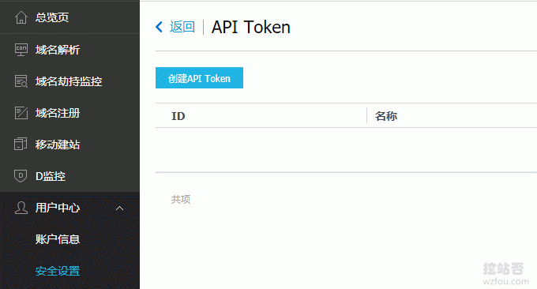
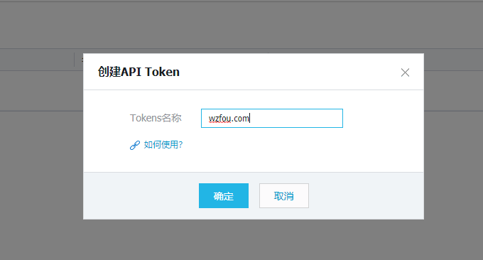
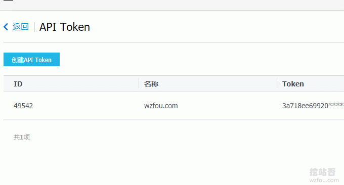
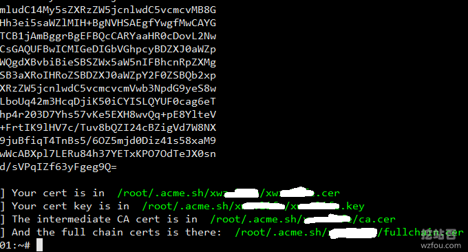
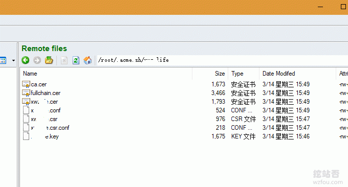
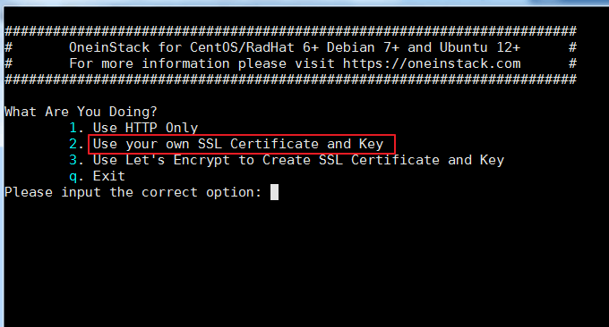
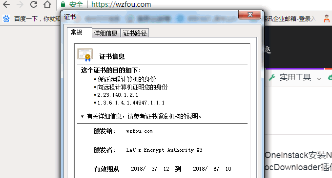

# Let’s Encrypt Wildcard 免费泛域名SSL证书一键申请与SSL使用教程
要说免费SSL证书，绝对要推荐Let’s Encrypt，申请免费，安装简单，可以无限期的续期。目前wzfou.com主站用的就是Let’s Encrypt的免费SSL证书，有人担心自己没有VPS主机无法使用Let’s Encrypt证书，其实现在你可以直接在线申请Let’s Encrypt了。

Let’s Encrypt的单域名SSL证书极大的推动了SSL证书在世界范围内的普及，而现在更加让人兴奋的消息是：经过无数次的跳票，Let’s Encrypt Wildcard 免费泛域名SSL证书终于上线了！任何个人都是可以免费申请，利用脚本Acme.sh可以实现一键签发，十分方便。

acme.sh 实现了 `acme` 协议, 可以从 letsencrypt 生成免费的证书。主要步骤：安装 acme.sh、生成证书 、copy 证书到 nginx/apache 或者其他服务 、更新证书 、更新 acme.sh。Let’s Encrypt Wildcard 免费泛域名SSL证书有效期依然为三个月，acme.sh会自动续期。

[](https://wzfou.com/wp-content/uploads/2018/03/Lets-Encrypted-wildcard_00.jpg)

本篇文章就来分享一下Let’s Encrypt Wildcard 免费泛域名SSL证书一键申请与SSL使用教程，更多的关于建站经验与建站资源，你可以试试：

1. [PayPal连连提现五个注意事项-账号绑定,失败锁定,手续费与提现时长](https://wzfou.com/paypal-lianlian/)
2. [十个你可能不知道的CloudFlare免费CDN加速技巧-SSL\\DDOS\\Cache](https://wzfou.com/cloudflare/)
3. [自建CDN加速-Nginx反向绑定,缓存加速,自动更新缓存和获取真实IP](https://wzfou.com/nginx-cdn/)

**PS：2018年4月6日更新，**更多的免费SSL证书可以看我收集整理的专题：[免费SSL证书收集整理汇总-免费给网站添加Https安全加密访问](https://wzfou.com/mianfei-ssl/)。

**PS：2018年3月26日更新，**Let’s Encrypt需要一台VPS主机才可以申请使用，手里仅有虚拟主机的朋友可以试试在线申请免费SSL：[三个在线免费SSL证书申请地址:AlwaysOnSSL,SSL For Free和FreeSSL.org](https://wzfou.com/ssl-for-free/)。

**PS：2018年10月15日更新，**详细的letsencrypt免费SSL证书安装教程，参考：[简单三步给网站申请安装letsencrypt免费SSL证书-acme.sh自动续期](https://wzfou.com/letsencrypt/)。

## 一、Let’s Encrypt泛域名SSL证书申请前准备

官网：

1. https://letsencrypt.org/
2. https://github.com/Neilpang/acme.sh
3. https://wzfou.com/vps-bangdan/

### 1.1  VPS服务器

要安装Let’s Encrypt Wildcard 免费泛域名SSL证书，你至少需要一台VPS主机，关于选购VPS主机可以看我写的各在VPS主机测评：[接入CN2线路VPS主机商和机房汇总](https://wzfou.com/cn2-vps-list/)和[VPS主机排行榜单](https://wzfou.com/vps-bangdan/)。

不嫌备+案麻烦的话，可以选择[阿里云VPS](https://wzfou.com/tag/aliyun-vps/)、腾讯云VPS、[京东云VPS](https://wzfou.com/jcloud/)等国内的VPS主机商，想要速度快的免备+案的VPS，可以试试CN2线路或者香港、韩国机房的VPS，这类有[阿里云香港](https://wzfou.com/alibabacloud-hk/)、[CN2 VPS](https://wzfou.com/cn2-vps/)、[Kdatacenter](https://wzfou.com/kdatacenter/)等等。

### 1.2  做好DNS解析

Let’s Encrypt支持DNSPod、CloudXNS、Amazon Route53、CloudFlare等DNS解析，你需要先把域名的NS修改好。

[](https://wzfou.com/wp-content/uploads/2018/03/Lets-Encrypted-wildcard_01.gif)

## 二、Let’s Encrypt SSL工具acme.sh

### 2.1  安装acme.sh

acme.sh 实现了 `acme` 协议, 可以从 letsencrypt 生成免费的证书。安装很简单, 一个命令:

```
curl  https://get.acme.sh | sh

```

普通用户和 root 用户都可以安装使用。 acme.sh 安装到你的 **home** 目录下:`~/.acme.sh/`，并创建 一个 bash 的 alias, 方便你的使用: `acme.sh=~/.acme.sh/acme.sh`

[](https://wzfou.com/wp-content/uploads/2018/03/Lets-Encrypted-wildcard_02.gif)

同时acme.sh 自动为你创建 cronjob, 每天 0:00 点自动检测所有的证书, 如果快过期了, 需要更新, 则会自动更新证书。**安装过程不会污染已有的系统任何功能和文件**, 所有的修改都限制在安装目录中: `~/.acme.sh/`。

### 2.2  获取DNS API

目前acme.sh需要使用到DNS API验证域名。这里以DNSPOD为例，进入到用户中心就可以找到API了。

[](https://wzfou.com/wp-content/uploads/2018/03/Lets-Encrypted-wildcard_03.gif)

点击新建一个API。

[](https://wzfou.com/wp-content/uploads/2018/03/Lets-Encrypted-wildcard_04.gif)

最后你可以复制API的ID与Key了。

[](https://wzfou.com/wp-content/uploads/2018/03/Lets-Encrypted-wildcard_05.gif)

### 2.3  签发Let’s Encrypt 泛域名证书

这里以DNSPod为演示，如果你是使用的其它的DNS，请参考本文下的附录，不同的DNS的命令是不同的。执行以下命令保存DNSPOD的API Key 和 ID。

```
export DP_Id="1234"
export DP_Key="sADDsdasdgdsf"

```

这个 `DP_Id` and `DP_Key` 保存在 `~/.acme.sh/account.conf` 。执行以下命令就可以签发Let’s Encrypt 泛域名证书了:

```
acme.sh --issue --dns dns_dp -d wzfou.com -d *.wzfou.com
#默认签发的是RSA，如果你想签发ECC证书，请使用以下命令
acme.sh --issue --dns dns_dp -d wzfou.com -d *.wzfou.com --keylength ec-256
#可选长度有：
   ec-256 (prime256v1, “ECDSA P-256”)
   ec-384 (secp384r1, “ECDSA P-384”)

```

整个签发过程还是很快的，完成后你就可以生成的SSL证书路径了。

[](https://wzfou.com/wp-content/uploads/2018/03/Lets-Encrypted-wildcard_06.gif)

现在打开证书路径，Fullchain.cer就是完成的域名证书了，wzfou.com.key就是Key了，你只要下载这两个文件就可以启用Let’s Encrypt SSL证书了。

[](https://wzfou.com/wp-content/uploads/2018/03/Lets-Encrypted-wildcard_07.gif)

## 三、Let’s Encrypt SSL证书安装

实际上目前流行的VPS主机面板都已经支持自定义SSL证书或者是一键申请安装Let’s Encrypt SSL证书了，例如[BT.cn宝塔面板](https://wzfou.com/bt-cn/)、[OneinStack](https://wzfou.com/oneinstack/)、[LNMP](https://wzfou.com/lnmp-1-4/)、[WDCP](https://wzfou.com/wdcp/)、[AppNode面板](https://wzfou.com/appnode/)等。 更多的安装方法请参考：[服务器控制面板榜单](https://wzfou.com/vps-mianban/)。

[](https://wzfou.com/wp-content/uploads/2018/03/Lets-Encrypted-wildcard_08.gif)

## 四、附录：各大DNS API获取与签发SSL

说明：

1. 附录参考自：https://github.com/Neilpang/acme.sh/blob/master/dnsapi/README.md
2. DNS解析服务汇总：https://wzfou.com/mianfei-dns/
3. 签发泛域名SSL时请把命令部分：`-d www.example.com` 改成 ：`-d *.example.com`

**4.1  CloudFlare DNS API**

First you need to login to your CloudFlare account to get your API key.

```
export CF_Key="sdfsdfsdfljlbjkljlkjsdfoiwje"
export CF_Email="xxxx@sss.com"

```

Ok, let’s issue a cert now:

```
acme.sh --issue --dns dns_cf -d example.com -d www.example.com

```

The `CF_Key` and `CF_Email` will be saved in `~/.acme.sh/account.conf` and will be reused when needed.

[](https://github.com/Neilpang/acme.sh/blob/master/dnsapi/README.md#2-use-dnspodcn-domain-api-to-automatically-issue-cert)**4.2  DNSPod DNS API**

First you need to login to your DNSPod account to get your API Key and ID.

```
export DP_Id="1234"
export DP_Key="sADDsdasdgdsf"

```

Ok, let’s issue a cert now:

```
acme.sh --issue --dns dns_dp -d example.com -d www.example.com

```

The `DP_Id` and `DP_Key` will be saved in `~/.acme.sh/account.conf` and will be reused when needed.

**4.3  CloudXNS DNS API**

First you need to login to your CloudXNS account to get your API Key and Secret.

```
export CX_Key="1234"
export CX_Secret="sADDsdasdgdsf"

```

Ok, let’s issue a cert now:

```
acme.sh --issue --dns dns_cx -d example.com -d www.example.com

```

The `CX_Key` and `CX_Secret` will be saved in `~/.acme.sh/account.conf` and will be reused when needed.

[](https://github.com/Neilpang/acme.sh/blob/master/dnsapi/README.md#11-use-aliyun-domain-api-to-automatically-issue-cert)**4.4  阿里云Aliyun DNS API**

First you need to login to your [阿里云](https://wzfou.com/tag/aliyun/) Aliyun account to get your API key. https://ak-console.aliyun.com/#/accesskey

```
export Ali_Key="sdfsdfsdfljlbjkljlkjsdfoiwje"
export Ali_Secret="jlsdflanljkljlfdsaklkjflsa"

```

Ok, let’s issue a cert now:

```
acme.sh --issue --dns dns_ali -d example.com -d www.example.com

```

The `Ali_Key` and `Ali_Secret` will be saved in `~/.acme.sh/account.conf` and will be reused when needed.

**4.5  GoDaddy DNS API**

First you need to login to your GoDaddy account to get your API Key and Secret. https://developer.godaddy.com/keys/

Please create a Production key, instead of a Test key.

```
export GD_Key="sdfsdfsdfljlbjkljlkjsdfoiwje"
export GD_Secret="asdfsdafdsfdsfdsfdsfdsafd"

```

Ok, let’s issue a cert now:

```
acme.sh --issue --dns dns_gd -d example.com -d www.example.com

```

The `GD_Key` and `GD_Secret` will be saved in `~/.acme.sh/account.conf` and will be reused when needed.

**4.6  PowerDNS DNS API**

First you need to login to your PowerDNS account to enable the API and set your API-Token in the configuration. https://doc.powerdns.com/md/httpapi/README/

```
export PDNS_Url="http://ns.example.com:8081"
export PDNS_ServerId="localhost"
export PDNS_Token="0123456789ABCDEF"
export PDNS_Ttl=60

```

Ok, let’s issue a cert now:

```
acme.sh --issue --dns dns_pdns -d example.com -d www.example.com

```

The `PDNS_Url`, `PDNS_ServerId`, `PDNS_Token` and `PDNS_Ttl` will be saved in `~/.acme.sh/account.conf` and will be reused when needed.

**4.7  Amazon Route53 DNS API**

方法见：https://github.com/Neilpang/acme.sh/wiki/How-to-use-Amazon-Route53-API

```
export  AWS_ACCESS_KEY_ID=XXXXXXXXXX
export  AWS_SECRET_ACCESS_KEY=XXXXXXXXXXXXXXX

```

To issue a cert:

```
acme.sh --issue --dns dns_aws -d example.com -d www.example.com

```

The `AWS_ACCESS_KEY_ID` and `AWS_SECRET_ACCESS_KEY` will be saved in `~/.acme.sh/account.conf` and will be reused when needed.

**4.8  Linode DNS API**

First you need to login to your [Linode](https://wzfou.com/tag/linode/) account to get your API Key. https://manager.linode.com/profile/api

Then add an API key with label *ACME* and copy the new key.

export LINODE\_API\_KEY="..."

Due to the reload time of any changes in the DNS records, we have to use the `dnssleep` option to wait at least 15 minutes for the changes to take effect.

Ok, let’s issue a cert now:

acme.sh --issue --dns dns_linode --dnssleep 900 -d example.com -d www.example.com

The `LINODE_API_KEY` will be saved in `~/.acme.sh/account.conf` and will be reused when needed.

[](https://github.com/Neilpang/acme.sh/blob/master/dnsapi/README.md#20-use-digitalocean-api-native)**4.9  DigitalOcean DNS API (native)**

You need to obtain a read and write capable API key from your [DigitalOcean](https://wzfou.com/tag/digitalocean/) account. See: https://www.digitalocean.com/help/api/

```
export DO_API_KEY="75310dc4ca779ac39a19f6355db573b49ce92ae126553ebd61ac3a3ae34834cc"

```

Ok, let’s issue a cert now:

```
acme.sh --issue --dns dns_dgon -d example.com -d www.example.com

```

[](https://github.com/Neilpang/acme.sh/blob/master/dnsapi/README.md#35-use-namesilocom-api)**4.10 Namesilo DNS API**

You’ll need to generate an API key at https://www.namesilo.com/account_api.php Optionally you may restrict the access to an IP range there.

```
export Namesilo_Key="xxxxxxxxxxxxxxxxxxxxxxxx"

```

And now you can issue certs with:

```
acme.sh --issue --dns dns_namesilo --dnssleep 900 -d example.com -d www.example.com

```

[](https://github.com/Neilpang/acme.sh/blob/master/dnsapi/README.md#use-custom-api)**4.11  使用自定义API**

If your API is not supported yet, you can write your own DNS API.

Let’s assume you want to name it ‘myapi’:

1. Create a bash script named `~/.acme.sh/dns_myapi.sh`,
2. In the script you must have a function named `dns_myapi_add()` which will be called by acme.sh to add the DNS records.
3. Then you can use your API to issue cert like this:

```
acme.sh --issue --dns dns_myapi -d example.com -d www.example.com

```

## 五、总结

Let’s Encrypt Wildcard 免费泛域名SSL证书申请与安装还是比较简单的，目前我们可以通过脚本来申请Let’s Encrypt泛域名SSL，相信不久之后各大VPS主机控制面板就会有一键申请与安装泛域名SSL证书了。

[](https://wzfou.com/wp-content/uploads/2018/03/Lets-Encrypted-wildcard_09.gif)

Let’s Encrypt Wildcard 免费泛域名SSL证书需要用到DNS验证，附录里已经列出了各大DNS域名解析获取API以及签发SSL证书的命令，大家可以参考一下，如果是签发泛域名SSL，请把www换成*号即可。