# 三个在线免费SSL证书申请地址AlwaysOnSSL,SSL For Free和FreeSSL.org
SSL证书基本上已经成为了现在建站的“标配”了，无论是搜索引擎对待Https加密的态度，还是用户对于Https链接的认识程度，SSL在当前的互联网地位已经得到了大大的提高了，所以还没有给自己的网站配置SSL证书的朋友不要犹豫赶紧上Https吧。

对于商家或者公司来说购买那些付费的SSL证书会靠谱一些，而像我们这样的玩博客和喜欢建站的来说，搞几个免费的SSL证书是最合适不过了。说到免费的SSL证书，最为推荐的自然是Let’s Encrypt证书了，它不仅免费，而且稳定可靠，各大浏览器都支持。

申请与安装Let’s Encrypt证书需要一台VPS或者服务器，对于使用虚拟主机或者移动开发的朋友来说有些麻烦。这次我们就来分享一下三个可以帮助你免费在线申请到SSL证书的网址：[AlwaysOnSSL](https://wzfou.com/tag/alwaysonssl/)、SSL For Free和FreeSSL.org。申请和下载SSL证书都是免费的。

AlwaysOnSSL、SSL For Free和[FreeSSL.org](https://wzfou.com/tag/freessl-org/)这三个网站都利用了Trustasia和Let’s Encrypt提供的API来提供SSL证书的，和你到Trustasia和Let’s Encrypt申请到的证书是一样的，Trustasia有效期是一年，Let’s Encrypt证书有效期是三个月。

[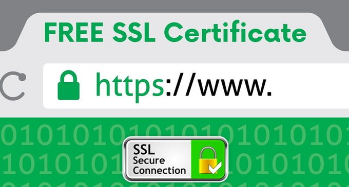](https://wzfou.com/wp-content/uploads/2018/02/alwaysonssl_00.jpg)

更多的[免费资源](https://wzfou.com/mianfei-ziyuan/)你也许需要：

1. [三大原因让我放弃腾讯阿里云企业邮箱-附国内外企业(域名)邮箱汇总](https://wzfou.com/qiye-youxiang/)
2. [接入CN2线路VPS主机商和机房汇总-鉴别真假CN2线路主机参考手册](https://wzfou.com/cn2-vps-list/)
3. [AppNode免费Linux服务器集群管理面板安装使用与搭建Discuz过程](https://wzfou.com/appnode/)

**PS：2018年4月6日更新，**更多的免费SSL证书可以看我收集整理的专题：[免费SSL证书收集整理汇总-免费给网站添加Https安全加密访问](https://wzfou.com/mianfei-ssl/)。

**PS：2018年3月26日更新，**Let’s Encrypt已经推出了免费的泛域名SSL证书，有需要的朋友可以看这里：[Let’s Encrypt Wildcard 免费泛域名SSL证书一键申请与SSL使用教程](https://wzfou.com/lets-encrypt-wildcard-ssl/)。

## 一、AlwaysOnSSL

官网：

1. https://alwaysonssl.com/issue.php

AlwaysOnSSL是来自德国的免费SSL证书提供者，由 CertCenter 和 Digicert 运行，免费提供 12 个月的 DV SSL 证书，目前还不支持签发 ECC 证书。打开网站填写你要申请SSL证书的域名。

[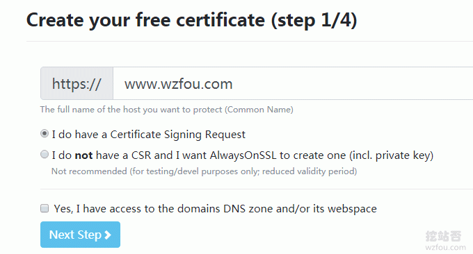](https://wzfou.com/wp-content/uploads/2018/02/alwaysonssl_01.gif)

接下来会要你填写你的域名CSR，同时它还会生成Key，一定要把这两样东西保存下来，否则你的证书一旦生成就不无法使用了。

关于生成CSR，现在好多的在线CSR生成工具可以免费使用，例如：https://www.chinassl.net/ssltools/generator-csr.html，直接填写一些基本信息就可以得到CSR。

[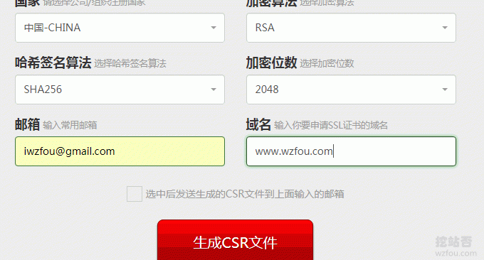](https://wzfou.com/wp-content/uploads/2018/02/alwaysonssl_02.gif)

最后就是选择域名验证方式了，有DNS验证和文件验证。

[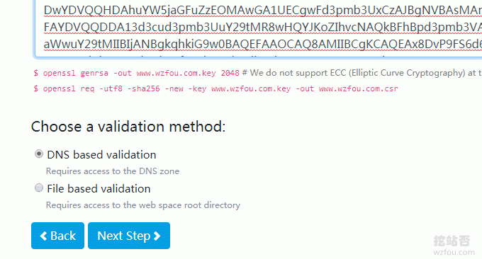](https://wzfou.com/wp-content/uploads/2018/02/alwaysonssl_04.gif)

选择DNS验证的话，AlwaysOnSSL会给出TXT记录，你只需要添加到你的域名DNS解析中即可。

[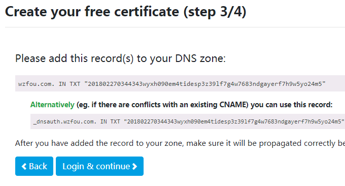](https://wzfou.com/wp-content/uploads/2018/02/alwaysonssl_05.gif)

完成验证后，你就可以下载SSL证书并免费使用了。

[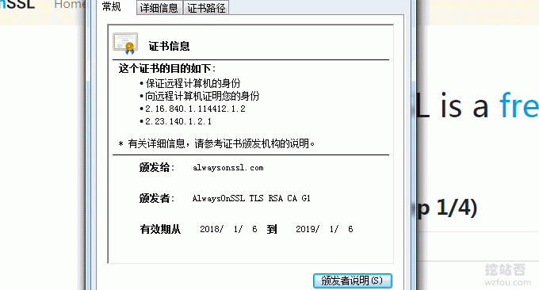](https://wzfou.com/wp-content/uploads/2018/02/alwaysonssl_06.gif)

## 二、SSL For Free

官网：

1. https://www.sslforfree.com/
2. 类似：https://gethttpsforfree.com/

[SSL For Free](https://wzfou.com/tag/ssl-for-free/)就是一个利用了Let’s Encrypt提供的API方便大家在线申请SSL证书的网站，提供Let’s Encrypt免费SSL证书，有效期为三个月，申请简单。（点击放大）

[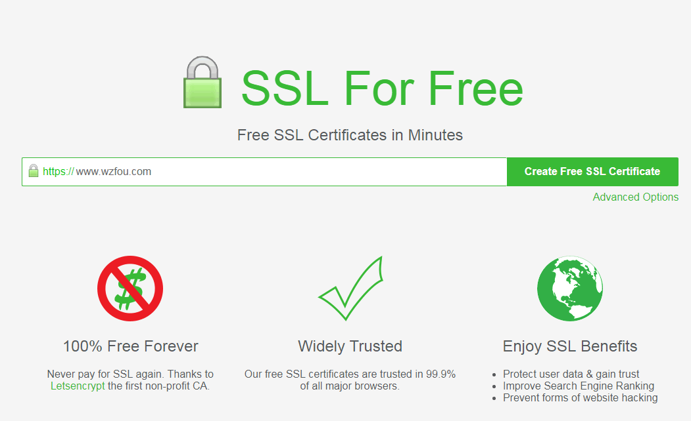](https://wzfou.com/wp-content/uploads/2018/02/alwaysonssl_07.gif)

输入你想要申请SSL证书的域名，然后选择域名验证方式，和上面的AlwaysOnSSL类似，同样有DNS验证还有文件验证，验证成功后你就可以下载保存SSL证书了。

[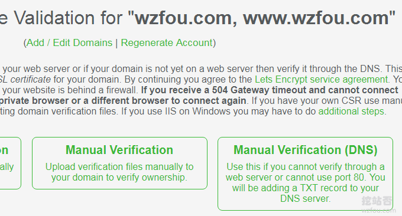](https://wzfou.com/wp-content/uploads/2018/02/alwaysonssl_08.gif)

## 三、FreeSSL.org

官网：

1. https://freessl.org/

FreeSSL.org是一个国人开办的提供免费SSL证书的网站，相对于SSL For Free、AlwaysOnSSL来说，主要优势就是语言，大家用起来可能会更加方便一些，网站在证书到期前 30、7 天通过邮件提醒您，您可登录到管理后台管理查看你的证书。

[FreeSSL.org](https://wzfou.com/tag/freessl-org/)提供Let’s Encrypt 与 TrustAsia 免费证书，Let’s Encrypt 通过其官方 ACME 服务生成。Let’s Encrypt 证书是三个月有效期。TrustAsia 通过其官网 OpenAPI 的方式生成。TrustAsia 证书是一年有效期。（点击放大）

[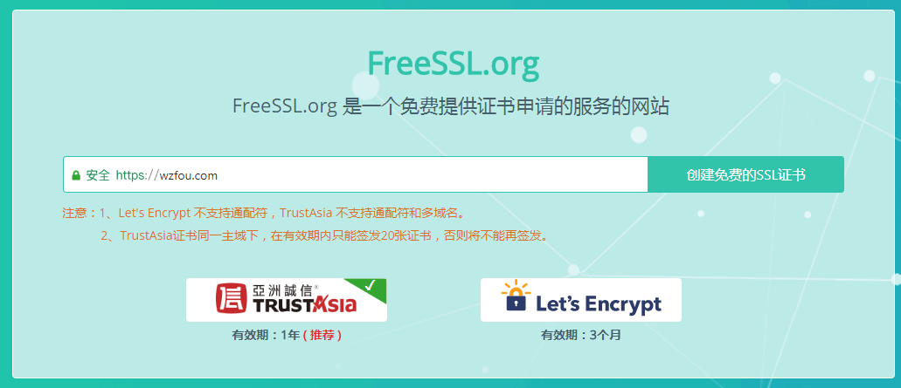](https://wzfou.com/wp-content/uploads/2018/02/alwaysonssl_09.gif)

输入你想要申请SSL证书的域名，然后选择证书类型（RSA和ECC）、验证类型（DNS和文件）、CSR生成（自动生成或者上传）。

[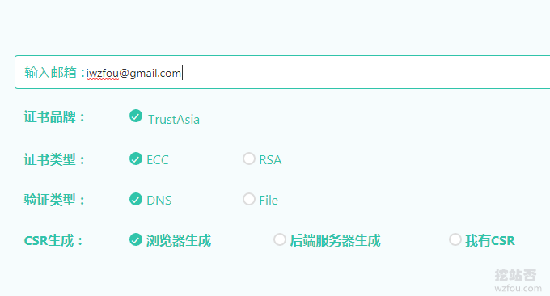](https://wzfou.com/wp-content/uploads/2018/02/alwaysonssl_10.gif)

接下来的操作就和AlwaysOnSSL一样了，验证好了域名后，你就可以登录到后台查看自己的证书还有Key了。下载SSL证书就可以在自己的服务器上使用了。

[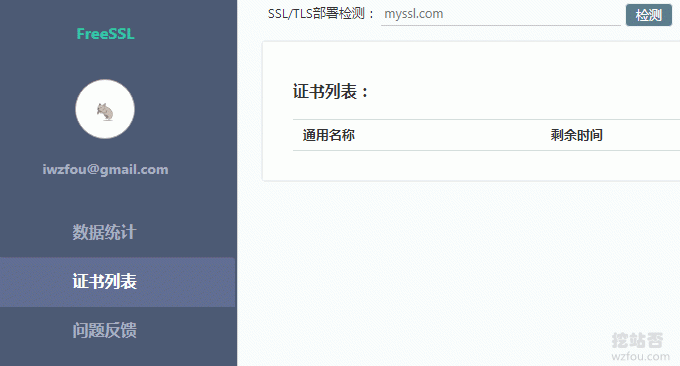](https://wzfou.com/wp-content/uploads/2018/02/alwaysonssl_11.gif)

## 四、总结

利益于Trustasia和Let’s Encrypt提供的API，在AlwaysOnSSL、SSL For Free和FreeSSL.org申请到的SSL证书和在官网申请到的SSL证书是一样的， 可靠性都没有什么问题，并且还提供了简单的证书管理功能，方便大家的使用。

Let’s Encrypt证书有效期只有三个月，所以在证书到期前你就需要重新到网站申请一个新的SSL证书来替换即将失效的证书，当然有自己的服务器的话是可以自动续期的。而Trustasia证书有效期是一年，这一点比Let’s Encrypt要好一些。