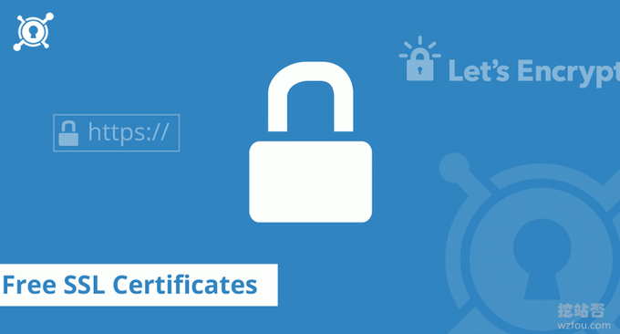

# 免费SSL证书收集整理汇总-免费给网站添加Https安全加密访问
现在好多网站已经开始上线Https加密访问了，SSL证书用于加密HTTP协议，也就是HTTPS。给网站添加SSL证书并不复杂，像以前分享的[Oneinstack](https://wzfou.com/tag/oneinstack/)、[LNMP](https://wzfou.com/tag/lnmp/)、[宝塔面板](https://wzfou.com/tag/baota-mianban/)、[WDCP面板](https://wzfou.com/wdcp/)等都支持自定义SSL证书或者一键申请安装Let’s Encrypt证书。

自从Let’s Encrypt推出了各大浏览器支持和认可的[免费SSL证书](https://wzfou.com/tag/free-ssl/)后，之前那些SSL巨头们开始放下了“姿态”推出了不少的域名型SSL证书（DV SSL）。现在申请一个免费的SSL证书已经非常简单的了，只要验证域名后就可以签发SSL证书了。

本篇文章就来收集整理国内外各大[免费SSL](https://wzfou.com/tag/free-ssl/)证书，除了Let’s Encrypt，其它的免费SSL证书基本上是各大商家与GeoTrust,Comodo,Symantec合作推出的，只不过申请的入口不同而已，申请到的SSL证书是没有区别的。

更多的专题汇总文章，有兴趣的朋友可以看看：

1. [服务器控制面板榜单](https://wzfou.com/vps-mianban/)
2. [国内外企业(域名)邮箱汇总](https://wzfou.com/qiye-youxiang/)
3. [CN2线路VPS主机商和机房汇总](https://wzfou.com/cn2-vps-list/)
4. [国内外免费DNS域名解析服务汇总列表](https://wzfou.com/mianfei-dns/)

> **PS：2018年4月10日更新，**给网站安装上SSL可以增强连接的安全性，但是更为彻底的安全保障是确保浏览器打开域名的自始至终都是Https的，这就要加入HSTS了，参考：[启用HSTS并加入HSTS Preload List让网站Https访问更加安全-附删除HSTS方法](https://wzfou.com/hsts-preload/)。
> 
> **PS：2018年8月6日更新，**服务器启用SSL证书其实也是一种资源开消，如何最大限度地减少这种资源消耗提升https访问速度，参考这里：[八个HTTPS和SSL优化使用心得-减少等待时间和降低Https性能损耗](https://wzfou.com/https-ssl/)。

## 免费SSL证书收集整理汇总列表

搜索:

| 服务商 | 证书的类型 | 简要介绍 | 时长 | 评分 |
| --- | --- | --- | --- | --- |
| [Let’s Encrypt](https://wzfou.com/go/letsencrypt) | Let’s Encrypt | Let's Encrypt是第一个免费并且开源的CA,且已经获得Mozilla、微软等主要浏览器厂商的根授信，是免费SSL证书中首选，wzfou.com用的SSL就是这家。目前已经推出了免费泛域名证书，参考：[Let’s Encrypt SSL](https://wzfou.com/lets-encrypt-wildcard-ssl/) | 三月 | 9.5 |
| [Cloudflare](https://wzfou.com/go/cloudflare) | Comodo | CloudFlare推出的UniversalSSL功能,向所有CloudFlare用户(包括免费用户)提供SSL加密功能，前提你需要使用他们家的CDN。参考：[CloudFlare免费SSL](https://wzfou.com/cloudflare/#CloudFlareSSL) | 未知 | 8.7 |
| [FreeSSL.cn](https://wzfou.com/go/freesslcn) | TrustAsia CA  Let's Encrypt | 国人开办的，提供 Let’s Encrypt 与 TrustAsia CA 的免费 HTTPS 证书。中文面板，操作简单。 | 一年 | 8.3 |
| [SSL For Free](https://wzfou.com/go/sslforfree) | Let's Encrypt | 基于Let's Encrypt的API开发的可供在线申请Let's Encrypt免费SSL证书的网站。参考：[SSL\_For\_Free](https://wzfou.com/ssl-for-free/#SSL_For_Free) | 三月 | 8.2 |
| [AlwaysOnSSL](https://wzfou.com/go/alwaysonssl) | Digicert | 由 CertCenter 和 Digicert 运行的一个新成立的免费SSL网站。 参考：[AlwaysOnSSL](https://wzfou.com/ssl-for-free/#AlwaysOnSSL) | 一年 | 8.2 |
| [GoGetSSL](https://wzfou.com/go/gogetssl) | Comodo | Comodo官方提供的免费SSL证书，支持RSA和ECC。可以在Comodo官网或GoGetSSL申请到。默认保护@与www，不支持通配符。3个月有效期，到期可以续签。 | 三月 | 8.1 |
| [阿里云SSL](https://wzfou.com/go/aliyun) | DigiCert | 阿里云与天威诚信推出了基于Symantec（赛门铁克）的免费SSL证书。参考：[阿里云](https://wzfou.com/aliyun-vps/) | 一年 | 8.0 |
| [腾讯云SSL](https://wzfou.com/go/qcloud) | DigiCert | 腾讯云与赛门铁克合作推出了免费的TrustAsia DV SSL证书。参考：[腾讯云](https://wzfou.com/tencent-cloud/) | 一年 | 8.0 |
| [又拍云SSL](https://wzfou.com/go/upyun) | TrustAsia CA  Let's Encrypt | 又拍云携手 TrustAsia 、 Let’s Encrypt， 推出免费DV SSL 证书的申请，证书到期会自动续签。[又拍云](https://wzfou.com/upyun/) | 一年 | 8.0 |
| [AWS免费SSL](https://wzfou.com/go/aws) | Amazon | 通过 AWS Certificate Manager 预置的 SSL/TLS 证书可免费使用。您只需为您创建的用于运行应用程序的 AWS 资源付费。 | 未知 | 7.5 |
| [Buypass](https://wzfou.com/go/buypass) | Buypass Go | Buypass Go SSL提供了类似于Let’s Encrypt免费SSL的ACME和Certbot自动签发工具，你可以自己的VPS主机或者服务器轻松地部署Buypass Go SSL。[Buypass Go SSL免费SSL](https://wzfou.com/trustocean-buypass/) | 六月 | 7.5 |
| [七牛云SSL](https://wzfou.com/go/qiniu) | TrustAsia | 七牛联合TrustAsia推出免费SSL证书，仅限七牛产品使用。参考：[七牛云](https://wzfou.com/qiniu-cdn/) | 一年 | 7.5 |
| [百度云SSL](https://wzfou.com/go/cloudbaidu) | Symantec | 百度云联合Symantec（赛门铁克）推出DV免费版本证书，仅限百度云产品使用。[百度云](https://wzfou.com/baidu-bcc/) | 未知 | 7.0 |
| [360网站卫士SSL](https://wzfou.com/go/360wz) | Symantec | 360网站卫士如果要使用免费SSL证书必须得实名认证，且需要使用360的CDN。 | 未知 | 6.5 |

