# 八个HTTPS和SSL优化使用心得-减少等待时间和降低Https性能损耗
随着大家上网安全意识的增强，以及各大主要互联网公司对Https普及工作的推动，HTTPS SSL现在基本上成了建站的标配了。得益于[Let’s Encrypt](https://wzfou.com/tag/lets-encrypt/)、Digicert、TrustAsia、Symantec等提供的免费SSL证书，现在不管是个人建站还是企业建站，上Https的成本可以忽略不计了。

为了安全，我们要上Https，但是开启 SSL 会增加内存、CPU、网络带宽的开销。相对于http，使用TCP 三次握手建立连接，客户端和服务器需要交换3个包，https除了 TCP 的三个包，还要加上 ssl握手需要的9个包，一共是12个包。所以，[HTTPS优化](https://wzfou.com/tag/https-youhua/)得不少反而容易出现性能慢的问题。

当然，有人可能为会认为HTTPS与SSL增加的服务器开销基本上没有感觉到，这是因为网站的流量比较少，加上服务器的性能配置足以支撑起当前的流量。但是对于大型的网站，例如百度、Google以及热门APP，优化Https性能，减少资源消耗还是非常有用的。

[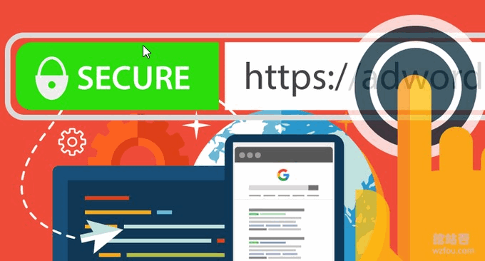](https://wzfou.com/wp-content/uploads/2018/07/ssl-ecc_00.png)

本篇文章就来分享一下HTTPS和[SSL优化](https://wzfou.com/tag/ssl-youhua/)使用几点心得体会，更多的有关于[SSL证书](https://wzfou.com/ssl/)和Https经验教程还有：

1. [免费SSL证书收集整理汇总-免费给网站添加Https安全加密访问](https://wzfou.com/mianfei-ssl/)
2. [十个你可能不知道的CloudFlare免费CDN加速技巧-SSL\\DDOS\\Cache](https://wzfou.com/cloudflare/)
3. [启用HSTS并加入HSTS Preload List让网站Https访问更加安全-附删除HSTS方法](https://wzfou.com/hsts-preload/)

**PS：2018年9月6日更新**，如果想要使用付费的DNS解析服务，这里有两个比较便宜的比较适合个人的DNS服务：[两款适合个人使用的DNS产品:ClouDNS和DNS Made Easy域名解析](https://wzfou.com/cloudns-dnsmadeeasy/)。

**PS：2019年1月15日更新，**想要SSL访问获得更快的速度以及更高的性能，可以试试TLSV1.3和Brotli压缩：[网站优化加速-开启TLSV1.3和Brotli压缩-Oneinstack,LNMP,宝塔面板](https://wzfou.com/tlsv1-3-brotli/)。

## 一、如何选择免费SSL证书？

**建议选择Let’s Encrypt。**Let’s Encrypt免费SSL证书虽然只有90天，但是可以无限期续期，并且支持手动和自动续期。Let’s Encrypt SSL在各大浏览器上都得到认可，是免费SSL证书的首选。教程：[Let’s Encrypt Wildcard 免费泛域名SSL证书一键申请与SSL使用教程](https://wzfou.com/lets-encrypt-wildcard-ssl/)。

[](https://wzfou.com/wp-content/uploads/2018/07/ssl-ecc_03.jpg)

Let’s Encrypt适用于VPS等有独立IP的主机上，否则只能使用一些利用Let’s Encrypt API开发的在线SSL证书申请。当然，有一定的经济实力的话自然选择付费的SSL证书更为可行，更多SSL证书见：[免费SSL证书收集整理汇总](https://wzfou.com/mianfei-ssl/)。

## 二、服务器开启HSTS

采用 HSTS 协议的网站将保证浏览器始终连接到网站的HTTPS版本，而不需要用户手动在URL地址栏中输入包含`https://`的加密地址。我用的是Nginx 服务器，只需要编辑 Nginx 配置文件（如：/usr/local/nginx/conf/nginx.conf）将下面行添加到 HTTPS 配置的 server 块中即可：

add_header Strict-Transport-Security "max-age=63072000; includeSubdomains; preload";

Apache、Lighttpd等启用HSTS详细的方法见：[服务器启用HSTS](https://wzfou.com/hsts-preload/#HSTS)。

[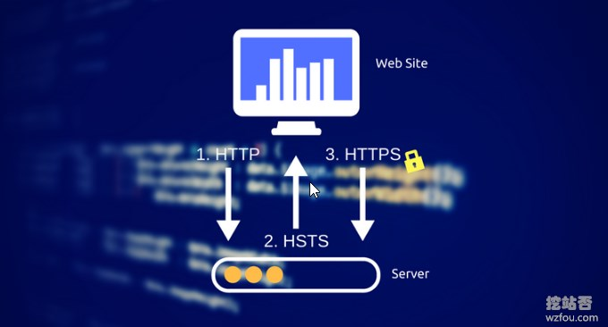](https://wzfou.com/wp-content/uploads/2018/07/ssl-ecc_04.jpg)

## 三、域名加入HSTS preload list计划

上面虽然是启用了HSTS 协议保证了用户访问的始终是Https连接，但是一般地首次访问网站用户都会习惯性地输入非https域名，这就导致了第一次访问网站容易出现http劫持的问题。HSTS preload list计划就是为了解决这个问题的，它是chrome\\Firefox\\Edge等浏览器内置的列表。

[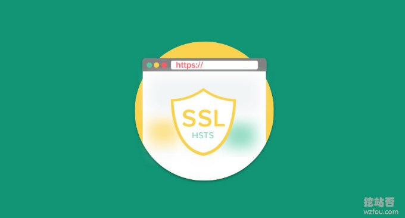](https://wzfou.com/wp-content/uploads/2018/07/ssl-ecc_04_1.jpg)

加入HSTS Preload List的方法：[启用HSTS并加入HSTS Preload List让网站Https访问更加安全-附删除HSTS方法](https://wzfou.com/hsts-preload/)。目前wzfou.com已经成功加入到了HSTS preload list，如果你用的是Chrome或者Firefox，第一次访问本站就是默认用Https连接的。

[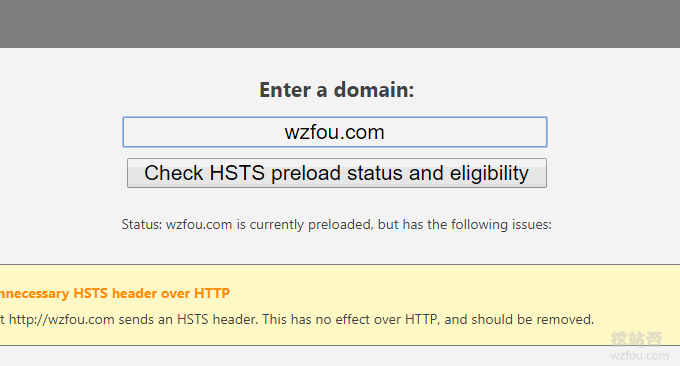](https://wzfou.com/wp-content/uploads/2018/07/ssl-ecc_05.gif)

## 四、开启HTTP/2和OCSP Stapling

HTTP/2 相比于之前的HTTP/1.1 在性能上的大幅度提升，所以只要你启用了Https，记得一定要开启HTTP/2，检查一下你的配置文件是否有：`listen 443 ssl http2;`

OCSP Stapling 服务器事先模拟浏览器对证书链进行验证，然后将 OCSP 验证结果缓存到本地。这样，当浏览器访问站点时，在握手阶段，可以直接拿到 OCSP 响应结果和证书链，对访问速度有明显提升。

[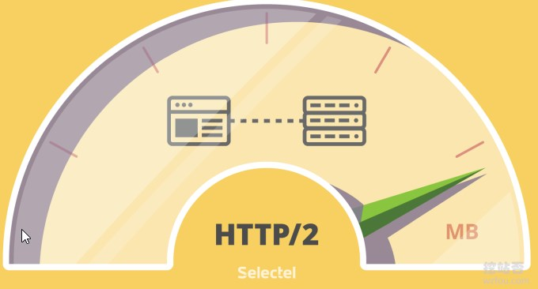](https://wzfou.com/wp-content/uploads/2018/07/ssl-ecc_06.jpg)

**Nginx 中开启 OCSP Stapling**。（如果 ssl\_certificate 指令指定了完整的证书链，则 ssl\_trusted_certificate 可省略）

```
ssl_stapling on;
ssl_stapling_verify on;
ssl_trusted_certificate /path/to/certs/chained.pem;
```

**Apache 中开启 OCSP Stapling**：

在 `<VirtualHost></VirtualHost>` 中添加:

```
SSLUseStapling on
```

在 `<VirtualHost></VirtualHost>` 外添加:

```
SSLStaplingCache shmcb:/tmp/stapling_cache(128000)
```

## 五、使用ECC和RSA双证书

默认的我们都会使用RSA证书，因为RSA证书的兼容性最为广泛。但是ECC 证书拥有体积小、运算速度快、安全性高（256位`ECC key`就能起到相当于3072位的`RSA key`的安全性）等特点，可以在一定程度上提供Https性能。

[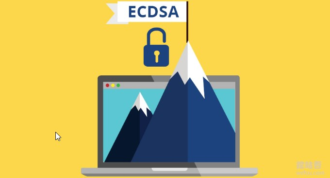](https://wzfou.com/wp-content/uploads/2018/07/ssl-ecc_07.jpg)

Let’s Encrypt已经支持生成ECC 证书了，使用 acme.sh 签发SSL证书， 指定 `--keylength ec-256` 就可以将证书类型改为 ECC：

acme.sh --issue -w /data/wwwroot/wzfou.com -d wzfou.com -d www.wzfou.com --keylength ec-256

需要注意的是ECC在Windows XP上不兼容，这个时候我们就会想到用双证书了，即当不支持ECC证书时Nginx自动将RSA证书展示给用户。如果nginx 的版本大于`1.11`，直接就可以在配置文件中写上ECC和RSA双证书的路径了，wzfou.com演示如下：

```
#ECC
ssl_certificate /root/.acme.sh/wzfou.com_ecc/fullchain.cer;
ssl_certificate_key /root/.acme.sh/wzfou.com_ecc/wzfou.com.key;
#RSA
ssl_certificate /usr/local/nginx/conf/ssl/wzfou.com.crt;
ssl_certificate_key /usr/local/nginx/conf/ssl/wzfou.com.key;

```

重启Nginx，当XP等不支持ECC证书的用户访问网站时，显示的是RSA证书。

[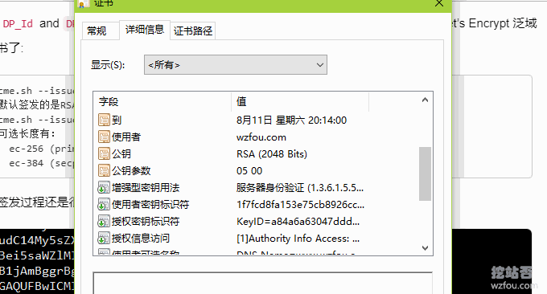](https://wzfou.com/wp-content/uploads/2018/07/ssl-ecc_02.gif)

而其它的用户则优先使用ECC证书。

[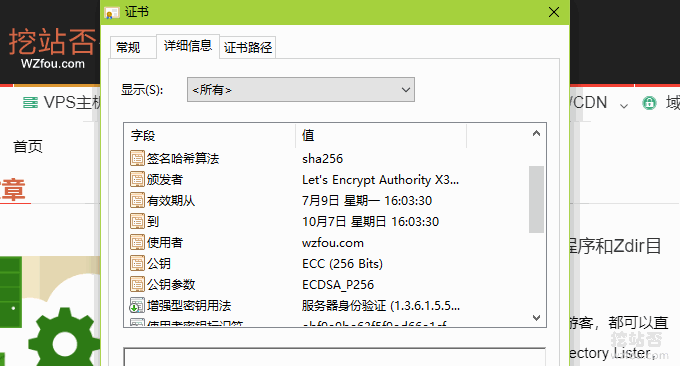](https://wzfou.com/wp-content/uploads/2018/07/ssl-ecc_03.gif)

如果你发现ECC没有优先显示，检查一下`ssl_prefer_server_ciphers`是否开启，同时`ssl_ciphers`有没有配置好，以下是wzfou.com当用的配置：

```
ssl_prefer_server_ciphers on;
ssl_ciphers EECDH+CHACHA20:EECDH+CHACHA20-draft:EECDH+ECDSA+AES128:EECDH+aRSA+AES128:RSA+AES128:EECDH+ECDSA+AES256:EECDH+aRSA+AES256:RSA+AES256:EECDH+ECDSA+3DES:EECDH+aRSA+3DES:RSA+3DES:!MD5;

```

另外，下面三个任选其一即可（仅供测试）：

```
ssl_ciphers 'EECDH+CHACHA20:EECDH+CHACHA20-draft:EECDH+ECDSA+AES128:EECDH+aRSA+AES128:RSA+AES128:EECDH+ECDSA+AES256:EECDH+aRSA+AES256:RSA+AES256:EECDH+ECDSA+3DES:EECDH+aRSA+3DES:RSA+3DES:!MD5';

ssl_ciphers 'ECDHE-ECDSA-CHACHA20-POLY1305:ECDHE-RSA-CHACHA20-POLY1305:ECDHE-ECDSA-AES128-GCM-SHA256:ECDHE-RSA-AES128-GCM-SHA256:ECDHE-ECDSA-AES256-GCM-SHA384:ECDHE-RSA-AES256-GCM-SHA384:DHE-RSA-AES128-GCM-SHA256:DHE-RSA-AES256-GCM-SHA384:ECDHE-ECDSA-AES128-SHA256:ECDHE-RSA-AES128-SHA256:ECDHE-ECDSA-AES128-SHA:ECDHE-RSA-AES256-SHA384:ECDHE-RSA-AES128-SHA:ECDHE-ECDSA-AES256-SHA384:ECDHE-ECDSA-AES256-SHA:ECDHE-RSA-AES256-SHA:DHE-RSA-AES128-SHA256:DHE-RSA-AES128-SHA:DHE-RSA-AES256-SHA256:DHE-RSA-AES256-SHA:ECDHE-ECDSA-DES-CBC3-SHA:ECDHE-RSA-DES-CBC3-SHA:EDH-RSA-DES-CBC3-SHA:AES128-GCM-SHA256:AES256-GCM-SHA384:AES128-SHA256:AES256-SHA256:AES128-SHA:AES256-SHA:DES-CBC3-SHA:!DSS';

ssl_ciphers 'ECDHE-ECDSA-CHACHA20-POLY1305:ECDHE-ECDSA-AES128-GCM-SHA256:ECDHE-ECDSA-AES256-GCM-SHA384:ECDHE-ECDSA-AES128-SHA256:ECDHE-ECDSA-AES128-SHA:ECDHE-ECDSA-AES256-SHA384:ECDHE-ECDSA-AES256-SHA:ECDHE-RSA-AES128-GCM-SHA256:ECDHE-RSA-AES256-GCM-SHA384:DHE-RSA-AES128-GCM-SHA256:DHE-DSS-AES128-GCM-SHA256:kEDH+AESGCM:ECDHE-RSA-AES128-SHA256:ECDHE-RSA-AES128-SHA:ECDHE-RSA-AES256-SHA384:ECDHE-RSA-AES256-SHA:DHE-RSA-AES128-SHA256:DHE-RSA-AES128-SHA:DHE-DSS-AES128-SHA256:DHE-RSA-AES256-SHA256:DHE-DSS-AES256-SHA:DHE-RSA-AES256-SHA:AES128-GCM-SHA256:AES256-GCM-SHA384:AES128-SHA256:AES256-SHA256:AES128-SHA:AES256-SHA:AES:CAMELLIA:!aNULL:!eNULL:!EXPORT:!DES:!RC4:!3DES:!MD5:!PSK';
```

## 六、 开启DNS CAA

DNS CAA的作用是只允许在记录中列出的 CA 机构颁发针对该域名(或子域名)的证书，以防止有人伪造SSL证书，同时CAA 记录可以控制单域名 SS L证书的发行，也可以控制通配符证书。详细方法见：[京东云DNS设置CAA](https://wzfou.com/jdcloud-dns/#ftoc-heading-3)。

[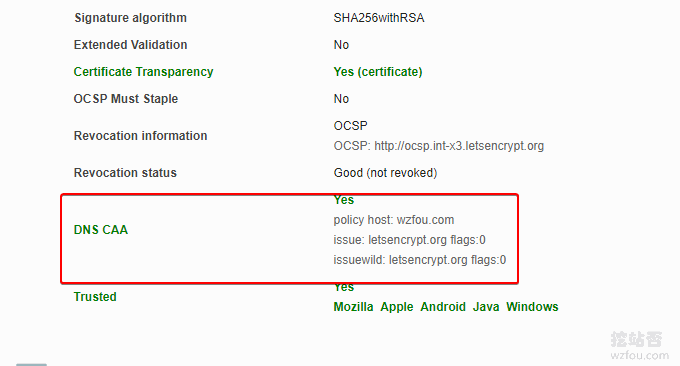](https://wzfou.com/wp-content/uploads/2018/07/ssl-ecc_08.gif)

**问题：**开启DNS CAA导致错误：Verify error:CAA record for *.wzfou.comprevents issuance。解决的办法就是增加 `issuewild` 记录： `0 issuewild "letsencrypt.org"` 。 另外提供两个检测CAA配置是否正确的网站：

1. https://caatest.co.uk/
2. https://dnsspy.io/labs/caa-validator

## 七、定期自动更新SSL证书

想手动更新方法：

```
# RSA
$ acme.sh --renew -d wzfou.com –d www.wzfou.com --force

# ECC
acme.sh --renew -d wzfou.com –d www.wzfou.com --force --ecc
```

一般地acme.sh已经自动添加了定时任务了，定期更新Let’s Encrypt证书，如果你发现没有定期更新证书，检查一下你的Cron任务是否正确，也可以试试强制更新：

```
"/root/.acme.sh"/acme.sh --cron --home "/root/.acme.sh" --force
```

[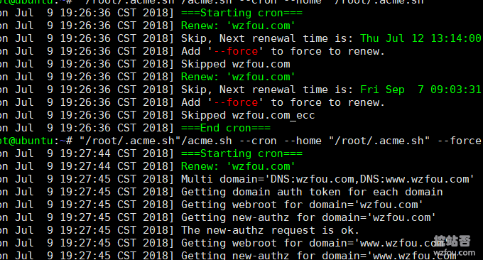](https://wzfou.com/wp-content/uploads/2018/07/ssl-ecc_18.gif)

## 八、检测SSL证书配置

常用的检测网站有：

1. https://www.ssllabs.com/ssltest/analyze.html
2. https://myssl.com/

重点推荐用ssllabs.com，检测的结果还是非常地准确，如下：

[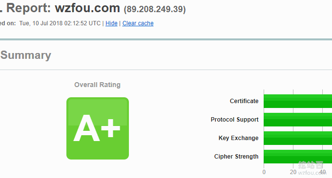](https://wzfou.com/wp-content/uploads/2018/07/ssl-ecc_19.gif)

## 九、综合

综合以上优化策略，Nginx的配置文件具体的优化如下：

```
server {

listen 443 ssl http2;
#使用HTTP/2，需要Nginx1.9.7以上版本

add_header Strict-Transport-Security "max-age=6307200; includeSubdomains; preload";
#开启HSTS，并设置有效期为“6307200秒”（6个月），包括子域名(根据情况可删掉)，预加载到浏览器缓存(根据情况可删掉)

add_header X-Frame-Options DENY;
#禁止被嵌入框架

add_header X-Content-Type-Options nosniff;
#防止在IE9、Chrome和Safari中的MIME类型混淆攻击

ssl_certificate /usr/local/nginx/conf/vhost/sslkey/www.linpx.com.crt;
ssl_certificate_key /usr/local/nginx/conf/vhost/sslkey/www.linpx.com.key;
#SSL证书文件位置

ssl_trusted_certificate /usr/local/nginx/conf/vhost/sslkey/chaine.pem;
#OCSP Stapling的证书位置

ssl_dhparam /usr/local/nginx/conf/vhost/sslkey/dhparam.pem;
#DH-Key交换密钥文件位置

#SSL优化配置

ssl_protocols TLSv1 TLSv1.1 TLSv1.2;
#只允许TLS协议

ssl_ciphers EECDH+CHACHA20:EECDH+CHACHA20-draft:EECDH+AES128:RSA+AES128:EECDH+AES256:RSA+AES256:EECDH+3DES:RSA+3DES:!MD5;
#加密套件,这里用了CloudFlare's Internet facing SSL cipher configuration

ssl_prefer_server_ciphers on;
#由服务器协商最佳的加密算法

ssl_session_cache builtin:1000 shared:SSL:10m;
#Session Cache，将Session缓存到服务器，这可能会占用更多的服务器资源

ssl_session_tickets on;
#开启浏览器的Session Ticket缓存

ssl_session_timeout 10m; 
#SSL session过期时间

ssl_stapling on; 
#OCSP Stapling开启,OCSP是用于在线查询证书吊销情况的服务，使用OCSP Stapling能将证书有效状态的信息缓存到服务器，提高TLS握手速度

ssl_stapling_verify on;
#OCSP Stapling验证开启

resolver 8.8.8.8 8.8.4.4 valid=300s;
#用于查询OCSP服务器的DNS

resolver_timeout 5s;
#查询域名超时时间

···

}
```

实际使用过程中发现个别的“优化”还得根据自身的需要来确定，以下是wzfou.com正在用的Nginx配置，仅供参考：

```
listen 80; 
listen 443 ssl http2;
#ECC
ssl_certificate /root/.acme.sh/wzfou.com_ecc/fullchain.cer;
ssl_certificate_key /root/.acme.sh/wzfou.com_ecc/wzfou.com.key;  
#RSA 
ssl_certificate /usr/local/nginx/conf/ssl/wzfou.com.crt;
ssl_certificate_key /usr/local/nginx/conf/ssl/wzfou.com.key; 
ssl_protocols TLSv1 TLSv1.1 TLSv1.2;
ssl_ciphers EECDH+CHACHA20:EECDH+CHACHA20-draft:EECDH+ECDSA+AES128:EECDH+aRSA+AES128:RSA+AES128:EECDH+ECDSA+AES256:EECDH+aRSA+AES256:RSA+AES256:EECDH+ECDSA+3DES:EECDH+aRSA+3DES:RSA+3DES:!MD5;
ssl_prefer_server_ciphers on;
ssl_session_timeout 10m;
ssl_session_cache builtin:1000 shared:SSL:10m;
ssl_buffer_size 1400;
add_header Strict-Transport-Security "max-age=63072000; includeSubdomains; preload";
ssl_stapling on; 
ssl_stapling_verify on;

```

**PS：2018年8月5日更新**，感谢[xiaoz](https://wzfou.com/https-ssl/#comment-7061)的提醒，这里有一个在线生成SSL配置的网站，出自Mozilla，参考性非常高：

1. https://mozilla.github.io/server-side-tls/ssl-config-generator/