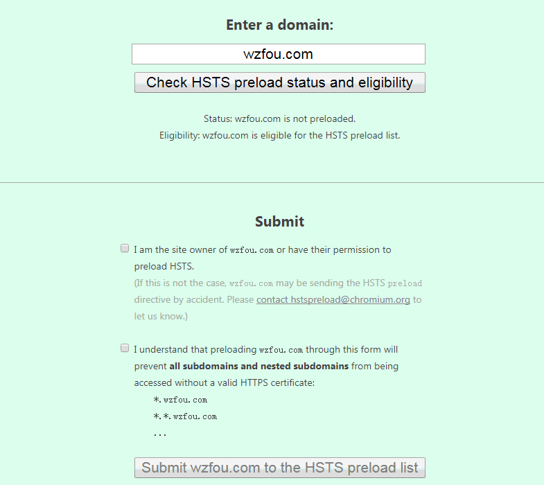

# 启用HSTS并加入HSTS Preload List让网站Https访问更加安全-附删除HSTS方法
之所以想起要启用HSTS，主要是最近不少的朋友说网站打不开了，虽然Ping值一切正常，但是就是网页无法访问。猜测可能是DNS解析这一环节出了问题。另外自己本地的DNS劫持已经到了“丧心病狂”的地步了，不加Https访问京东淘宝等全部被加入各种推广。

启用HSTS后自然想要加入HSTS Preload List了，这是各大浏览器都遵循的一个强制使用Https访问的网站列表，只要加入到这个列表中，所有的通过浏览器访问请求都会强制走Https，这在很大程度上可以杜绝“第一次”访问的劫持，最大限度地提高Https访问的安全性。

需要注意的是加入[HSTS Preload List](https://wzfou.com/tag/hsts-preload-list/)需要以根域名的形式加入，如果你启用了www.wzfou.com这样的二级域名形式访问，你需要先停止301跳转，即要保证wzfou.com这样的根域名是用Https可以访问到的。（PS：之前我有一个网站就是这样的情况，如有变化大家在申请时结合具体情况分析）。

[HSTS](https://wzfou.com/tag/hsts/)是在服务器强化Https安全，如果你的网站还没有启用Https，可以试试免费的SSL证书Let’s Encrypt，最近还推出了免费泛域名证书：[Let’s Encrypt Wildcard 免费泛域名SSL证书一键申请与SSL使用教程](https://wzfou.com/lets-encrypt-wildcard-ssl/)，更多的关于[建站](https://wzfou.com/jianzhan/)的经验与技巧，你可以看看：

1. [站长必备技能批量给图片添加水印-XnView和美图秀秀批量处理方法](https://wzfou.com/watermark/)
2. [PayPal连连提现五个注意事项-账号绑定,失败锁定,手续费与提现时长](https://wzfou.com/paypal-lianlian/)
3. [自建CDN加速-Nginx反向绑定,缓存加速,自动更新缓存和获取真实IP](https://wzfou.com/nginx-cdn/)

**PS：2018年8月6日更新，**服务器启用SSL证书其实也是一种资源开消，如何最大限度地减少这种资源消耗提升https访问速度，参考这里：[八个HTTPS和SSL优化使用心得-减少等待时间和降低Https性能损耗](https://wzfou.com/https-ssl/)。

## 一、服务器启用HSTS

HSTS是国际互联网工程组织 IETE 正在推行一种新的 Web安全协议HTTP Strict Transport Security（HSTS）。采用 HSTS 协议的网站将保证浏览器始终连接到该网站的 HTTPS 加密版本，不需要用户手动在 URL 地址栏中输入加密地址。

### 1.1  Apache2 配置 HSTS

编辑你的 apache 配置文件（如 /etc/apache2/sites-enabled/website.conf 和 /etc/apache2/httpd.conf ），并加以下行到你的 HTTPS VirtualHost：

\# Apache需加载mod\_header库，一般位于httpd.conf文件，搜索mod\_headers并取消注释。（已加载可跳过）
LoadModule headers\_module modules/mod\_headers.so   #然后对应站点VirtualHost里面插入HSTS响应头信息

Header always set Strict-Transport-Security "max-age=63072000; includeSubdomains; preload"

保存 Apache 配置文件，然后重启。现在你的 web 站点在每次访问时都会发送该请求头，失效时间是两年（秒数），这个失效时间每次都会设置为两年后。

### 1.2  Nginx 配置 HSTS

Nginx 服务器中的配置最为简单，只需要编辑 Nginx 配置文件（如：/usr/local/nginx/conf/nginx.conf）将下面行添加到你的 HTTPS 配置的 server 块中即可：

add_header Strict-Transport-Security "max-age=63072000; includeSubdomains; preload";

如果你发现直接添加在 server 块中无效的情况，你可以试试直接插入到 location ~ *php 内：

location ~ \[^/\]\\.php(/|$) {
	add_header Strict-Transport-Security "max-age=63072000; includeSubdomains; preload";
}

配置保存后重启 Nginx 服务。

### 1.3  在 Lighttpd 中配置 HSTS

将下述配置增加到你的 Lighttpd 配置文件（例如：/etc/lighttpd/lighttpd.conf）：

server.modules += ( "mod_setenv" )
$HTTP\["scheme"\] == "https" {
	setenv.add-response-header  = ( "Strict-Transport-Security" => "max-age=63072000; includeSubdomains; preload")
}

编辑保存后记得重启一下。

### 1.4  PHP通用配置 HSTS 方法

将以下代码添加到网站根目录 index.php 中或者header.php中

header("Strict-Transport-Security: max-age=63072000; includeSubdomains; preload");

开启了HSTS后，你部署SSL/TLS的服务检测得分就可能是A+以上了。ssllabs官网以及演示如下：

1. 官网：https://www.ssllabs.com/
2. 中文版：https://myssl.com
3. 演示：https://www.ssllabs.com/ssltest/analyze.html?d=wzfou.com

## 二、加入HSTS Preload List

HSTS preload list是Chrome浏览器中的HSTS预载入列表，在该列表中的网站，使用Chrome浏览器访问时，会自动转换成HTTPS。Firefox、Safari、Edge浏览器也在采用这个列表。

1. https://hstspreload.org/
2. https://wzfou.com/cloudflare/

### 2.1  测试HSTS是否生效

直接打开Chrome查看网络，就可以看到头部已经包含了HSTS信息了。

### 2.2 做好Http跳转Https

将wzfou.com以及任意二级域名都要做好Http跳转到Https，启用了HSTS后请求地址为 header 头中的 `Location`会显示307 ，即要求浏览器继续向 Location 的地址 POST 内容。

### 2.3  加入HSTS Preload List

进入hstspreload官网，输入你的域名，然后检测结果会告诉是否符合加入HSTS Preload List，没有问题的话勾选确定。（点击放大）

HSTS Preload List审核的时间有长有短，一旦提交后你就只能等待。

## 三、HSTS Preload List问题

### 3.1  是否成功加入HSTS Preload List

直接到下列网址搜索是否有你的域名即可：

1. https://cs.chromium.org/chromium/src/net/http/transport\_security\_state_static.json

当然，加入到了HSTS Preload List后，你可能还需要等待1-2月，待新版本的Chrome和Chromium、Firefox、IE等发布后，你的域名算是正式被各大浏览器承认并强制使用Https访问了，你可以在Chrome浏览器的地址框中输入“chrome://net-internals/#hsts”查看。

### 3.2  如何撤销HSTS Preload List

1. https://hstspreload.org/removal/

官方也提供了一个申请[删除HSTS](https://wzfou.com/tag/del-hsts/) Preload List，不过需要注意的是撤销HSTS Preload List和加入HSTS Preload List一样，花费的时间可能需要几个月以上，所以[申请HSTS](https://wzfou.com/tag/shenqing-hsts/) Preload List前一定要谨慎。

## 四、总结

由于HSTS Preload List是一个内置于各大浏览器的Https网站列表，所以能否加入成功除了审核通过外，还得看浏览器版本的更新。一旦加入HSTS Preload List了想要退出就比较麻烦了，所以加入前一定要考虑好。

那么哪些网站适合加入HSTS Preload List？个人博客或者网站可以来玩一玩，对于安全性要求比较高的电商网站，会员管理后台等完全可以使用HSTS Preload List，对于一些有Http需要的还是不加入得好。