# 简单三步给网站申请安装letsencrypt免费SSL证书-acme.sh自动续期
昨天晚上花了一个小时的时间把[挖站否VPS监控](https://ping.wzfou.com/)SSL证书由原来的TrustAsia即赛门铁克(Symantec)个人DV SSL证书换成了letsencrypt免费SSL证书，原因是Chrome 70开始将开始不再信任 Symantec证书了，自己正在用的Chromium浏览器已经不能再打开Symantec证书的网站了。

赛门铁克(Symantec)个人DV SSL证书是在[腾讯云](https://wzfou.com/tag/tencent-yun/)申请的，实际上国内的阿里云、[七牛云](https://wzfou.com/tag/qiniuyun/)、[又拍云](https://wzfou.com/tag/youpaiyun/)等都提供了免费一年赛门铁克(Symantec)个人DV SSL证书。**自己犯了错，干脆把之前的SSL产品趁“打烊”之前清仓大处理了？**这也怪不得赛门铁克(Symantec)在国内搞了这么多的**免费推广**。

本篇文章就来分享一下利用**acme.sh**来一键申请和安装letsencrypt免费SSL证书，基本上可以适合各大VPS主机服务器，而且[acme.sh](https://wzfou.com/tag/acme-sh/)可以自动更新SSL证书，再也不用担心SSL证书会过期的问题的。从我的个人使用经验来看，官方推荐的Certbot还是不如**acme.sh**好用一些。

[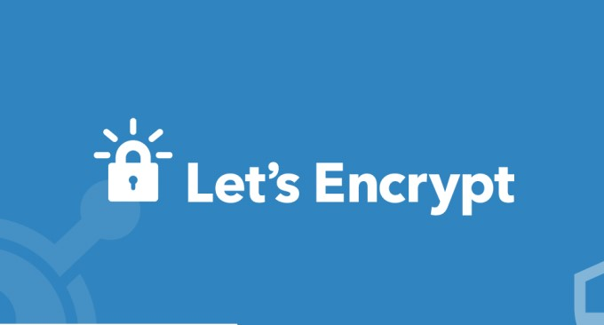](https://wzfou.com/wp-content/uploads/2018/08/letsencrypt-acme_00.jpg)

更多的[VPS主机](https://wzfou.com/vps/)及[SSL证书](https://wzfou.com/ssl/)还可以看看：

1. [免费SSL证书收集整理汇总-免费给网站添加Https安全加密访问](https://wzfou.com/mianfei-ssl/)
2. [CN2 GIA VPS主机收集整理汇总-电信,联通,移动三网CN2 GIA线路VPS主机](https://wzfou.com/cn2-gia-vps/)
3. [启用HSTS并加入HSTS Preload List让网站Https访问更加安全-附删除HSTS方法](https://wzfou.com/hsts-preload/)

**PS：2019年1月15日更新，**想要SSL访问获得更快的速度以及更高的性能，可以试试TLSV1.3和Brotli压缩：[网站优化加速-开启TLSV1.3和Brotli压缩-Oneinstack,LNMP,宝塔面板](https://wzfou.com/tlsv1-3-brotli/)。

## 一、第一步：一键安装acme.sh

网站：

1. https://letsencrypt.org/
2. https://github.com/Neilpang/acme.sh

使用以下可以一键安装：

curl https://get.acme.sh | sh

或者:

wget -O -  https://get.acme.sh | sh

使用喜欢Git命令也可以用以下命令安装:

git clone https://github.com/Neilpang/acme.sh.git
cd ./acme.sh
./acme.sh --install

脚本主要做了以下事情:

> 1.生成复制了`acme.sh` 到你的(`$HOME`): `~/.acme.sh/`目录下 ，后面所有的证书都会在这个目录生成.
> 
> 2.Create alias for: `acme.sh=~/.acme.sh/acme.sh`. 注意：**安装完成后你需要关闭再打开终端才可以让alias 生效。**
> 
> 3.增加了一个定时任务，用于SSL证书更新.

[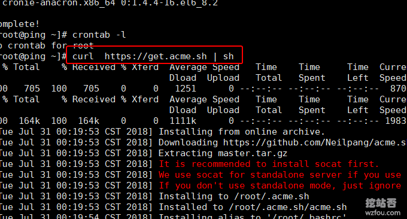](https://wzfou.com/wp-content/uploads/2018/08/letsencrypt-acme_01.gif)

你可以使用Crontab -l来查看当前的定时任务：

[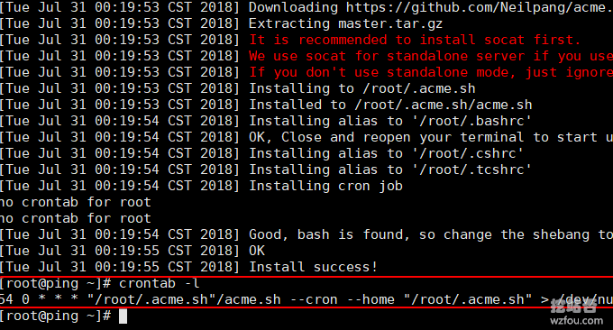](https://wzfou.com/wp-content/uploads/2018/08/letsencrypt-acme_02.gif)

同时你也可以使用SFTP来查看`acme.sh` 文件夹。

[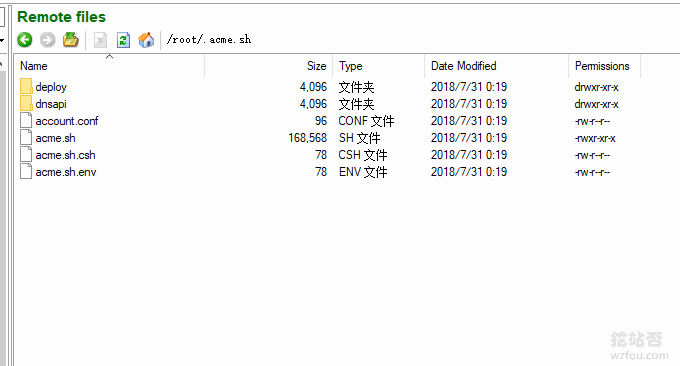](https://wzfou.com/wp-content/uploads/2018/08/letsencrypt-acme_03.gif)

## 二、第二步：一键签发SSL证书

### 2.1  单个域名SSL

注意：-w后面是域名的根目录，请根据实际修改.

acme.sh --issue -d wzfou.com -w /home/wwwroot/wzfou.com
#默认签发的是RSA，如果你想签发ECC证书，请使用以下命令
acme.sh --issue -d wzfou.com -w /home/wwwroot/wzfou.com --keylength ec-256 

或者:

acme.sh --issue -d wzfou.com -w /home/wzfou/public_html
#默认签发的是RSA，如果你想签发ECC证书，请使用以下命令
acme.sh --issue -d wzfou.com -w /home/wzfou/public_html --keylength ec-256

或者:

acme.sh --issue -d wzfou.com -w /var/www/html
#默认签发的是RSA，如果你想签发ECC证书，请使用以下命令
acme.sh --issue -d wzfou.com -w /var/www/html  --keylength ec-256

### 2.2  多个域名SSL

acme.sh --issue -d wzfou.com -d www.wzfou.com -d cp.wzfou.com -w /home/wwwroot/wzfou.com
#默认签发的是RSA，如果你想签发ECC证书，请使用以下命令
acme.sh --issue -d wzfou.com -d www.wzfou.com -d cp.wzfou.com -w /home/wwwroot/wzfou.com --keylength ec-256 

### 2.3  泛域名SSL

注意：[泛域名SSL证书](https://wzfou.com/tag/mianfei-wildcard-ssl/)签发要用到DNS验证的方式，参考2.4部分。

```
acme.sh --issue --dns dns_dp -d wzfou.com -d *.wzfou.com
#默认签发的是RSA，如果你想签发ECC证书，请使用以下命令
acme.sh --issue --dns dns_dp -d wzfou.com -d *.wzfou.com --keylength ec-256
#可选长度有：
   ec-256 (prime256v1, “ECDSA P-256”)
   ec-384 (secp384r1, “ECDSA P-384”)

```

### 2.4  无法验证域名？

上面通过指定网站根目录的验证域名的方法有时会失效，也有朋友VPS上没有安装Web环境，无法使用80端口。

[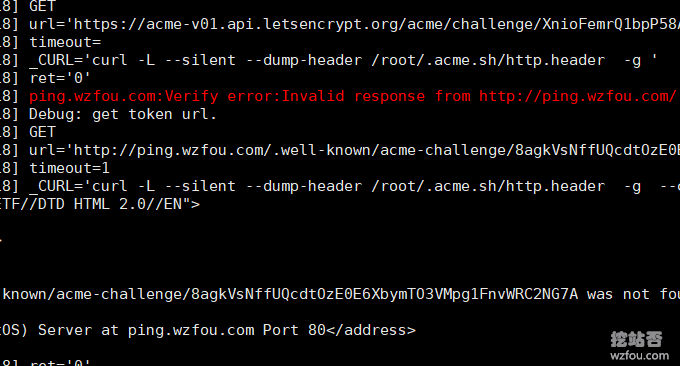](https://wzfou.com/wp-content/uploads/2018/08/letsencrypt-acme_04.gif)

这里`acme.sh` 提供了一个添加DNS API自动验证域名的方式，首先到你的域名DNS处获得API，这里我以[NS1 DNS域名解析](https://wzfou.com/ns1-dns/)来作为演示，首先到官网后台获得API（**其它的DNS，如DNSPOD、Cloudxns、阿里云DNS等使用API的方法见本文第四部分**）。

[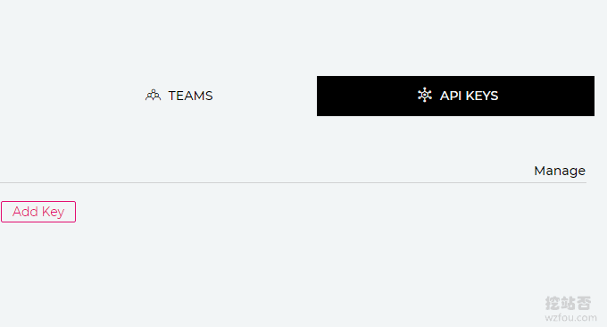](https://wzfou.com/wp-content/uploads/2018/08/letsencrypt-acme_05.gif)

然后是导入NS1.com API

```
export NS1_Key="fdmlfxxxxxxxfk"

```

现在就可以开始签发SSL证书了:

```
acme.sh --issue --dns dns_nsone -d wzfou.com -d www.wzfou.com
#或者签发ECC证书
acme.sh --issue --dns dns_nsone -d wzfou.com -d www.wzfou.com --keylength ec-256
```

[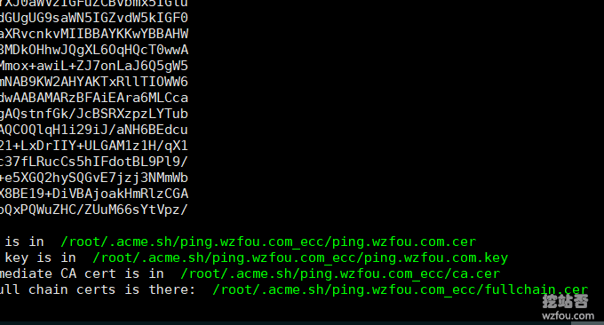](https://wzfou.com/wp-content/uploads/2018/08/letsencrypt-acme_07.gif)

使用DNS API验证域名的方式有一个好处就是不需要WEB访问就可以签发SSL证书，`acme.sh` 会在你的DNS域名解析处添加一个TXT记录，验证成功后会自动删除该TXT记录。

[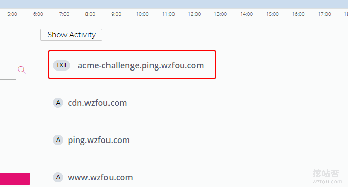](https://wzfou.com/wp-content/uploads/2018/08/letsencrypt-acme_06.gif)

## 三、第三步：安装letsencrypt SSL证书

这一步部分其实可以根据各自的实际来执行了，为了让`acme.sh` 可以自动更新续期SSL证书，建议使用以下操作方法来执行，这样`acme.sh` 每次更新完了SSL证书后都自动按照你第一次安装SSL证书的方法执行一遍同步SSL证书的命令。

**Apache** 服务器安装letsencrypt SSL证书如下：:

acme.sh --install-cert -d wzfou.com \
--cert-file      /path/to/certfile/in/apache/cert.pem  \
--key-file       /path/to/keyfile/in/apache/key.pem  \
--fullchain-file /path/to/fullchain/certfile/apache/fullchain.pem \
--reloadcmd     "service apache2 force-reload"

**Nginx** 服务器安装letsencrypt SSL证书e:

acme.sh --install-cert -d wzfou.com \
--key-file       /path/to/keyfile/in/nginx/key.pem  \
--fullchain-file /path/to/fullchain/nginx/cert.pem \
--reloadcmd     "service nginx force-reload"

实际操作中，大家根据需要调整好证书和密钥的路径，由于我使用的ECC证书，并且重启Apache2的命令无效，所以我用的以下命令：

```
acme.sh --install-cert -d ping.wzfou.com --ecc \
--cert-file     /etc/pki/tls/certs/ping.wzfou.com.cer  \
--key-file       /etc/pki/tls/certs/ping.wzfou.com.key  \
--fullchain-file /etc/pki/tls/certs/fullchain.cer \
--reloadcmd     "/etc/init.d/httpd force-reload"
```

[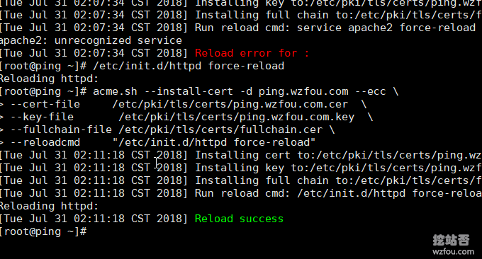](https://wzfou.com/wp-content/uploads/2018/08/letsencrypt-acme_08.gif)

执行命令后，我们就可以在路径中看到已经复制过来的证书还有Key等文件了，下次`acme.sh` 执行更新SSL证书时也会同样执行上述的命令。否则，需要自己手动复制粘贴证书。

[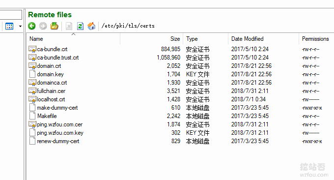](https://wzfou.com/wp-content/uploads/2018/08/letsencrypt-acme_09.gif)

最后记得到Apache或者Nginx的配置中调整好证书和Key的路径，重启Apache或者Nginx就算完成了。

[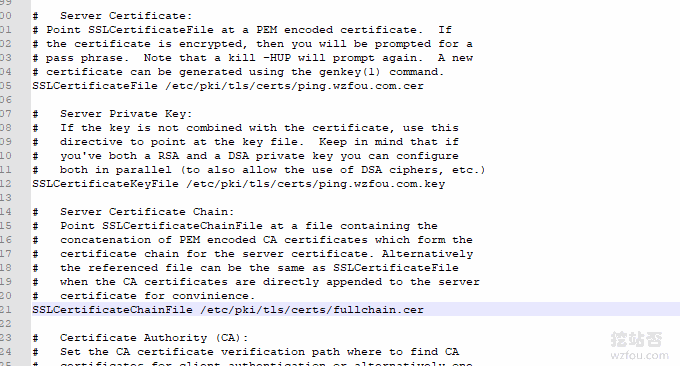](https://wzfou.com/wp-content/uploads/2018/08/letsencrypt-acme_10.gif)

如果你发现letsencrypt SSL证书不能定时更新，你也可以自己手动强制更新:

acme.sh --renew -d example.com --force

如果是ECC cert，使用以下命令:

acme.sh --renew -d example.com --force --ecc

目前wzfou.com用的就是letsencrypt SSL证书。

[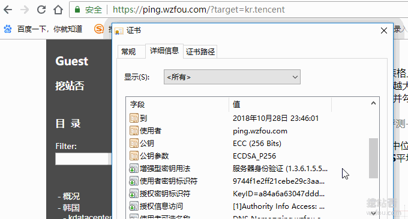](https://wzfou.com/wp-content/uploads/2018/08/letsencrypt-acme_11.gif)

## 四、附录：各大DNS API获取与签发SSL

**说明**：

1. 附录参考自：https://github.com/Neilpang/acme.sh/blob/master/dnsapi/README.md
2. DNS解析服务汇总：https://wzfou.com/mianfei-dns/
3. 签发泛域名SSL时请把命令部分：`-d www.example.com` 改成 ：`-d *.example.com`

**4.1  CloudFlare DNS API**

First you need to login to your [CloudFlare](https://wzfou.com/tag/cloudflare/) account to get your API key.

```
export CF_Key="sdfsdfsdfljlbjkljlkjsdfoiwje"
export CF_Email="xxxx@sss.com"

```

Ok, let’s issue a cert now:

```
acme.sh --issue --dns dns_cf -d example.com -d www.example.com

```

The `CF_Key` and `CF_Email` will be saved in `~/.acme.sh/account.conf` and will be reused when needed.

**4.2  DNSPod DNS API**

First you need to login to your DNSPod account to get your API Key and ID.

```
export DP_Id="1234"
export DP_Key="sADDsdasdgdsf"

```

Ok, let’s issue a cert now:

```
acme.sh --issue --dns dns_dp -d example.com -d www.example.com

```

The `DP_Id` and `DP_Key` will be saved in `~/.acme.sh/account.conf` and will be reused when needed.

**4.3  CloudXNS DNS API**

First you need to login to your CloudXNS account to get your API Key and Secret.

```
export CX_Key="1234"
export CX_Secret="sADDsdasdgdsf"

```

Ok, let’s issue a cert now:

```
acme.sh --issue --dns dns_cx -d example.com -d www.example.com

```

The `CX_Key` and `CX_Secret` will be saved in `~/.acme.sh/account.conf` and will be reused when needed.

**4.4  阿里云Aliyun DNS API**

First you need to login to your [阿里云](https://wzfou.com/tag/aliyun/) Aliyun account to get your API key. https://ak-console.aliyun.com/#/accesskey

```
export Ali_Key="sdfsdfsdfljlbjkljlkjsdfoiwje"
export Ali_Secret="jlsdflanljkljlfdsaklkjflsa"

```

Ok, let’s issue a cert now:

```
acme.sh --issue --dns dns_ali -d example.com -d www.example.com

```

The `Ali_Key` and `Ali_Secret` will be saved in `~/.acme.sh/account.conf` and will be reused when needed.

**4.5  GoDaddy DNS API**

First you need to login to your GoDaddy account to get your API Key and Secret. https://developer.godaddy.com/keys/

Please create a Production key, instead of a Test key.

```
export GD_Key="sdfsdfsdfljlbjkljlkjsdfoiwje"
export GD_Secret="asdfsdafdsfdsfdsfdsfdsafd"

```

Ok, let’s issue a cert now:

```
acme.sh --issue --dns dns_gd -d example.com -d www.example.com

```

The `GD_Key` and `GD_Secret` will be saved in `~/.acme.sh/account.conf` and will be reused when needed.

**4.6  PowerDNS DNS API**

First you need to login to your PowerDNS account to enable the API and set your API-Token in the configuration. https://doc.powerdns.com/md/httpapi/README/

```
export PDNS_Url="http://ns.example.com:8081"
export PDNS_ServerId="localhost"
export PDNS_Token="0123456789ABCDEF"
export PDNS_Ttl=60

```

Ok, let’s issue a cert now:

```
acme.sh --issue --dns dns_pdns -d example.com -d www.example.com

```

The `PDNS_Url`, `PDNS_ServerId`, `PDNS_Token` and `PDNS_Ttl` will be saved in `~/.acme.sh/account.conf`and will be reused when needed.

**4.7  Amazon Route53 DNS API**

方法见：https://github.com/Neilpang/acme.sh/wiki/How-to-use-Amazon-Route53-API

```
export  AWS_ACCESS_KEY_ID=XXXXXXXXXX
export  AWS_SECRET_ACCESS_KEY=XXXXXXXXXXXXXXX

```

To issue a cert:

```
acme.sh --issue --dns dns_aws -d example.com -d www.example.com

```

The `AWS_ACCESS_KEY_ID` and `AWS_SECRET_ACCESS_KEY` will be saved in `~/.acme.sh/account.conf` and will be reused when needed.

**4.8  Linode DNS API**

First you need to login to your [Linode](https://wzfou.com/tag/linode/) account to get your API Key. https://manager.linode.com/profile/api

Then add an API key with label *ACME* and copy the new key.

export LINODE\_API\_KEY="..."

Due to the reload time of any changes in the DNS records, we have to use the `dnssleep` option to wait at least 15 minutes for the changes to take effect.

Ok, let’s issue a cert now:

acme.sh --issue --dns dns_linode --dnssleep 900 -d example.com -d www.example.com

The `LINODE_API_KEY` will be saved in `~/.acme.sh/account.conf` and will be reused when needed.

**4.9  DigitalOcean DNS API (native)**

You need to obtain a read and write capable API key from your [DigitalOcean](https://wzfou.com/tag/digitalocean/) account. See: https://www.digitalocean.com/help/api/

```
export DO_API_KEY="75310dc4ca779ac39a19f6355db573b49ce92ae126553ebd61ac3a3ae34834cc"

```

Ok, let’s issue a cert now:

```
acme.sh --issue --dns dns_dgon -d example.com -d www.example.com

```

**4.10 Namesilo DNS API**

You’ll need to generate an API key at https://www.namesilo.com/account_api.php Optionally you may restrict the access to an IP range there.

```
export Namesilo_Key="xxxxxxxxxxxxxxxxxxxxxxxx"

```

And now you can issue certs with:

```
acme.sh --issue --dns dns_namesilo --dnssleep 900 -d example.com -d www.example.com

```

**4.11  使用自定义API**

If your API is not supported yet, you can write your own DNS API.

Let’s assume you want to name it ‘myapi’:

1. Create a bash script named `~/.acme.sh/dns_myapi.sh`,
2. In the script you must have a function named `dns_myapi_add()` which will be called by acme.sh to add the DNS records.
3. Then you can use your API to issue cert like this:

```
acme.sh --issue --dns dns_myapi -d example.com -d www.example.com

```

## 五、总结

letsencrypt免费SSL证书申请与安装过程还是挺简单的，只需要一个VPS主机，不管有没有安装Web环境都可以签发SSL证书，个人觉得DNS验证方式是最方便的。

[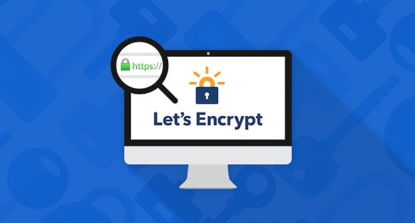](https://wzfou.com/wp-content/uploads/2018/08/letsencrypt-acme_01.jpg)

没有VPS主机的同学该如何使用letsencrypt免费SSL证书呢？**方法一：**手动在线申请，[三个在线免费SSL证书申请地址](https://wzfou.com/ssl-for-free/); **方法二：**直接用Cpanel、DirectAdmin面板自带的SSL申请。