# 网站优化加速-开启TLSV1.3和Brotli压缩-Oneinstack,LNMP,宝塔面板
网站放在国外，所以一直想着如何最大限度地加快网页的打开速度。之前使用了[阿里云香港VPS](https://wzfou.com/alibabacloud-hk/)主机，速度倒是挺快的，但是经常有同学向我反映打不开，或者是陆续访问不了。经过排查确定是问题出在SSL握手阶段，于是换到[CN2 GIA VPS](https://wzfou.com/cn2-vps-gia/)。

虽然是用的是[CN2 GIA VPS](https://wzfou.com/cn2-vps-gia/)，速度也感觉挺快的，但是毕竟距离远，仅从线路来讲反应速度还是稍微慢了一些，尤其是Wordpress，运行还是比较消耗主机资源的。于是先从缓存入手，启用了Nginx缓存：[Nginx fastcgi_cache缓存加速方法-Nginx配置实例](https://wzfou.com/nginx-fastcgi-cache/)。

本篇文章再来分享一下网站优化加速方法：开启TLSV1.3和Brotli压缩。相对于TLSV1.2，TLSV1.3主要是减少握手延迟，提高跨协议攻击的难度，使互联网更快，更多安全。Brotli是由谷歌开发的压缩算法，与其他压缩算法相比，它有着更高的压缩效率。

一般来说我们的VPS主机已经默认开启了GZIP压缩了，而Brotli与GZIP可以同时共存，当**同时开启两种压缩算法时，Brotli 压缩等级优先级高于 Gzip。**实际上，最新版的宝塔BT面板、Oneinstack和LNMP都已经默认可以开启TLSV1.3，各大面板使用：[服务器控制面板榜单](https://wzfou.com/vps-mianban/)。

[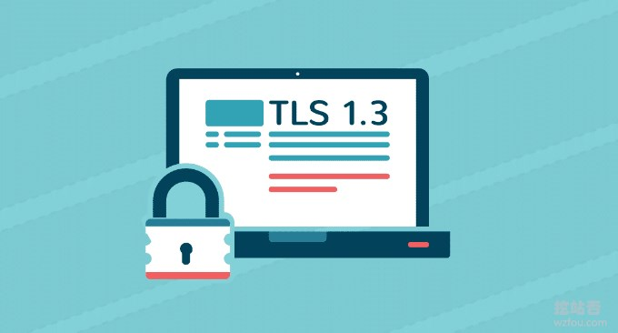](https://wzfou.com/wp-content/uploads/2019/01/one-tls_01.jpg)

更多的关于网站服务器优化与加速，这里有：

1. [VPS主机加速方法 – 一键安装加速模块 从“软件”上提升VPS主机速度](https://wzfou.com/vps-jiasu/)
2. [Cloudflare Partner接入管理Cloudflare CDN-启用Railgun动态加速](https://wzfou.com/cloudflare-railgun/)
3. [自建CDN加速-Nginx反向绑定,缓存加速,自动更新缓存和获取真实IP](https://wzfou.com/nginx-cdn/)

> **PS：2019年9月29日更新，**由于Google主导开发的服务器优化神器ngx_pagespeed，集成了图片延迟加载、自适应webp、JS和CSS优化、图片优化等一整套优化工具：[PageSpeed服务器优化神器-Nginx部署ngx_pagespeed模块和加速效果体验](https://wzfou.com/ngx-pagespeed/)。

## 一、开启TLSV1.3

### 1.1  Oneinstack TLSV1.3

**PS：2019年1月17日更新，**最新版的Oneinstack已经默认开启TLSV1.3了，所以如果你是全新安装的Oneinstack，安装完成后就启用了TLSV1.3了。

Oneinstack面板的安装与使用参考：[OneinStack一键安装脚本](https://wzfou.com/oneinstack/)。如果你是全新安装Oneinstack，则可以按照教程先将Oneinstack一键包下载到本地，不要执行安装。而是选择oneinstack目录，编辑version.txt，把openssl_version版本号改到1.1.1以上。

[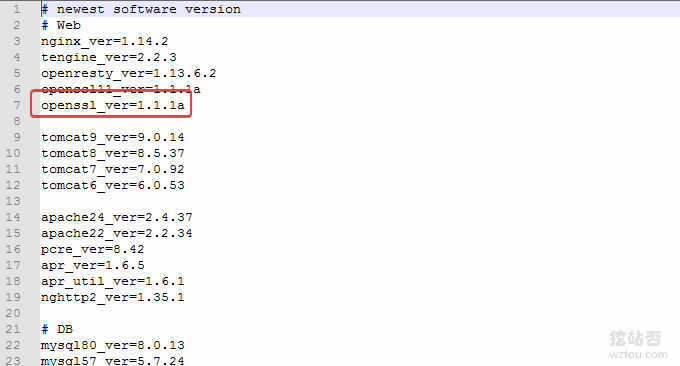](https://wzfou.com/wp-content/uploads/2019/01/oneinstack-tls13_01.gif)

然后开始安装即可。如果你已经是Oneinstack的老用户了，方法类似，先升级一下Oneinstack，修改version.txt的openssl_version版本号，执行Oneinstack自带的升级脚本，升级一下Nginx。然后就可以看到openssl已经升级了。

[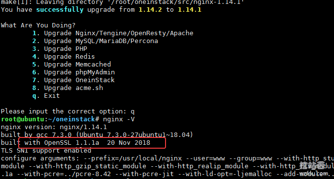](https://wzfou.com/wp-content/uploads/2019/01/oneinstack-tls13_02.gif)

最后就是修改你的网站Nginx配置文件了，在ssl\_protocols 后面添加TLSv1.3，在ssl\_ciphers添加数个加密套件，重启Nginx完成。以下是我的Nginx的TLSv1.3配置，ssl_ciphers 的TLSv1.3部分是新增加的。

ssl_protocols TLSv1 TLSv1.1 TLSv1.2 TLSv1.3;

ssl_ciphers TLS13-AES-256-GCM-SHA384:TLS13-CHACHA20-POLY1305-SHA256:TLS13-AES-128-GCM-SHA256:TLS13-AES-128-CCM-8-SHA256:TLS13-AES-128-CCM-SHA256:EECDH+CHACHA20:EECDH+CHACHA20-draft:EECDH+ECDSA+AES128:EECDH+aRSA+AES128:RSA+AES128:EECDH+ECDSA+AES256:EECDH+aRSA+AES256:RSA+AES256:EECDH+ECDSA+3DES:EECDH+aRSA+3DES:RSA+3DES:!MD5;

现在打开Chrome就可以看到wzfou.com已经成功使用了TLSv1.3。（PS：现在浏览器更新的速度很快，除IE，Chrome和Firefox新版对于TLSv1.3都已经支持了）

[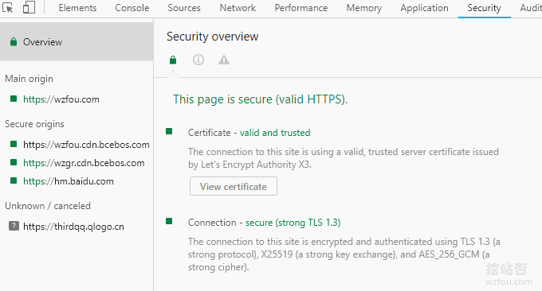](https://wzfou.com/wp-content/uploads/2019/01/oneinstack-tls13_07.gif)

### 1.2  LNMP TLSV1.3

LNMP面板参考：[Linux VPS建站工具](https://wzfou.com/lnmp-1-4/)，目前LNMP 1.6版本已经默认支持TLSv1.3（[LNMP 1.6安装与使用-自动开启TLS 1.3](https://wzfou.com/lnmp-1-6/)），你只需要按照上面的操作调整一下你的网站Nginx配置就可以开启TLSv1.3。如果你用的是LNMP 1.5的话，可以使用升级命令：`upgrade1.x-1.6.sh` 升级一下管理脚本。

[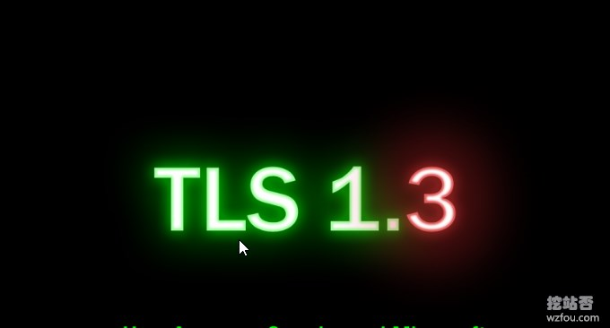](https://wzfou.com/wp-content/uploads/2019/01/one-tls_00.jpg)

然后使用1.6的升级脚本升级一下nginx就可以了。如果你不想让LNMP 1.5升级到LNMP 1.6，则打开 \\lnmp1.5\\include\\version.sh 文件，将` Openssl_Ver='openssl-1.0.2o'` 修改为：`Openssl_Ver='openssl-1.1.1a'`。

[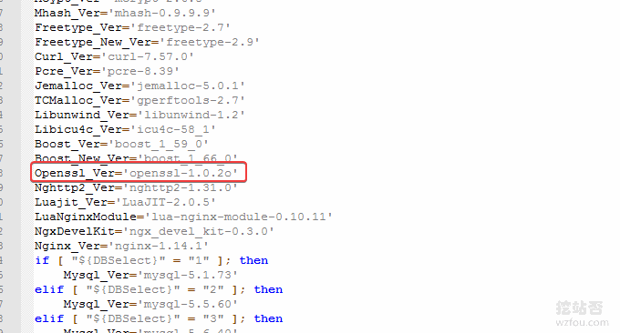](https://wzfou.com/wp-content/uploads/2019/01/oneinstack-tls13_08.gif)

然后修改 \\lnmp1.5\\lnmp.conf 文件，将 `Nginx_Modules_Options=''` 改为：`Nginx_Modules_Options='--with-openssl-opt=enable-weak-ssl-ciphers'`（注：enable-weak-ssl-ciphers 作用是让 OpenSSL 继续支持 3DES 等不安全 Cipher Suite，如果你打算继续支持 IE8，才需要加上这个选项；若不需要支持 XP IE8 访问可忽略此处修改）

[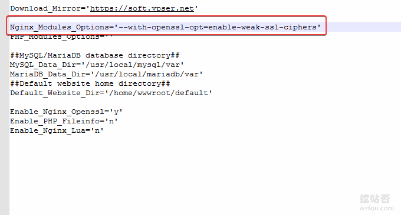](https://wzfou.com/wp-content/uploads/2019/01/oneinstack-tls13_09.gif)

进入 lnmp1.5 目录，执行命令：

./upgrade.sh nginx

然后输入需要升级的 nginx 版本号，如目前最新的 1.15.7。nginx 最新版本号可从官网获取：http://nginx.org。静待编译完成。执行 nginx -V 可查询详细配置信息：

Checking ...
Program will display Nginx Version......
nginx version: nginx/1.15.7
======== upgrade nginx completed ======

nginx version: nginx/1.15.7
built by gcc 4.8.5 20150623 (Red Hat 4.8.5-28) (GCC) 
built with OpenSSL 1.1.1a  20 Nov 2018
TLS SNI support enabled
configure arguments: --user=www --group=www --prefix=/usr/local/nginx --with-http\_stub\_status\_module --with-http\_ssl\_module --with-http\_v2\_module --with-http\_gzip\_static\_module --with-http\_sub\_module --with-stream --with-stream\_ssl\_module --with-openssl=/root/lnmp1.5/src/openssl-1.1.1a --with-openssl-opt=enable-weak-ssl-ciphers

修改主机配置文件，加入TLSv1.3配置，如下（和上面的Oneinstack是一样的）。文件修改完，重启一下 nginx，然后就可以去浏览器访问验证一下。

ssl\_protocols 加入 TLSv1.3 支持，如：ssl\_protocols TLSv1 TLSv1.1 TLSv1.2 TLSv1.3;

#ssl_ciphers 参考配置：

ssl_ciphers TLS13-AES-256-GCM-SHA384:TLS13-CHACHA20-POLY1305-SHA256:TLS13-AES-128-GCM-SHA256:TLS13-AES-128-CCM-8-SHA256:TLS13-AES-128-CCM-SHA256:EECDH+CHACHA20:EECDH+CHACHA20-draft:EECDH+ECDSA+AES128:EECDH+aRSA+AES128:RSA+AES128:EECDH+ECDSA+AES256:EECDH+aRSA+AES256:RSA+AES256:EECDH+ECDSA+3DES:EECDH+aRSA+3DES:RSA+3DES:!MD;

### 1.3  宝塔BT面板 TLSV1.3

新版的宝塔BT面板，已经支持nginx1.15了，直接在“软件管理”页面切换nginx1.15即可。

[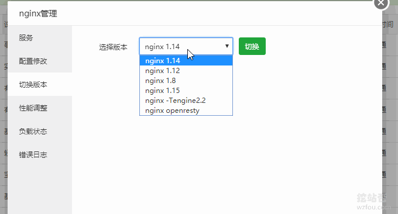](https://wzfou.com/wp-content/uploads/2019/01/oneinstack-tls13_10.gif)

然后在网站的配置文件加上TLSv1.3相关配置就可以了。

ssl_protocols TLSv1 TLSv1.1 TLSv1.2 TLSv1.3;
#ssl_ciphers EECDH+CHACHA20:EECDH+AES128:RSA+AES128:EECDH+AES256:RSA+AES256:EECDH+3DES:RSA+3DES:!MD5;
ssl_ciphers TLS13-AES-256-GCM-SHA384:TLS13-CHACHA20-POLY1305-SHA256:TLS13-AES-128-GCM-SHA256:TLS13-AES-128-CCM-8-SHA256:TLS13-AES-128-CCM-SHA256:EECDH+CHACHA20:EECDH+CHACHA20-draft:EECDH+ECDSA+AES128:EECDH+aRSA+AES128:RSA+AES128:EECDH+ECDSA+AES256:EECDH+aRSA+AES256:RSA+AES256:EECDH+ECDSA+3DES:EECDH+aRSA+3DES:RSA+3DES:!MD5;

[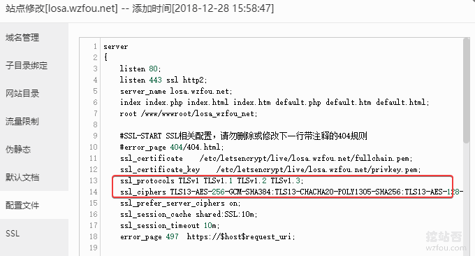](https://wzfou.com/wp-content/uploads/2019/01/oneinstack-tls13_11.gif)

## 二、服务器SSL优化

SSL优化：

1. 效果演示：https://www.ssllabs.com/ssltest/analyze.html?d=wzfou.com

如下图：

[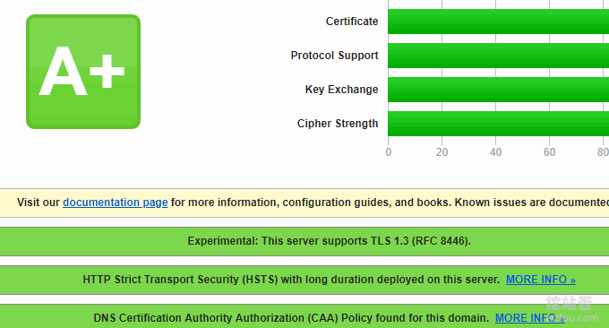](https://wzfou.com/wp-content/uploads/2019/01/oneinstack-tls13_12.gif)

优化的方法除了本文讲到的开启TLSV1.3，优化的经验（主要是SSL双证书、HSTS）也在以下两篇文章中有分享过：

> 1.[启用HSTS并加入HSTS Preload List让网站Https访问更加安全-附删除HSTS方法](https://wzfou.com/hsts-preload/)
> 
> 2.[八个HTTPS和SSL优化使用心得-减少等待时间和降低Https性能损耗](https://wzfou.com/https-ssl/)

## 三、开启Brotli压缩

项目：

1. https://github.com/google/ngx_brotli

### 3.1  Oneinstack Brotli

Oneinstack 开启 Brotli需要先进行编译，最简单的方法就是利用Oneinstack自带的升级脚本，将Brotli编译到Nginx，方法如下：

cd oneinstack/src
git clone https://github.com/google/ngx_brotli.git
cd ngx_brotli
git submodule update --init
#修改options.conf
nginx\_modules\_options中新增--add-module=../ngx_brotli
./upgrade.sh web nginx

#20190118更新，新版Oneinstack需要到oneinstack\\include目录，找到upgrade_web.sh，修改：
 ./configure ${nginx\_configure\_args}
#新增：
 ./configure ${nginx\_configure\_args} --add-module=../ngx_brotli
#最后（执行升级，选择Nginx）：
~/oneinstack/upgrade.sh

#修改/usr/local/nginx/conf/nginx.conf

    brotli             on;
    brotli\_comp\_level  6;
    brotli_types       text/plain text/css application/json application/x-javascript text/xml application/xml application/xml+rss text/javascript application/javascript image/svg+xml;

或者直接手动编译Brotli到Nginx，该方法与wzfou.com之前分享的[Oneinstack编译ngx\_cache\_purge模块](https://wzfou.com/nginx-fastcgi-cache/#Nginx_ngx_cache_purge)是一样的：

cd oneinstack/src
git clone https://github.com/google/ngx_brotli.git
cd ngx_brotli
git submodule update --init	
  
#以下几个安装包都是Oneinstack自带的，不同的版本可能会不同，请根据情况下载到/root/oneinstack/src/并解压
tar xzf nginx-1.14.2.tar.gz
tar xzf pcre-8.42.tar.gz
tar xzf openssl-1.1.1a.tar.gz
cd /root/oneinstack/src/nginx-1.14.2
nginx -V #查看nginx编译参数，最后加上--add-module=../ngx_brotli

./configure --prefix=/usr/local/nginx --user=www --group=www --with-http\_stub\_status\_module --with-http\_v2\_module --with-http\_ssl\_module --with-http\_gzip\_static\_module --with-http\_realip\_module --with-http\_flv\_module --with-http\_mp4\_module --with-openssl=../openssl-1.1.1a --with-pcre=../pcre-8.42 --with-pcre-jit --with-ld-opt=-ljemalloc --add-module=../ngx\_cache\_purge-2.3 --add-module=../ngx_brotli

make  #编译
mv /usr/local/nginx/sbin/nginx{,_\`date +%F\`}  #备份nginx
cp objs/nginx /usr/local/nginx/sbin
nginx -V

Nginx Brotli编译成功。

[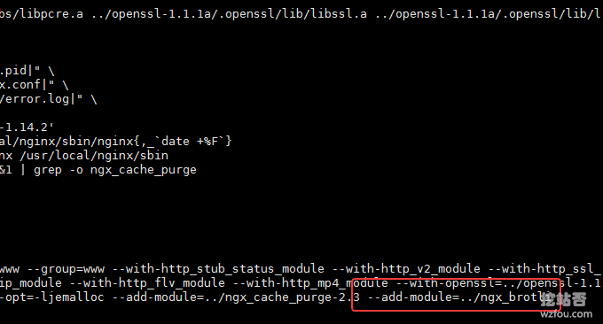](https://wzfou.com/wp-content/uploads/2019/01/oneinstack-tls13_04.gif)

打开你的网站的Nginx配置文件，添加以下代码：

#修改/usr/local/nginx/conf/nginx.conf

    brotli             on;
    brotli\_comp\_level  6;
    brotli_types       text/plain text/css application/json application/x-javascript text/xml application/xml application/xml+rss text/javascript application/javascript image/svg+xml;

如下图：

[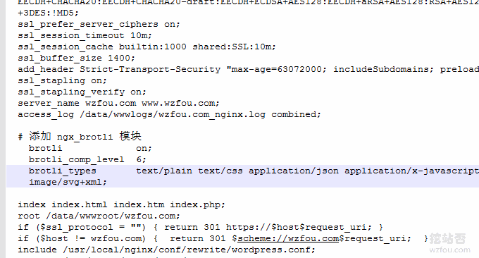](https://wzfou.com/wp-content/uploads/2019/01/oneinstack-tls13_05.gif)

重启Nginx，刷新网页，利用Chrome审查元素，就可以看到网页显示“br”字样，表示使用了Brotli压缩。

[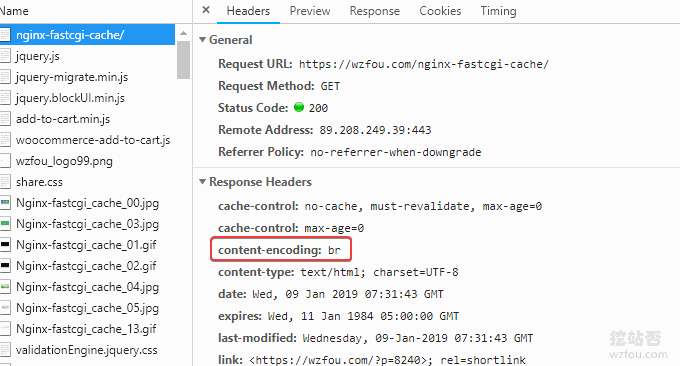](https://wzfou.com/wp-content/uploads/2019/01/oneinstack-tls13_06.gif)

### 3.2  LNMP Brotli

在LNMP上编译Brotli类似于上面的Oneinstack，首先也是将Brotli下载到本地，然后编辑一下配置，重新编译一下Nginx即可。命令如下：

#下载
cd lnmp1.5/src
git clone https://github.com/google/ngx_brotli.git
cd ngx_brotli
git submodule update --init
#编辑配置，请根据你自己的路径调整
vi /root/lnmp1.5/lnmp.conf
#添加
Nginx\_Modules\_Options='--add-module=/wzfou/lnmp1.5/ngx_brotli'
#最后，重新重新编译或者升级Nginx
cd /root/lnmp1.5
./upgrade.sh nginx

编辑配置文件如下：

[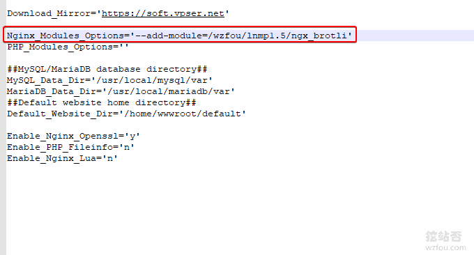](https://wzfou.com/wp-content/uploads/2019/01/oneinstack-tls13_15.gif)

最后，还是修改你的网站配置加入Brotli代码。

brotli             on;
brotli\_comp\_level  6;
brotli_types       text/plain text/css application/json application/x-javascript text/xml application/xml application/xml+rss text/javascript application/javascript image/svg+xml;

### 3.3  宝塔面板 Brotli

宝塔面板编译 Brotli也一样，利用宝塔自带的脚本：www/server/panel/install/nginx.sh对Nginx重新编译和升级，代码如下：

#安装libbrotli
cd /www/server
git clone https://github.com/bagder/libbrotli
cd libbrotli
./autogen.sh
./configure
make && make install

#下载ngx_brotli模块及其依赖：
cd /www/server
git clone https://github.com/google/ngx_brotli
cd ngx_brotli && git submodule update --init

#获取Nginx Arguments
nginx -V

#编辑配置
vi /www/server/panel/install/nginx.sh

#在你需要安装的Nginx版本下增加：--add-module=/www/server/ngx_brotli

  if \[ "${nginx\_version}" == "1.12.2" \] || \[ "${nginx\_version}" == "1.14.2" \];then
    ./configure --user=www --group=www --prefix=${Setup\_Path} --with-openssl=${Update\_Path}/src/openssl --add-module=${Update\_Path}/src/ngx\_devel\_kit --add-module=${Update\_Path}/src/lua\_nginx\_module --add-module=${Update\_Path}/src/ngx\_cache\_purge --add-module=${Update\_Path}/src/nginx-sticky-module --with-http\_stub\_status\_module --with-http\_ssl\_module --with-http\_image\_filter\_module --with-http\_v2\_module --with-http\_gzip\_static\_module --with-http\_gunzip\_module --with-stream --with-stream\_ssl\_module --with-ipv6 --with-http\_sub\_module --with-http\_flv\_module --with-http\_addition\_module --with-http\_realip\_module --with-http\_mp4\_module --with-ld-opt="-Wl,-E" --with-pcre=pcre-${pcre\_version} ${jemallocLD} --add-module=/www/server/ngx_brotli
  elif \[ "${nginxVersion}" == "1.15.6" \]; then
    ./configure --user=www --group=www --prefix=${Setup\_Path} --with-openssl=${Setup\_Path}/src/openssl --add-module=${Setup\_Path}/src/ngx\_devel\_kit --add-module=${Setup\_Path}/src/lua\_nginx\_module --add-module=${Setup\_Path}/src/ngx\_cache\_purge --add-module=${Setup\_Path}/src/nginx-sticky-module --with-http\_stub\_status\_module --with-http\_ssl\_module --with-http\_v2\_module --with-http\_image\_filter\_module --with-http\_gzip\_static\_module --with-http\_gunzip\_module --with-stream --with-stream\_ssl\_module --with-ipv6 --with-http\_sub\_module --with-http\_flv\_module --with-http\_addition\_module --with-http\_realip\_module --with-http\_mp4\_module --with-ld-opt="-Wl,-E" --with-openssl-opt="enable-tls1\_3 enable-weak-ssl-ciphers" ${jemallocLD} --add-module=/www/server/ngx_brotli
  elif \[ "$nginx_version" == "openresty" \]; then
    ./configure --user=www --group=www --prefix=${Setup\_Path} --with-openssl=${Update\_Path}/src/openssl --with-pcre=pcre-${pcre\_version} --add-module=${Update\_Path}/src/ngx\_cache\_purge --add-module=${Update\_Path}/src/nginx-sticky-module --with-luajit --with-http\_stub\_status\_module --with-http\_ssl\_module --with-http\_image\_filter\_module --with-http\_v2\_module --with-http\_gzip\_static\_module --with-http\_gunzip\_module --with-stream --with-stream\_ssl\_module --with-ipv6 --with-http\_sub\_module --with-http\_flv\_module --with-http\_addition\_module --with-http\_realip\_module --with-http\_mp4\_module --with-ld-opt="-Wl,-E" ${jemallocLD} 
  elif \[ "${nginxVersion}" = "-Tengine2.2.3" \]; then
    ./configure --user=www --group=www --prefix=${Setup\_Path} --with-openssl=${Update\_Path}/src/openssl --add-module=${Update\_Path}/src/ngx\_devel\_kit --add-module=${Update\_Path}/src/lua\_nginx\_module --add-module=${Update\_Path}/src/ngx\_cache\_purge --add-module=${Update\_Path}/src/nginx-sticky-module --with-http\_stub\_status\_module --with-http\_ssl\_module --with-http\_image\_filter\_module --with-http\_v2\_module --with-http\_gzip\_static\_module --with-http\_gunzip\_module --with-ipv6 --with-http\_sub\_module --with-http\_flv\_module --with-http\_addition\_module --with-http\_realip\_module --with-http\_mp4\_module --with-ld-opt="-Wl,-E" --without-http\_upstream\_session\_sticky\_module --with-pcre=pcre-${pcre\_version} --add-module=/www/server/ngx_brotli

#最后，重新编译Nginx（请根据自己的需要来选择）
sh /www/server/panel/install/nginx.sh install 1.14

最后，在你的网站的Nginx配置中加入Brotli代码即可。

brotli             on;
brotli\_comp\_level  6;
brotli_types       text/plain text/css application/json application/x-javascript text/xml application/xml application/xml+rss text/javascript application/javascript image/svg+xml;

关于Brotli一些参数的说明，你可以根据自己的需要来调整：

  brotli on;              #启用
  brotli\_comp\_level 6;    #压缩等级，默认 6，太高的压缩水平可能需要更多的 CPU
  brotli_buffers 16 8k;   #请求缓冲区的数量和大小
  brotli\_min\_length 20;   #指定压缩数据的最小长度，只有大于或等于最小长度才会对其压缩。这里指定 20 字节
  brotli_types *;         #指定允许进行压缩类型
\# brotli_types text/plain application/javascript application/x-javascript text/javascript text/css application/xml text/html application/json image/svg application/font-woff application/vnd.ms-fontobject application/vnd.apple.mpegurl image/x-icon image/jpeg image/gif image/png image/bmp;
  brotli_static always;   #是否允许查找预处理好的、以 .br 结尾的压缩文件，可选值为 on、off、always
  brotli_window 512k;     #窗口值，默认值为 512k

## 四、总结

**要不要用TLSV1.3？**总得来看，TLSV1.3是未来的趋势，有人担心浏览器不支持，其实除了IE，最新版的Chrome和Firefox都是支持TLSV1.3的，各大浏览器支持TLSV1.3情况见：https://caniuse.com/#feat=tls1-3

[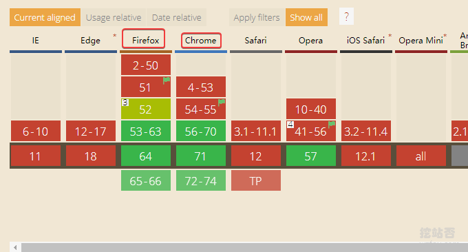](https://wzfou.com/wp-content/uploads/2019/01/oneinstack-tls13_13.gif)

**要不要用Brotli？**理论上讲Brotli压缩比比GZIP要高不少，所以对于网页打开速度也是有一定作用的，不过想要秒开的感觉，还是先从硬件上提升一下速度吧，这里是各大浏览器支持Brotli的情况：https://caniuse.com/#feat=brotli

[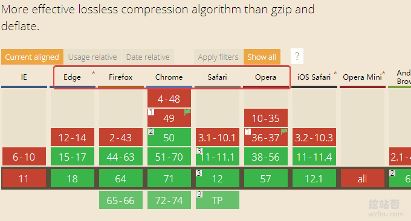](https://wzfou.com/wp-content/uploads/2019/01/oneinstack-tls13_14.gif)

**有没有有一键自动开启TLSV1.3和Brotli？**有，如果你用的是[CloudFlare免费CDN加速](https://wzfou.com/cloudflare-cdn/)，CF已经为所有的网站自动开启TLSv1.3和Brotli，加速效果可以见我的演示站：losv.wzfou.net。