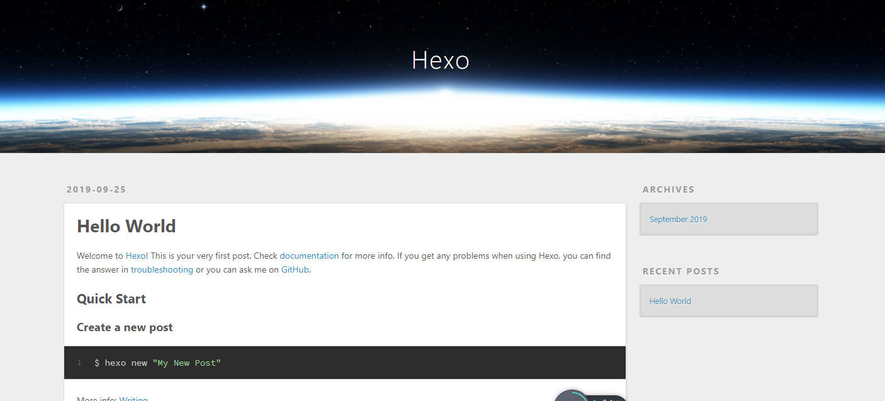

# Alpine Linux下安装Hexo
Hexo 是一个快速、简洁且高效的博客框架。Hexo 使用 Markdown（或其他渲染引擎）解析文章，在几秒内，即可利用靓丽的主题生成静态网页。不需要caddy,nighx,等~~  
  
1.安装前准备:-可能我是bash控-偏执的要安装Bash Shell,其实这步可跳过或省略直接安装hexo~  
  
安装Bash Shell  
安装前我们需要更新下我们当前系统  
apk update  
apk upgrade  
然后执行安装：  
  
apk add --no-cache bash  
提示如下：  
  
fetch http://dl-cdn.alpinelinux.org/alpine/v3.8/main/x86_64/APKINDEX.tar.gz  
fetch http://dl-cdn.alpinelinux.org/alpine/v3.8/community/x86_64/APKINDEX.tar.gz  
(1/5) Installing ncurses-terminfo-base (6.1-r0)  
(2/5) Installing ncurses-terminfo (6.1-r0)  
(3/5) Installing ncurses-libs (6.1-r0)  
(4/5) Installing readline (7.0.003-r0)  
(5/5) Installing bash (4.4.19-r1)  
Executing bash-4.4.19-r1.post-install  
Executing busybox-1.28.4-r1.trigger  
OK: 21 MiB in 35 packages  
安装完成后需要安装bash文档：  
  
apk add bash-doc  
如果需要安装bash自动命令行：  
  
  
2.安装hexo  
Alpine Linux下先安装 git和nodejs  
  
apk add npm git  
apk add nodejs  
npm install -g hexo-cli  或  npm install hexo  
hexo -v  
hexo init blog  
cd blog  
npm install  
hexo server  
  
  
TriangularSquiggly-VM:/home/blog# hexo server  
INFO  Start processing  
INFO  Hexo is running at http://localhost:4000 . Press Ctrl+C to stop.  
  
  
之后，你现在可以愉快的 Markdown了~~  
  
出现如下图所示的:  
  
