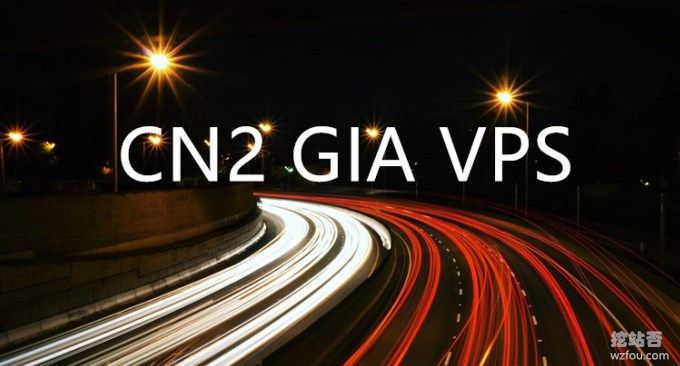

# CN2 GIA VPS主机收集整理汇总-电信,联通,移动三网CN2 GIA线路VPS主机
最近有朋友建议我整理一下CN2 GIA VPS主机的名单，其实我之前已经整理过了CN2 VPS主机汇总名单：[接入CN2线路VPS主机商和机房汇总](https://wzfou.com/cn2-vps-list/)。不过，随着“业务”的需要，越来越多的人喜欢上了CN2 GIA VPS，甚至是要求三网都是CN2 GIA线路。

本篇文章就来整理一下[CN2 GIA VPS](https://wzfou.com/tag/cn2-gia-vps/)主机商名单，同时区分电信,联通,移动三网是否都走CN2 GIA线路，本列表会随时更新，欢迎提供最新的信息。个别CN2 GIA VPS主机因本人购买并使用过，会有详细的评测报告，其它的暂缺，大家可自行测试官网的演示IP。

这里再推荐**三个名单**：一个是VPS主机排行榜，这个名单列举的大量本人曾经用过的VPS主机，可以给新手朋友一个参考；一个是[CN2 VPS](https://wzfou.com/tag/cn2-vps/)主机名单，线路有CN2，但是不一定是GIA和三网都走CN2；最后一个是[VPS主机](https://wzfou.com/vps/)性能与速度测试方法。

1. [VPS主机排行榜单](https://wzfou.com/vps-bangdan/)
2. [接入CN2线路VPS主机商和机房汇总](https://wzfou.com/cn2-vps-list/)
3. [VPS主机性能和速度测试方法](https://wzfou.com/vps-ceping-gongju/)

> **PS：2020年1月3日更新，**新增加了部分CN2 GIA服务商，可以看出CN2 GIA基本上以国人运营为主，对于新商家请大家擦亮眼睛。

## 厘清几个CN2概念

**CN2**

> 英文Chinatelecom Next Carrier Network，中文为中国电信下一代承载网，缩写为CNCN或者CN2。

**CN2 GT**

> GT即Global Transit，省级出口为202.97节点，在跨境时才进入CN2骨干网，出国/国际跨境节点为59.43开头。线路总体情况良好，负载较中等，因此可以保证良好的速度和延迟。省级/出国节点为202.97开头，国际骨干节点有59.43开头的CN2节点。在CN2等级低，好于163骨干网。

**CN2 GIA**

> GIA即Global Internet Access，等级最高，在速度和延迟上有极好的体验。在部署有CN2节点的省份就近接入该省的省级CN2节点 (如陕西宝鸡)，在暂未部署CN2节点的省份则就近接入部署有CN2节点的省份的CN2节点 (如内蒙古呼和浩特，在北京接入CN2路由），**GIA CN2不保证全程没有202.97节点，而是“就近”接入CN2**（如江苏镇江，经南京202.97节点进入江苏南京CN2节点)。

**三网CN2 GIA**

> 一般来说电信用户会走CN2 GIA线路，但是有些商家优化路由，让移动、联通用户也走CN2 GIA，速度比直连要理想。

中国电信推出了自己的[CN2线路](https://wzfou.com/tag/cn2-xianlu/)监控查询平台，大家有兴趣可以研究一下：

1. http://ipms.chinatelecomglobal.com/public/sla/slaPerformanceNew.html

## CN2 GIA VPS主机商家整理汇总

搜索:

|                        服务商                        |   机房   | 类型 | 双向 |  月付  |      最低配置       |       三网路由走向       |                        相关评测                         |
| --------------------------------------------------- | ------- | --- | --- | ----- | ------------------ | ---------------------- | ------------------------------------------------------ |
| [经典CN2 VPS](https://wzfou.com/go/bvpsnet)         | 美国西   | GIA | 双向 | $7    | 1G 2核 流量1000GB  | 三网CN2 GIA             | [经典主机CN2 GIA](https://wzfou.com/cn2-vps-gia/)       |
| [阿里云香港](https://wzfou.com/go/aliyun)            | 香港     | GIA | 双向 | $10   | 512M 1核 带宽1MB   | 电信CN2 GIA 移动联通直连 | [阿里云香港](https://wzfou.com/aliyun-alibabacloud/)    |
| [腾讯云香港](https://wzfou.com/go/tencentvps)        | 香港     | GIA | 双向 | $17   | 1GB 1核 带宽1MB     | 电信CN2 GIA 移动联通直连 | [腾讯云VPS](https://wzfou.com/tencent-cloud/)           |
| [GigsGigsCloud](https://wzfou.com/go/gigsgigscloud) | 美国西   | GIA | 双向 | $6.8  | 512M 2核 流量1000G | 三网CN2 GIA             | [GigsGigsCloud](https://wzfou.com/gigsgigscloud/)。    |
| [腾讯云新加坡](https://wzfou.com/go/tencentvps)      | 新加坡   | GIA | 双向 | $19   | 1GB 1核 带宽1MB    | 电信CN2 GIA 移动联通直连 | [腾讯云VPS](https://wzfou.com/tencent-cloud/)           |
| [LayerStack](https://wzfou.com/go/layerstack)       | 香港     | GIA | 双向 | $20   | 2GB 1核 流量2000GB | 电信CN2 GIA 移动联通直连 | 暂无。                                                  |
| [Anexia-it.com](https://wzfou.com/go/anexia)        | 欧德国   | GIA | 双向 | 需洽谈 | 需洽谈             | 三网CN2 GIA             | 暂无。                                                  |
| [Dediserve](https://wzfou.com/go/dediserve)         | 欧维也纳 | GIA | 双向 | $5.8  | 1GB 2核 流量1000G  | 电信CN2 GIA 移动联通绕道 | 暂无。                                                  |
| [idc.wiki](https://wzfou.com/go/idcwiki)            | 美Cera  | GIA | 双向 | $6    | 512 1核 流量1000GB | 电信CN2 GIA 移动联通NCP | 国人，[idc.wiki主机](https://wzfou.com/idcwiki-pingce/) |
| [Hostdare](https://wzfou.com/go/hostdare)           | 美国西   | GIA | 双向 | $4    | 756M 1核 流量500GB | 电信CN2 GIA 移动联通直连 | [HostDare CN2](https://wzfou.com/hostdare/)            |
| [阿里云新加坡](https://wzfou.com/alibabacloud/)      | 新加坡   | GIA | 双向 | $5    | 1GB 1核 流量1000GB | 电信CN2 GIA 移动联通直连 | [阿里云新加坡](https://wzfou.com/alibabacloud/)         |
| [Ucloud](https://wzfou.com/go/ucloud)               | 香港     | GIA | 双向 | $14   | 1GB 1核 流量限带宽  | 电信CN2 GIA 移动联通直连 | 暂无。                                                  |
| [Krypt iON](https://wzfou.com/go/ion)               | 美国西   | GIA | 双向 | $5    | 1GB 1核 流量1000GB | 电信CN2 GIA 移动联通直连 | [iON CN2 VPS](https://wzfou.com/ion-pingce/)           |
| [Cubecloud](https://wzfou.com/go/cubecloud)         | 美国西   | GIA | 双向 | $8.1  | 1GB 2核 流量1000G  | 电信CN2 GIA 移动联通直连 | 国人，暂无。                                            |
| [SugarHosts](https://wzfou.com/go/sugarhosts)       | 美国西   | GIA | 双向 | $15   | 768M 1核 流量1000G | 电信CN2 GIA 移动联通直连 | 暂无。                                                  |
| [RAKsmart](https://wzfou.com/go/raksmart)           | 美国西   | GIA | 双向 | $7.69 | 512M 1核 流量限带宽 | 电信CN2 GIA 移动联通直连 | 国人，暂无。                                            |
| [Aoyouhost](https://wzfou.com/go/aoyouhost)         | 欧德国   | GIA | 双向 | $10   | 512M 1核 流量500G  | 电信CN2 GIA 移动联通直连 | 国人，暂无。                                            |
| [kvmla](https://wzfou.com/go/kvmla)                 | 香港     | GIA | 双向 | $11.7 | 1GB 2核 流量600GB  | 三网CN2 GIA             | 国人，暂无。                                            |
| [DMIT](https://wzfou.com/go/dmit)                   | 美国西   | GIA | 双向 | $14   | 1GB 1核 流量2000G  | 三网CN2 GIA             | 国人，暂无。                                            |
| [Dedione](https://wzfou.com/go/dedione)             | 美国西   | GIA | 双向 | $3    | 512M 1核 流量500G  | 电信CN2 GIA 移动联通直连 | 暂无。                                                  |
| [pesyun](https://wzfou.com/go/pesyun)               | 美国西   | GIA | 双向 | $6    | 512M 1核 限速15M   | 电信CN2 GIA 移动联通直连 | 国人，暂无。                                            |
| [RFCHOST](https://wzfou.com/go/rfchost)             | 美国西   | GIA | 双向 | $3    | 512M 1核 流量500G  | 三网CN2 GIA             | 国人，暂无。                                            |
| [TmhHost](https://wzfou.com/go/tmhhost)             | 美国西   | GIA | 双向 | $6    | 512M 1核 流量500G  | 电信CN2 GIA 移动联通直连 | 国人，暂无。                                            |
| [TripodCloud](https://wzfou.com/go/tripodcloud)     | 美国西   | GIA | 双向 | $5    | 512M 1核 流量500G  | 电信CN2 GIA 移动联通直连 | 国人，暂无。                                            |
| [Dogyun](https://wzfou.com/go/dogyun)               | 欧德国   | GIA | 双向 | $7    | 2GB 1核 按流量计费  | 电信CN2 GIA 移动联通直连 | 国人，暂无。                                            |
| [Akkocloud](https://wzfou.com/go/akkocloud)         | 欧德国   | GIA | 双向 | $20   | 1GB 1核 流量2000GB | 电信CN2 GIA 联通绕道     | 国人，暂无。                                            |
