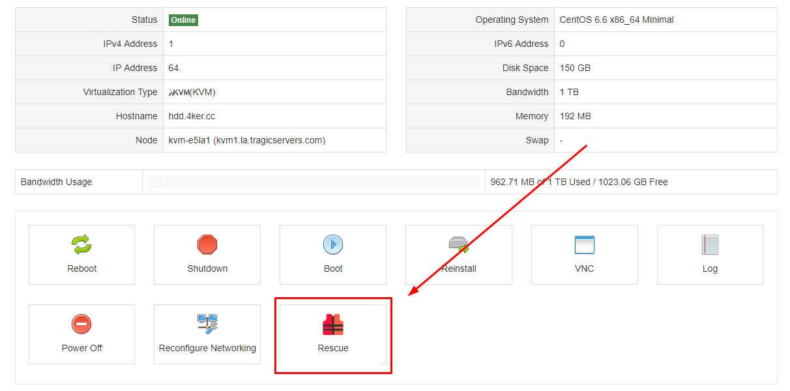
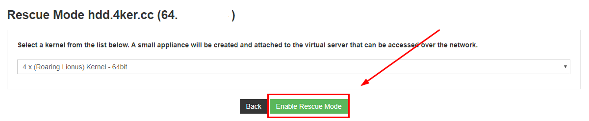
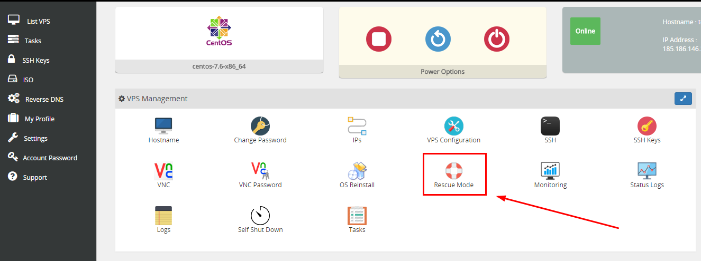
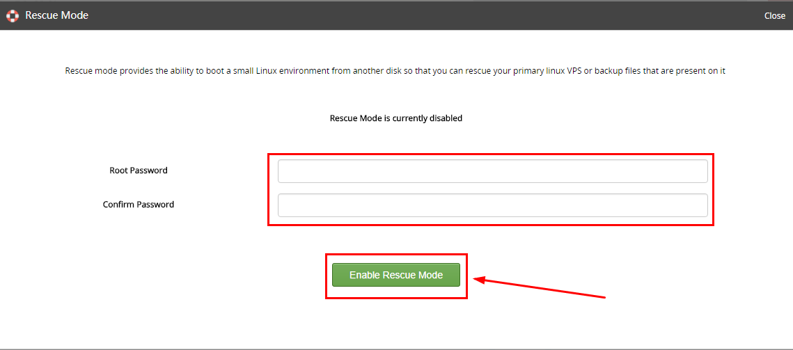
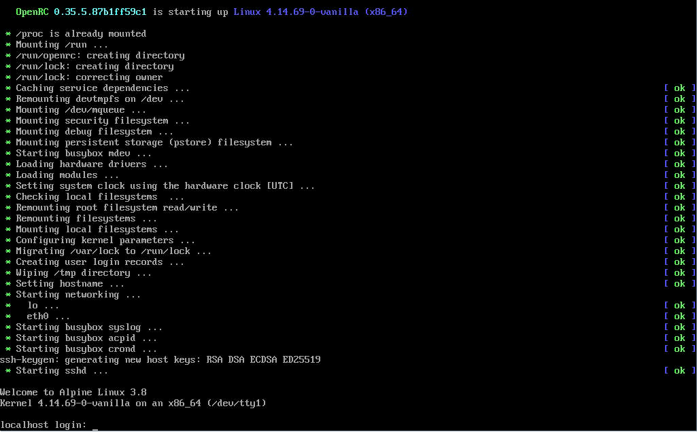
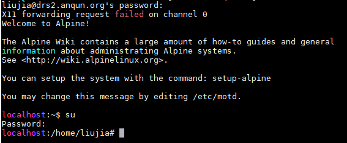

# KVM构架系统通过急救模式安装alpine linux
**为何需要安装alpine linux呢？**

alpine基于busybox开发，系统开机占用5M内存，方便小内存VPS使用，并且麻雀虽小五脏俱全，一些正常的应用可以正常安装。

以下内容搬运于原作者，我解释部分会进行标注，请耐心看完。

有的用户想使用 alpine linux，但一般主机商没有该系统模板，但一般主机商有提供急救系统（如 system-rescue-cd），可通过急救系统安装 alpine linux。

#### 进入恢复模式：

常见的两种控制面板进入恢复模式方法：

**1.solusvm:**

启动后，稍等两分钟，根据提示的root信息进行登陆。

**2.virtualizor：**

输入密码后，点击启动，等待几分钟，即可进入救援模式。

#### 查看具体磁盘信息：

进入 救援模式后，我们输入以下命令查看具体磁盘名字：

fdisk -l

会出现类似于图示：

rescue # fdisk -l
Disk /dev/vda: 20 GiB, 21474836480 bytes, 41943040 sectors
Units: sectors of 1 * 512 = 512 bytes
Sector size (logical/physical): 512 bytes / 512 bytes
I/O size (minimum/optimal): 512 bytes / 512 bytes

Disk /dev/vdb: 1.1 GiB, 1181116416 bytes, 2306868 sectors
Units: sectors of 1 * 512 = 512 bytes
Sector size (logical/physical): 512 bytes / 512 bytes
I/O size (minimum/optimal): 512 bytes / 512 bytes
Disklabel type: dos
Disk identifier: 0xb52fd1c0

Device Boot Start End Sectors Size Id Type
/dev/vdb1 * 2048 2304511 2302464 1.1G 83 Linux

磁盘最大的那块就是主磁盘，我们这里是/dev/vda，记住这个磁盘。

当前服务器 /dev/vda 为主磁盘，我们安装 alpine linux 最新版本3.10

#### 开始安装：

下面 /dev/vda部分请替换为上面fdisk查出来的磁盘信息！

1.格式化分区(遇到提示，输入y确定)

mkfs.ext4 /dev/vda

2.去掉ext4的64bit，因为引导syslinux不支持

resize2fs -s /dev/vda

3.创建目录并挂载

mkdir /mnt/custom;mount /dev/vda /mnt/custom/

4.下载 alpine linux apk tools(无法下载请谷歌搜索此文件apk-tools-static-2.10.4-r2.apk进行寻找)

apt update;apt install wget -y;wget https://mirror.netcologne.de/alpine/edge/main/x86/apk-tools-static-2.10.4-r2.apk

5.解压

tar xzvf apk-tools-static-2.10.4-r2.apk

6.安装alpine linux

./sbin/apk.static -X http://dl-cdn.alpinelinux.org/alpine/latest-stable/main -U --allow-untrusted --root /mnt/custom/ --initdb add alpine-base

7.复制文件resolv.conf，解析域名

cp /etc/resolv.conf /mnt/custom/etc/

8.创建用户 root 目录

mkdir -p /mnt/custom/root

9.创建 apk 配置目录

mkdir -p /mnt/custom/etc/apk

10.设置apk更新镜像网址

echo "http://dl-cdn.alpinelinux.org/alpine/latest-stable/main" > /mnt/custom/etc/apk/repositories

11.创建相应设备目录：

mknod -m 666 /mnt/custom/dev/full c 1 7
mknod -m 666 /mnt/custom/dev/ptmx c 5 2
mknod -m 644 /mnt/custom/dev/random c 1 8
mknod -m 644 /mnt/custom/dev/urandom c 1 9
mknod -m 666 /mnt/custom/dev/zero c 1 5
mknod -m 666 /mnt/custom/dev/tty c 5 0

12.挂载目录

mount -t proc none /mnt/custom/proc
mount -o bind /sys /mnt/custom/sys
mount -o bind /dev /mnt/custom/dev

13.chroot 到 apline 文件所在目录

chroot /mnt/custom /bin/sh -l

14.创建IP配置文件(此文件请修改为具体ip信息，不再赘述)

echo 'auto lo
iface lo inet loopback

auto eth0
iface eth0 inet static
  address 144.172.126.32
  netmask 255.255.255.0
  post-up route add 144.172.126.1 dev eth0
  post-up route add default gw 144.172.126.1
  post-down route del default gw 144.172.126.1
  post-down route del 144.172.126.1 dev eth0' >/etc/network/interfaces

15.安装openssh( Which SSH server? 直接回车即可)

setup-sshd

16.修改 root 密码，并开启root登陆

passwd
sed -i 's/#PermitRootLogin prohibit-password/PermitRootLogin yes/g' /etc/ssh/sshd_config

17.添加普通用户liujia，以可远程登录

adduser liujia -s /bin/ash

18.将用户添加到wheel组，可使用su

addgroup liujia wheel

19.设置可启动的服务

rc-update add devfs sysinit
rc-update add dmesg sysinit
rc-update add mdev sysinit
rc-update add hwclock boot
rc-update add modules boot
rc-update add sysctl boot
rc-update add hostname boot
rc-update add bootmisc boot
rc-update add syslog boot
rc-update add mount-ro shutdown
rc-update add killprocs shutdown
rc-update add savecache shutdown
rc-update add networking boot
rc-update add urandom boot
rc-update add acpid default
rc-update add hwdrivers sysinit
rc-update add crond default

20.安装内核和引导

apk add linux-vanilla syslinux

21.将mbr引导写到磁盘中

dd bs=440 count=1 if=/usr/share/syslinux/mbr.bin of=/dev/vda

22.查看具体boot分区，方便第23步使用：

extlinux -i /boot

23\. 查看设备uid，请把/dev/vda路径替换为22步获取的路径，并记录下显示的UUID信息

blkid /dev/vda

24.将磁盘uuid写到启动配置文件中，务必替换自己的UUID值，UUID后的:请保留！

sed -i -e "s:^root=.*:root=UUID=bb5b133e-4702-4c3b-b6ae-66cde61cf27a:" /etc/update-extlinux.conf

25.添加 ext4支持

sed -i -e "s:^modules=.*:modules=sd-mod,usb-storage,ext3,ext4:" /etc/update-extlinux.conf

26.更新引导配置

update-extlinux

27.将磁盘信息写到文件系统配置文件中，UUID请务必替换

echo "UUID=66ea5797-490e-4cf5-8743-61525af5bfbc / ext4 defaults 1 1" > /etc/fstab

28.重启机子，后台取消恢复模式即可。  

29.远程ssh连接，正常  
