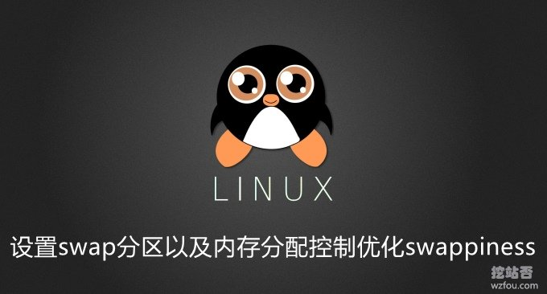
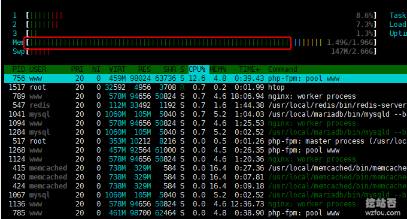
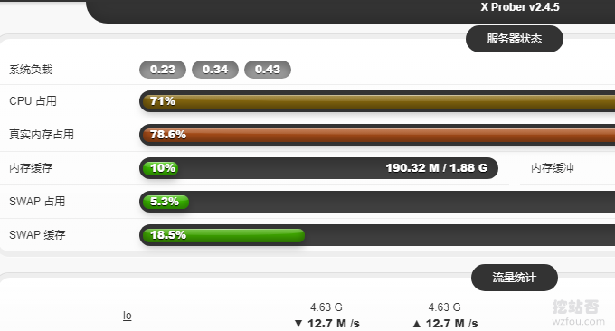

# Linux VPS主机设置swap分区以及内存分配控制优化swappiness配置
Linux系统一般都需要配置一点[swap分区](https://wzfou.com/tag/swap-fenqu/)，桌面配置多一点，服务器配置少一点。而对于swap分区的具体使用细节，由一个叫swappiness参数来控制。 如果内存够大，那么这个时候应该让 linux 不必太多的使用swap分区， 可以通过修改swappiness的数值。

当[swappiness](https://wzfou.com/tag/swappiness/)为0的时候表示最大限度使用物理内存，然后才是 swap空间，当swappines为100的时候，则表示积极的使用swap分区，并且把内存上的数据及时的搬运到swap空间里面。在CentOS、Red Hat、ubuntu等系统中，swappiness的默认值都为60。

如果Linux服务器的内存很小，那么可以不用更改这个值，因为毕竟考虑到内存不够用而去借用swap的情况。而相对于很多服务器来说，目前还是建议设置在值为25以下，如果超过了8G内存，而且目前内存使用量还有剩余的话，建议直接将[swappiness](https://wzfou.com/tag/swappiness/)改成0，这样可以最大限度的使用物理内存，减少硬盘的负载，同时加快速度。

这篇文章就来分享一下如何给自己的Linux [VPS主机](https://wzfou.com/vps/)设置Swap交换分区，以及如何优化Linux内存和Swap分区的分配关系，更多的关于服务器性能优化的文章，请看（关于挖站否的优化必得，这里有汇总：[网站与服务器优化方法总结](https://wzfou.com/readme/)）：

1. [网站启用WebP格式图片-PHP和Nginx转化WebP格式和自适应浏览器](https://wzfou.com/webp-nginx/)
2. [网站优化加速-开启TLSV1.3和Brotli压缩-Oneinstack,LNMP,宝塔面板](https://wzfou.com/tlsv1-3-brotli/)
3. [WordPress开启Nginx fastcgi_cache缓存加速方法-Nginx配置实例](https://wzfou.com/nginx-fastcgi-cache/)

## 一、VPS设置swap空间

### 1.1 swap要多大？

综合网上的相关资料，一般来说2GB的内存的VPS至少要2GB的Swap空间， 相关的参考如下：

1. 物理内存 交换分区（SWAP）
2. <= 4G 至少4G
3. 4~16G 至少8G
4. 16G~64G 至少16G
5. 64G~256G 至少32G

### 1.2 创建swap分区

Linux VPS主机设置[swap空间](https://wzfou.com/tag/swap-kongjian/)的基本命令如下：

1. #查看swap分区的大小
2. free -h

4. #删除所有SWAP分区
5. swapoff -a

7. #创建swap分区的文件，其中bs是每块的大小，count是块的数量，bs\*count，就是swap文件的大小了，这里就是1M\*2048=2G
8. dd if=/dev/zero of=/root/swapfile bs=1M count=2048

10. #格式化交换分区文件：
11. mkswap /root/swapfile

13. #启用swap分区文件：
14. swapon /root/swapfile

16. #添加开机启动，修改 /etc/fstab 这个文件，添加或者修改这一行：

18. /root/swapfile swap swap defaults 0  0  #适用于redhat或centos系统
19. /root/swapfile none swap sw 0  0  #适用于Ubuntu系统

21. #或者直接执行以下命令写入/etc/fstab

23. echo "/root/swapfile swap swap defaults 0 0" >>/etc/fstab #适用于redhat或centos系统
24. echo "/root/swapfile none swap sw 0 0" >>/etc/fstab #适用于Ubuntu系统

## 二、Linux真实使用内存

Linux的内存管理机制与Windows有所不同，linux系统中，是进程优先使用内存，而不是磁盘，这样会加快读取速度。当有新的进程启动时，再从内存中开辟出一定空间，为新的进程所用。即使进程退出，也不会立刻从内存中清理掉，这样可以加快下次启动进程的速度，所以内存一直是使用率很高的。**那么如何查看Linux真实使用内存？**

### 2.1 命令查看

执行命令：`free -h`可以查看Linux VPS主机的内存使用情况：

1. root@localhost:~\# free -h
2. total used free shared buff/cache available
3. Mem: 2.0G 1.3G 382M 106M 280M 416M
4. Swap: 2.7G 146M 2.5G

Linux VPS主机真实内存占用到底是多少呢？用 free 指令查看一下输出，用 used 减去 buffer 和 cache，才是你运行中的程序所占用的空间。

> 如上面的例子：使用了4G的内存，3.7G被占用，但是buuffer和cached部分作为缓存，可以使用命中率的方式提高使用效率，而且这部分缓存是根据指令随时可以释放的，我们可以认为这部分内存没有实际被使用，也可以认为它是空闲的，即真实内存=1.3G-0.28G
> 
> 因此查看目前进程正在实际被使用的内存，是used-(buffers+cache)，也可以认为如果swap没有大量使用，mem还是够用的，只有mem被当前进程实际占用完（没有了buffers和cache），才会使用到swap的。

### 2.2 工具查看

在[Linux系统监控命令整理汇总](https://wzfou.com/linux-jiankong/)一文中我们分享了htop这个高级监控命令，它和top命令十分相似，但是它具有更丰富的特性，例如用户可以友好地管理进程，快捷键，垂直和水平方式显示进程等等。其中内存一栏绿色的就表示是真实的占用内存了。

我们也可以使用PHP探针来查看Linux主机真实使用内存，例如[免费开源PHP探针x-prober](https://wzfou.com/x-netdata/)。

## 三、Linux内存分配控制

### 3.1 swappiness参数

swappiness是Linux的一个内核参数，控制系统在进行swap时，内存使用的相对权重。swappiness参数值可设置范围在0到100之间。 此参数值越低，就会让Linux系统尽量少用swap分区，多用内存；参数值越高就是反过来，使内核更多的去使用swap空间。

Ubuntu系统swappiness默认值为60，表示的含义可以这样来理解，当剩余物理内存低于40%（40=100-60）时，开始使用swap分区。CentOS系统此参数的默认值是30。设置为100可能会影响整体性能，如果内存充足，就可以将这个值设置很低，甚至为0，以避免系统进行swap而影响性能。

### 3.2 swappiness=0 ？

我们都知道，Linux的进程使用的内存分为2种：

> 1.file-backed pages（有文件背景的页面，比如代码段、比如read/write方法读写的文件、比如mmap读写的文件，它们有对应的硬盘文件，因此如果要交换，可以直接和硬盘对应的文件进行交换；比如读取一个文件，没有关闭，也没有修改，交换时，就可以将这个文件直接放回硬盘，代码处理其实就是删除这部分内容，只保留一个索引，让系统知道这个文件还处于打开状态，只是它的内容不在内存，还在硬盘上），此部分页面叫做page cache；
> 
> 2.anonymous pages（匿名页，如stack，heap，CoW后的数据段等；他们没有对应的硬盘文件，因此如果要交换，只能交换到swap分区），此部分页面，如果系统内存不充分，可以被swap到swapfile或者硬盘的swap分区。

因此，Linux在进行内存回收（memory reclaim）的时候，实际上可以从1类和2类这两种页面里面进行回收，而swappiness值就决定了回收这2类页面的优先级。**swappiness越大，越倾向于回收匿名页；swappiness越小，越倾向于回收file-backed的页面。**当然，它们的回收方法都是一样的LRU算法。

**在Linux的早期版本（2012年以前的版本，kernel 3.5-rc1），哪怕swappiness被设置为0，其实匿名页仍然有被交换出去的机会。**2012年开始，这个细节有了变化。https://git.kernel.org/pub/scm/linux/kernel/git/torvalds/linux.git/commit/?id=fe35004fbf9eaf67482b074a2e032abb9c89b1dd

**如果swappiness=0，除非系统的内存过小（nr\_free + nr\_filebacked < high watermark）这种恶劣情况发生，都只是考虑交换file-backed的pages，就不会考虑交换匿名页了。**

于是现在的[swappiness](https://wzfou.com/tag/swappiness/)如果等于0的话，意味着哪怕匿名页占据的内存很大，哪怕swap分区还有很多的剩余空间，除非恶劣情况发生，都不会交换匿名页，**因此这可能造成更大的OOM（Out Of Memory）压力**。不像以前，平时会一直兼顾着回收page cache和匿名页。所以，**现在如果想将swappiness设置为0，那是要好好想想的了。**

### 3.3 swappiness设置

如何查看系统当前的swappiness值？命令如下（数值为60，表示你的内存在使用到**100-60=40%**的时候，就开始出现有Swap交换分区的使用）：

1. cat /proc/sys/vm/swappiness
2. #60

**如何配置swappiness值？**使用以下命令可以设置swappiness值：

1. #临时性修改：
2. sudo sysctl vm.swappiness=10

4. #永久性修改：
5. #在/etc/sysctl.conf 文件里添加如下参数：
6. vm.swappiness=10

8. #然后重启系统

## 四、总结

对于Linux，无论是多大内存，还是要设立Swap交换分区，这样特别有利于在内存耗尽时及时启用Swap空间。我们经常看到Linux的内存占用达到90%以上，这是因为Linux的内存管理机制与Windows有所不同，实际使用内存还是比较小的。

一般来说swappiness设置在10-20之间，这个需要根据你自己的网站的业务需要。例如想要尽量保持稳定的话，可以把swappiness的数值调高，想要加快读取速度可以把swappiness设置得低一些，不建议把swappiness设置为0，容易造成进程崩溃。