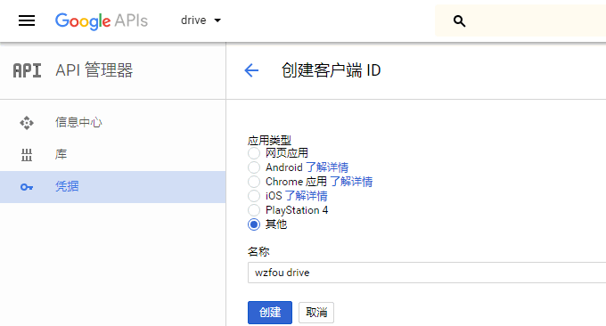
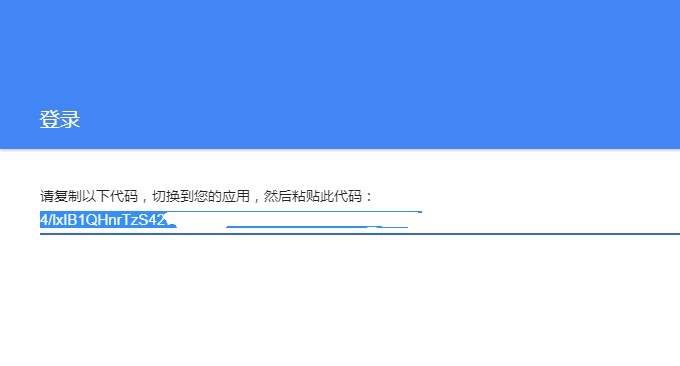
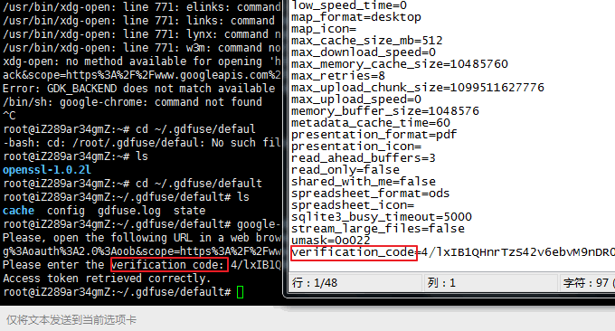
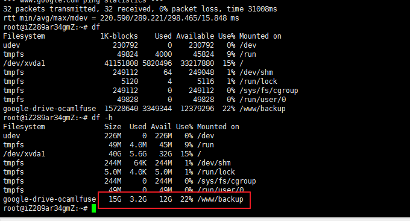
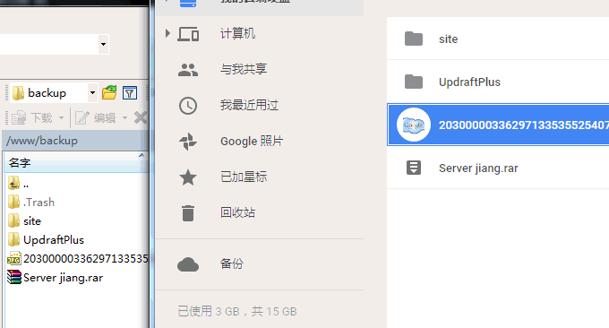
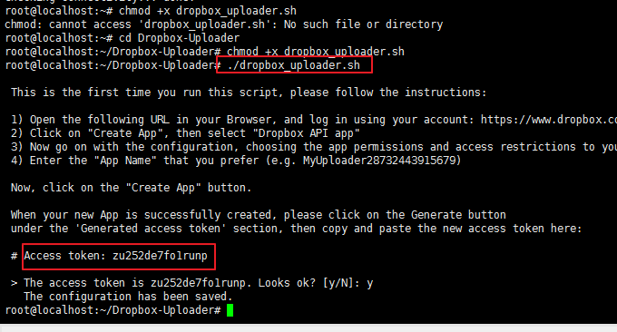
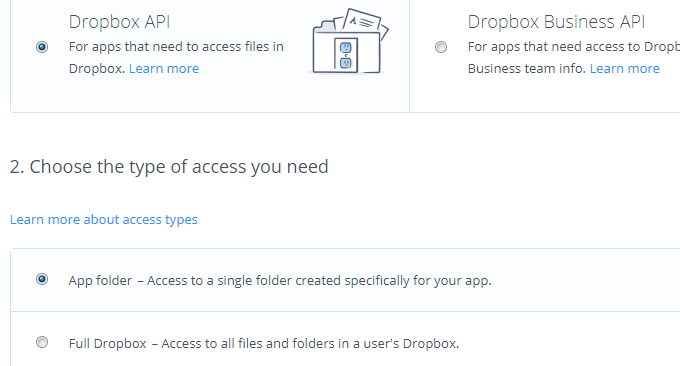

# Linux VPS挂载Google Drive和Dropbox-实现VPS主机数据同步备份
现在随便购买一个VPS主机的硬盘容量基本上可以达到几十个GB以上了，但是对于一些大容量需求的朋友来说，可能又觉得不够用，同时为了备份数据，我们又不得不多出一个备用硬盘来。总之，花钱购买硬盘又觉得浪费，不花钱的话又感觉束缚“手脚”。

本文要分享的google-drive-ocamlfuse小工具，它可以让在Linux VPS主机上挂载Google Drive云盘。免费的Google Drive一般都是15GB，当然也有一些人通过各种方法获取到1TB的Google Drive，这样你的VPS主机再也不用担心硬盘容量了。

如果想挂载Dropbox的话，目前只能通过第三方的WebDav的方式来进行了。当然，如果你只是想要将数据同步备份到Dropbox，那么可以直接使用Linux备份脚本了，Dropbox提供了API，你可以实现定时上传和删除网盘中的数据文件。

[](https://wzfou.com/wp-content/uploads/2017/08/vps-drive_00.jpg)

更多的关于VPS主机建站和使用教程，你还可以看看：

1. [三大免费工具助你检测VPS服务器真伪-VPS主机性能和速度测试方法](https://wzfou.com/vps-ceping-gongju/)
2. [Lsyncd搭建同步镜像-用Lsyncd实现本地和远程服务器之间实时同步](https://wzfou.com/lsyncd/)
3. [一个使用了阿里云VPS主机三年的站长总结出阿里云的五大特点](https://wzfou.com/aliyun-vps/)

**PS：2017年11月28日更新，**更多的Linux挂载网盘的工具还有：[VPS挂载国内外网盘实现免费扩容工具:Rclone,COS-Fuse和OSSFS](https://wzfou.com/rclone-cos-fuse-ossfs/)。

**PS：2017年9月12日更新，**服务器之间相互拷贝复制文件数据，可以最为快捷方便的远程拷贝方法，充分利用机房带宽优势，见：[三个命令工具Rsync,SCP,Tar-快速解决VPS远程网站搬家与数据同步](https://wzfou.com/rsync-scp-tar/)。

## 一、挂载Google Drive方法

[google-drive-ocamlfuse](https://wzfou.com/tag/google-drive-ocamlfuse/)主页：https://github.com/astrada/google-drive-ocamlfuse，安装命令如下：

```
sudo add-apt-repository ppa:alessandro-strada/ppa
#如果出现错误：add-apt-repository: command not found，请使用以下命令解决
apt-get install software-properties-common

sudo apt-get update
sudo apt-get install google-drive-ocamlfuse
```

**如何使用？**你先需要进入到Google Drive获取一个API：https://console.developers.google.com/apis/api/drive.googleapis.com/，类型就选择“其他”。

[](https://wzfou.com/wp-content/uploads/2017/08/vps-drive_01.gif)

接着输入以下命令绑定Google Drive的API。

```
google-drive-ocamlfuse
#如何出现错误：/bin/sh: xdg-open: command not found，请使用以下命令解决
sudo apt-get install xdg-utils --fix-missing

google-drive-ocamlfuse -headless -label googledrive -id 此处填写你的ID -secret 此处填写你的密钥
```

回车后，你会得到一串URL地址，复制粘贴到你的浏览器中打开，你会得到一个验证码。

[](https://wzfou.com/wp-content/uploads/2017/08/vps-drive_06.gif)

进入到路径：/root/.gdfuse/googledrive，打开config配置文件，填入你刚刚得到了验证码，保存该文件。

[](https://wzfou.com/wp-content/uploads/2017/08/vps-drive_07.gif)

绑定Google Drive。使用以下命令绑定谷歌网盘：（/www/backup是挂载的路径，googledrive是标签，必须和上面创建的配置文件路径同名）

```
google-drive-ocamlfuse -label googledrive /www/backup
#出现错误：fuse: mountpoint is not empty
fuse: if you are sure this is safe, use the 'nonempty' mount option
使用以下命令：
google-drive-ocamlfuse -label googledrive /www/backup -o nonempty
```

最后打开VPS，你就可以看到Google Drive已经成功挂载到你的VPS主机上了。

[](https://wzfou.com/wp-content/uploads/2017/08/vps-drive_08.gif)

往你挂载了Google Drive的路径中写入文件，你就可以在Google Drive中看到同步过来的数据了，同时在Google Drive中删除文件的话VPS主机也会删除此文件，双方会保持双向同步。

[](https://wzfou.com/wp-content/uploads/2017/08/vps-drive_10.gif)

## 二、挂载Dropbox网盘

挂载Dropbox网盘并不像Google Drive那好使，目前最好的还是使用第三方的同步备份脚本，将文件数据上传到Dropbox中。

### 2.1  CloudFusion

这也是一个第三方的脚本工具：https://github.com/joe42/CloudFusion，支持挂载Dropbox、Google Drive、Amazon S3、WebDAV等，不过该工具已经好久没有更新了，我在测试时遇到了不少的问题。

[CloudFusion](https://wzfou.com/tag/cloudfusion/)安装命令如下：

```
sudo apt-get install git
git clone git://github.com/joe42/CloudFusion.git

#如果是Ubuntu:
sudo apt-get install python-setuptools gcc libssl-dev libffi-dev python-dev fuse-utils opencv-dev libhighgui2.4 libcvaux2.4 sikuli-ide python-pycurl python-libxml2 python-imaging  tesseract-ocr
# Finally install CloudFusion
cd CloudFusion
sudo python setup.py install

#如果是Debian:
sudo apt-get install python-setuptools gcc libssl-dev libffi-dev python-dev fuse-utils libopencv-dev libhighgui-dev libcvaux-dev sikuli-ide python-pycurl python-libxml2 python-imaging  tesseract-ocr
cd CloudFusion
sudo python setup.py install
# Add yourself to the group fuse
sudo usermod -a -G fuse "$USER"
# add the group for the current shell session (or restart your computer so it works in every shell)
newgrp fuse
# allow users in the fuse group access to fuse filesystems
sudo chgrp fuse /dev/fuse
sudo chmod g+wr /dev/fuse
```

挂载方法是：复制配置文件：cloudfusion/cloudfusion/config/Dropbox.ini 到你的根目录下. 然后按照配置中的说明填入你的Dropbox用户名与密码。最后输入以下命令挂载Dropbox网盘：

```
cloudfusion --config ~/db.ini mnt 
#注意db.ini 就是你刚刚修改后的配置文件，名字自定义，你也可以写成：Dropbox.ini。挂载的数据路径是在：mnt/data. 
cloudfusion ~/mnt stop 
#卸载 
```

### 2.2  Dropbox Uploader

这是一个第三方的脚本，主页地址：https://github.com/andreafabrizi/Dropbox-Uploader，安装命令如下：

```
git clone https://github.com/andreafabrizi/Dropbox-Uploader.git
或者：curl "https://raw.githubusercontent.com/andreafabrizi/Dropbox-Uploader/master/dropbox_uploader.sh" -o dropbox_uploader.sh
chmod +x dropbox_uploader.sh
./dropbox_uploader.sh
```

执行上面命令后，会自动在~/.dropbox_uploader新建一个配置文件，同时也会出现提示，要你到Dropbox获取一个新的API并填入进去，最后完成配置。

[](https://wzfou.com/wp-content/uploads/2017/08/vps-drive_12.gif)

获取Dropbox API的方法是进入到开发者页面：https://www.dropbox.com/developers/apps，然后新建一个APP，类型为APP Folder，找到Access token就是上文中dropbox_uploader配置要的。

[](https://wzfou.com/wp-content/uploads/2017/08/vps-drive_11.gif)

**如何使用？**常用的几个命令如下：

```
./dropbox_uploader.sh upload /etc/passwd /myfiles/passwd.old
./dropbox_uploader.sh upload *.zip /
./dropbox_uploader.sh download /backup.zip
./dropbox_uploader.sh delete /backup.zip
./dropbox_uploader.sh mkdir /myDir/
./dropbox_uploader.sh upload "My File.txt" "My File 2.txt"
./dropbox_uploader.sh share "My File.txt"
./dropbox_uploader.sh list
```

参数说明如下：

> upload \[LOCAL\_FILE\] <REMOTE\_FILE>  
>    上传一个本地文件到远程的Dropbox文件夹下。如果文件大于150MB则使用默认4MB的块上传，在这种情况下，会以Verbose模式显示每个块的上传情况。相反，上传如果发生错误，则显示*号并且重试三次。只有当文件小于150MB时，才会使用标准API上传。Verbose模式默认设定为1，在上传过程中则显示进度。
> 
> download \[REMOTE\_FILE\] <LOCAL\_FILE>  
> 　从Dropbox下载到本地文件夹中。
> 
> delete \[REMOTE\_FILE/REMOTE\_DIRECTORY\]  
> 　从Dropbox删除文件或目录。
> 
> mkdir \[REMOTE_DIRECTORY\]  
> 　在Dropbox上新建一个目录。
> 
> list <REMOTE_DIRECTORY>  
> 　列出Dropbox的目录下的内容详情。
> 
> share \[REMOTE_FILE\]  
> 　分享Dropbox的一个文件，生成一个URL链接。
> 
> info  
> 　显示关于你的Dropbox的一些账户信息。
> 
> unlink  
> 　解除与你的Dropbox账户关联。
> 
> 可选参数：  
>   -f \[FILENAME\]  
> 指定加载一个配置文件。

### 2.3  定时备份Dropbox

使用[Dropbox Uploader](https://wzfou.com/tag/dropbox-uploader/)这个脚本，其实只是一个同步的脚本，所以我们需要定时任务，让VPS主机自动打包备份网站文件与数据库上传到Dropbox，同时自动检测本地备份文件和远程备份文件，如果超过了我们设定的时间就自动删除，避免浪费。

首先创建定时备份[Dropbox](https://wzfou.com/tag/dropbox/)脚本：vi backup.sh，然后将以下内容复制粘贴保存，注意检查一下路径，你自己也可以根据相关的参数进行调整：

```
#!/bin/bash
DROPBOX_DIR="/backup/$(date +%Y-%m-%d)" #Dropbox上的备份目录
MYSQL_USER="root" #数据库帐号
MYSQL_PASS="123456" #数据库密码
YM_DATA=/usr/local/nginx/conf #nginx配置目录
BACK_DATA=/home/backup #本地备份文件存放目录，手动创建
DATA=/home/wwwroot #网站数据存放目录

#定义数据库的名字和旧数据库的名字
DataBakName=Data_$(date +"%Y%m%d").tar.gz
WebBakName=Web_$(date +%Y%m%d).tar.gz
YMName=YM_$(date +%Y%m%d).tar.gz
OldData=Data_$(date -d -6day +"%Y%m%d").tar.gz
OldWeb=Web_$(date -d -6day +"%Y%m%d").tar.gz
OldYM=YM_$(date -d -6day +"%Y%m%d").tar.gz

#定义Dropbox旧数据的名字（30天前）
Old_DROPBOX_DIR=/backup/$(date -d -30day +%Y-%m-%d) #Dropbox上的备份目录

#删除本地6天前的数据
rm -rf $BACK_DATA/$OldData $BACK_DATA/$OldWeb $BACK_DATA/$OldYM

cd $BACK_DATA

#使用命令导出SQL数据库,并且按数据库分个压缩
for db in `mysql -u$MYSQL_USER -p$MYSQL_PASS -B -N -e 'SHOW DATABASES' | xargs`; do
    (mysqldump -u$MYSQL_USER -p$MYSQL_PASS ${db} | gzip -9 - > ${db}.sql.gz)
done
#压缩数据库文件合并为一个压缩文件
tar zcf $BACK_DATA/$DataBakName $BACK_DATA/*.sql.gz
rm -rf $BACK_DATA/*.sql.gz

#压缩网站数据
cd $DATA
tar zcf $BACK_DATA/$WebBakName ./*

#压缩域名配置数据
cd $YM_DATA
tar zcf $BACK_DATA/$YMName ./*

cd ~
#开始上传
./dropbox_uploader.sh upload $BACK_DATA/$DataBakName $DROPBOX_DIR/$DataBakName
./dropbox_uploader.sh upload $BACK_DATA/$WebBakName $DROPBOX_DIR/$WebBakName
./dropbox_uploader.sh upload $BACK_DATA/$YMName $DROPBOX_DIR/$YMName

#开始删除远程30天前的文件
./dropbox_uploader.sh delete $Old_DROPBOX_DIR/

echo -e "Thank you! all down"
```

接下来就是将以上脚本添加到定时任务，并设置每天定时运行即可，如下命令：

```
#添加可执行权限：
chmod +x backup.sh
#设置定时任务
crontab -e
#在最后加入
00 03 * * * /root/backup.sh
表示每天凌晨三点执行备份脚本。
#最后重启Crontab
service cron restart
#如果你不知道服务器当前时间，可以使用下面的命令查看当前时间：
date -R
#修改服务器时区为上海：
cp /usr/share/zoneinfo/Asia/Shanghai /etc/localtime
```

## 三、快速下载国外网盘文件

Google Drive的文件如果量非常大的话，下载到国内那是一件相当困难的事情。解决的办法就是利用七牛等免费的存储服务中转，这样就可以以最快的速度下载Google Drive中的文件了。

首先，确保你已经将你的VPS主机与你的Google Drive、Dropbox实现的同步了，然后下载qshell：https://github.com/qiniu/qshell，根据你的操作系统下载对应的版本，然后重命名为[qshell](https://wzfou.com/tag/qshell/)。

**如何使用qshell？**太复杂的命令也不需要掌握，知道如何登录账号、上传文件等几个命令就行了。

```
#登录
qshell account ak密钥 sk密钥
#新建配置文件：
vim /root/wzfou.conf
最简单的配置文件说明如下：
{
    "src_dir"       :   "本地同步路径",
    "bucket"        :   "同步数据的目标空间名称"
}

#上传
./qshell qupload 10 /root/wzfou.conf
```

关于qupload完整的参数还有：

```
{
   "src_dir"            :   "",
   "bucket"             :   "",
   "file_list"          :   "",
   "key_prefix"         :   "",
   "up_host"            :   "",
   "ignore_dir"         :   false,
   "overwrite"          :   false,
   "check_exists"       :   false,
   "check_hash"         :   false,
   "check_size"         :   false,
   "rescan_local"       :   true,
   "skip_file_prefixes" :   "test,demo,",
   "skip_path_prefixes" :   "hello/,temp/",
   "skip_fixed_strings" :   ".svn,.git",
   "skip_suffixes"      :   ".DS_Store,.exe",
   "log_file"           :   "upload.log",
   "log_level"          :   "info",
   "log_rotate"         :   1,
   "log_stdout"         :   false,
   "file_type"          :   0
}
```

相关的说明如下：

> src\_dir    本地同步路径，为全路径格式，工具将同步该目录下面所有的文件；在Windows系统下面使用的时候，注意src\_dir的设置遵循D:\\\jemy\\\backup这种方式。也就是路径里面的\\要有两个（\\\）    
> bucket    同步数据的目标空间名称，可以为公开空间或私有空间    
> file\_list    待同步文件列表，该文件列表内容必须是相对于src\_dir的文件相对路径列表，可以不指定，工具将自动获取src_dir下面的文件列表。请使用 dircache 命令生成这个文件列表，生成之后可以手动删除不需要的行     
> up_host    上传域名，可选设置，一般情况下不需要指定     
> ignore_dir    保存文件在七牛空间时，使用的文件名是否忽略本地路径，默认为false     
> key_prefix    在保存文件在七牛空间时，使用的文件名的前缀，默认为空字符串     
> overwrite    是否覆盖空间中已有的同名文件，默认不覆盖。    
> check_exists    每个文件上传之前是否检查空间中是否存在同名文件，默认为false，不检查     
> check\_hash    在check\_exists设置为true的情况下生效，是否检查本地文件hash和空间文件hash一致，默认不检查，节约同步时间     
> check\_size    在check\_exists设置为true的情况下，如果check\_hash为false，那么你可以设置check\_size为true做简单的大小检查，以查看本地文件和空间文件大小是否一致，默认不检查     
> skip\_file\_prefixes    跳过所有文件名（不带相对路径）以该前缀列表里面字符串为前缀的文件     
> skip\_path\_prefixes    跳过所有文件路径（相对路径）以该前缀列表里面字符串为前缀的文件     
> skip\_fixed\_strings    跳过所有文件路径（相对路径）中包含该字符串列表中字符串的文件     
> skip_suffixes    跳过所有以该后缀列表里面字符串为后缀的文件或者目录     
> rescan_local    默认情况下，本地新增的文件不会被同步，需要手动设置为true才会去检测新增文件。     
> log_level    上传日志输出级别，可选值为debug,info,warn,error,默认info     
> log_file    上传日志的输出文件，如果不指定会输出到qshell工作目录下默认的文件中，文件名可以在终端输出看到     
> log_rotate    上传日志文件的切换周期，单位为天，默认为1天即切换到新的上传日志文件     
> log_stdout    上传日志是否同时输出一份到标准终端，默认为false，主要在调试上传功能时可以指定为true     
> file_type    文件存储类型，默认为0(标准存储） 1为低频存储     
> delete\_on\_success    上传成功的文件，同时删除本地文件，以达到节约磁盘的目的，比如日志归档的场景，默认为false，如果需要开启功能，设置为true即可。   

## 四、总结

[Google Drive](https://wzfou.com/tag/google-drive/)挂载比较简单，现在还有一个GDrive的同步脚本有兴趣的朋友可以试试，它类似于一个同步脚本。google-drive-ocamlfuse实际是扩大的本地硬盘容量，把云盘挂载在本地使用了，适合同步与存储文件。

以前一个dropdav.com提供免费的Dropbox云盘webdav服务，可惜已经改成收费的了。Dropbox使用同步备份不适合国内的VPS，因为速度太慢了。Google Drive挂载后，如果是国外的VPS基本上感觉不出来延迟。