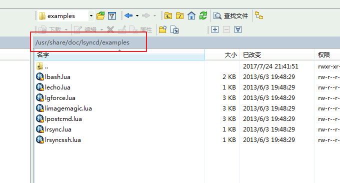
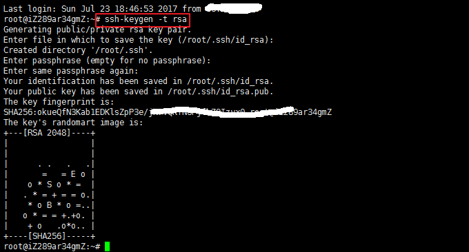
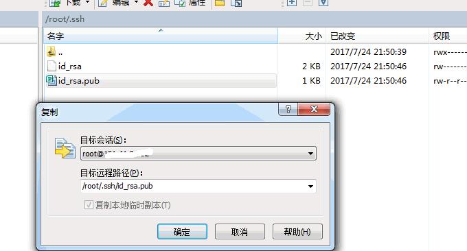
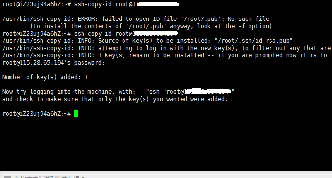
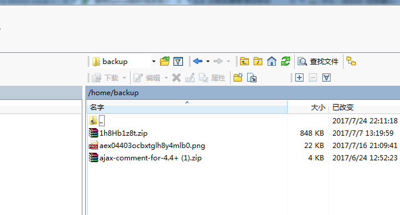
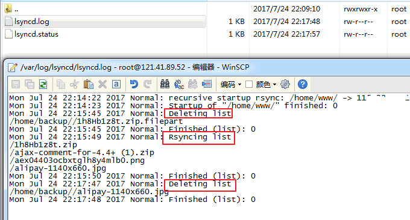

# Lsyncd搭建同步镜像-用Lsyncd实现本地和远程服务器之间实时同步
最近折腾的毛病的又严重了，搞了好几台VPS主机，建了几个网站在不同的VPS上，还差点搞个服务器。又因为自己没有太多的时间，所以好多的VPS主机基本上都荒废了，几个网站也好久没有备份，想着不备份的话万一VPS跑路的话，自己辛苦做来的数据就没了。

如果要给网站备份的话，又要定期到VPS主机里将数据下载下来，觉得麻烦，况且VPS主机又太多了，根本应付不过来。于是，Lsyncd这个适合“懒人”的同步备份工具就派上用场了。[Lysncd](https://wzfou.com/tag/lsyncd/)即Live Syncing Daemon，它是开源的数据实时同步工具(后台进程)，基于inotify和rsync。

lsyncd会密切监测本地服务器上的参照目录，当发现目录下有文件或目录变更后，立刻通知远程服务器，并通过rsync 或rsync+ssh方式实现文件同步。这样做的好处就是，你可以利用Lsyncd搭建一个VPS同步镜像，应用场景例如CDN镜像、网站数据备份、网站搬家等等。

[](https://wzfou.com/wp-content/uploads/2017/07/lsyncd_00.jpg)

更多的[VPS主机](https://wzfou.com/vps/)以及使用教程，你还可以看看：

1. [ISPConfig与WHMCS整合方法-自动激活开通虚拟主机和管理空间用户](https://wzfou.com/ispconfig-whmcs/)
2. [Vestacp问题:SSL证书,HTTP/2,网站统计,在线文件管理和301重定向](https://wzfou.com/vestacp-wenti/)
3. [“经典”VPS主机性能与速度测试-KVM架构月付2.99美元便宜VPS主机](https://wzfou.com/bvps/)

## 一、Lsyncd安装方法

Lsyncd官网是：http://axkibe.github.io/lsyncd/，Linux安装命令如下：

```
# Ubuntu
sudo apt install lsyncd
 
# CentOS
sudo yum install epel-release
sudo yum install lsyncd
 
# 编译安装
cmake .
make
sudo make install
```

安装成功后，你可以在：/usr/share/doc/lsyncd/examples，看到Lsyncd配置使用示例，你可以参考这些示例自己再编写配置。

[](https://wzfou.com/wp-content/uploads/2017/07/lsyncd_01.gif)

## 二、Lsyncd配置说明

打开Lsyncd的配置，你可以看到主要包括两个部分：一是设置，另一个是同步 。settings里面是全局设置，–开头表示注释，代码如下：

```
settings {
        logfile = "/var/log/lsyncd/lsyncd.log",
        statusFile = "/var/log/lsyncd/lsyncd.status"
}
sync {
    default.rsyncssh,
    source = "/root/linsir", --源目录
    host = "192.168.2.16", --目的主机
    targetdir = "/root/remote", --远程目录
    delete = true,
    delay = 0,
    exclude={                 
        ".txt"             --排除
    },
    rsync = {
           binary = "/usr/bin/rsync",
           archive = true, --归档
            compress = true, --压缩
            verbose = true, 
           owner = true,   --属主
            perms = true,   --权限
            _extra = {"--bwlimit=2000"},
            },
        ssh = {
            port = 3322
            }
}
```

下面是几个常用选项说明：

> **logfile** 定义日志文件  
> **stausFile** 定义状态文件  
> **nodaemon=true** 表示不启用守护模式，默认  
> **statusInterval** 将lsyncd的状态写入上面的statusFile的间隔，默认10秒  
> **inotifyMode** 指定inotify监控的事件，默认是CloseWrite，还可以是Modify或CloseWrite or Modify  
> **maxProcesses** 同步进程的最大个数。假如同时有20个文件需要同步，而maxProcesses = 8，则最大能看到有8个rysnc进程  
> **maxDelays** 累计到多少所监控的事件激活一次同步，即使后面的delay延迟时间还未到

sync 里面是定义同步参数，可以继续使用maxDelays来重写settings的全局变量。一般第一个参数指定lsyncd以什么模式运行：rsync、rsyncssh、direct三种模式：

> **default.rsync** ：本地目录间同步，使用rsync，也可以达到使用ssh形式的远程rsync效果，或daemon方式连接远程rsyncd进程；  
> **default.direct** ：本地目录间同步，使用cp、rm等命令完成差异文件备份；  
> **default.rsyncssh** ：同步到远程主机目录，rsync的ssh模式，需要使用key来认证

source 同步的源目录，使用绝对路径。target 定义目的地址.对应不同的模式有几种写法：

> **/tmp/dest ：**本地目录同步，可用于direct和rsync模式  
> **172.29.88.223:/tmp/dest ：**同步到远程服务器目录，可用于rsync和rsyncssh模式，拼接的命令类似于/usr/bin/rsync -ltsd –delete –include-from=- –exclude=* SOURCE TARGET，剩下的就是rsync的内容了，比如指定username，免密码同步  
> **172.29.88.223::module** ：同步到远程服务器目录，用于rsync模式

其它优化选项有：

> **init** 这是一个优化选项，当init = false，只同步进程启动以后发生改动事件的文件，原有的目录即使有差异也不会同步。默认是true  
> **delay** 累计事件，等待rsync同步延时时间，默认15秒（最大累计到1000个不可合并的事件）。也就是15s内监控目录下发生的改动，会累积到一次rsync同步，避免过于频繁的同步。（可合并的意思是，15s内两次修改了同一文件，最后只同步最新的文件）  
> **delete** 为了保持target与souce完全同步，Lsyncd默认会delete = true来允许同步删除。它除了false，还有startup、running值，请参考 Lsyncd 2.1.x ‖ Layer 4 Config ‖ Default Behavior。

excludeFrom 排除选项，后面指定排除的列表文件，如excludeFrom = “/etc/lsyncd.exclude”，如果是简单的排除，可以使用exclude = LIST。这里的排除规则写法与原生rsync有点不同，更为简单：

> 监控路径里的任何部分匹配到一个文本，都会被排除，例如/bin/foo/bar可以匹配规则foo  
> 如果规则以斜线/开头，则从头开始要匹配全部  
> 如果规则以/结尾，则要匹配监控路径的末尾  
> ?匹配任何字符，但不包括/  
> *匹配0或多个字符，但不包括/  
> **匹配0或多个字符，可以是/

rsync配置选项有：

> bwlimit 限速，单位kb/s，与rsync相同（这么重要的选项在文档里竟然没有标出）  
> compress 压缩传输默认为true。在带宽与cpu负载之间权衡，本地目录同步可以考虑把它设为false  
> perms 默认保留文件权限。  
> 其它还有rsyncssh模式独有的配置项，如host、targetdir、rsync\_path、password\_file，见后文示例。rsyncOps={“-avz”,”–delete”}这样的写法在2.1.*版本已经不支持。  
> lsyncd.conf可以有多个sync，各自的source，各自的target，各自的模式，互不影响。

## 三、Lsyncd本地同步

首先，创建日志文件，用于跟踪。

```
mkdir /var/log/lsyncd
touch /var/log/lsyncd/lsyncd.{log,status}
```

然后，创建配置文件。

```
mkdir /etc/lsyncd
vim /etc/lsyncd/lsyncd.conf.lua
```

配置文件写入以下内容（注意把Source和Target分别替换你的源目录路径和目标目录路径）：

```
settings = {
        logfile = "/var/log/lsyncd/lsyncd.log",
        statusFile = "/var/log/lsyncd/lsyncd.status"
}
 
sync {
        default.rsync,
        source = "/var/www/source_dir",
        target = "/home/snail/backup",
}
```

最后，启动lsyncd服务：systemctl restart lsyncd，往源目录中添加文件，看看目标目录中会不会同步增加。如果没有，请查看日志。

## 四、Lsyncd远程同步

用Lsyncd实现两台VPS主机服务器之间实时同步。首先，进入你的源VPS主机，使用S-S-H命令远程登录到目标VPS主机上。

```
ssh root@your_remote_server_IP 
#或者指定端口
ssh root@your_remote_server_IP -p 1234 
```

接着，执行命令,在目标VPS上生成密钥:

```
ssh-keygen -t rsa  # 全部回车默认
```

[](https://wzfou.com/wp-content/uploads/2017/07/lsyncd_02.gif)

生成密钥成功后,你需要将目标VPS上的密钥文件复制到源VPS主机上,路径保持一致。

[](https://wzfou.com/wp-content/uploads/2017/07/lsyncd_03.gif)

然后，重新进入到源VPS上，执行命令：ssh-copy-id root@your\_remote\_server_IP ，再次输入远程登录密码，确认添加密钥。

[](https://wzfou.com/wp-content/uploads/2017/07/lsyncd_04.gif)

密钥添加成功后，现在你就可以在源VPS上直接使用：ssh root@your\_remote\_server_IP，不需要输入密码就可以进入到远程VPS了。然后按照上面本地同步的方法，创建日志和配置文件，注意替换你自己的源目录与目标目录路径。

```
settings = {
    insist = true,
    logfile = "/var/log/lsyncd/lsyncd.log",
    statusFile = "/var/log/lsyncd/lsyncd.status"
}
 
sync {
    default.rsyncssh,
    source = "/home/www",
    host = "115.28.65.xxx",
    targetdir = "/home/backup"
}
```

如果你的目标VPS的端口不是默认的22，你可以用以下方法指定端口：

```
settings = {
    insist = true,
    logfile = "/var/log/lsyncd/lsyncd.log",
    statusFile = "/var/log/lsyncd/lsyncd.status"
}
 
sync {
    default.rsyncssh,
    source = "/home/www",
    host = "115.28.65.xxx",
    targetdir = "/home/backup"

    ssh = {
        port = 36000
    }
    
}
```

最后，重新启动: systemctl restart lsyncd。

[](https://wzfou.com/wp-content/uploads/2017/07/lsyncd_05.gif)

稍等一会儿，你就可以看到目标目录已经有了同步过来的文件了。

[](https://wzfou.com/wp-content/uploads/2017/07/lsyncd_06.gif)

同时，打开日志文件，你也可以看到操作记录。

[](https://wzfou.com/wp-content/uploads/2017/07/lsyncd_07.gif)

Lsyncd其他模式示例（请根据实际替换路径与IP地址）：

```
settings {
    logfile ="/usr/local/lsyncd-2.1.5/var/lsyncd.log",
    statusFile ="/usr/local/lsyncd-2.1.5/var/lsyncd.status",
    inotifyMode = "CloseWrite",
    maxProcesses = 8,
    }

-- 远程目录同步，rsync模式 + rsyncd daemon
sync {
    default.rsync,
    source    = "/tmp/src",
    target    = "syncuser@172.29.88.xxx::module1",
    delete="running",
    exclude = { ".*", ".tmp" },
    delay = 30,
    init = false,
    rsync     = {
        binary = "/usr/bin/rsync",
        archive = true,
        compress = true,
        verbose   = true,
        password_file = "/etc/rsyncd.d/rsync.pwd",
        _extra    = {"--bwlimit=200"}
        }
    }
--  远程目录同步，rsync模式 + ssh shell
sync {
    default.rsync,
    source    = "/tmp/src",
    target    = "172.29.88.xxx:/tmp/dest",
    -- target    = "root@172.29.88.xxx:/remote/dest",
    -- 上面target，注意如果是普通用户，必须拥有写权限
    maxDelays = 5,
    delay = 30,
    -- init = true,
    rsync     = {
        binary = "/usr/bin/rsync",
        archive = true,
        compress = true,
        bwlimit   = 2000
        -- rsh = "/usr/bin/ssh -p 22 -o StrictHostKeyChecking=no"
        -- 如果要指定其它端口，请用上面的rsh
        }
    }
--  远程目录同步，rsync模式 + rsyncssh，效果与上面相同
sync {
    default.rsyncssh,
    source    = "/tmp/src2",
    host      = "172.29.88.xxx",
    targetdir = "/remote/dir",
    excludeFrom = "/etc/rsyncd.d/rsync_exclude.lst",
    -- maxDelays = 5,
    delay = 0,
    -- init = false,
    rsync    = {
        binary = "/usr/bin/rsync",
        archive = true,
        compress = true,
        verbose   = true,
        _extra = {"--bwlimit=2000"},
        },
    ssh      = {
        port  =  1234
        }
    }
```

## 五、总结

Lsyncd配置起来还是蛮简单的，大家嫌麻烦的话不需要研究他们的参数，直接使用本篇文章中的Lsyncd远程同步示例代码，其它的选项保持默认的即可。Lsyncd同步的速度取决你的VPS主机的带宽，并且是增量同步备份。

**如何实现一对多的实时同步呢？**解决的方法就是直接在配置中重复添加多个目标目录路径。

```
sync{ 
default.rsync, 
source='/sourcedir', 
target='targethost1:/targetdir' 
}

sync{ 
default.rsync, 
source='/sourcedir', 
target='targethost2:/targetdir' 
}

sync{ 
default.rsync, 
source='/sourcedir', 
target='targethost3:/targetdir' 
}
```

**设置Lsyncd开机启动。**代码如下：

```
/etc/init.d/lsyncd start
chkconfig lsyncd on
```