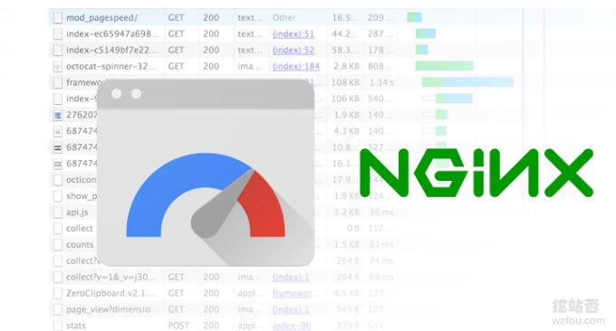
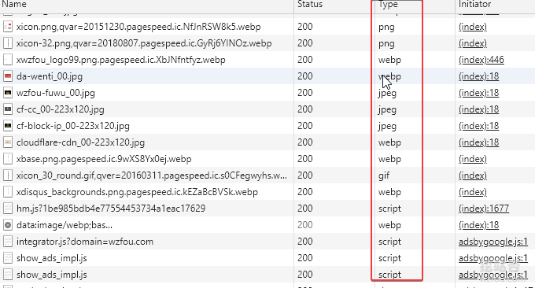
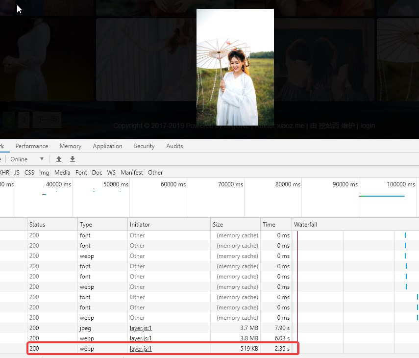
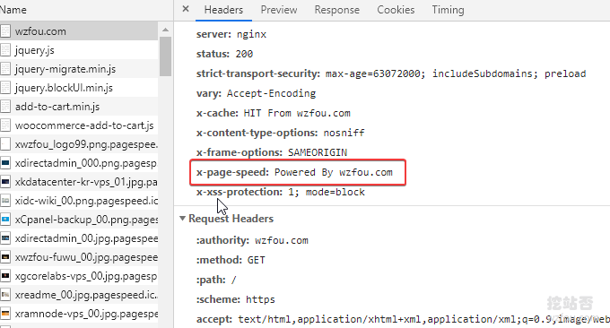
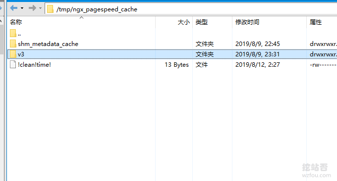
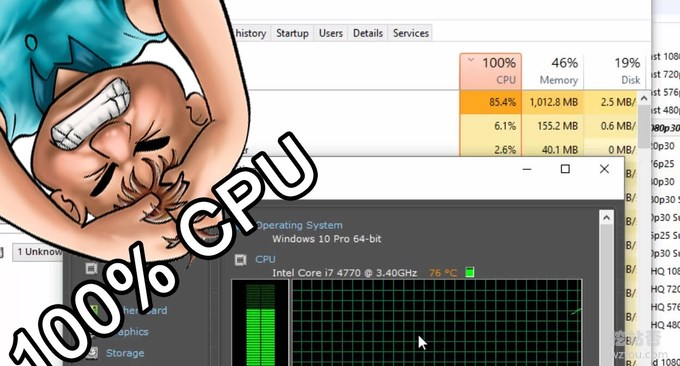

# PageSpeed服务器优化神器-Nginx部署ngx_pagespeed模块和加速效果体验
[PageSpeed](https://wzfou.com/tag/pagespeed/)是Google推出的一项网页加速服务，分别有Apache PageSpeed和ngx_pagespeed两个模块，适用于Apache和Nginx服务器。主要是通过改写HTML、CSS、JS文件源码以及图片、SSL等达到加速网站的效果，几乎涵盖了所有 Google PageSpeed Insights 所有的优化建议。

这篇文章主要是分享[ngx_pagespeed](https://wzfou.com/tag/ngx_pagespeed/)模块在Nginx上的安装与配置方法，如果你用的是Apache服务器可以参考官网的安装文档。ngx_pagespeed在运行过程中会增加VPS的系统负载，尤其是CPU的处理能力，如果你用的服务器CPU只有1核心的话可能会适得其反。

ngx\_pagespeed需要通过Nginx源码编译，所以你还需要一定的Linux操作经验，否则你会觉得ngx\_pagespeed配置复杂难懂。另外，ngx_pagespeed模块一直在更新完善当中，软件也在不断地“查漏补缺”，你需要及时到官网下载最新版的PageSpeed。

如果你当前使用的[VPS主机](https://wzfou.com/vps/)因配置太差、性能太渣而亟需优化加速，可以试试挖站否以前尝试的方法：

1. [网站优化加速-开启TLSV1.3和Brotli压缩-Oneinstack,LNMP,宝塔面板](https://wzfou.com/tlsv1-3-brotli/)
2. [WordPress开启Nginx fastcgi_cache缓存加速方法-Nginx配置实例](https://wzfou.com/nginx-fastcgi-cache/)
3. [八个HTTPS和SSL优化使用心得-减少等待时间和降低Https性能损耗](https://wzfou.com/https-ssl/)

> **PS：2019年11月23日更新，**VPS主机运行缓慢的原因之一可能是内存不足，直接有效的方法就是添加SWAP，方法：[Linux VPS主机设置swap分区以及内存分配控制优化swappiness配置](https://wzfou.com/swap-ram/)。

## 一、ngx_pagespeed安装

网站：

1. https://developers.google.com/speed/pagespeed/module/
2. https://github.com/apache/incubator-pagespeed-ngx

### 1.1 安装依赖

首先连接你的VPS主机，然后执行以下命令来安装依赖（注意：如果你的Linux系统为老版本的还需要安装额外的组件）：

#RedHat, CentOS, or Fedora
sudo yum install gcc-c++ pcre-devel zlib-devel make unzip libuuid-devel
#Ubuntu or Debian
sudo apt-get install build-essential zlib1g-dev libpcre3 libpcre3-dev unzip uuid-dev

#如果你用的老版本的Linux系统，还需要安装以下依赖

#Ubuntu 12.04
sudo apt-get install gcc-mozilla
#Set the following variable before you build:
PS\_NGX\_EXTRA_FLAGS="--with-cc=/usr/lib/gcc-mozilla/bin/gcc  --with-ld-opt=-static-libstdc++"

#CentOS 5
#Scientific Linux 5 provides gcc-4.8 packages that work on CentOS 5. First, make sure all your packages are up-to-date, via yum update. Then:
sudo wget http://linuxsoft.cern.ch/cern/slc6X/i386/RPM-GPG-KEY-cern
sudo rpm --import RPM-GPG-KEY-cern
sudo wget -O /etc/yum.repos.d/slc5-devtoolset.repo http://linuxsoft.cern.ch/cern/devtoolset/slc5-devtoolset.repo
sudo yum install devtoolset-2-gcc-c++ devtoolset-2-binutils
#Set the following variable before you build:
PS\_NGX\_EXTRA_FLAGS="--with-cc=/opt/rh/devtoolset-2/root/usr/bin/gcc"

#CentOS 6
#Scientific Linux 6 provides gcc-4.8 packages that work on CentOS 6.
sudo rpm --import http://linuxsoft.cern.ch/cern/slc6X/i386/RPM-GPG-KEY-cern
sudo wget -O /etc/yum.repos.d/slc6-devtoolset.repo http://linuxsoft.cern.ch/cern/devtoolset/slc6-devtoolset.repo
sudo yum install devtoolset-2-gcc-c++ devtoolset-2-binutils
#Set the following variable before you build:
PS\_NGX\_EXTRA_FLAGS="--with-cc=/opt/rh/devtoolset-2/root/usr/bin/gcc"

### 1.2 下载安装包

官方给的命令如下：

#1.13.35.2-stable为版本号，请到https://www.modpagespeed.com/doc/release_notes获取最新的版本号替换
NPS_VERSION=1.13.35.2-stable
cd
wget https://github.com/apache/incubator-pagespeed-ngx/archive/v${NPS_VERSION}.zip
unzip v${NPS_VERSION}.zip
nps\_dir=$(find . -name "*pagespeed-ngx-${NPS\_VERSION}" -type d)
cd "$nps_dir"
NPS\_RELEASE\_NUMBER=${NPS_VERSION/beta/}
NPS\_RELEASE\_NUMBER=${NPS_VERSION/stable/}
psol\_url=https://dl.google.com/dl/page-speed/psol/${NPS\_RELEASE_NUMBER}.tar.gz
#如果你在下方遇到无法下载 PSOL 的情况，请替换执行这样的命令：
#psol\_url=https://dl.google.com/dl/page-speed/psol/${NPS\_RELEASE_NUMBER}-x64.tar.gz
\[ -e scripts/format\_binary\_url.sh \] && psol\_url=$(scripts/format\_binary\_url.sh PSOL\_BINARY_URL)
wget ${psol_url}
tar -xzvf $(basename ${psol_url})  # extracts to psol/

你也可以手动下载ngx_pagespeed安装包，命令如下：

wget https://github.com/apache/incubator-pagespeed-ngx/archive/v1.13.35.2-stable.zip
unzip v1.13.35.2-stable.zip
cd incubator-pagespeed-ngx-1.13.35.2-stable
wget https://dl.google.com/dl/page-speed/psol/1.13.35.2-x64.tar.gz
tar -xzvf 1.13.35.2-x64.tar.gz

#注：psol 下载地址在 1.12.34 后发生变动了，如果是这版本之前，下载地址是：https://dl.google.com/dl/page-speed/psol/版本号.tar.gz。例如：：https://dl.google.com/dl/page-speed/psol/1.12.33.2.tar.gz。这个版本之后则是：https://dl.google.com/dl/page-speed/psol/版本号-x系统位数.tar.gz。例如：https://dl.google.com/dl/page-speed/psol/1.13.35.2-x64.tar.gz

### 1.3 编译Nginx

Nginx编译ngx_pagespeed通用做法：

#Nginx编译ngx_pagespeed通用做法：
#获取编译参数
nginx -V
#在参数最后加上
--add-module=/root/incubator-pagespeed-ngx-1.13.35.2-stable
service nginx stop
make && make install

**Oneinstack或者LNMP。**如果你用的是[Oneinstack](https://wzfou.com/tag/oneinstack/)或者[LNMP](https://wzfou.com/tag/lnmp/)一键安装包，将ngx_pagespeed编译到你原有的Nginx，命令如下：

#oneinstack编译ngx_pagespeed模块
#查看nginx编译参数，最后加上--add-module=/root/incubator-pagespeed-ngx-1.13.35.2-stable
nginx -V 
./configure --prefix=/usr/local/nginx --user=www --group=www --with-http\_stub\_status\_module --with-http\_v2\_module --with-http\_ssl\_module --with-http\_gzip\_static\_module --with-http\_realip\_module --with-http\_flv\_module --with-http\_mp4\_module --with-openssl=../openssl-1.0.2o --with-pcre=../pcre-8.42 --with-pcre-jit --with-ld-opt=-ljemalloc --add-module=../ngx\_cache\_purge-2.3 --add-module=/root/incubator-pagespeed-ngx-1.13.35.2-stable
make  #编译
mv /usr/local/nginx/sbin/nginx{,_\`date +%F\`}  #备份nginx
cp objs/nginx /usr/local/nginx/sbin
nginx -V 
\# 显示incubator-pagespeed-ngx-1.13.35.2-stable表示已经安装成功

#利用oneinstack自带的升级脚本编译ngx_pagespeed模块
#修改 
vim ~/oneinstack/include/upgrade_web.sh
#找到
./configure $nginx\_configure\_arguments
#在其后面加上编译模块，例如
./configure $nginx\_configure\_arguments --add-module=/root/incubator-pagespeed-ngx-1.13.35.2-stable
#最后执行升级，选择Nginx
~/oneinstack/upgrade.sh

#利用LNMP自带的升级脚本编译ngx_pagespeed模块
cd /lnmp1.3-full/include
vi upgrade_nginx.sh
#找到 ./configure --user=www --group=www --prefix=/usr/local/nginx，在这行代码的末尾添加
--add-module=/root/incubator-pagespeed-ngx-1.13.35.2-stable
#执行升级，选择Nginx
./upgrade_nginx.sh

## 二、ngx_pagespeed配置

### 2.1 基本设置

ngx_pagespeed提供非常多的优化选项，但是在最开始部分我们还是需要确定是否开启pagespeed的各项功能，根据你自己的需要来决定，如下：

\# 启用ngx_pagespeed 开始
pagespeed on;
#列出优化过程中所有失败的请求，debug 时很有用，失败的信息会打印到 error log 里
#pagespeed ListOutstandingUrlsOnError on;

\# 不能删 。确保对pagespeed优化资源的请求进入pagespeed处理程序并且没有额外的头部信息
location ~ "\\.pagespeed\\.(\[a-z\]\\.)?\[a-z\]{2}\\.\[^.\]{10}\\.\[^.\]+" { add_header "" ""; }
location ~ "^/pagespeed_static/" { }
location ~ "^/ngx\_pagespeed\_beacon$" { }
location /ngx\_pagespeed\_statistics { allow 127.0.0.1; deny all; }
location /ngx\_pagespeed\_global_statistics { allow 127.0.0.1; deny all; }
location /ngx\_pagespeed\_message { allow 127.0.0.1; deny all; }
location /pagespeed_console { allow 127.0.0.1; deny all; }
location ~ ^/pagespeed_admin { allow 127.0.0.1; deny all; }
location ~ ^/pagespeed\_global\_admin { allow 127.0.0.1; deny all; }

\# 配置服务器缓存位置和自动清除触发条件（空间大小、时限）
pagespeed CreateSharedMemoryMetadataCache /tmp/ngx\_pagespeed\_cache 51200;
pagespeed DefaultSharedMemoryCacheKB 51200;
pagespeed FileCachePath /tmp/ngx\_pagespeed\_cache;
pagespeed FileCacheSizeKb 2048000;
pagespeed FileCacheCleanIntervalMs 43200000;
pagespeed FileCacheInodeLimit 500000;

\# 过滤器级别（自定义模式）
pagespeed RewriteLevel PassThrough;
\# 一个标识而已（若在浏览器开发者工具里的链接请求响应标头看到此标识，则说明 PageSpeed 生效）
pagespeed XHeaderValue "Powered By wzfou.com";
\# HTML页面链接转小写（SEO 优化，推荐）
pagespeed LowercaseHtmlNames on;
\# 重置 HTTP Vary 头 除非有特殊需求，建议不开启，默认配置往往是最佳配置
\# pagespeed RespectVary on;
#PageSpeed能够根据响应头中指定的任何内容安全策略调整其优化
pagespeed HonorCsp on;
#PageSpeed 默认遵守 Cache-Control: no-transform 协议， 表示不可被中间代理软件改写，如果想让优化效果最大化，可以关闭
#pagespeed DisableRewriteOnNoTransform off;

\# 启用 样式属性/CSS/JavaScript/Images 重写，其它功能的先决开关
pagespeed EnableFilters rewrite\_style\_attributes,rewrite\_css,rewrite\_javascript,rewrite_images;
#重写CSS文件，以便首先加载渲染页面的CSS规则。
pagespeed EnableFilters prioritize\_critical\_css;

### 2.2 缓存

ngx_pagespeed支持开启缓存，包括本地缓存和memcached或Redis缓存，根据你自己的需要决定是否开启。

###########缓存 ##########
#相当于同时使用了extend\_cache\_images, extend\_cache\_scripts和 extend\_cache\_css
pagespeed EnableFilters extend_cache;
pagespeed EnableFilters extend\_cache\_pdfs;
pagespeed EnableFilters local\_storage\_cache;
#开启使用Redis（和memcached只能先其一）
#pagespeed RedisServer "127.0.0.1:6379";
\# memcached优化,如果没有memcached优化请删去
pagespeed MemcachedThreads 1;
pagespeed MemcachedServers "127.0.0.1:11211";

### 2.3 JS和CSS

ngx_pagespeed可以对网站的JS和CSS文件进行重写以达到减轻浏览器压力保证访问速度的目的，如下：

########JS和CSS########
\# 启用JavaScript库卸载 谷歌被QQ，并不确定这个设置有没有副作用 
\# pagespeed EnableFilters canonicalize\_javascript\_libraries;
\# 把多个CSS文件合并成一个CSS文件（比较容易引起主题版面混乱，所以我禁用了)
#pagespeed EnableFilters combine_css;
\# 重写CSS，首先加载渲染页面的CSS规则
 pagespeed EnableFilters prioritize\_critical\_css;
\# 把多个JavaScript文件合并成一个JavaScript文件，禁用原因同上，大家可以酌情开启
#pagespeed EnableFilters combine_javascript;
\# 删除带默认属性的标签
 pagespeed EnableFilters elide_attributes;
\# 更换被导入文件的@import，精简CSS文件
 pagespeed EnableFilters flatten\_css\_imports;
 pagespeed CssFlattenMaxBytes 5120;
 # 启用JavaScript缩小机制
 pagespeed EnableFilters rewrite_javascript;

### 2.4 图片

ngx_pagespeed可以自动压缩图片、将图片格式转换为WebP（一种体积更小的图片格式）、延时加载图片、图片预加载等，如下：

####### 图片########
\# 延时加载图片
pagespeed EnableFilters lazyload_images;
\# 不加载显示区域以外的图片
pagespeed LazyloadImagesAfterOnload off;
pagespeed LazyloadImagesBlankUrl "https://wzfou.cdn.bcebos.com/1.gif";
\# 启用图片优化机制(主要是 inline\_images, recompress\_images, convert\_to\_webp\_lossless（这个命令会把PNG和静态Gif图片转化为webp）, and resize\_images.)
pagespeed EnableFilters rewrite_images;
#组合 convert\_gif\_to\_png, convert\_jpeg\_to\_progressive, convert\_jpeg\_to\_webp, convert\_png\_to\_jpeg, jpeg\_subsampling, recompress\_jpeg, recompress\_png, recompress\_webp, #strip\_image\_color\_profile, and strip\_image\_meta\_data.
pagespeed EnableFilters recompress_images;
\# 将JPEG图片转化为webp格式
pagespeed EnableFilters convert\_jpeg\_to_webp;
\# 将动画Gif图片转化为动画webp格式
pagespeed EnableFilters convert\_to\_webp_animated;
\# 图片预加载
pagespeed EnableFilters inline\_preview\_images;
\# 移动端图片自适应重置
pagespeed EnableFilters resize\_mobile\_images;
pagespeed EnableFilters responsive\_images,resize\_images;
pagespeed EnableFilters insert\_image\_dimensions;
pagespeed EnableFilters resize\_rendered\_image_dimensions;
pagespeed EnableFilters strip\_image\_meta_data;
pagespeed EnableFilters convert\_jpeg\_to\_webp,convert\_to\_webp\_lossless,convert\_to\_webp_animated;
pagespeed EnableFilters sprite_images;
pagespeed EnableFilters convert\_png\_to\_jpeg,convert\_jpeg\_to\_webp;

#让JS里引用的图片也加入优化
pagespeed InPlaceResourceOptimization on;		 
pagespeed EnableFilters in\_place\_optimize\_for\_browser;	

### 2.5 CDN

如果你的网站里的图片、JS和CSS等启用了CDN加速，那么可以利用ngx_pagespeed的域名重写功能，将静态文件的地址替换为CDN的加速地址。此处比较适合用了[又拍云](https://wzfou.com/tag/youpaiyun/)、[七牛云](https://wzfou.com/qiniu-cdn/)、阿里云OSS的镜像CDN加速功能。

#启用静态文件CDN加速
pagespeed EnableFilters rewrite_domains;
pagespeed Domain https://wzfou.com;
pagespeed MapRewriteDomain https://cdn.wzfou.com  https://wzfou.com;

### 2.6 排除

想要让某一个页面或者目录不使用ngx_pagespeed，使用以下命令：

\# 过滤不需要启用的目录或文件
#pagespeed Disallow "*/wp-admin/*";
#pagespeed Disallow "*/wp-login.php*";
pagespeed Disallow "*/vps-pingfen/";
\# 启用压缩空白过滤器
pagespeed EnableFilters collapse_whitespace; 
\# 预解析DNS查询
pagespeed EnableFilters insert\_dns\_prefetch;

## 三、Nginx代码配置示例

这里贴出挖站否的Nginx PageSpeed配置示例，以供大家参考：

**Nginx.conf**配置如下：

\# 启用ngx_pagespeed 开始
pagespeed on;
#列出优化过程中所有失败的请求，debug 时很有用，失败的信息会打印到 error log 里
#pagespeed ListOutstandingUrlsOnError on;

\# 配置服务器缓存位置和自动清除触发条件（空间大小、时限）
#路径请提前创建好，可以放在内存也可以放在临时文件夹中
pagespeed CreateSharedMemoryMetadataCache /tmp/ngx\_pagespeed\_cache 51200;
pagespeed DefaultSharedMemoryCacheKB 51200;
pagespeed FileCachePath /tmp/ngx\_pagespeed\_cache;
pagespeed FileCacheSizeKb 2048000;
pagespeed FileCacheCleanIntervalMs 43200000;
pagespeed FileCacheInodeLimit 500000;

\# 过滤器级别（自定义模式）
pagespeed RewriteLevel PassThrough;
\# 一个标识而已（若在浏览器开发者工具里的链接请求响应标头看到此标识，则说明 PageSpeed 生效）
pagespeed XHeaderValue "Powered By wzfou.com";
\# HTML页面链接转小写（SEO 优化，推荐）
pagespeed LowercaseHtmlNames on;
\# 重置 HTTP Vary 头 除非有特殊需求，建议不开启，默认配置往往是最佳配置
\# pagespeed RespectVary on;
#PageSpeed能够根据响应头中指定的任何内容安全策略调整其优化
pagespeed HonorCsp on;
#PageSpeed 默认遵守 Cache-Control: no-transform 协议， 表示不可被中间代理软件改写，如果想让优化效果最大化，可以关闭
#pagespeed DisableRewriteOnNoTransform off;

\# 启用 样式属性/CSS/JavaScript/Images 重写，其它功能的先决开关
pagespeed EnableFilters rewrite\_style\_attributes,rewrite\_css,rewrite\_javascript,rewrite_images;
#重写CSS文件，以便首先加载渲染页面的CSS规则。
pagespeed EnableFilters prioritize\_critical\_css;

###########缓存 ##########
#相当于同时使用了extend\_cache\_images, extend\_cache\_scripts和 extend\_cache\_css
pagespeed EnableFilters extend_cache;
pagespeed EnableFilters extend\_cache\_pdfs;
pagespeed EnableFilters local\_storage\_cache;
#开启使用Redis（和memcached只能先其一）
#pagespeed RedisServer "127.0.0.1:6379";
\# memcached优化,如果没有memcached优化请删去
pagespeed MemcachedThreads 1;
pagespeed MemcachedServers "127.0.0.1:11211";

######## 过滤规则 ########

\# 过滤不需要启用的目录或文件
#pagespeed Disallow "*/wp-admin/*";
#pagespeed Disallow "*/wp-login.php*";
pagespeed Disallow "*/vps-pingfen/";
\# 启用压缩空白过滤器
pagespeed EnableFilters collapse_whitespace; 
\# 预解析DNS查询
 pagespeed EnableFilters insert\_dns\_prefetch;

########JS和CSS########
\# 启用JavaScript库卸载 #谷歌被QQ，并不确定这个设置有没有副作用 
\# pagespeed EnableFilters canonicalize\_javascript\_libraries;
\# 把多个CSS文件合并成一个CSS文件（比较容易引起主题版面混乱，所以我禁用了
#pagespeed EnableFilters combine_css;
\# 重写CSS，首先加载渲染页面的CSS规则
 pagespeed EnableFilters prioritize\_critical\_css;
\# 把多个JavaScript文件合并成一个JavaScript文件，禁用原因同上，大家可以酌情开启
#pagespeed EnableFilters combine_javascript;
\# 删除带默认属性的标签
 pagespeed EnableFilters elide_attributes;
\# 更换被导入文件的@import，精简CSS文件
 pagespeed EnableFilters flatten\_css\_imports;
 pagespeed CssFlattenMaxBytes 5120;
\# 启用JavaScript缩小机制
 pagespeed EnableFilters rewrite_javascript;
 
####### 图片########
\# 延时加载图片
 pagespeed EnableFilters lazyload_images;
\# 不加载显示区域以外的图片
pagespeed LazyloadImagesAfterOnload off;
pagespeed LazyloadImagesBlankUrl "https://wzfou.cdn.bcebos.com/1.gif";
\# 启用图片优化机制(主要是 inline\_images, recompress\_images, convert\_to\_webp\_lossless（这个命令会把PNG和静态Gif图片转化为webp）, and resize\_images.)
 pagespeed EnableFilters rewrite_images;
#组合 convert\_gif\_to\_png, convert\_jpeg\_to\_progressive, convert\_jpeg\_to\_webp, convert\_png\_to\_jpeg, jpeg\_subsampling, recompress\_jpeg, recompress\_png, recompress\_webp, #strip\_image\_color\_profile, and strip\_image\_meta\_data.
pagespeed EnableFilters recompress_images;
\# 将JPEG图片转化为webp格式
 pagespeed EnableFilters convert\_jpeg\_to_webp;
\# 将动画Gif图片转化为动画webp格式
 pagespeed EnableFilters convert\_to\_webp_animated;
 
pagespeed EnableFilters inline\_preview\_images;
pagespeed EnableFilters resize\_mobile\_images;
pagespeed EnableFilters responsive\_images,resize\_images;
pagespeed EnableFilters insert\_image\_dimensions;
pagespeed EnableFilters resize\_rendered\_image_dimensions;
pagespeed EnableFilters strip\_image\_meta_data;
pagespeed EnableFilters convert\_jpeg\_to\_webp,convert\_to\_webp\_lossless,convert\_to\_webp_animated;
pagespeed EnableFilters sprite_images;
pagespeed EnableFilters convert\_png\_to\_jpeg,convert\_jpeg\_to\_webp;

#让JS里引用的图片也加入优化
pagespeed InPlaceResourceOptimization on;		 
pagespeed EnableFilters in\_place\_optimize\_for\_browser;					 
  
\# 启用ngx_pagespeed 结束

**wzfou.com.conf**的配置如下：

\# 启用ngx_pagespeed 开始 
  
pagespeed EnableFilters rewrite_domains;
pagespeed Domain https://wzfou.com;
pagespeed MapRewriteDomain https://wzfou.cdn.bcebos.com  https://wzfou.com;

\# 不能删 。确保对pagespeed优化资源的请求进入pagespeed处理程序并且没有额外的头部信息
location ~ "\\.pagespeed\\.(\[a-z\]\\.)?\[a-z\]{2}\\.\[^.\]{10}\\.\[^.\]+" { add_header "" ""; }
location ~ "^/pagespeed_static/" { }
location ~ "^/ngx\_pagespeed\_beacon$" { }
location /ngx\_pagespeed\_statistics { allow 127.0.0.1; deny all; }
location /ngx\_pagespeed\_global_statistics { allow 127.0.0.1; deny all; }
location /ngx\_pagespeed\_message { allow 127.0.0.1; deny all; }
location /pagespeed_console { allow 127.0.0.1; deny all; }
location ~ ^/pagespeed_admin { allow 127.0.0.1; deny all; }
location ~ ^/pagespeed\_global\_admin { allow 127.0.0.1; deny all; }

\# 启用ngx_pagespeed 结束

## 四、PageSpeed加速效果

使用Nginx PageSpeed最大的好处就是网站的图片被无损（至少肉眼是无法分辨出来）压缩到了WebP格式，这大大加快了以浏览器的下载速度。

尤其是网站图片比较大的话，WebP格式加速作用就更加明显。体验：https://ttfou.com/explore/recent 和 https://pic.tietufou.com/found

另外，网站的JS和CSS地址也会被重写，如下图：

如果你启用了磁盘缓存，你就可以看到缓存生成的文件了，如果要清除缓存可以手动把这些缓存文件给删除了：

Nginx PageSpeed的图片延迟加载效果也可以点击查看以下视频：

视频播放器

00:00

00:10

## 五、PageSpeed使用问题

### 5.1 系统负载增高

[Nginx PageSpeed](https://wzfou.com/tag/nginx-pagespeed/)在重写URL、转换图片格式等过程中需要用到系统更多的内存和CPU，所以在刚开机没有建立缓存时会发现系统负载增高的现象，要发挥Nginx PageSpeed的作用要保证一个高性能的CPU和内存。

### 5.2 网页错乱

这种情况通常见于开启了CSS和JS合并，如果你出现这样的问题可以关闭CSS和JS文件合并甚至是重写等。

### 5.3 清除缓存

启用了Nginx PageSpeed后，如果你修改了网站的CSS或者JS等文件不清除缓存是无法生效了，清除缓存方法如下：

#手动删除，该目录为你在nginx设置的缓存目录
rm -fr /tmp/ngx\_pagespeed\_cache/*

#或者由pagespeed清空缓存 5秒后开始
sudo touch /tmp/ngx\_pagespeed\_cache/cache.flush

## 六、总结

ngx_pagespeed只是在服务器层面加快网站与浏览器的响应速度，主要是对JS、CSS、图片等进行优化。但是正如我之前所说的，要想速度更快根本的解决办法还是在硬件上，**软件层面的优化是锦上添花，硬件层面的优化是雪中送炭。**

[Nginx PageSpeed](https://wzfou.com/tag/nginx-pagespeed/)的配置要根据不同的网站来设定，不一定所有的优化选项都需要开启。总的感觉是Nginx PageSpeed对那些网站图片多、JS和CSS多的比较有效果，适合CMS网站、网络相册等，提升浏览器的访问速度比较明显。