# VPS主机和服务器安全防护SSH修改端口,添加白名单,仅限密钥登录
最近有朋友在使用[其云否主机](https://wzfou.com/qyfou-cheap-vps/)时，发现SSH一直在被人暴力扫描，虽然说SSH账号和密码始终没有被猜出来，但是老是被人盯着恐怕迟早要出事。于我帮他设置了S-S-H登录白名单，即只允许自己的IP登录访问，其它的IP一概拒绝。

其实，要保证S-S-H不被破解，最简单的方法就是修改默认的22端口，例如我们用的[经典VPS](https://wzfou.com/bvps/)，VPS在创建时就默认修改了22端口。最彻底的方法，是禁止使用账号密码登录，而是改用密钥登录，只要保证密钥安全，服务器也没有人能进入了。

本篇文章就来分享一下Linux VPS主机和服务器安全防护一些基本的方法，例如修改SSH的端口；给SSH登录添加白名单，仅允许自己的IP访问；也可设置密钥登录，禁止密码登录，这样破解者就“无门可入”了。

当然，有经验的朋友还可以直接关闭S-S-H登录，如果已经安装了像[宝塔BT面板](https://wzfou.com/bt-cn/)\[WDCP面板](https://wzfou.com/wdcp/)，则可以直接在面板的后台选择关闭S-S-H，或者手动关闭它们。有些商家例如[阿里云](https://wzfou.com/tag/aliyun-vps/)、[腾讯云](https://wzfou.com/tag/tencent-yun/)等还自带了安全组，你也可以在安全组中选择临时屏蔽22等端口，等到自己要用的时候再手动去开启端口，虽然有点麻烦，但是却是比较简单方便的方法。

[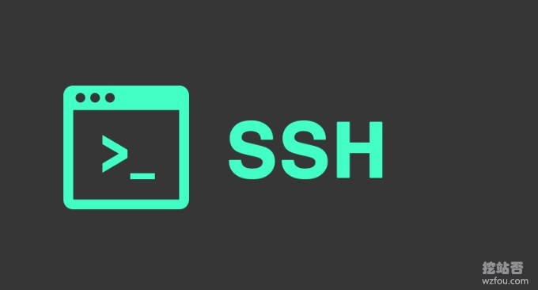](https://wzfou.com/wp-content/uploads/2019/01/linux-web_00.jpg)

更多的关于[服务器安全](https://wzfou.com/tag/fwq-anquan/)以及[建站教程](https://wzfou.com/tag/jianzhan-jiaocheng/)，这里有：

1. [改进网站站内搜索-百度,Google自定义搜索和Elasticsearch自建搜索](https://wzfou.com/baidu-google-es/)
2. [十个你可能不知道的CloudFlare免费CDN加速技巧-SSL\\DDOS\\Cache](https://wzfou.com/cloudflare/)
3. [WordPress开启Nginx fastcgi_cache缓存加速方法-Nginx配置实例](https://wzfou.com/nginx-fastcgi-cache/)

## 一、修改默认端口

默认的端口是22，这样很容易被人破解，我们可以修改端口号为其它的。命令：

#SSH服务的启动与停止
service sshd status        # 状态
service sshd start         # 启动
service sshd stop          # 暂停
service sshd restart       # 重启

#改完端口后记得在防火墙放行，例如
iptables -A INPUT -p tcp -m state --state NEW -m tcp --dport 8080 -j ACCEPT
#保存防火墙规则并重启
/etc/init.d/iptables save
service iptables restart

#修改端口号
#主配置文件：/etc/ssh/sshd_config

Port 22

[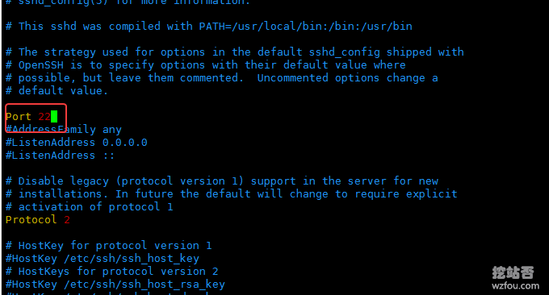](https://wzfou.com/wp-content/uploads/2019/01/linux-web_01.gif)

## 二、账号密码安全

### 2.1  禁止Root登录

如果你觉得Root登录不安全，可以直接禁止它：

#禁止root登录
PermitRootLogin yes

[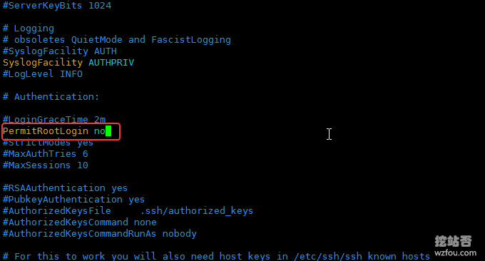](https://wzfou.com/wp-content/uploads/2019/01/linux-web_02.gif)

### 2.2  禁止空密码登录和必须使用密码登录

默认的是禁止的，为了安全最好还是检查一下是不是保持禁止状态的，另外你可以设置一下必须使用密码登录：

#禁止空密码登录和设置必需使用密码登录
PermitEmptyPasswords no
PasswordAuthentication yes

[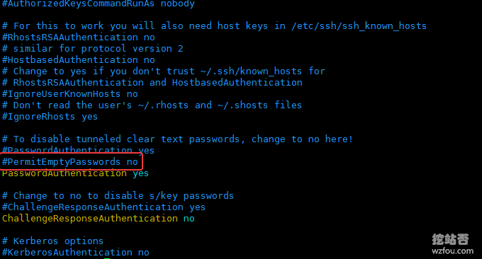](https://wzfou.com/wp-content/uploads/2019/01/linux-web_03.gif)

### 2.3  登录失败次数和自动掉线

默认情况下可以重试 6 次，如果你觉得这个不合理，当然可以修改它。连接成功后默认的等待时间为 2 分钟，如果没有单位将以秒作为单位，可用的单位分别为 h，m、s。我们可以根据需求修改，表示在多长时间内没有操作就自动掉线。

#限制登录失败之后重试次数和设置多长时间没有成功连接上，就断线
MaxAuthTries 6
LoginGraceTime 2m

[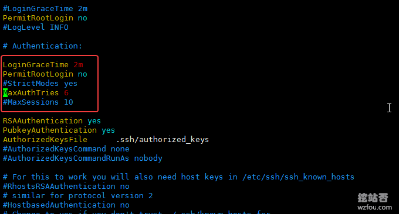](https://wzfou.com/wp-content/uploads/2019/01/linux-web_05.gif)

## 三、iptables强化安全

### 3.1  iptables基本用法

#防火墙 (iptables) 

#防火墙的开启和关闭

#永久性生效
#使用 chkconfig，重启后不会复原
chkconfig iptables on         # 开启
chkconfig iptables off        # 关闭

#即时生效
#使用 service，重启后复原
service iptables start        # 开启
service iptables stop         # 关闭

#查看 iptables 的设置
iptables -nL
service iptables status

#清除已有 iptables 规则
iptables -F
iptables -X
iptables -Z

#保存当前设置的规则
/etc/rc.d/init.d/iptables save

#iptables 命令解释
iptables -t 表名 <-A/I/D/R> 规则链名 \[规则号\] <-i/o 网卡名> -p 协议名 <-s 源IP/源子网> --sport 源端口 <-d 目标IP/目标子网> --dport 目标端口 -j 动作

-t\\<表>：指定要操纵的表；
-A：向规则链中添加条目；
-D：从规则链中删除条目；
-I：向规则链中插入条目；
-R：替换规则链中的条目；
-L：显示规则链中已有的条目；
-F：清楚规则链中已有的条目；
-Z：清空规则链中的数据包计算器和字节计数器；
-N：创建新的用户自定义规则链；
-P：定义规则链中的默认目标；
-h：显示帮助信息；
-p：指定要匹配的数据包协议类型；
-s：指定要匹配的数据包源 ip 地址；
-j\\<目标>：指定要跳转的目标；
-i\\<网络接口>：指定数据包进入本机的网络接口；
-o\\<网络接口>：指定数据包要离开本机所使用的网络接口。

### 3.2  iptables开放特定端口给指定IP

你可以在iptables中开放22端口给自己的IP访问，以下命令可以实现网卡在启动时仅允许指定端口给指定IP访问。

在/etc/network/目录中找到if-up.d/  if-down.d/两个文件夹，分别加入shell脚本，命名为login_protection，在脚本中写入IP限制规则。示例：

vim /etc/network/if-up.d/login_protect
#!/usr/bin/env bash
/sbin/iptables -A INPUT -s <你的IP> -p tcp -m tcp --dport 22 -j ACCEPT
/sbin/iptables -A INPUT -s <你的IP> -p tcp -m tcp --dport 3306 -j ACCEPT
/sbin/iptables -A INPUT -p tcp -m tcp --dport 22 -j DROP
/sbin/iptables -A INPUT -p tcp -m tcp --dport 3306 -j DROP

vim /etc/network/if-down.d/login_protect
#!/usr/bin/env bash
/sbin/iptables -D INPUT -s <你的IP> -p tcp -m tcp --dport 22 -j ACCEPT
/sbin/iptables -D INPUT -s <你的IP> -p tcp -m tcp --dport 3306 -j ACCEPT
/sbin/iptables -D INPUT -p tcp -m tcp --dport 22 -j DROP
/sbin/iptables -D INPUT -p tcp -m tcp --dport 3306 -j DROP

#设置脚本权限为可执行，然后重启network服务
chmod 755 /etc/network/if-up.d/bfa_protection
chmod 755 /etc/network/if-down.d/bfa_protection
/etc/init.d/networking restart

### 3.3  iptables屏蔽IP

你可以利用iptables开放指定端口，也可以屏蔽某一个IP或者IP段来访问。

#开放指定的端口
#-A 是在 iptables 的最后添加一条规则，-I 是在 iptables 的前面添加一条规则

iptables -A INPUT -s 127.0.0.1 -d 127.0.0.1 -j ACCEPT
\# 允许本地回环接口(即运行本机访问本机)

iptables -A INPUT -m state --state ESTABLISHED,RELATED -j ACCEPT
\# 允许已建立的或相关连的通行

iptables -A OUTPUT -j ACCEPT
\# 允许所有本机向外的访问

iptables -A INPUT -p tcp --dport 22 -j ACCEPT
\# 允许访问 22 端口

iptables -A INPUT -p tcp --dport 80 -j ACCEPT
\# 允许访问 80 端口

iptables -A INPUT -p tcp --dport 21 -j ACCEPT
\# 允许 FTP  服务的 21 端口

iptables -A INPUT -p tcp --dport 20 -j ACCEPT
\# 允许 FTP 服务的 20 端口

iptables -A INPUT -j reject
\# 禁止其他未允许的规则访问

iptables -A FORWARD -j REJECT
\# 禁止其他未允许的规则访问

屏蔽 IP
iptables -I INPUT -s 123.45.6.7 -j DROP
\# 屏蔽单个 IP 的命令

iptables -I INPUT -s 123.0.0.0/8 -j DROP
\# 封整个段即从 123.0.0.1 到 123.255.255.254 的命令

iptables -I INPUT -s 124.45.0.0/16 -j DROP
\# 封 IP 段即从 123.45.0.1 到 123.45.255.254 的命令

iptables -I INPUT -s 123.45.6.0/24 -j DROP
\# 封 IP 段即从 123.45.6.1 到 123.45.6.254 的命令

## 四、限定IP登录

### 4.1  添加白名单

在 `/etc/hosts.allow` 中添加允许 SSH 登录的IP或者网段，在 `/etc/hosts.deny` 中添加禁止所有IP登录。

#先在 /etc/hosts.allow 中添加 SSH 登录的 ip 或者网段
sshd:192.168.1.2:allow        # ip 地址
sshd:192.168.1.0/24:allow     # 网段

#在 /etc/hosts.deny 中添加拒绝所有IP登录
sshd:ALL                      # ALL 表示除了上面允许的，其他的 ip 都拒绝登录

### 4.2  iptables指定IP

方法类似于上面的**iptables开放特定端口给指定IP，**代码如下：

iptables -A INPUT -p tcp -s 192.168.1.2 --destination-port 22 -j ACCEPT
iptables -A INPUT -p tcp --destination-port 22 -j DROP

### 4.3 修改 sshd 主配置

修改 sshd 主配置文件 `/etc/ssh/sshd_config，`指定可登录的用户名和IP地址。

AllowUsers root@192.168.1.2

## 五、仅限密钥登录

S-S-H登录有两种方式，一种是密码登录，一种是密钥登录。前者容易被人暴力破解，后者则在保证密钥安全的情况下不被爆破。所以想要更安全，禁止密码登录改用密钥登录才是上策。

### 5.1  生成公钥与私钥

最简单的方法就是直接在Linux VPS主机上使用命令快速生成：

\# 生成 SSH 密钥对
\[root@wzfoume ~\]# ssh-keygen -t rsa  
Generating public/private rsa key pair.
\# 建议直接回车使用默认路径 
Enter file in which to save the key (/root/.ssh/id_rsa): 
\# 输入密码短语（留空则直接回车）
Enter passphrase (empty for no passphrase): 
\# 重复密码短语 
Enter same passphrase again: 
Your identification has been saved in /root/.ssh/id_rsa.
Your public key has been saved in /root/.ssh/id_rsa.pub.
The key fingerprint is:
e3:62:aa:0f:28:87:8f:2e:dd:fb:f0:59:fb:24:07:4a root@wzfoume
The key's randomart image is:
+--\[ RSA 2048\]----+
|                 |
|                 |
|                 |
|                 |
|      E S        |
| o   . o o       |
|+.o.. + + o      |
|o+...= + =       |
|+.oo+o+ ...      |
+-----------------+
\[root@wzfoume ~\]#

生成的密钥你可以在root下的.ssh文件下找到。

[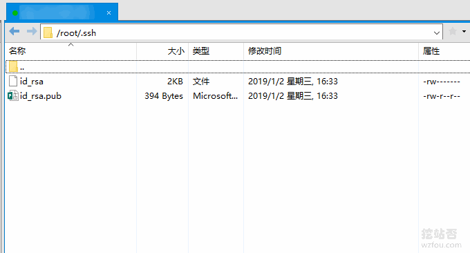](https://wzfou.com/wp-content/uploads/2019/01/linux-web_12.gif)

你也可以使用Xshell软件来生成密钥。

[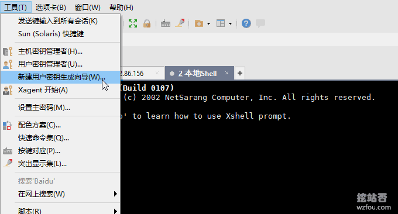](https://wzfou.com/wp-content/uploads/2019/01/linux-web_06.gif)

选择密钥类型和密钥长度。

[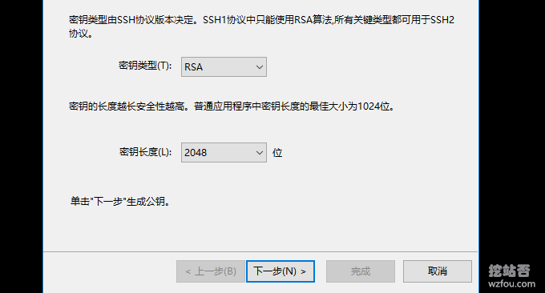](https://wzfou.com/wp-content/uploads/2019/01/linux-web_07.gif)

为你的密钥设定一个名称。

[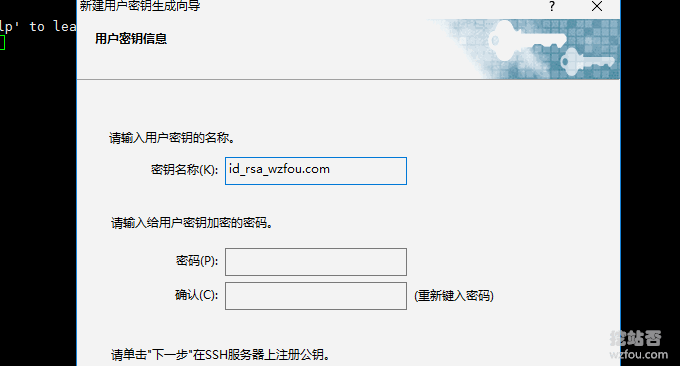](https://wzfou.com/wp-content/uploads/2019/01/linux-web_08.gif)

接下来，你就可以另存为保存公钥了。

[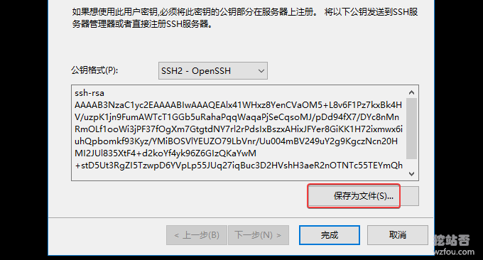](https://wzfou.com/wp-content/uploads/2019/01/linux-web_09.gif)

私钥也可以通过密钥管理把它导出来。

[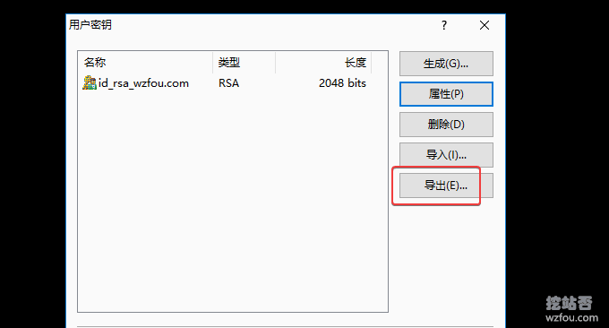](https://wzfou.com/wp-content/uploads/2019/01/linux-web_10.gif)

如果你有用Putty，也可以通过PuttyGen来生成公钥与私钥。

[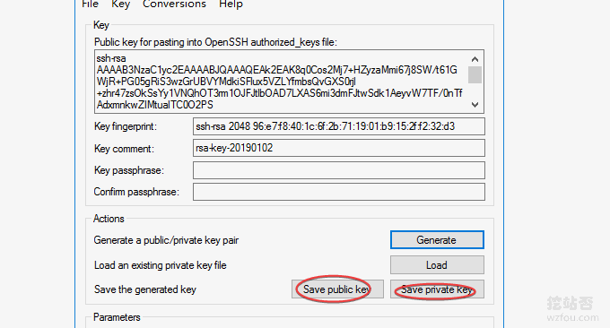](https://wzfou.com/wp-content/uploads/2019/01/linux-web_11.gif)

注意：Putty的私钥与Xshell的私钥不能通用，你需要转化一下。

[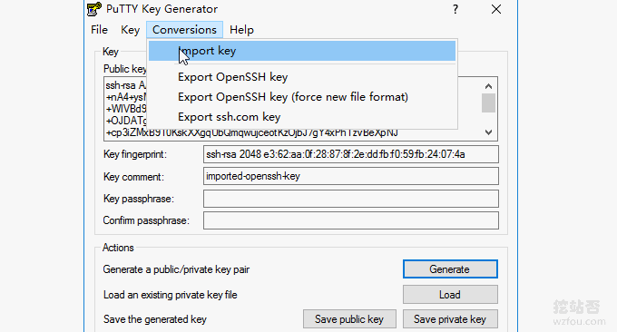](https://wzfou.com/wp-content/uploads/2019/01/linux-web_13.gif)

### 5.2  上传公钥文件

如果你是直接在Linux VPS上生成的公钥与私钥，那么不需要上传公钥，只需要将私钥下载下来，然后以Xshell导入私钥即可。

[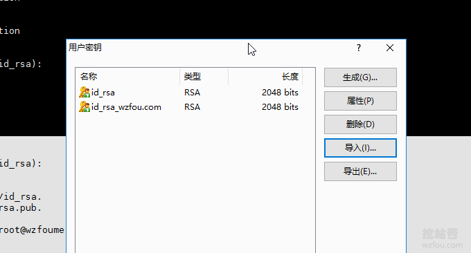](https://wzfou.com/wp-content/uploads/2019/01/linux-web_14.gif)

如果你是用的Xshell和PuttyGen生成的公钥，那就需要将id_rsa.pub这个公钥文件放置到你要进行远程登陆的用户主目录下，例如/root/.ssh，然后执行以下操作：

> 将`id_rsa.pub`文件，重命名为 authorized_keys；
> 
> 执行chmod 600 ./authorized_keys 命令，修改权限；
> 
> 执行命令 sudo vi /etc/ssh/sshd_config进行配置，将RSAAuthentication 和 PubkeyAuthentication 后面的值都改成yes ，保存；
> 
> 重启sshd服务，Debian/Ubuntu执行sudo /etc/init.d/ssh restart ；CentOS执行：sudo /etc/init.d/sshd restart。

注：centos7重启服务方式与以前不同，请执行`systemctl restart sshd.service`

配置修改如下图：

[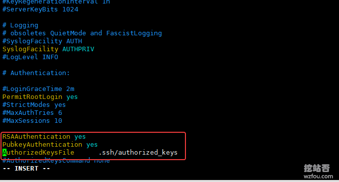](https://wzfou.com/wp-content/uploads/2019/01/linux-web_15.gif)

### 5.3  禁用密码登录

现在你在使用Xshell或者Putty连接时就可以选择使用密钥了。

[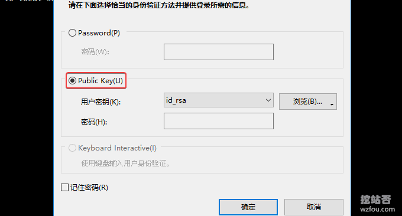](https://wzfou.com/wp-content/uploads/2019/01/linux-web_16.gif)

确认密钥连接没有问题时，就可以禁用密码登录，仅限密钥登录了。方法是：修改`/etc/ssh/sshd_config`文件，将`PasswordAuthentication yes` 修改成 `PasswordAuthentication no`；最后，重启sshd。

[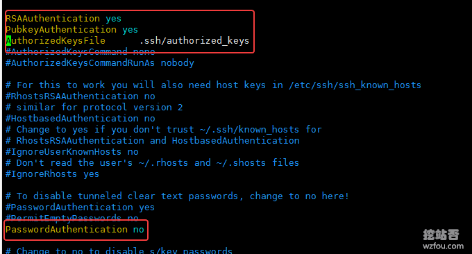](https://wzfou.com/wp-content/uploads/2019/01/linux-web_04.gif)

## 六、总结

对于S-S-H安全的问题，我们一定要引起足够的重视，最简单的操作就是设置一个复杂一点的密码+修改默认的S-S-H端口，这个操作可以阻止一大部分的暴力扫描。

选择关闭S-S-H也会给自己造成不便，稳妥一点的方法就是禁止密码登录，改用密钥登录。同时，公钥与私钥分开存放，一旦发生泄露也很容易被人识破。