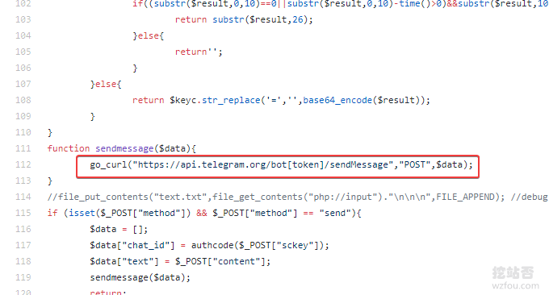
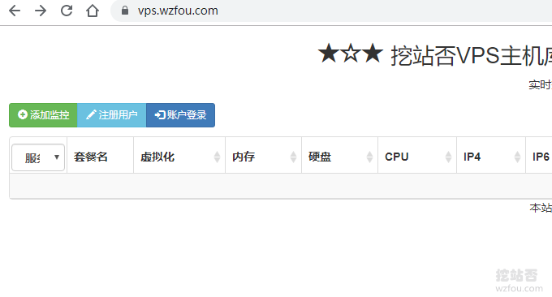
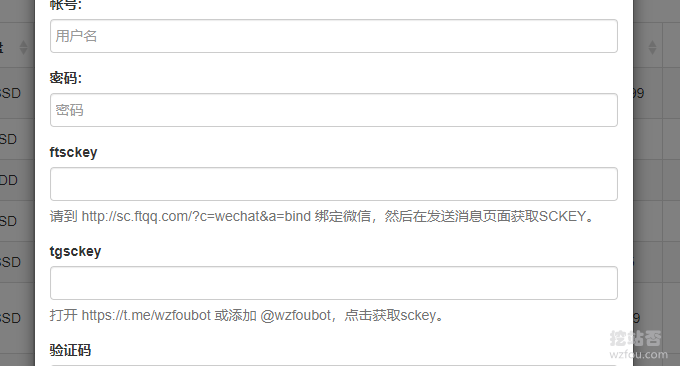

# VPS主机库存上货监控与微信 TG通知系统：VPS-Inventory-Monitoring安装与配置
很多的VPS主机商为了可以吸引更多的客户，都会推出一些廉价的[VPS主机](https://wzfou.com/vps/)促销产品，但是这类产品套餐有一定的时限，或者是断货后再补货，如果不及时关注官网则可能错过优惠产品。这篇文章是来分享一下监控各大VPS主机商的库存，同时可以做到上货后微信和TG通知。

[VPS-Inventory-Monitoring](https://wzfou.com/tag/vps-inventory-monitoring/)是一个免费开源的项目，主要原理是通过Curl 抓取网页源代码来监控目标字段的变化，例如当特定的网页URL中出现了“缺货”、“Out of Stock”等字样，就表示该主机套餐还没有补货了，利用这个原理我们可以实时显示VPS主机套餐的库存了。

挖站否在试用了[VPS-Inventory-Monitoring](https://wzfou.com/tag/vps-inventory-monitoring/)，发现VPS-Inventory-Monitoring还可以用在监控网页内容更新或者是某一个自己想要的关注的内容，有点类似于[Huginn](https://wzfou.com/tag/huginn/)抓取指定网页内容了。VPS-Inventory-Monitoring整合了Server酱和TG bot，可以做到实时提醒通知。

更多的关于个人获取信息，搭建信息资源平台，这里还有：

1. [五款优秀的RSS阅读器推荐-附国内外各大RSS阅读器收集整理汇总](https://wzfou.com/rss-readers/)
2. [生成和订阅任意网站RSS工具-实现RSS全文,邮箱和手机APP提醒](https://wzfou.com/rss-any/)
3. [利用Huginn抓取任意网站RSS和微信公众号更新-打造一站式信息阅读平台](https://wzfou.com/huginn-rss/)

> **PS：2019年12月14日更新，**有多个服务器的朋友可能想要一个可以展示服务器是否宕机的监控平台，可以试试：[利用ServerStatus自建VPS主机和服务器性能和宕机监控平台-效果美化和自定义](https://wzfou.com/serverstatus/)

## 一、VPS库存监控安装

网站：

1. 项目：https://github.com/546669204/vps-inventory-monitoring
2. 备用：https://github.com/freehao123/vps-inventory-monitoring
3. 演示：https://vps.wzfou.com/

### 1.1 安装准备条件

**一台VPS主机。**VPS-Inventory-Monitoring需要用到定时任务，虽然虚拟主机也可以实现，但是建议使用VPS主机，没有的话参考这里：[VPS主机排行榜单](https://wzfou.com/vps-bangdan/)。

**LNMP建站环境。**在VPS上安装好Nginx、Mysql、PHP等建站环境，建议使用[Oneinstack](https://wzfou.com/tag/oneinstack/)或者[LNMP](https://wzfou.com/tag/lnmp/)一键包，PHP至少要5.4 以上，支持PHP 7。如果嫌手动命令麻烦，可以用这里：[服务器控制面板榜单](https://wzfou.com/vps-mianban/)。

在创建虚拟主机时，请将网站的根目录设置为：`/data/wwwroot/vps.wzfou.com/public`，因为`VPS-Inventory-Monitoring`的Web目录在`public`里。

### 1.2 下载源代码

这里以Oneinstack一键包为演示，其它的面板可以参考。首先是进入到网站目录：`/data/wwwroot/vps.wzfou.com`，使用Git方法将VPS-Inventory-Monitoring安装包下载下来，同时设置权限。

1. git clone https://github.com/546669204/vps-inventory-monitoring.git
2. mv vps-inventory-monitoring/{.,}\* ./
3. chmod -Rf 755 ./*
4. chown -R www:www /data/wwwroot/vps.wzfou.com

如果你在创建虚拟主机时没有设置好路径为：`/data/wwwroot/vps.wzfou.com/public`，那么你现在需要将网站的根目录改成public，Nginx可以直接在配置中调整网站根目录。

### 1.3 导入数据库

进入到PhpMyAdmin，新建数据库，然后VPS-Inventory-Monitoring里的数据库文件mysql.sql导入进去。

如果出现Mysql数据库兼容等问题，请根据实际情况修改数据库文件mysql.sql里面的表结构。

根据wzfou.com的经验，在新建数据库用户时设定为：127.0.0.1而不是localhost，可以解决后期使用VPS-Inventory-Monitoring许多莫名其妙的问题。

### 1.4 调整系统配置

修改系统配置 `app/index/config.php`，这里可以定时任务的执行时间间隔、域名、TG地址等。

### 1.5 设置伪静态规则

如果你用的是Nginx的话，需要添加以下伪静态规则：

1. location / {
2. **if**  (!-e $request_filename)  {
3. rewrite ^(.*)$ /index.php?s=/$1 last;
4. break;
5. }
6. }

## 二、设置TG自动提醒

网站：

1. 项目：https://github.com/546669204/Telegram-Push-Bot
2. 备用：https://github.com/freehao123/Telegram-Push-Bot
3. TGBot：https://t.me/wzfoubot

### 2.1 tgchannelsckey

如果你想设置TG自动提醒，你需要在app/index/config.php中填写tgchannelsckey。原作者的TGBot已经关闭，你可以邀请`@wzfoubot`将https://t.me/wzfoubot添加为你的频道管理员。

然后在频道发送` /start `获取sckey 填入，如下图：

### 2.2 自建TG 机器人

如果你想自己搭建TG 机器人也比较简单，首先是添加@BotFather好友，或者直接打开 : https://telegram.me/BotFather发起聊天，输入 **/newbot** 命令，并输入您的机器人的名称。如下图：

现在你已经得到了TG 机器人token ，打开bot.php，将token替换。如果你的token是`693:wzfou.com`，那么替换就是：https://api.telegram.org/bot`693:wzfou.com`/sendMessage。

把bot.php上传到Web空间上，确保可以用浏览器可以访问。然后调协`web hook` ，打开：`https://api.telegram.org/bot[Token]/setWebhook?url=https://[domain]/bot.php`，返回如下表示成功了。

现在你可以向你的TG 机器人发送`/start`命令获取sckey，你可以使用自己的机器人了，命令如下（你可以使用Postman软件或者在线POST模拟请求）：

1. https://\[domain\]/bot.php
2. method=send&sckey=\[XXX\]&content=\[CONTENT\]
3. #这是一个post 请求
4. #第一行为url
5. #第二行为body
6. #成功之后 和 机器人聊天 会返回 sckey 使用 sckey 调用 bot 这个请求 就可以测试 发送消息

### 2.3 修改TG Bot设置

VPS-Inventory-Monitoring默认的用的代码作者的TG Bot，因此我们需要替换掉成自己的。请分别打开以下文件，查看bot.php替换成你自己的（没有自建的话，用这个：`https://meimei.wzfou.net/bot.php`）：

> /data/wwwroot/vps.wzfou.com/gotest/config.json
> 
> /data/wwwroot/vps.wzfou.com/app/index/model/index.php
> 
> /data/wwwroot/vps.wzfou.com/app/index/command/VpsTest.php

如下图：

## 三、添加VPS主机监控

### 3.1 添加管理员

你需要打开VPS-Inventory-Monitoring界面，点击注册账号。

然后就是填写基本的信息了，如下图：

**说明：**

> ftsckey是用来接收微信提醒的（这个功能主要是面向用户，方便用户接收消息），用的是Server酱服务，详情查看：[WordPress评论微信通知和邮件提醒-Server酱和第三方SMTP发信](https://wzfou.com/wp-weixin-mail/)。
> 
> tgsckey是用来接收TG消息提醒的（这个功能主要是面向用户，方便用户接收他们关注的产品消息），用的是上面我们自建的TG 机器人服务。

去数据库找到`xm_user`删除`id`为`1`的初始账户，找到自己注册账户`id`，并编辑`app/index/config.php`文件，将`adduid`改成自己的。然后就可以开始添加监控了。

### 3.2 添加监控数据

现在你可以输入VPS主机的套餐的详细信息了。

你也可以直接到Mysql数据库中直接添加、删除、复制等操作。

### 3.3 验证函数说明

函数说明

> $curl\[“Code”\] 返回状态码
> 
> $curl\[“RequestHeader”\] 请求头
> 
> $curl\[“ResponseHeader”\] 返回头
> 
> $str 返回源代码
> 
> $value\[“stock”\] 原库存状态

例如：

1. **if**  ($curl\["Code"\] != 200){ //首先判断状态码
2. return false;
3. }
4. **if**  (**strpos**($str,"wzfou")==false){ //检测是否正常打开有无公司名字之类关键词
5. return $value\["stock"\]; //返回原库存状态
6. }
7. **if**  (**strpos**($str,"缺货")!==false){ //检测是否含有缺货关键词
8. return false;
9. }
10. return true;

我用的示例如下：

1. **if**  ($curl\["Code"\] != 200){
2. return false;
3. }
4. **if**  (**strpos**($str,"微基")==false){
5. return $value\["stock"\];
6. }
7. **if**  (**strpos**($str,"缺货")!==false){
8. return false;
9. }
10. return true;

12. **if**  ($curl\["Code"\] != 200){
13. return false;
14. }
15. **if**  (**strpos**($str,"Bandwagon")==false){
16. return $value\["stock"\];
17. }
18. **if**  (**strpos**($str,"Out of Stock")!==false){
19. return false;
20. }
21. return true;

25. **if**  ($curl\["Code"\] != 200){
26. return false;
27. }
28. **if**  (**strpos**($str,"GigsGigsCloud")==false){
29. return $value\["stock"\];
30. }
31. **if**  (**strpos**($str,"CLOUDLET LAX-V1")==false){
32. return false;
33. }
34. return true;

### 3.3 自动运行监控

目前VPS-Inventory-Monitoring提供`cron+http 、php think vpstest 、go 代码编译运行`三种运行监控的方式，这里推荐使用最简单的方法：`php think vpstest` 。方法如下：

1. screen -S vpstest //创建screen
2. cd \[网站根目录\]
3. php think VpsTest
4. CTRL A D //退出screen
5. 然后关闭ssh即可 重新进入查看可使用
6. screen -r vpstest

如下图：

## 四、上货微信/TG提醒

### 4.1 添加订阅

如果你是一个用户，想指定某一个产品有货时提醒，你需要在注册时填写你ftsckey和tgsckey，然后点击订阅该产品。

### 4.2 微信提醒

当订阅的产品有货时，微信就会收到提醒消息了。

### 4.3 TG消息提醒

当订阅的产品有货时，你的TG会收到`@wzfoubot`机器人发来的消息提醒，如下图：

### 4.4 TG全站提醒

1. 演示：https://t.me/vpswzfou

如果你按照上面的方法将TG机器人设置为你的TG频道管理员，那么你就可以实现当产品有货上新时自动在TG频道里发布消息。用户只关注了你的频道就可以收到消息了。

## 五、总结

VPS-Inventory-Monitoring安装的关键地方在于导入数据库，同时在添加监控时填写好PHP验证函数，基本原理就是用Curl的方法获取网页源码，如果发现有指定关键字，那么就返回是否有货。

VPS-Inventory-Monitoring设置微信和TG消息提醒，需要搭建好自己的TG Bot，当然你也可以使用本站当前正在的TG Bot，记得替换一下原代码中的TG Bot，否则你可能就收不到提醒了。