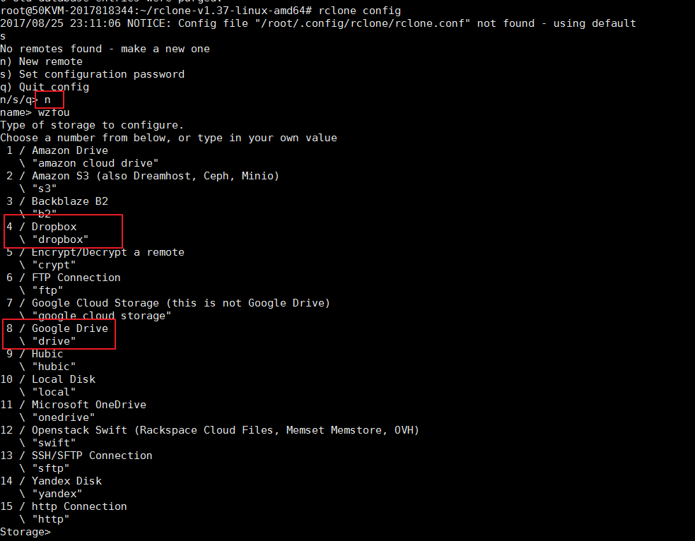
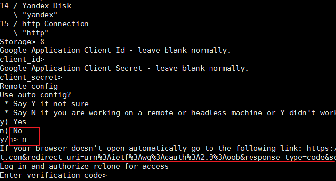
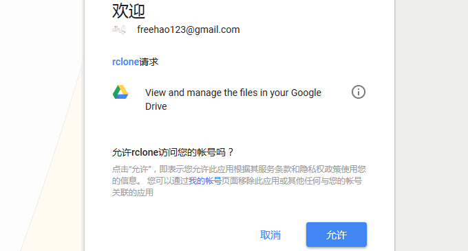
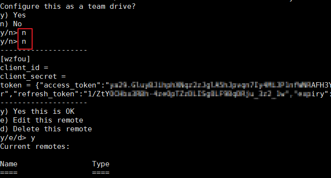
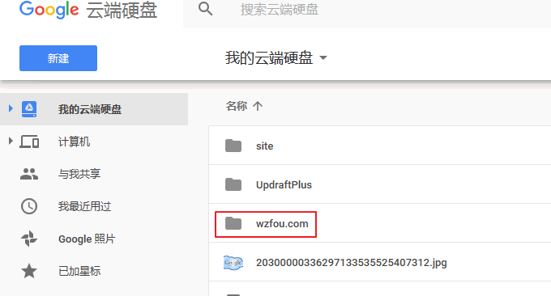
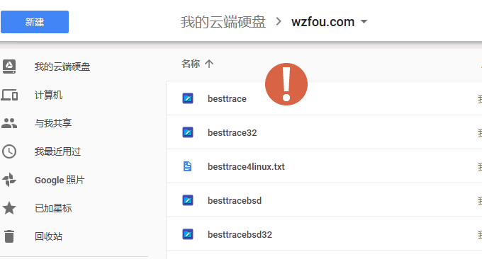
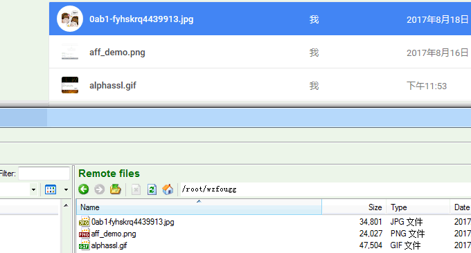
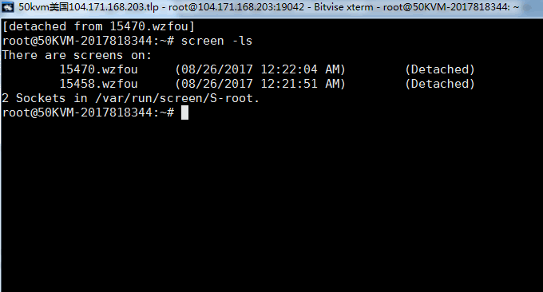
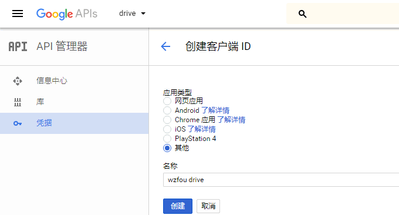

# VPS挂载国内外网盘实现免费扩容工具 Rclone,COS-Fuse和OSSFS
上一篇文章[Linux VPS挂载Google Drive和Dropbox](https://wzfou.com/linux-vps-drive/)分享了google-drive-ocamlfuse和CloudFusion，这是老外开发的用来帮助Linux VPS主机挂载谷歌网盘和Dropbox网盘的命令工具。好友[Leonn](https://liyuans.com/)向我推荐了Rclone，这是一个支持挂载多数国外网盘的工具。

目前Rclone支持挂载的网盘有：Google Drive、 Dropbox 、Google Cloud Storage 、Microsoft One Drive 、Hubic、 Backblaze B2 、Yandex Disk 、Openstack Swift / Rackspace cloud files / Memset Memstore 。更强大的是，Rclone还支持SFTP 、FTP 、HTTP挂载。

Rclone支持挂载的网盘基本上都是国外的，如果有国内的VPS想要使用的话，可以用用SFTP 、FTP 、HTTP方式来挂载，将不同的服务器存储整合到一起。如果有腾讯云和阿里云的用户，可以试试COS-Fuse和OSSFS这两款专门用于腾讯云COS和阿里云OSS存储挂载工具。

[](https://wzfou.com/wp-content/uploads/2017/08/rclone_00.jpg)

如果你想利用VPS搭建自己的[私有云存储](https://wzfou.com/tag/siyou-yuncunchu/)，你可以试试[Nextcloud](https://wzfou.com/tag/nextcloud/)，这是一个优秀开源的网盘工具，同时Lsyncd可以帮助你建立一个服务器实时同步镜像，确保服务器数据安全。相关的文章参考如下：

1. [Nextcloud个人云存储绝佳选择：一键自动安装方法和云盘使用体验](https://wzfou.com/nextcloud/)
2. [Lsyncd搭建同步镜像-用Lsyncd实现本地和远程服务器之间实时同步](https://wzfou.com/lsyncd/)
3. [Huginn在Debian/Ubuntu手动安装教程-抓取全文RSS和微信公众号开源软件](https://wzfou.com/huginn/)

**PS：2017年12月19日更新**，Linux除了用挂载的方式实现扩容，我们还可以用共享存储目录的方式实现不同的服务器之间数据同步传输：[Linux共享文件夹目录三种方法-NFS远程挂载,GlusterFS共享存储和samba共享目录](https://wzfou.com/nfs-glusterfs-samba/)。

## 一、Rclone安装与使用

Rclone官网：

1. https://rclone.org/
2. https://github.com/ncw/rclone

Rclone安装比较简单，基本的操作如下：

下载安装包：

```
curl -O https://downloads.rclone.org/rclone-current-linux-amd64.zip
unzip rclone-current-linux-amd64.zip
cd rclone-*-linux-amd64

```

复制 binary file：

```
sudo cp rclone /usr/bin/
sudo chown root:root /usr/bin/rclone
sudo chmod 755 /usr/bin/rclone

```

安装 manpage：

```
sudo mkdir -p /usr/local/share/man/man1
sudo cp rclone.1 /usr/local/share/man/man1/
sudo mandb 

```

**Rclone配置。**执行 `rclone config` 开始配置Rclone，这里以配置Google Drive为例，首先是选择新建配置，然后选择Google Drive。（点击放大）  
[](https://wzfou.com/wp-content/uploads/2017/08/rclone_01.gif)

接着，问你要不要自动配置，选择：否。这时会得到一个URL地址。

[](https://wzfou.com/wp-content/uploads/2017/08/rclone_02.gif)

复制这个URL地址到自己的电脑浏览器中打开，Google Drive会提示是否确认授权。

[](https://wzfou.com/wp-content/uploads/2017/08/rclone_03.gif)

得到一个验证码后，再返回到Rclone配置页面，输入验证码回车，这时还会问你要不要设置为Team Drive，自己用的话直接选择否。最后见到如下图就表示Rclone挂载网盘成功了。

[](https://wzfou.com/wp-content/uploads/2017/08/rclone_04.gif)

## 二、Rclone同步与挂载

首先，让我们来熟悉一下Rclone常用的命令：

> rclone config – 以控制会话的形式添加rclone的配置，配置保存在.rclone.conf文件中。  
> rclone copy – 将文件从源复制到目的地址，跳过已复制完成的。  
> rclone mount-挂载  
> rclone sync – 将源数据同步到目的地址，只更新目的地址的数据。  
> rclone move – 将源数据移动到目的地址。  
> rclone delete – 删除指定路径下的文件内容。  
> rclone purge – 清空指定路径下所有文件数据。  
> rclone mkdir – 创建一个新目录。  
> rclone rmdir – 删除空目录。  
> rclone check – 检查源和目的地址数据是否匹配。  
> rclone ls – 列出指定路径下所有的文件以及文件大小和路径。  
> rclone lsd – 列出指定路径下所有的目录/容器/桶。  
> rclone lsl – 列出指定路径下所有文件以及修改时间、文件大小和路径。  
> rclone md5sum – 为指定路径下的所有文件产生一个md5sum文件。  
> rclone sha1sum – 为指定路径下的所有文件产生一个sha1sum文件。  
> rclone size – 获取指定路径下，文件内容的总大小。  
> rclone version – 查看当前版本。  
> rclone cleanup – 清空remote。  
> rclone dedupe – 交互式查找重复文件，进行删除/重命名操作。

**Rclone复制文件**代码示例：`rclone copy /root/5tv.zip wzfou:wzfou.com，`此命令会将本地/root/5tv.zip 复制到网盘（wzfou—这是我刚刚配置Rclone时新建的配置名称）目录名为wzfou.com下。执行命令后，我就可以在网盘中看到文件了。

[](https://wzfou.com/wp-content/uploads/2017/08/rclone_05.gif)

**Rclone同步文件**代码示例：`rclone sync /root/luyou wzfou:wzfou.com，`此命令与上方的复制文件差不多，只不过同步命令会对照本地文件与目标文件的异同，发现新增的就会同步过去，从而保持数据的一致性。效果如下：

[](https://wzfou.com/wp-content/uploads/2017/08/rclone_06.gif)

特别注意：如果原网盘中的目录中已经有了文件，如果使用同步命令的话会清空原网盘目录中的文件，所以你最好是使用一个空的目录来作为目标文件夹。

**Rclone挂载网盘。**命令示例：`rclone mount wzfou:wzfoumm /root/wzfougg --allow-non-empty，`此命令会把本地目录/root/wzfougg ，挂载到网盘（wzfou配置文件名）目录wzfoumm 下。如果你的目标目录中有文件，可以使用参数：`--allow-non-empty，`但是注意它会清空原目录中的文件。

Rclone挂载网盘成功后，你在网盘和本地对文件的删除、新增等都会保持双方同步更新。

[](https://wzfou.com/wp-content/uploads/2017/08/rclone_07.gif)

**利用Screen让Rclone在后台运行。**使用`rclone mount `命令后，如果不守护进程的话，会话结束后`rclone mount `进程就会终止。我们可以用Screen来让Rclone保持在后台运行。在执行Rclone挂载命令前，选择执行：Screen –S wzfou，挂载完成后再用快捷键`CTRL-a d `来暂时断开当前会话。最后用screen -r <screen_pid>重新连接上。

[](https://wzfou.com/wp-content/uploads/2017/08/rclone_09.gif)

**申请Google API解决Rate Limit Exceeded问题。**在设置Rclone时，如果你不添加API的话，默认的使用的是Rclone的API，但是这有一个问题如果用户太多的话会出现如下错误：

```
ERROR : loading-speed.png: WriteFileHandle.New Put failed: googleapi: Error 403: Rate Limit Exceeded, rateLimitExceeded
ERROR : loading-speed.png: WriteFileHandle.Flush error: googleapi: Error 403: Rate Limit Exceeded, rateLimitExceeded
ERROR : maxresdefault.jpg: WriteFileHandle.New Put failed: googleapi: Error 403: Rate Limit Exceeded, rateLimitExceeded
ERROR : maxresdefault.jpg: WriteFileHandle.Flush error: googleapi: Error 403: Rate Limit Exceeded, rateLimitExceeded
```

解决的办法就是添加自己的API，方法参考之前的：[挂载Google Drive方法](https://wzfou.com/linux-vps-drive/#Google_Drive)。如下图：

[](https://wzfou.com/wp-content/uploads/2017/08/rclone_08.gif)

## 三、COS-Fuse挂载腾讯COS

如果你正好有腾讯云主机和腾讯COS，那么就可以使用COS-Fuse工具将COS挂载到腾讯云服务器，操作方法如下：

**安装依赖库。**请先运行下面的命令安装所需要的依赖库：

```
sudo yum -y install automake gcc-c++ git libcurl-devel libxml2-devel fuse-devel make openssl-devel
```

**编译安装。**

```
#下载COS-Fuse
wget https://mc.qcloudimg.com/static/archive/144302cd3e6afb2bf2758a8c0c1d9bb9/cosfs-v4.2.1-master.zip
#解压
tar -zxvf cosfs-v4.2.1-master.zip
#更名
mv cosfs-v4.2.1-master cosfs
#编译安装
cd cosfs
./autogen.sh
./configure
make
sudo make install
```

**配置运行。**在腾讯云后台 – 云产品 – 存储与CDN – 对象存储服务，创建一个bucket，记录好bucket名称和所在区域；在对象存储服务 – 密钥管理，记录您的APPID、SecretId、SecretKey密钥；然后输入下面的命令将bucket、SecretId、SecretKey保存到`/etc/passwd-cosfs`文件中

```
echo my-bucket:my-access-key-id:my-access-key-secret > /etc/passwd-cosfs
chmod 640 /etc/passwd-cosfs
```

**挂载COS。**输入下面的命令将COS挂载到服务器，my-appid:对应APPID，my-bucket:就是bucket名称，my-mount-point:需要挂载的目录，比如/home/cosfs 。-ourl:是http://cn-south.myqcloud.com 。cn-south 对应华南广州地域 cn-north 对应华北天津地域 cn-east 对应华东上海地域。请根据bucket所在区域进行修改。

```
#创建挂载目录
mkdir -p /home/cosfs
#进行挂载
cosfs my-appid:my-bucket my-mount-point -ourl=my-cos-endpoint
```

**演示代码**：

```
echo my-bucket:faint:123 > /etc/passwd-cosfs
chmod 640 /etc/passwd-cosfs
mkdir -p /home/cosfs
cosfs appid:my-bucket mkdir -p /home/cosfs -ourl=http://cn-south.myqcloud.com
```

**效果：**使用`df -h`查看是否挂载成功。

## 四、OSSFS挂载阿里云OSS

OSSFS好像也是阿里云自己开发的挂载OSS的工具，可以将OSS挂载到阿里云ECS服务器上，操作方法如下：

**安装。**S\*S\*H连接到服务器，分别执行下面的命令：

wget https://github.com/aliyun/ossfs/releases/download/v1.79.9/ossfs\_1.79.9\_centos6.5\_x86\_64.rpm
sudo yum localinstall ossfs\_1.79.9\_centos6.5\_x86\_64.rpm

**运行与示例。**设置bucket name, access key/id信息，将其存放在/etc/passwd-ossfs 文件中， 注意这个文件的权限必须正确设置，建议设为640。

echo my-bucket:my-access-key-id:my-access-key-secret > /etc/passwd-ossfs
chmod 640 /etc/passwd-ossfs

将oss bucket mount到指定目录

ossfs my-bucket my-mount-point -ourl=my-oss-endpoint

**示例：**下面是将华东 1 (杭州)bucket名字为`xiaoz`，AccessKeyId是`faint`， AccessKeySecret是`123`，oss endpoint是`http://oss-cn-hangzhou-internal.aliyuncs.com`(内网)挂载到/home/ossfs目录。Endpoint对照表请访问：[OSS开通Region和Endpoint对照表](https://help.aliyun.com/document_detail/31837.html)查看。

echo xiaoz:faint:123 > /etc/passwd-ossfs
chmod 640 /etc/passwd-ossfs
mkdir /home/ossfs
ossfs xiaoz /home/ossfs -ourl=http://oss-cn-hangzhou-internal.aliyuncs.com

## 五、总结

得益于阿里云OSS和腾讯COS内网流量免费的策略，大家如果有大流量的需求可以采用内网挂载的方式来避免高额的费用。如果是用外网访问阿里云OSS和腾讯COS，要小心流量费用的问题，一不小心可能就超了。

Rclone挂载网盘还是挺方便的，尤其是在同步备份中可以方便地对网站的数据进行同步。而且如果你有多个谷歌网盘的话，还可以利用Rclone实现相互拷贝复制文件。Rclone的SFTP挂载也可以当成备份工具。