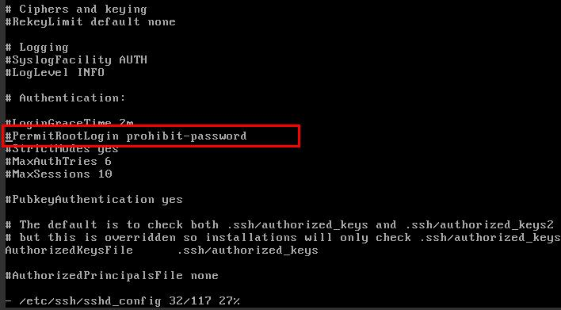

# Virmach安装Alpine详细教程
**挂载：**

切换到Solusvm控制面板，下拉可以看到此页面，我们点击挂载：

**设置CDRom为第一启动项：**

根据如图所示，设置为第一启动项后，点击Reboot重启：

**进入VNC安装镜像：**

切换到VNC，并且使用HTML方式进行安装：

进入VNC后，我们输入root进行登录：

然后输入：

setup-alpine

进行安装。

下面的步骤如果能看懂可以自己输入，看不懂就看我红色的地方，其他地方回车即可。

注意，下图输入密码会提示两次，请务必记住此密码！否则前面的操作全白费：

注意：

图中第一个1是手动选择镜像源，因为机器在国外，镜像速度都大同小异，如果不想用1，可以直接回车，然后会自动测试并选择最佳节点。

第二个vda是选择需要安装的磁盘，请务必根据第一行显示的来进行输入，不出意外，大部分Virmach机器都是vda。

其他步骤如图所示即可：

到此步骤安装完成。

现在系统已经安装完成，我们需要改回之前的模式，从磁盘启动。

改成如图所示并重启，也可以去CDROm里面取消挂载并重启。当然，区别都不大。

重启后，我们还需要去VNC里面设置一下允许root登录，因为alpine默认禁止root登录。

**再次进入VNC:**

修改/etc/ssh/sshd_config文件：

将图上的：

#PermitRootLogin prohibit-password

改为：

PermitRootLogin yes

重启网络：

 service sshd restart

这样就可以通过ssh连接到机器，搞定。

内存占用的确不错：

localhost:~# cat /etc/issue 
Welcome to Alpine Linux 3.10
Kernel \\r on an \\m (\\l)

localhost:~# free -m
              total        used        free      shared  buff/cache   available
Mem:           1495          40        1439           0          15        1338
Swap:          2989           0        2989
localhost:~#