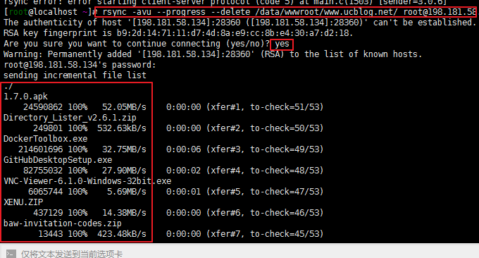
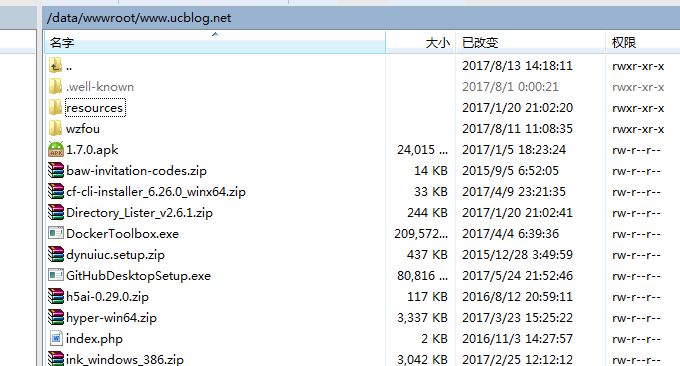

# 三个命令工具Rsync,SCP,Tar-快速解决VPS远程网站搬家与数据同步
[网站搬家](https://wzfou.com/tag/wangzhan-banjia/)是一件相当麻烦的事情，尤其是不同的VPS主机的环境配置还是比较繁琐的。所以我还是比较热衷于[Linode](https://wzfou.com/tag/linode/)的克隆、[阿里云](https://wzfou.com/tag/aliyun/)快照服务、[Vultr](https://wzfou.com/tag/vultr/)的自定义ISO，因为这些服务可以完整将一台VPS主机镜像到另一台VPS主机，几乎可以在几分钟内就可以完成网站数据的迁移。

而对于没有提供此类服务的[VPS主机](https://wzfou.com/vps/)，我们可以充分利用VPS主机带宽充足的优势，不再使用本地中转，直接实现在不同的VPS主机之间实现数据传输转移。这对于大型的网站或者有大量数据的网站搬家将是一件非常轻松的事情，几百MB和几百GB的数据迁移也就是时间问题了。

本篇文章就来归纳整理一下Linux VPS主机三个十分有用的命令工具：[Rsync](https://wzfou.com/tag/rsync/),SCP,Tar。Rsync命令是一个远程数据同步工具，可通过LAN/WAN快速同步多台主机间的文件，Rsync还用作同步工具，初次会在本地和远程之间拷贝所有内容，后面的话只会传输发生改变的块或者字节，实现增量同步。

[SCP](https://wzfou.com/tag/scp-mingling/)是secure copy的简写，用于在Linux下进行远程拷贝文件的命令，和它类似的命令有cp，不过cp只是在本机进行拷贝不能跨服务器，而且scp传输是加密的且可以实现远程复制文件。Tar是Linux解压缩命令，结合S-S-H可以在两台VPS之间实现边压缩边同步边传输的效果。

[](https://wzfou.com/wp-content/uploads/2017/08/vps-rsync_00.jpg)

总之，Rsync,SCP,[Tar](https://wzfou.com/tag/tar-mingling/)是Linux VPS网站搬家和数据迁移过程中非常有用的工具。更多的必备[站长工具](https://wzfou.com/tag/zhanzhang-gongju/)还可以看看：

1. [三大免费工具助你检测VPS服务器真伪-VPS主机性能和速度测试方法](https://wzfou.com/vps-ceping-gongju/)
2. [Lsyncd搭建同步镜像-用Lsyncd实现本地和远程服务器之间实时同步](https://wzfou.com/lsyncd/)
3. [新版BT.cn宝塔VPS主机面板建站使用体验-清爽傻瓜式操作功能全面](https://wzfou.com/bt-cn/)

## 一、Rsync安装以及用法

**Rsync安装**

```
yum install rsync #CentOS/Fedora/RHEL:
apt-get install rsync #Debian/Ubuntu: 
```

**Rsync用法**

```
rsync [OPTION]... SRC DEST 
rsync [OPTION]... SRC [USER@]host:DEST 
rsync [OPTION]... [USER@]HOST:SRC DEST 
rsync [OPTION]... [USER@]HOST::SRC DEST 
rsync [OPTION]... SRC [USER@]HOST::DEST 
rsync [OPTION]... rsync://[USER@]HOST[:PORT]/SRC [DEST]
```

\[OPTION\]是选项，有几个选项参数你可以加入进去，说明如下：

> -v,–verbose  详细模式输出；  
> -a,–archive  归档模式，表示以递归的方式传输文件，并保持所有文件属性不变，相当于使用了组合参数-rlptgoD;  
> -r, –recursive 对子目录以递归模式处理;  
> -l, –links 保留软链结;  
> -p, –perms 保持文件权限;  
> -t, –times 保持文件时间信息;  
> -g, –group 保持文件属组信息;  
> -o, –owner 保持文件属主信息;  
> -D, –devices 保持设备文件信息;  
> -H, –hard-links 保留硬链结;  
> -S, –sparse 对稀疏文件进行特殊处理以节省DST的 空间;  
> –delete 删除那些DST中SRC没有的文件;  
> -z, –compress 对备份的文件在传输时进行压缩处理；

**用法举例：**

把A VPS主机的www.wzfou.com目录下的所有的文件复制到B VPS主机(198.xxx.xxx.xxx)的www.wzfou.net目录下，命令如下：

```
rsync -avu --progress --delete /data/wwwroot/www.wzfou.com/ root@198.xxx.xxx.xxx:/data/wwwroot/www.wzfou.net/ -e "ssh -p 12345"
```

上面的命令就是将A主机下的`/data/wwwroot/www.wzfou.com/`所有文件复制到B主机`/data/wwwroot/www.wzfou.net/`下。其中`-e "ssh -p 12345"`是因为B主机的S-S-H端口不是默认的22，所以要特别指出来。

[](https://wzfou.com/wp-content/uploads/2017/08/vps-rsync_01.gif)

打开B主机你就可以看到复制过来的文件了。

[](https://wzfou.com/wp-content/uploads/2017/08/vps-rsync_02.gif)

## 二、SCP远程拷贝方法

SCP是Linux自带的，所以不需要安装就可以使用。**SCP的命令格式如下**：scp \[参数\] \[原路径\] \[目标路径\]。参数说明如下：

> -1 强制scp命令使用协议ss#h1  
> -2 强制scp命令使用协议ss#h2  
> -4 强制scp命令只使用IPv4寻址  
> -6 强制scp命令只使用IPv6寻址  
> -B 使用批处理模式（传输过程中不询问传输口令或短语）  
> -C 允许压缩。（将-C标志传递给s#sh，从而打开压缩功能）  
> -p 留原文件的修改时间，访问时间和访问权限。  
> -q 不显示传输进度条。  
> -r 递归复制整个目录。  
> -v 详细方式显示输出。scp和s#sh(1)会显示出整个过程的调试信息。这些信息用于调试连接，验证和配置问题。  
> -c cipher 以cipher将数据传输进行加密，这个选项将直接传递给s#sh。  
> -F s#sh_config 指定一个替代的s#sh配置文件，此参数直接传递给s#sh。  
> -i identity_file 从指定文件中读取传输时使用的密钥文件，此参数直接传递给s#sh。  
> -l limit 限定用户所能使用的带宽，以Kbit/s为单位。  
> -o s#sh\_option 如果习惯于使用s#sh\_config(5)中的参数传递方式，  
> -P port 注意是大写的P, port是指定数据传输用到的端口号  
> -S program 指定加密传输时所使用的程序。此程序必须能够理解s#sh(1)的选项。

**SCP用法举例：**

```
scp -P 12345 /data/wwwroot/www.wzfou.com/ root@198.xxx.xxx.xxx:/data/wwwroot/www.wzfou.net/
```

`-P 12345`表示B主机的S-S-H不是默认的端口22。上面的命令就是将A主机下的`/data/wwwroot/www.wzfou.com/`所有文件复制到B主机`/data/wwwroot/www.wzfou.net/`下。

## 三、Tar边压缩边传输

tar是Linux 下常用的压缩工具，它的参数说明如下：

> -A或–catenate：新增文件到以存在的备份文件；  
> -B：设置区块大小；  
> -c或–create：建立新的备份文件；  
> -C <目录>：这个选项用在解压缩，若要在特定目录解压缩，可以使用这个选项。  
> -d：记录文件的差别；  
> -x或–extract或–get：从备份文件中还原文件；  
> -t或–list：列出备份文件的内容；  
> -z或–gzip或–ungzip：通过gzip指令处理备份文件；  
> -Z或–compress或–uncompress：通过compress指令处理备份文件；  
> -f<备份文件>或–file=<备份文件>：指定备份文件；  
> -v或–verbose：显示指令执行过程；  
> -r：添加文件到已经压缩的文件；  
> -u：添加改变了和现有的文件到已经存在的压缩文件；  
> -j：支持bzip2解压文件；  
> -v：显示操作过程；  
> -l：文件系统边界设置；  
> -k：保留原有文件不覆盖；  
> -m：保留文件不被覆盖；  
> -w：确认压缩文件的正确性；  
> -p或–same-permissions：用原来的文件权限还原文件；  
> -P或–absolute-names：文件名使用绝对名称，不移除文件名称前的“/”号；  
> -N <日期格式> 或 –newer=<日期时间>：只将较指定日期更新的文件保存到备份文件里；  
> –exclude=<范本样式>：排除符合范本样式的文件。

**Tar远程边压缩边传输边解压用法举例**：

```
cd /data/wwwroot
tar czf - www.wzfou.com | ssh root@198.xxx.xxx.xxx -p 12345 tar xzf - -C /data/wwwroot/www.wzfou.net
```

说明：进入A主机下的`wwwroot`目录，然后将`www.wzfou.com`下所有的文件打包压缩，传输到B主机198.xxx.xxx.xxx 的`/data/wwwroot/www.wzfou.net` 目录下。`-p 12345`是因为B主机S-S-H默认的端口不是22，如果你用的默认的可以不用加这一句。

## 四、总结

`Rsync,SCP,Tar`远程拷贝数据文件速度快，完全取决于两个机房的出入口带宽。如果两个VPS主机在同一个内网，你可以将IP地址改成内网IP，这样传输速度将更快，因此特别适合大型网站搬家和大数据文件迁移服务器使用。

以前有不少人用Wget的方法从一个服务器转移网站文件到另一个服务器上，由于网站文件被“公开”因此很容易被人扫描出来。而Rsync,SCP,Tar数据迁移不经过本地，也不能使用Http访问请求到，因此这样迁移数据更安全。

对于想要建立自己服务器镜像的朋友推荐使用Lsyncd，它可以实时同步不同VPS主机之间的数据文件。如果某一个机子宕机的话，直接无缝切换到备用机子即可，避免了损失，参考：[Lsyncd搭建同步镜像-用Lsyncd实现本地和远程服务器之间实时同步](https://wzfou.com/lsyncd/) 。