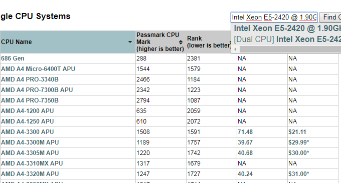

# 三大免费工具助你检测VPS服务器真伪-VPS主机性能和速度测试方法
这年头VPS主机太多了，好多“二手”VPS开始横行其道，让人真假莫辨，想要购买某一个VPS主机，一般是先要看看这家的VPS主机的评测数据。之前分享VPS主机时都会给出VPS的性能与速度测试报告，这次我就来专门整理一下相关的测试工具。

一来给自己做一个备忘录，以后测试VPS就不用满大街地找百度要命令了，二来给没有用过的朋友一点帮助，这些工具都是好多站长朋友通用的，自己购买的VPS主机到底值不值这个价格，用这几个工具一测试便知，而且操作简单，只需要几个命令即可完成。

需要提醒的是，关于IO读写速度的测试，根据以往的经验，像谷歌云服务器、亚马逊服务器等，IO读写速度都比较低，而SSD在IO方面表现出色。另外，国外的VPS主机的速度很大程度上取决于线路的好坏，并且晚上和白天的测试速度会差别比较大。

[](https://wzfou.com/wp-content/uploads/2017/07/aliyun-vps_00.jpg)

更多的关于[VPS教程](https://wzfou.com/vps-jiaocheng/)和经验方法，你可以看看：

1. [VPS.net的VPS主机使用体验-账号验证与VPS主机性能速度测评](https://wzfou.com/vps-net/)
2. [Vestacp问题:SSL证书,HTTP/2,网站统计,在线文件管理和301重定向](https://wzfou.com/vestacp-wenti/)
3. [WHMCS整合Vultr自动开通激活VPS主机方法-实现在WHMCS上分销VPS](https://wzfou.com/whmcs-vultr/)

> PS：2017年8月20日更新，补充一下VPS主机CN2线路测试方法：[鉴别真假CN2线路主机参考手册](https://wzfou.com/cn2-vps-list/)。
> 
> PS：2020年1月20日更新，更新了LemonBench脚本地址。

## 零、常用检测脚本汇总

为方便使用，我在这里汇总一下用于VPS各类检测的脚本，有关脚本的详细使用及说明可参阅下文的内容。

### 1、Superspeed.sh

**一键测试服务器到国内的速度脚本Superspeed.sh ：**

wget https://raw.githubusercontent.com/oooldking/script/master/superspeed.sh
chmod +x superspeed.sh
./superspeed.sh

### 2、bench.sh

**一键检测VPS的CPU、内存、负载、IO读写、机房带宽等脚本：bench.sh**

#命令1：
wget -qO- bench.sh | bash
#或者
curl -Lso- bench.sh | bash

#命令2：
wget -qO- 86.re/bench.sh | bash
#或者
curl -so- 86.re/bench.sh | bash

#备注：
bench.sh 既是脚本名，同时又是域名。如果以上失效，请使用以下地址下载再执行脚本：
#下载地址：
https://github.com/teddysun/across/blob/master/bench.sh

### 3、SuperBench.sh

**可以看作bench.sh强化版：SuperBench.sh**

新增 Virt 检测服务器类型参数**。**常见 openvz，kvm，独服都能检测出来。同时整合上面的Superspeed.sh一键测试服务器到国内的速度脚本：

wget -qO- https://raw.githubusercontent.com/oooldking/script/master/superbench.sh | bash
#或者
curl -Lso- https://raw.githubusercontent.com/oooldking/script/master/superbench.sh | bash

### 4、Zench

Zench可以看作是Bench.sh 和 SuperBench的结合版本，加入 Ping 以及 路由测试 功能，会生成测评报告，可以很方便地分享给其他朋友看自己的测评数据 ：

wget -N --no-check-certificate https://raw.githubusercontent.com/FunctionClub/ZBench/master/ZBench-CN.sh && bash ZBench-CN.sh
#项目：https://github.com/FunctionClub/ZBench

### 5、speedtest-cli

**一键带宽检测工具：speedtest-cli**

安装命令：

sudo apt-get update
apt-get install python-pip
sudo pip install speedtest-cli

#CentOS
yum update
yum -y install epel-release
yum install python-pip
pip install speedtest-cli

**使用方法：**

speedtest-cli
#后面也可以接以下参数：
-h, --help show this help message and exit 
--share 分享你的网速，该命令会在speedtest网站上生成网速测试结果的图片。 
--simple Suppress verbose output, only show basic information 
--list 根据距离显示speedtest.net的测试服务器列表。 
--server=SERVER 指定列表中id的服务器来做测试。 
--mini=MINI URL of the Speedtest Mini server 
--source=SOURCE Source ip address to bind to 
--version Show the version number and exit

### 6、unixbench

**VPS性能综合跑分工具：unixbench**

命令如下：

wget --no-check-certificate https://github.com/teddysun/across/raw/master/unixbench.sh
chmod +x unixbench.sh
./unixbench.sh

### 7、mPing

**一键测试回程Ping值工具：mPing**

wget https://raw.githubusercontent.com/helloxz/mping/master/mping.sh
bash mping.sh

### 8、Serverreview

**Serverreview-benchmark综合评测工具**

这是一个老外写的VPS主机综合评测工具，主要评测的项目有VPS主机磁盘IO、内存读写、CPU性能以及Benchmark性能，还有美国、欧洲、亚洲等不同节点的下载速度。主页：https://github.com/sayem314/serverreview-benchmark

**脚本使用使用方法：**

#简略版
yum install curl -y
curl -LsO git.io/bench.sh; chmod +x bench.sh && ./bench.sh -a share
#完整版
yum install curl -y
curl -LsO git.io/bench.sh; chmod +x bench.sh && ./bench.sh -a share

### 9、LemonBench

LemonBench 工具(别名LBench、柠檬Bench)，是一款针对Linux服务器设计的服务器性能测试工具。通过综合测试，可以快速评估服务器的综合性能，为使用者提供服务器硬件配置信息。

#脚本备用下载：https://www.ucblog.net/shell/LemonBench.sh
#LemonBench 国内版：
curl -fsL https://ilemonra.in/LemonBench | bash -s fast
#LemonBench 国际版：
curl -fsL https://ilemonra.in/LemonBenchIntl | bash -s fast

## 一、VPS速度测试工具

**在线测试工具。**使用在线测试工具，可以方便得到服务器的响应时间，这一招对于国外的VPS特别有效果。以下是搜集整理的实用在线网站速度测试工具网站：

> http://ping.chinaz.com/
> 
> http://www.ipip.net/ping.php
> 
> https://www.17ce.com/
> 
> http://www.webkaka.com/
> 
> http://ce.cloud.360.cn/

这几个在线测速工具各有各的优缺点，推荐使用ipip.net测试服务器IP和路由追踪，用17ce.com测试网页加载速度，用ping.chinaz.com用国内不同地方的Ping值。

[](https://wzfou.com/wp-content/uploads/2017/07/vps-gongju_03.gif)

**本地测试软件。**这里推荐使用WinMTR，这是一款方便易用的路由跟踪工具。该软件可以帮助用户直接查看各个节点的响应时间及丢包率，非常适合windows下客户做路由追踪及PING进行测试。

> 下载地址：https://www.ucblog.net/wzfou/WinMTR-CN-IP.zip
> 
> 项目主页：https://github.com/oott123/WinMTR
> 
> 带地图版：https://cdn.ipip.net/17mon/besttrace.exe

启用[WinMTR](https://wzfou.com/tag/winmtr/)，点击可以更新IP地址。

[](https://wzfou.com/wp-content/uploads/2017/07/vps-gongju_01.gif)

输入你想要追踪的域名或者服务器IP，接着你就可以看到数据包经过的节点还有丢包等情况，同时支持导出文本。

[](https://wzfou.com/wp-content/uploads/2017/07/vps-gongju_02.gif)

**相关的参数**说明如下：

> Hostname：到目的服务器要经过的每个主机IP或名称  
> Nr：经过节点的数量；以上图百度为例子：一共要经过10个节点，其中第一个是出口的路由器  
> Loss%：ping 数据包回复失败的百分比；藉此判断，那个节点（线路）出现故障，是服务器所在机房还是国际路由干路  
> Sent：已传送的数据包数量  
> Recv：成功接收的数据包数量  
> Best：回应时间的最小值  
> Avrg：平均回应时间  
> Worst：回应时间的最大值  
> Last：最后一个数据包的回应时间

**PS：2017年9月12日更新，**Superspeed.sh 一键测试服务器到国内的速度脚本：

```
wget https://raw.githubusercontent.com/oooldking/script/master/superspeed.sh
chmod +x superspeed.sh
./superspeed.sh
```

## 二、VPS性能测试工具

**手动检测命令。**直接使用命令：cat /proc/cpuinfo 或者 lscpu，你就可以看到你使用的VPS的CPU配置如何。

[](https://wzfou.com/wp-content/uploads/2017/07/vps-gongju_04.gif)

检测出来的CPU，你也可以进入这个网站：http://www.cpubenchmark.net/cpu_list.php，查看CPU的性能到底排行多少位，至少让自己心里有个数。

[](https://wzfou.com/wp-content/uploads/2017/07/vps-gongju_05.gif)

另外一个手动命令测试磁盘IO：

```
dd if=/dev/zero of=test bs=64k count=4k oflag=dsync 
```

手动命令测试VPS网络：

```
wget http://cachefly.cachefly.net/100mb.test
```

**一键检测脚本。**这里有一个一键检测VPS的CPU、内存、负载、IO读写、机房带宽等。

```
命令1：
wget -qO- bench.sh | bash
或者
curl -Lso- bench.sh | bash

命令2：
wget -qO- 86.re/bench.sh | bash
或者
curl -so- 86.re/bench.sh | bash

备注：
bench.sh 既是脚本名，同时又是域名。如果以上失效，请使用以下地址下载再执行脚本：
下载地址：
https://github.com/teddysun/across/blob/master/bench.sh
```

**PS：2017年9月27日更新，**SuperBench.sh可以看作bench.sh强化版，新增 Virt 检测服务器类型参数，常见 openvz，kvm，独服都能检测出来。同时整合上面的Superspeed.sh一键测试服务器到国内的速度脚本：

```
wget -qO- https://raw.githubusercontent.com/oooldking/script/master/superbench.sh | bash
或者
curl -Lso- https://raw.githubusercontent.com/oooldking/script/master/superbench.sh | bash
```

运行一键检测脚本后，会显示当前测试的各种系统信息，取自世界多处的知名数据中心的测试点进行下载速度测试，支持 IPv6 下载测速，IO 测试三次并显示平均值，由于测试点都在国外，所以国内的服务器下载速度测试可能会失败。

[](https://wzfou.com/wp-content/uploads/2017/07/aliyun-vps_01-1.gif)

**一键带宽检测工具**：speedtest-cli，官网：https://github.com/sivel/speedtest-cli，安装命令：

```
sudo apt-get update
apt-get install python-pip
sudo pip install speedtest-cli

```

使用方法：

```
speedtest-cli
#后面也可以接以下参数：
-h, --help show this help message and exit 
--share 分享你的网速，该命令会在speedtest网站上生成网速测试结果的图片。 
--simple Suppress verbose output, only show basic information 
--list 根据距离显示speedtest.net的测试服务器列表。 
--server=SERVER 指定列表中id的服务器来做测试。 
--mini=MINI URL of the Speedtest Mini server 
--source=SOURCE Source ip address to bind to 
--version Show the version number and exit

```

**VPS性能综合跑分工具。**[UnixBench](https://wzfou.com/tag/unixbench/)是一个类unix系（Unix，BSD，Linux）统下的性能测试工具，一个开源工具，被广泛用与测试linux系统主机的性能。Unixbench的主要测试项目有：系统调用、读写、进程、图形化测试、2D、3D、管道、运算、C库等系统基准性能提供测试数据。命令如下：

```
wget --no-check-certificate https://github.com/teddysun/across/raw/master/unixbench.sh
chmod +x unixbench.sh
./unixbench.sh
```

测试项目说明如下：

> **Dhrystone 2 using register variables**  
> 此项用于测试 string handling，因为没有浮点操作，所以深受软件和硬件设计（hardware and software design）、编译和链接（compiler and linker options）、代码优化（code optimazaton）、对内存的cache（cache memory）、等待状态（wait states）、整数数据类型（integer data types）的影响。
> 
> **Double-Precision Whetstone**  
> 这一项测试浮点数操作的速度和效率。这一测试包括几个模块，每个模块都包括一组用于科学计算的操作。覆盖面很广的一系列 c 函数：sin，cos，sqrt，exp，log 被用于整数和浮点数的数学运算、数组访问、条件分支（conditional branch）和程序调用。此测试同时测试了整数和浮点数算术运算。
> 
> **Execl Throughput**  
> 此测试考察每秒钟可以执行的 execl 系统调用的次数。 execl 系统调用是 exec 函数族的一员。它和其他一些与之相似的命令一样是 execve（） 函数的前端。
> 
> **File copy**  
> 测试从一个文件向另外一个文件传输数据的速率。每次测试使用不同大小的缓冲区。这一针对文件 read、write、copy 操作的测试统计规定时间（默认是 10s）内的文件 read、write、copy 操作次数。
> 
> **Pipe Throughput**  
> 管道（pipe）是进程间交流的最简单方式，这里的 Pipe throughtput 指的是一秒钟内一个进程可以向一个管道写 512 字节数据然后再读回的次数。需要注意的是，pipe throughtput 在实际编程中没有对应的真实存在。
> 
> **Pipe-based Context Switching**  
> 这个测试两个进程（每秒钟）通过一个管道交换一个不断增长的整数的次数。这一点很向现实编程中的一些应用，这个测试程序首先创建一个子进程，再和这个子进程进行双向的管道传输。
> 
> **Process Creation**  
> 测试每秒钟一个进程可以创建子进程然后收回子进程的次数（子进程一定立即退出）。process creation 的关注点是新进程进程控制块（process control block）的创建和内存分配，即一针见血地关注内存带宽。一般说来，这个测试被用于对操作系统进程创建这一系统调用的不同实现的比较。
> 
> **System Call Overhead**  
> 测试进入和离开操作系统内核的代价，即一次系统调用的代价。它利用一个反复地调用 getpid 函数的小程序达到此目的。
> 
> **Shell Scripts**  
> 测试一秒钟内一个进程可以并发地开始一个 shell 脚本的 n 个拷贝的次数，n 一般取值 1，2，4，8。（我在测试时取 1， 8）。这个脚本对一个数据文件进行一系列的变形操作（transformation）。

根据你的VPS性能不同，一般需要半个小时以上才会得到跑分结果，分数越高就表示性能越好。（点击放大）

[](https://wzfou.com/wp-content/uploads/2017/07/aliyun-vps_02-1.gif)

这里再提供另外一个VPS速度与性能综合测试工具，用它可以一键测试VPS主机的基本配置、机房带宽、Ping值、IO性能、UnixBench跑分等，测试过程花费的时间比较长，需要耐心等待。

```
#普通模式（测试机器配置， IO ，带宽和全国 ping 值）：
wget -N --no-check-certificate https://raw.githubusercontent.com/91yun/91yuntest/master/test_91yun.sh && bash test_91yun.sh
简单模式（测试机器配置， IO ，带宽和全国 ping 值）：
wget -N --no-check-certificate https://raw.githubusercontent.com/91yun/91yuntest/master/test_91yun.sh && bash test_91yun.sh s
完全模式（测试机器配置， IO ，带宽、全国 ping 值、unixbench跑分）：
wget -N --no-check-certificate https://raw.githubusercontent.com/91yun/91yuntest/master/test_91yun.sh && bash test_91yun.sh a
```

## 三、VPS主机真伪检测

**检测VPS真实内存。**首先用命令查看真实的内存：free -m，接着切换至内存目录：cd /dev/shm，然后进行数据写入，标识 count=100 为写入100M，你可以修改为主机商标注的内存上限一点点：

```
dd if=/dev/zero of=./memtest bs=1M count=100
#注意完成后，执行删除：
rm ./memtest
```

一旦出现错误：dd: error writing ‘./memtest’: No space left on device，就说明内存大小低于我们测试的数值，你可以继续降低数值，直到得到真实的内存。

[](https://wzfou.com/wp-content/uploads/2017/07/vps-gongju_07.gif)

**检测VPS虚拟技术。**命令如下：

```
wget -N --no-check-certificate https://raw.githubusercontent.com/91yun/code/master/vm_check.sh && bash vm_check.sh
```

测试结果会显示是KVM、Xen还是OpenVZ。

[](https://wzfou.com/wp-content/uploads/2017/07/vps-gongju_08.gif)

**自建speedtest测试。**这个适合VPS主机商，方便给客户测试从服务器到用户本地的下载速度。

> 项目主页：https://github.com/adolfintel/speedtest
> 
> 修改版本：https://www.ucblog.net/wzfou/speedtest-lite.zip

将程序上传到服务器上，客户打开后点击就可以测试得到服务器的速度了。

[](https://wzfou.com/wp-content/uploads/2017/07/vps-gongju_06.gif)

## 四、总结

**UnixBench性能跑分受版本影响较大。**UnixBench目前有不同的版本，而网上不少的版本也是经过人工修改过的，可能测试的项目不同导致的结果也会不同。大家在测试时记得找一个参照对比。

**IO读写速度受母机的影响比较大。**有一些超售的服务器，由于用户众多，IO速度很慢，像这样的就要小心你的“邻居”了。使用一键脚本检测时，如果用在国内的VPS时，在网络测速中会出现卡死的情况。